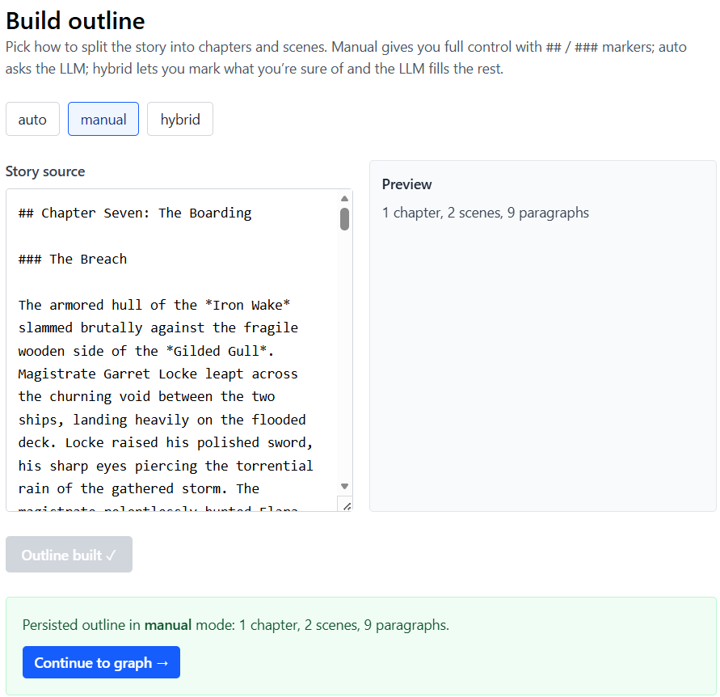
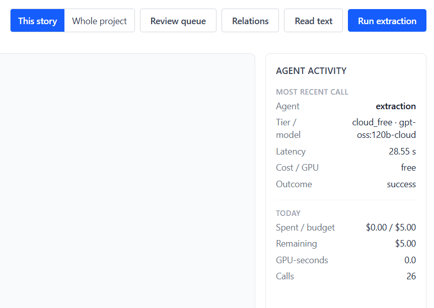
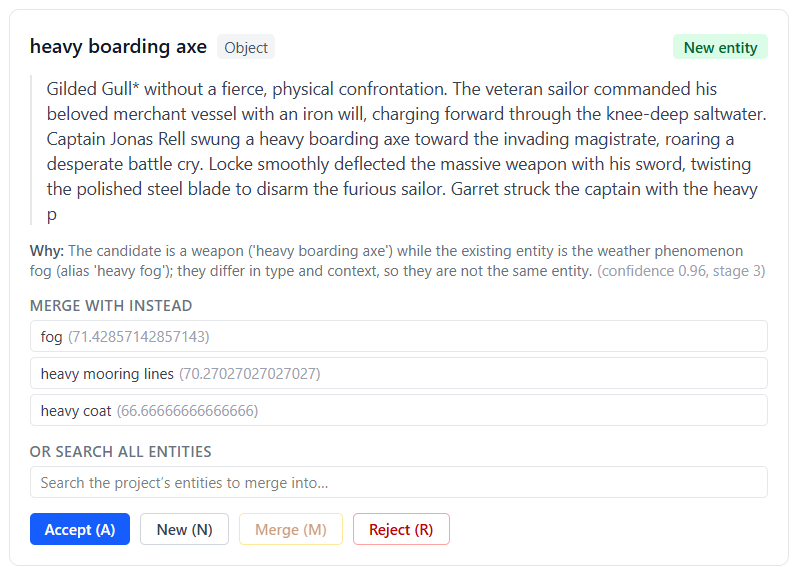
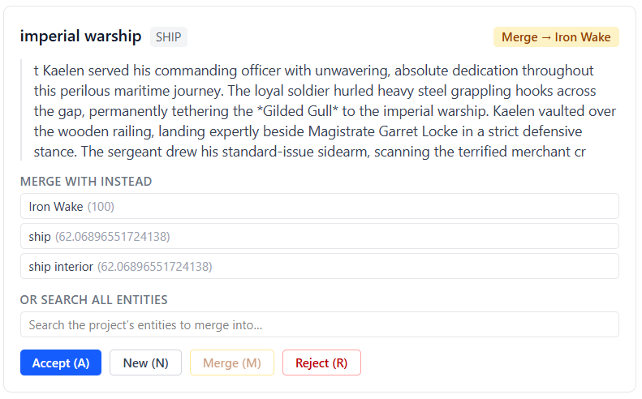
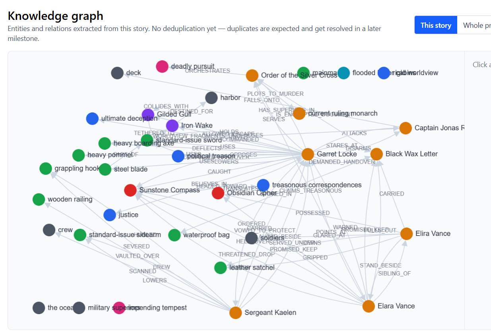
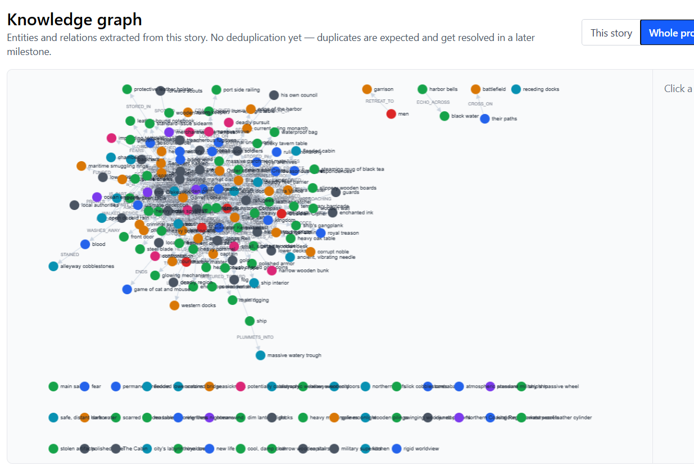
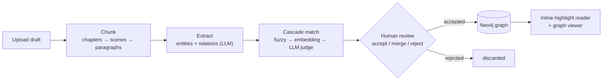

# Story Forge

A local, single-user web application that helps a solo author analyze, annotate, and edit
long-form narrative text — building a **Neo4j knowledge graph** of the story's entities and
their relations along the way. Runs entirely on your own machine.

It is **also a public portfolio piece**: a working demonstration of agent-based LLM
orchestration, multi-model routing across local and cloud providers, a cleanly layered
backend, and secure-by-default container infrastructure. Everything — the spec, the
architecture decisions, the per-layer conventions, the plans — is in the open.

> **Status.** V1 — the ingest → graph → viewer PoC — is **feature-complete**. The repo is
> currently in a **public-readiness** documentation pass; the next build milestones are
> graph-quality polish, then editing (V2). See [`docs/PLAN_LONG.md`](docs/PLAN_LONG.md).

**Contents:** [What is this](#what-is-this) · [Demo](#demo) · [Architecture](#architecture) · [Quickstart](#quickstart) · [Development](#development) · [Project map](#project-map) · [License](#license) · [Security](#security)

---

## What is this

Story Forge supports an author through three editorial phases (spec §1):

1. **Ingest & knowledge graph** — upload a raw draft, hierarchically split it
   (chapters → scenes → paragraphs), extract entities and relations into a Neo4j graph,
   **with the human deciding every new-entity and relation question.**
2. **Editing & polishing** *(planned, V2)* — paragraph-by-paragraph work with an LLM in
   inline / dialog / diff modes, with a full edit history that doubles as a training dataset.
3. **Style rewriting** *(planned, V3)* — coherence-preserving rewriting in a target style,
   with the graph as the factual anchor.

**This PoC delivers phase 1.** It's built first as an exploration — of the agent-based,
spec-driven architecture and the process of building it — and as a public demonstration meant
to be read, not just run. The bundled sample stories are **LLM-generated** for the PoC; there's
no real manuscript behind it. The tool is *designed* for a solo author working in a coherent
fictional world, and the longer-term hope is to point it at real use — research, maybe some
writing of my own — but for now the point is the process itself.

**What it is _not_** (spec §2.3): not a content generator (the LLM assists analysis and
editing, it does not write the story); not multi-user (solo, local); not a productionable
product as-is.

---

## Demo

The repo ships a sample project under [`docs/samples/`](docs/samples/) — three short stories
in the "Oakhaven" world (`oakhaven.md`, `oakhaven-2.md`, `oakhaven-3.md`) — so you can exercise
the full pipeline end to end without supplying your own text. The screenshots below walk one
real run over those samples.

**1 — Chunk.** Upload a draft; the editor splits it into a chapter / scene / paragraph outline
— deterministic `##` / `###` markers (manual), or an LLM pass (auto / hybrid).



**2 — Extract & route.** The extraction agent proposes entity and relation candidates per
paragraph. The agent-activity panel shows which agent ran, the tier / model the router chose,
and that call's latency and cost — here a free Ollama Cloud call on `gpt-oss:120b-cloud`.



**3 — Review (the human gate).** The four-stage cascade (fuzzy → embedding → LLM judge → you) stages
each candidate as *new* or *merge-into-existing*; you accept, merge, re-target, or reject from a
keyboard-driven queue, and **nothing enters the graph until you accept.** The judge explains
itself — and correctly *declines* a bad merge (a "heavy boarding axe" is not the weather
phenomenon "fog"):



A candidate that matches an entity already in the graph is proposed as a **merge**, not a new
node — and matching runs *as you go*: each accept re-runs the matcher over the still-pending
queue, so a later mention can fold into an entity you just accepted, **within a single story** as
well as **across stories** when a new one reuses earlier entities. The shot below is a cross-story
case — Chapter Seven's "imperial warship" folding into the *Iron Wake* already in the project graph
from story two:



**4 — Explore the graph.** Accepted entities and relations render in the viewer, scoped either
to a single story or to the whole multi-story project. Chapter Seven on its own:



…and the full three-story project graph, where the cross-story merges have stitched the shared
characters, ships, and objects together:



> **Honest about graph quality.** These graphs are dense on purpose. At PoC stage the
> extractor proposes *generously* and curation lives at the human gate, not in the extractor —
> and these runs accepted broadly to show the unfiltered result. Some of that density is real
> signal (the boarding axe is a genuine object; "harbor" is a shared destination for both
> ships); some is over-eager; and the *right* level of entity granularity is case-dependent,
> not a flat "less is better." Tightening extraction precision and entity de-duplication is the
> **next milestone** (graph-quality polish) — the open items are tracked in
> [`docs/BACKLOG.md`](docs/BACKLOG.md).

You can also read the story with accepted entities highlighted inline and open an entity's side
panel with its 1-hop neighbourhood (spec §3.4–§3.5).

---

## Architecture

The portfolio core. Authoritative detail lives in the spec (§6) and the architecture vault
([`architecture/overview.md`](architecture/overview.md)); this is the orientation.

### The ingest pipeline



The pipeline is **fail-closed at the human gate**: the automated cascade only ever *proposes*.
Anything it cannot resolve with high confidence falls through to the reviewer, and **no graph
node or edge is written until the author accepts it** (spec §3.3).

### Agent-based orchestration

Each logical task in the pipeline is a small, individually-testable agent under
[`backend/src/story_forge/agents/`](backend/src/story_forge/agents/) — chunking, extraction,
matching, LLM-as-judge, embedding, candidate staging / re-match / review, relation review,
and entity editing. Each agent owns **one task, one Jinja2 prompt template, one Pydantic
output schema, and a preferred model tier**, and is unit-tested against a mocked provider.
LLM output is always validated against its schema and retried on a schema violation.

### Multi-model routing

One `LLMProvider` Protocol with swappable, hand-rolled adapters (no vendor SDKs) over three
tiers:

- **local** — Ollama (Qwen3.5 9B) on your own GPU,
- **cloud-free** — Ollama Cloud's free tier,
- **cloud-paid** — **OpenRouter** (the preferred paid route, reaching Grok / Anthropic /
  Google / OpenAI through one endpoint; it is the only paid adapter built so far — direct
  vendor adapters are added as needed).

A small router picks a tier per task weight, **fails over within a tier** on a network error /
rate limit / malformed response envelope (swap logged), and is **budget-gated and fail-closed**
— it pauses and asks rather than silently escalating to paid. Every call is recorded in a cost
ledger (model, tier, tokens, cost, latency), surfaced live in the agent-activity panel.
Provider order and budget rationale: [`docs/decisions/0003`](docs/decisions/0003-llm-router-provider-order-and-budget.md).

### Layered backend

A strict package layering (`backend/src/story_forge/`), enforced by convention and review:

```
api/       ← thin HTTP routes, no business logic
agents/    ← orchestration: one logical task per module
domain/    ← pure business logic — no I/O, no HTTP, imports nothing
adapters/  ← all I/O: Neo4j, Postgres + pgvector, LLM providers, embeddings, file storage
```

`domain/` defines the `typing.Protocol`s it needs; `adapters/` implements them; everything is
wired in `main.py`. The payoff: domain logic is testable without a database, and agents are
testable without a real LLM. Each major directory carries its own `AGENTS.md` documenting its
conventions. Two stores split by shape — **Neo4j** holds the knowledge graph (entities +
relations); **Postgres + pgvector** holds the document tree, entity occurrences, embeddings,
the edit/undo history, and the cost ledger.

### Secure-by-default infrastructure

Every container runs **non-root, bound to `127.0.0.1` only, on a private bridge network**.
Every dependency is pinned to an exact version ≥ 14 days old; every image tag is pinned ≥ 7
days old and CVE-scanned in CI. No telemetry libraries of any kind. CORS is strict (loopback
origins only). Secrets live only in `.env` (gitignored) — the spec's §6.7 baseline, enforced
by CI and pre-commit hooks. *(The full supply-chain, waiver-lifecycle, and CI story is written
up separately in [`docs/SECURITY_POSTURE.md`](docs/SECURITY_POSTURE.md); the baseline checklist
is spec §6.7.)*

### Spec ↔ reality, stated honestly

A public repo should not overclaim. Two designed-but-not-active pieces:

- A **spaCy pre-NER baseline** is built but **dormant** — the live extraction path is
  LLM-only (spec §7 Step 3, deferred for the PoC).
- The **cross-story world graph** is **post-PoC** — V1 shares one graph per *project*; the
  larger world graph is on the backlog ([`docs/BACKLOG.md`](docs/BACKLOG.md)).

---

## Quickstart

### Prerequisites

The dev environment expects a Linux-family shell (this README is bash-only; we develop on WSL2
Debian). Tooling required:

- `docker` (Compose v2)
- `git`
- `python3` (system; uv will install the project's pinned 3.12)
- `uv` ([install](https://docs.astral.sh/uv/getting-started/installation/))
- `node` ≥ 20 and `npm`
- `pre-commit`
- `detect-secrets`

Optional but recommended for the security CI step locally:
- `trivy` ([install](https://aquasecurity.github.io/trivy/))

### First-time setup

```bash
git clone <this-repo-url> story-forge
cd story-forge

# 1. Generate the two .env files
cp .env.example .env
cp backend/.env.example backend/.env

# 2. Fill in the secrets in both .env files
#    Generate random passwords with: openssl rand -hex 24
#    Paste real API keys where applicable (Ollama Cloud + OpenRouter; plus Grok / Anthropic / OpenAI
#    for the direct adapters built as needed — a Google/Gemini key joins when that adapter lands)

# 3. Install pre-commit hooks
pre-commit install
pre-commit install --hook-type pre-push

# 4. Bring up infra (Neo4j, Postgres + pgvector, Ollama)
docker compose up -d
# Wait for healthchecks — the one-shot neo4j-init service applies infra/neo4j/init.cypher automatically.
# pgvector's CREATE EXTENSION runs once on first Postgres start via the mounted init.sql.

# 5. Install backend deps + run unit tests (no DB needed)
(cd backend && uv sync && uv run pytest -m "not integration" -q)
#    The integration suite additionally needs Postgres up (step 4) and a
#    TEST_DATABASE_URL line in backend/.env — see "Running tests" below.

# 6. Install frontend deps + start dev server
(cd frontend && npm install && npm run dev)

# 7. In a third terminal, start the backend
(cd backend && uv run uvicorn story_forge.main:app --reload --port 8000)
```

Open <http://localhost:5173>. The page fetches `http://localhost:8000/health` and renders
ok / loading / error.

---

## Development

Day-to-day, three terminals:

```bash
# infra
docker compose up

# backend
cd backend && uv run uvicorn story_forge.main:app --reload --port 8000

# frontend
cd frontend && npm run dev
```

### Running tests

The backend suite splits into two tiers, separated by the `integration` marker:

- **Unit** — pure, no Postgres. `cd backend && uv run pytest -m "not integration" -q`
- **Integration** — exercise a real Postgres. `cd backend && uv run pytest -m integration -q`
  (or just `uv run pytest -q` for both).

Integration tests never touch your dev database. A pytest session fixture owns a
throwaway DB end to end: it `CREATE DATABASE story_forge_test`, runs
`alembic upgrade head`, yields for the session, then `DROP`s it. Two prerequisites:

1. Postgres is up (`docker compose up -d` — step 4 above).
2. `backend/.env` defines `TEST_DATABASE_URL` pointing at a **distinct** DB name
   (`story_forge_test`) on that server. The `backend/.env.example` template carries
   the line; the simplest fill is to copy your `DATABASE_URL` and swap the trailing
   db name to `story_forge_test`. CI sets this via its Postgres service container.

### Verification commands

Everything that CI runs, locally:

```bash
# compose validity
POSTGRES_USER=v POSTGRES_PASSWORD=v POSTGRES_DB=v NEO4J_AUTH=neo4j/v \
  docker compose config --quiet

# backend (pytest -q runs both tiers; needs Postgres up + TEST_DATABASE_URL — see "Running tests")
(cd backend && uv sync && uv run ruff check . \
   && uv run ruff format --check . && uv run mypy && uv run pytest -q)

# frontend
(cd frontend && npm install && npm run lint && npm run format:check && npm run build)

# dependency-age + non-exact-pin sweep
python3 scripts/check_dependency_age.py

# backend dependency-advisory scan (osv-scanner vs uv.lock, fail-on-any; requires docker)
docker run --rm -v "$PWD/backend:/src:ro" -v "$PWD/infra/osv/osv-scanner.toml:/cfg/osv.toml:ro" \
  ghcr.io/google/osv-scanner:v2.3.8@sha256:64e86bec6df2466feea5137fc7c78fb3b7c21ec077f014d7130f64810e50676b \
  scan source -L /src/uv.lock --config=/cfg/osv.toml

# secret scan against the committed baseline
detect-secrets scan --baseline .secrets.baseline

# container CVE scan (requires trivy)
for img in $(grep -E '^\s+image:' docker-compose.yml | awk '{print $2}'); do
  trivy image --severity HIGH,CRITICAL --exit-code 1 "$img"
done

# everything pre-commit can run
pre-commit run --all-files
```

### Branch & commit conventions

- Work happens on feature branches; **squash-merge** to `main` with a single curated commit per feature.
- Dirty WIP commits never reach `main`'s history. The linear `main` log should read like an intentional record of how the project was built.
- Throwaway experiments live as untracked scratch files (covered by `.gitignore`), not as branches.

---

## Project map

A stranger's reading order:

- **[`docs/CODE_GUIDE.md`](docs/CODE_GUIDE.md)** — where to start reading the **code**: the
  layer-by-layer reading order, a request traced from upload to graph, and a directory map.
- **[`docs/code/`](docs/code/)** — the **code reference**: one note per layer (domain, agents,
  adapters, api, the two frontend areas) describing what each module is and what it's for.
- **[`story-forge-poc-spec.md`](story-forge-poc-spec.md)** — the full PoC specification, and
  the **source of truth** for what we build.
- **[`docs/PLAN_LONG.md`](docs/PLAN_LONG.md)** / **[`docs/PLAN_SHORT.md`](docs/PLAN_SHORT.md)**
  — the strategic and tactical plans (a living record of *how* the project was built;
  conventions in [`docs/AGENTS.md`](docs/AGENTS.md)).
- **[`docs/decisions/`](docs/decisions/README.md)** — the Architecture Decision Records (the
  three-tier LLM strategy, the router/provider-order/budget design, the human-gated graph
  writes, the merge/delete/undo model, and more); the [index](docs/decisions/README.md) lists
  all eight.
- **[`docs/SECURITY_POSTURE.md`](docs/SECURITY_POSTURE.md)** — the security & CI story: the
  threat model, supply-chain pinning/ageing/scanning, the waiver lifecycle, and the CI gates
  that enforce the spec §6.7 baseline.
- **[`architecture/`](architecture/)** — the meta-architect vault: named invariants, state
  machines, and per-feature decompositions. **Orientation, not a source of truth** — start at
  [`architecture/INDEX.md`](architecture/INDEX.md). Its notes are linked with `[[wikilinks]]`,
  so it is **Obsidian-compatible** if you want to wander it as a graph.
- **`AGENTS.md` / `CLAUDE.md` files** — root plus one per major directory, documenting the
  conventions for that area. (`CLAUDE.md` is a symlink to its sibling `AGENTS.md`.)
- **[`CONTRIBUTING.md`](CONTRIBUTING.md)** — what this repo is here for (read it, learn from it)
  and how it's built — for a stranger deciding how to engage.

---

## License

MIT — see [`LICENSE`](LICENSE).

## Security

See [`SECURITY.md`](SECURITY.md) for the vulnerability-reporting channel, and
[`docs/SECURITY_POSTURE.md`](docs/SECURITY_POSTURE.md) for the supply-chain + CI posture
narrative (the *how and why* behind the spec §6.7 baseline).
