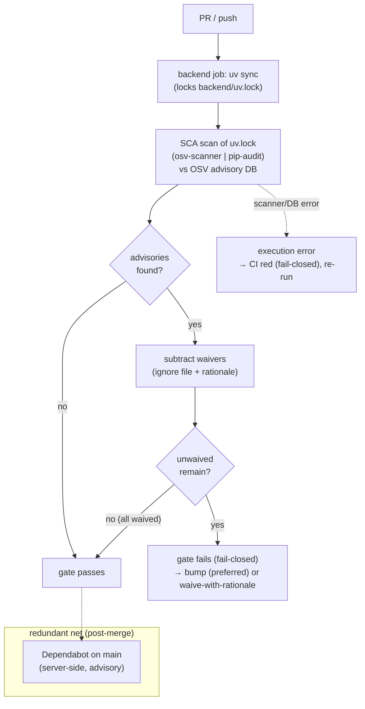

# Proposal — Backend dependency-advisory scan in CI (continuous SCA)

> **✅ Built 2026-06-08 (PR #44).** The gate is live: an `osv-scanner` step scans `backend/uv.lock`
> fail-on-any in CI, `starlette` was bumped 1.0.0→1.0.1 (the self-test ran red→green), waivers live in
> `infra/osv/`, and spec §6.7 documents the gate. The register below is fully resolved (owner cluster +
> as-built implementer calls); `[[open-questions]]` OQ-13 is closed in code. The one build-time
> deviation: the scanner runs as a **digest-pinned container**, not a GitHub Action (the action is a
> no-`runs:` stub) — strictly stronger than D6's SHA-pin, intent preserved (see D6 As-built).
>
> **✅ Register resolved 2026-06-08.** The owner approved the **G1–G7 cluster** (recorded
> "looks okay at a glance"): **osv-scanner** (D1/G1), **fail-on-any + scoped waiver file** (D2),
> **§6.7 amendment to document the gate** (G2), **reuse the Trivy waiver split** — scoped ignore +
> a `WAIVERS.md`-style register, condition-based expiry, in a sibling `infra/osv/` (D3/D4/G3),
> **leave `npm audit` at HIGH/CRITICAL** for now (D5/G4), **SHA-pin the scanner Action** (D6/G5),
> **§6.7 baseline control, not a new invariant** (D-INV/G6), and the **explicit `starlette==1.0.1`
> pin** as the bundled bump + the gate's first self-test (D7/G7). Each entry below is now the
> **Decision**. The decisions are **reversible config** — any G-item is revisitable at build time.
> **Build deferred to the next session** (CI step + waiver scaffold + starlette bump, one branch);
> **the spec §6.7 amendment lands *with* the build**, not before — amending §6.7 to claim a gate
> the CI doesn't yet run would create spec↔code drift. `[[open-questions]]` OQ-13 stays open until
> the code lands (same posture OQ-10 held).

**Requirement (operator):** close the gap where a vulnerability **disclosed *after* a package is
pinned** is invisible to CI. Story Forge gates dependency *freshness* (≥14-day soak,
`check_dependency_age.py`) and runs a **one-shot OSV check at pin-time** inside `/add-dependency`,
but nothing re-checks `backend/uv.lock` against the advisory database on later runs. So an advisory
disclosed against an already-shipped version is caught only by **Dependabot** (GitHub-server-side,
post-merge on `main`), never by CI. Add a **continuous backend SCA gate** that fails the build on a
known, unwaived advisory — the PyPI analogue of the frontend's `npm audit` step.

**Triggering case (the proof the gap is real):** GHSA-86qp-5c8j-p5mr — `starlette` **1.0.0**
(transitive via `fastapi==0.136.1`), **MEDIUM**, *"missing Host header validation poisons
`request.url.path`, bypassing path-based security checks"*, patched in **1.0.1**. Dependabot flagged
it on `main`; CI stayed green, because the CI Trivy job only scans **Docker images** (`image-ref:`
neo4j / pgvector / ollama) and **nothing** scans the Python lockfile.

**New term — [[software-composition-analysis]]** (SCA, *analiza składu oprogramowania*): scanning a
project's dependency graph against a known-vulnerability database (here **OSV**) to find components
with publicly-disclosed advisories. The freshness/soak rule and SCA are different controls: soak
defends against a *freshly-hijacked* release (malicious package), SCA against a *known-vulnerable*
one — a package can be old enough to pass the soak and still carry a CVE disclosed yesterday.

**Altitude:** **CI / governance** (a pipeline gate + a security-baseline §6.7 amendment), not an
application component. Ripple is into the **security baseline** (spec §6.7), the **waiver
bookkeeping** (`infra/trivy/WAIVERS.md` pattern), and the **dependency-update flow**
(`/add-dependency`). One bundled, non-architectural implementation task rides along: bump
`starlette` 1.0.0 → 1.0.1 (the first advisory this gate would have caught — a live self-test).

---

## 1. The nine layers

**1. User / personas.** The actors are the **committing developers/agents** (Claude Code, Codex)
and the **maintainer** reviewing PRs — plus the **portfolio reader** who reads the security posture.
No end-user runtime path. Notably this is the **first control aimed at an actor other than the
trusted local author**: the threat is the **dependency supply chain** (an upstream maintainer ships,
or a CVE is disclosed against, a vulnerable transitive). That actor sits *outside* the single-user
[[trust-boundary]] the rest of the system assumes, which is exactly why a build-time gate (not a
runtime one) is the right place for it.

**2. Business.** Both drivers. *Portfolio:* a visible SCA gate + a green Dependabot tab is a
concrete "secure-by-default infra" signal (a stated project goal). *Personal tool:* a runtime-dep
vuln like starlette's path-poisoning is low-risk while the app is 127.0.0.1-only with no path-based
authz, but it is cheap insurance and the bug is a clean one-version fix. **Cost accepted:** CI
friction — a newly-disclosed advisory against an unchanged dep can turn an *unrelated* PR red (it
nearly just did), and waivers carry a maintenance tail.

**3. Domain.** Ubiquitous language: an **advisory** (a known vulnerability with an ID — GHSA/CVE/
GO-id — in the OSV DB); a **waiver / suppression** (a recorded, justified decision to accept a
specific advisory); the **soak/age gate** (§6.7, freshness) vs the **advisory gate** (SCA, known
vulns) — already named distinctly in §6.7 line 547. The sharp distinction this work rests on:
**pin-time** scanning (one-shot, `/add-dependency`) vs **continuous** scanning (every CI run against
the *live* DB). The gap between them is a **time-of-disclosure** problem — a vuln disclosed after
pin-time is invisible to a pin-time-only check, the precise hole Dependabot alone covers today.

**4. Data.** No persistent store. New *config/artifacts*: a scanner invocation in
`.github/workflows/ci.yml`; a **machine-read waiver file** (e.g. `osv-scanner.toml`'s
`[[IgnoredVulns]]`, or pip-audit `--ignore-vuln` args); the **human waiver register** (the existing
`infra/trivy/WAIVERS.md` pattern, or a sibling). The only "data" is the ephemeral advisory match-set
per run. The lockfile `backend/uv.lock` is the scanned input (already the source of truth for exact
versions).

**5. Behavior.** A new CI gate sub-machine: `scan → {clean | findings} → findings − waivers →
{∅ → pass | unwaived≠∅ → fail}`. **Guard:** a PR cannot reach green with an unwaived advisory
([[fail-closed]]). **Effect:** the CI run log is the evidence (which advisories matched, which were
waived). Folds under the existing **green-main bar** (`AGENTS.md`).

**6. Errors.** The control-flow question is **fail-closed vs fail-open on a *scanner* error**
(distinct from an *advisory* finding): if the OSV DB is unreachable or the action errors, does the
gate block or wave through? A blocking gate that fails-open on infra flake is security theatre; one
that fails-closed turns a transient outage into a red build you re-run. Proposal: treat a scanner
**execution** error as CI-red (fail-closed), same as any infra flake — re-run, don't bypass. A
second failure mode: a **silently-ineffective waiver** (a typo'd advisory ID suppresses nothing, or
suppresses the wrong thing) — argues for the human register cross-check.

**7. Security.** This *is* a security control — supply-chain SCA. It is **[[defense-in-depth]]**
(*obrona w głąb* — layering independent controls so one miss isn't a breach) **with** Dependabot,
not a replacement: Dependabot is **server-side, advisory, post-merge on `main`** (a Monitoring net);
the CI gate is **pre-merge, blocking, on the PR** (a Decision/Access gate). Keeping both is the
point — they fail differently and their DBs lag differently. **Abuse path:** a developer waiving an
advisory without justification to force green — mitigated by the `WAIVERS.md` discipline (per-item
rationale + reachability + drop-when), which `/review-pr` §5 already scrutinises for Trivy.

**8. Compliance / Audit.** Evidence trail = CI run log + the waiver entry's rationale. This mirrors
the mature Trivy model exactly: a **scoped functional ignore file** wired to one scan step + a
**`WAIVERS.md` register** with per-item reachability and a condition-based **"drop when"** expiry,
reviewed periodically. The audit question — *"can we prove why advisory X is accepted?"* — is
answered by the waiver row. (Story Forge's waivers use **condition-based** expiry — "drop when
upstream rebuilds" — not hard dates; the SCA analogue is "drop when a fixed version clears the
soak.")

**9. Operations.** Observability: CI surfaces the advisory inline; the waiver file documents accepted
ones. Runbook on a red SCA gate: **prefer bump** (the fixed version, soak-checked via
`/add-dependency`); **else waive** with rationale. One Trivy lesson **does not** carry over: the
**sequential-unmask** cascade (image N failing hides image N+1) is image-scan-specific — an OSV
lockfile scan reports **all** advisories in one pass, so there is no unmask treadmill here. The
analogue that *does* carry: a freshly-disclosed advisory reddening an unrelated PR is handled by the
green-main "pre-existing / unrelated / diagnosed" exception (exactly how CVE-2026-42504 was handled).

---

## 2. The nine stations

Identity → Intent → Policy → Decision → Access → Monitoring → Evidence → Expiry → Review.

| Station | Present? | Where / gap |
|---|---|---|
| **Identity** | n/a — CI actor | The runner / committing agent; no per-user identity. Named non-applicable. |
| **Intent** | ✅ | "fail the build if a backend dependency has a known, unwaived advisory." |
| **Policy** | ✅ (D2) | fail-on-**any** advisory + scoped waivers (owner lean); exact-pin + soak apply to the scanner action too (§6.7). |
| **Decision** | ✅ | scanner computes findings; waiver file filters; exit code gates the PR check. |
| **Access** | ✅ | the gate blocks merge (a required PR check), under the green-main bar. |
| **Monitoring** | ✅ | CI log (pre-merge) **+** Dependabot (post-merge redundant net) — [[defense-in-depth]]. |
| **Evidence** | ✅ | CI run log + waiver entry (rationale + reachability + drop-when). |
| **Expiry** | ✅ (D4) | condition-based, stated in `infra/osv/WAIVERS.md` ("drop when a fixed version clears the 14-day soak") with a `Last reviewed` date; optional per-waiver `ignoreUntil` backstop. |
| **Review** | ✅ (D3/`/review-pr`) | `/review-pr` §5 extended to scrutinise SCA waivers (attribution + register mirror); periodic re-scan command is in `infra/osv/WAIVERS.md` "how to review". |

The two former gaps (Expiry, Review) were **waiver-governance** questions, not blockers — both reused
the Trivy waiver model and are **resolved as-built** in PR #44 (`infra/osv/WAIVERS.md` + `/review-pr` §5).

---

## 3. Affected components & ripple

No `components/` notes exist yet. This touches, by reference:

- **`.github/workflows/ci.yml`** — a new SCA step (in the `backend` job, after `uv sync`, or a new
  job). The only *functional* change.
- **Spec §6.7** (security baseline) — **strengthens** the baseline (adds a gate), so this is **not**
  the stop-and-amend-*to-relax* flow; but §6.7 (lines 547, 557, 690) should **document** the new
  gate so the baseline stays the honest source of truth. Owner amends the spec; the architect
  proposes.
- **Waiver bookkeeping** — a machine-read ignore file + the `WAIVERS.md` register (extend it, or a
  sibling for PyPI advisories). Invariant under pressure: the **one-home** rule — two waiver homes
  (functional ignore + human register) already coexist for Trivy by making the register
  *documentation-only*; reuse that split, don't invent a second model.
- **`/add-dependency` skill** — already runs a **pin-time** OSV check; the new gate is its
  **continuous** complement. Note the relationship so the two aren't mistaken for duplicates.
- **`/review-pr` §5** — extend the existing Trivy-waiver-attribution lens to SCA waivers.
- **`/pin-image` skill** — parallel image-waiver flow; shares the doc pattern, no change needed.
- **`backend/pyproject.toml` + `uv.lock`** — the bundled starlette bump (D7).
- **Invariants:** see §5 — a register sub-question on whether this mints a new invariant or stays a
  §6.7 baseline control (as pinning/soak/Trivy do).

---

## 4. Data flow

The dotted Dependabot box is **[[defense-in-depth]]**: it keeps watching `main` after merge, on a
DB that may lag or lead the CI scanner's — the two controls are deliberately redundant, not
duplicative.

---

## 5. State & invariants + decision register

**No new invariant proposed by default** (see D-INV below). The gate is a **§6.7 baseline control**,
consistent with how pinning, the 14-day soak, and Trivy image-scanning live as baseline rules rather
than named `invariants.md` entries. **State-machine effect to preserve:** every gate run leaves a CI
log (evidence); every waiver leaves a register row (evidence). Both are the Compliance/Audit layer
happening at build time.

### Decision register (✅ resolved 2026-06-08 — owner approved the cluster; built next session)

> Every D-entry below is **decided**. The owner-approved cluster settled the policy questions;
> the few items left to the implementer ("Open:" → now **As-built:**) were resolved while building
> the gate (PR #44) and are recorded here so this artifact matches reality. **Nothing here is still
> open** — the leans/options are kept only as the history of how each call was made.

**D1 — Scanner tool: `osv-scanner` vs `pip-audit`.**
- *Context:* both query OSV-class data and exit non-zero on a finding. `osv-scanner` (Google) parses
  `backend/uv.lock` **natively** (no export step) and is multi-ecosystem (could later also scan the
  frontend lockfile and unify the waiver model); `pip-audit` (PyPA-official) scans the synced
  environment (`uv run pip-audit`, no separate export) and is the Python-idiomatic choice the §6.7
  context already half-anticipates ("OSV/advisory gate").
- *Options:* (a) `osv-scanner` against `uv.lock`; (b) `pip-audit` against the synced venv.
- *Decision (owner-approved cluster, 2026-06-08):* **(a) `osv-scanner`** — it reads the lockfile we already trust as the version
  source-of-truth, shares the **same OSV DB `/add-dependency` already queries** (one advisory model
  end-to-end), and its all-or-nothing + ignore-list gating *fits* the fail-on-any decision (D2)
  cleanly. **Cost accepted:** another third-party Action to pin + soak (D6), and coarser native
  severity filtering than Trivy's `severity:` flag (a non-issue under fail-on-any).
- *Owner lean (2026-06-08):* osv-scanner, with "get the architect to frame it" — hence this note.
- *As-built (PR #44):* a **step in the `security` job** (it groups with the existing
  detect-secrets / dep-age / Trivy supply-chain checks and reuses that runner), not a dedicated job;
  promote to its own job only if it slows the critical path. The scanner runs as the **digest-pinned
  `ghcr.io/google/osv-scanner` container** rather than the `google/osv-scanner-action` — see D6.

**D2 — Gate strictness: fail-on-any-advisory + waivers, vs HIGH/CRITICAL-only parity.**
- *Context:* the frontend gates `npm audit --audit-level=high`. The triggering starlette advisory is
  **MEDIUM** — a HIGH/CRITICAL-only backend gate would **not** catch it, leaving Dependabot as the
  sole net for mediums (the exact dependence the requirement wants to end).
- *Options:* (a) **fail on any** advisory, waive specific assessed ones in a scoped file; (b)
  HIGH/CRITICAL-only, mirroring `npm audit`.
- *Decision (owner-approved cluster, 2026-06-08):* **(a) fail-on-any + scoped waivers** — it actually achieves "don't depend only on
  Dependabot," catches this MEDIUM class, and reuses the team's existing scan-and-scoped-waiver
  muscle. **Cost accepted:** an un-fixable transitive LOW/MEDIUM will red CI until waived; the waiver
  file is the pressure valve, and the rationale discipline keeps "waive to go green" honest.
- *Owner decision (2026-06-08):* **(a) fail-on-any + waiver file** — selected.
- *As-built (PR #44):* fail-on-any (osv-scanner's default exit-1-on-any-finding); waiver home is D3.

**D3 — Waiver home + format (avoid a second source of truth).**
- *Context:* Trivy already runs **two** homes without drift by making one *documentation-only*: the
  functional scoped `*.trivyignore` (CI reads it) + `infra/trivy/WAIVERS.md` (human register,
  per-item rationale/reachability/drop-when). SCA needs the same split.
- *Options:* (a) machine-read ignore (e.g. `osv-scanner.toml [[IgnoredVulns]]`, with inline reason)
  is the **enforced** home; extend `WAIVERS.md` (or a sibling `infra/osv/WAIVERS.md`) as the human
  register that must mirror it. (b) one file only (rationale as comments in the ignore file). (c)
  rationale only in `WAIVERS.md`, bare IDs in the ignore file.
- *Decision (owner-approved cluster, 2026-06-08):* **(a)** — enforced ignore file carries the ID + a one-line reason + (D4) an expiry
  condition; the `WAIVERS.md` register carries the full reachability justification and "drop when",
  exactly as Trivy does. One **enforced** home, one **documentation** home, the register mirrors the
  enforced file (the `/review-pr` §2 reconciliation lens covers the mirror).
- *As-built (PR #44):* a **sibling `infra/osv/`** — enforced `infra/osv/osv-scanner.toml`
  (`[[IgnoredVulns]]`, wired via `--config`) + the documentation-only `infra/osv/WAIVERS.md` register.
  Kept separate from `infra/trivy/` (not a renamed shared register) so each scope stays visibly
  per-tool and the §6.7 "never repo-wide" rule is obvious. No active waivers yet (the gate is green by
  fixing, not suppressing).

**D4 — Waiver expiry (the Expiry-station gap).**
- *Context:* Trivy waivers expire by **condition** ("drop when upstream rebuilds"), reviewed
  periodically (`WAIVERS.md` "Last reviewed"). SCA needs an analogue so waivers don't ossify.
- *Options:* (a) condition-based, mirroring Trivy ("drop when a fixed version clears the 14-day
  soak"), reviewed at the same cadence; (b) hard date expiry (`osv-scanner`'s `ignoreUntil`), forcing
  a CI red on the date; (c) no expiry.
- *Decision (owner-approved cluster, 2026-06-08):* **(a) condition-based + periodic review**, for consistency with the existing model —
  *optionally* layered with (b)'s hard `ignoreUntil` as a backstop so a forgotten waiver self-surfaces.
- *As-built (PR #44):* **condition-based + periodic review** — `infra/osv/WAIVERS.md` states the
  SCA "drop when" ("when a fixed version clears the 14-day soak") and a `Last reviewed` date, exactly
  as Trivy does. The hard-date backstop is *available* (osv-scanner's per-waiver `ignoreUntil`,
  documented in the toml header) but not mandated; with zero active waivers there is nothing to
  date-expire yet.

**D5 — `npm audit` symmetry.**
- *Context:* if the backend gates fail-on-any but the frontend stays HIGH/CRITICAL, the two halves
  are asymmetric.
- *Options:* (a) leave `npm audit --audit-level=high` as-is (out of scope; the backend gap is what
  bit us); (b) tighten the frontend to fail-on-any too, for symmetry.
- *Decision (owner-approved cluster, 2026-06-08):* **(a) leave it, note the asymmetry** — don't scope-creep this into a frontend change;
  revisit deliberately. The asymmetry is defensible (npm's advisory noise floor is higher).
- *As-built (PR #44):* **left `npm audit --audit-level=high` unchanged**; the asymmetry is noted and
  deliberately out of this branch's scope. Revisit deliberately if desired (a one-flag change).

**D6 — Scanner Action pinning & soak (§6.7 applies to Actions too).**
- *Context:* the Trivy action is pinned `aquasecurity/trivy-action@v0.36.0`. A GitHub Action is itself
  a supply-chain surface; §6.7's exact-pin + soak should apply.
- *Options:* (a) pin the SCA action to an exact tag ≥ the soak; (b) pin to a **commit SHA** (strongest
  — a tag can be moved); (c) run the scanner via `uvx`/a pinned CLI version instead of an Action.
- *Decision (owner-approved cluster, 2026-06-08):* **(a) or (b)** — prefer **(b) SHA-pin** for a security tool (a moved tag is a real
  supply-chain risk for the very gate meant to catch them); apply the 7-day Action soak as for images.
- *As-built (PR #44) — intent preserved, mechanism changed:* the scanner runs as the
  **digest-pinned container** `ghcr.io/google/osv-scanner:v2.3.8@sha256:64e8…0676b`, **not** a
  GitHub Action. Reason discovered at build time: `google/osv-scanner-action`'s root `action.yml` is a
  metadata **stub with no `runs:` block** (not an invokable composite action), and its *reusable
  workflows* do either a PR **diff**-scan (would miss an advisory already on `main` — defeats
  fail-on-any) or a SARIF-upload **recursive** scan (heavier, needs `security-events: write`, not a
  scoped lockfile step). A digest pin is **strictly stronger** than the SHA-pin (b) the cluster asked
  for (a tag can move; a digest cannot), so D6's intent — *pin the scanner to an immutable ref + soak
  it* — is fully met. v2.3.8 (2026-05-11) clears the 7-day scanner soak. This is the one place the
  build deviated from the proposal's letter; flagged to the owner and recorded in the spec §6.7
  amendment.

**D-INV — Does this mint a new invariant?**
- *Context:* `invariants.md` has no entry for the dep-age/pin baseline either — those live as §6.7
  baseline rules. Minting an INV per CI gate inflates the "never break" set.
- *Decision (owner-approved cluster, 2026-06-08):* **no new invariant** — keep it a §6.7 baseline control, consistent with
  pinning/soak/Trivy. (If the owner wants it named, "no dependency ships with an unwaived known
  advisory" would be INV-9 — but I'd argue the baseline is the right home.)
- *As-built (PR #44):* **§6.7 baseline control, no new invariant** — consistent with how pinning, the
  soak, and Trivy live. `invariants.md` is unchanged.

**D7 — Bundled task (not architectural): bump `starlette` 1.0.0 → 1.0.1.**
- *Context:* the advisory that motivated this; `fastapi==0.136.1` allows 1.0.1. starlette is currently
  **transitive** (not in `pyproject.toml`), exact-locked at 1.0.0.
- *Options:* (a) add an explicit `starlette==1.0.1` pin to `pyproject.toml` (makes the security-forced
  bump **direct, auditable, and documented** — the pin's existence records *why*); (b)
  `uv lock --upgrade-package starlette` (keeps it transitive, bumps the lock only).
- *Decision (owner-approved cluster, 2026-06-08):* **(a) explicit pin with a comment** — a transitive bumped *for security* deserves to
  be visible in the manifest, not buried in the lock; drop the explicit pin once `fastapi` requires
  ≥1.0.1 on its own. Verify 1.0.1 ≥14-day soak via `/add-dependency`. **This bump is also the new
  gate's first live self-test** — the gate should go red on 1.0.0 and green on 1.0.1.
- *As-built (PR #44):* **(a) explicit pin** `starlette==1.0.1` in `backend/pyproject.toml` with the
  "drop when fastapi requires ≥1.0.1" comment; 1.0.1 confirmed **17 days old** (clears the soak) and
  OSV-clean. The self-test ran exactly as predicted: the SCA step went **red on 1.0.0**
  (PYSEC-2026-161, MEDIUM 6.5) and **green on 1.0.1**.

Mirrored to `[[open-questions]]` as **OQ-13**.

---

## 6. But what if

- **…the OSV DB / action is unreachable in CI?** Scanner *execution* error → **CI red
  (fail-closed)**, re-run — not a silent pass. Distinguish this from an *advisory finding*; both red,
  but for different reasons, and the log says which.
- **…a freshly-disclosed advisory reds an unrelated PR** (the starlette scenario, recurring)? Handle
  via the green-main **"pre-existing / unrelated / diagnosed"** exception — split it out (bump or
  waive on its own branch), exactly as CVE-2026-42504 was. The SCA analogue of the Trivy CVE-rot
  treadmill; **no sequential-unmask** here (lockfile scans report everything at once).
- **…a transitive can't be bumped because the parent's range forbids it?** Then the fix is a parent
  bump (bigger change) or a waiver — name it so it isn't mistaken for a scanner bug. (Not the case for
  starlette: `fastapi==0.136.1` allows 1.0.1.)
- **…a waiver has a typo'd advisory ID?** It silently suppresses nothing (or the wrong thing) — the
  human register + `/review-pr` cross-check is the guard; a bare-ID-only ignore file would hide this.
- **…OSV withdraws or disputes an advisory?** Waive with rationale "withdrawn/disputed", drop when the
  scanner stops reporting it — same lifecycle as a fixed-upstream Trivy CVE.
- **…Dependabot and the CI scanner disagree** (one flags, the other doesn't)? DB-freshness lag in
  either direction — [[defense-in-depth]] means the **stricter** wins; note it rather than "fix" the
  disagreement.
- **…the scanner Action's tag is moved to malicious code?** The gate meant to catch supply-chain risk
  is itself one — **SHA-pin** it (D6).
- **…a `[[toctou]]`-style gap between scan and merge** (advisory disclosed *after* CI passes but
  *before* merge)? The window is real but bounded; Dependabot on `main` is the post-merge backstop —
  this is precisely why both layers stay.

---

## 7. Gaps for the product owner — ✅ all resolved 2026-06-08 (owner approved the cluster)

- **G1 (D1/D2):** ✅ **osv-scanner + fail-on-any** — built.
- **G2 (§6.7):** ✅ spec §6.7 **amended** (lines ~547/557/690) to document the backend SCA gate;
  strengthening, so not the stop-and-amend-to-relax flow, and the baseline now records it.
- **G3 (D3/D4):** ✅ Trivy split reused — enforced `infra/osv/osv-scanner.toml` + `infra/osv/WAIVERS.md`
  register, **condition-based expiry**, in a **sibling `infra/osv/`** (not a merge into `infra/trivy/`).
- **G4 (D5):** ✅ `npm audit` **left at HIGH/CRITICAL**; the asymmetry is noted and out of scope.
- **G5 (D6):** ✅ scanner **pinned by image digest** (stronger than the SHA-pin asked for; the action
  is a no-`runs:` stub — see D6 As-built).
- **G6 (D-INV):** ✅ **§6.7 baseline control, no new invariant.**
- **G7 (D7):** ✅ explicit `starlette==1.0.1` pin; 1.0.1 confirmed 17 days old (clears the soak).

---

## 8. Hand-off

**Status: ✅ built 2026-06-08 (PR #44).** Register resolved (owner approved G1–G7) and built the same
day. The gate **strengthens** the §6.7 baseline, so the **spec §6.7 amendment landed *with* the build**
(amending §6.7 to claim a gate CI doesn't yet run would have created spec↔code drift — the one ordering
subtlety vs M2.S3, whose §6.5 amendment described *existing* behavior and so came first).

**Build as delivered (PR #44, one branch) — all four steps done:**
1. ✅ **SCA step in `.github/workflows/ci.yml`** — `osv-scanner` against `backend/uv.lock`, **fail on
   any** advisory, the scanner **pinned by immutable image digest** (`ghcr.io/google/osv-scanner@sha256:64e8…`,
   v2.3.8, clears the 7-day soak) rather than a GitHub Action — see D6 As-built for why (digest >
   SHA-pin; the action is a no-`runs:` stub).
2. ✅ **Waiver scaffold** — the scoped machine-read `infra/osv/osv-scanner.toml` (enforced home,
   `--config`) + the `infra/osv/WAIVERS.md` register (rationale + reachability + condition-based "drop
   when a fixed version clears soak"), mirroring the Trivy split; `/review-pr` §5 extended to SCA waivers.
3. ✅ **`starlette` 1.0.0 → 1.0.1** via `/add-dependency` — explicit pin in `pyproject.toml` with the
   "security bump, drop when fastapi requires ≥1.0.1" comment; 1.0.1 confirmed 17 days old + OSV-clean.
   The self-test ran as designed: the gate went **red on 1.0.0, green on 1.0.1**.
4. ✅ **Spec §6.7 amended** to document the backend SCA gate; reconciled `docs/PLAN_SHORT.md` (struck
   the "backend advisory scan in CI" cross-cutting item), `README`, and the relevant `AGENTS.md`/skill.

All register sub-items are resolved (owner cluster + as-built implementer calls). No ADR was raised for
the gate; the §6.7 baseline amendment is its authoritative record (can be escalated to an MADR ADR later
if the security-boundary crossing warrants a standalone one).
