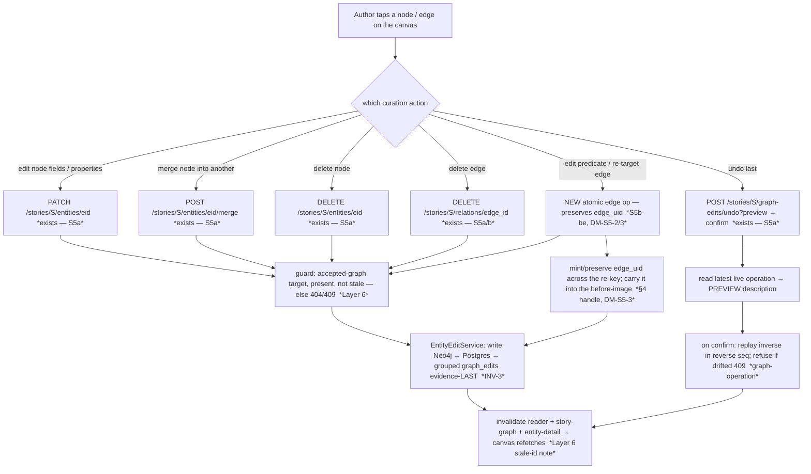

# Graph-quality S5 — the graph as an in-place editing surface

> **✅ Status: ACCEPTED — register RESOLVED with the owner (2026-07-09, Session 80).** Authoritative home
> for the resolution: `docs/PLAN_SHORT.md` Decided (Session 80). The original forward-design body is kept
> intact below (public-portfolio history — append the resolution, don't delete the thinking). Mirrored to
> [[open-questions]] OQ-33.
>
> **Resolutions (owner, 2026-07-09) — all my leans except DM-S5-4, which the owner overrode:**
> - **DM-S5-1 → (B) extract a shared `EntityEditPanel` core** the reader *and* the canvas both compose
>   ("expose editing to the common core"). *Rejected:* (A) mount `ReaderEntityPanel` directly with display
>   toggles (owner preferred the clean extraction up front); (C) grow the read-only `NodeDetailsPanel` (a
>   second edit surface — declined at S0).
> - **DM-S5-2 → (B) an atomic backend edge-edit op** (edit-predicate / re-target) doing delete-old +
>   create-new server-side as one grouped reversible operation, preserving the §4 handle. *Rejected:* (A)
>   client-side remove+add (splits one edit into two undo steps, opens a partial-failure data-loss window,
>   can't cleanly preserve the handle).
> - **DM-S5-3 → mint-forward + no backfill; coalesce-on-MERGE; survivor keeps the handle; AND mint the
>   "handle survives curation" invariant at the S5b build** (the enforcer exists then, and S6 also re-keys
>   edges → a real near-term consumer). *Rejected:* a backfill migration (premature — nothing reads the
>   handle yet); keeping it only a recorded constraint. **ADR-worthy — drafts at the S5b build** (DM-GQ-1's
>   standing obligation; never write an ADR unasked).
> - **DM-S5-4 → DEFER right-click entirely (owner override).** S5 is **panel-only**; the right-click
>   (`cxttap`) shortcut is a later focused follow-up. *(My lean was a droppable ride-along; the owner chose
>   to keep S5a/S5b lean and add right-click deliberately later — the DM-GQ-3 "panel + right-click"
>   shortcut is thus split: panel now, right-click later.)*
> - **DM-S5-5 → (5a) a single S5a slice** (extract the shared panel + canvas node editing in one
>   conversation) **and (5b) fold the §4 tag into S5b-be** (not a standalone tag slice). *Rejected:*
>   splitting S5a refactor-first; a standalone tag slice.
> - **DM-S5-6 → (A) add the modest panel-vanish guard** (keep the selection while an edit form is dirty;
>   re-select after a successful edit; still clear on delete/merge); **concurrency stays last-write-wins at
>   PoC** (carried, DM-S3a-6). *Rejected:* accept-and-document the panel blink.
>
> **Build sequence (authoritative in `docs/PLAN_SHORT.md`):** **S5a** (frontend-led — extract the shared
> `EntityEditPanel`, mount it on the canvas, wire node edit/merge/delete/undo + the panel guard) → **S5b-be**
> (the §4 handle + the two atomic edge ops + the ADR + the invariant, test-first) → **S5b-fe** (the canvas
> edge affordances). Right-click deferred to a later follow-up.

> **Status: PROPOSED — register OPEN (DM-S5-1..6 / OQ-33). The owner resolves before any S5 code.**
> Step-0 forward design for the milestone **spine** (`docs/specs/graph-quality.md` §3 **S5** + §4). S5
> is **branchy** — the parent [[graph-curation-surface]] already sliced it **S5a node-editing / S5b
> edge-editing** (DM-GQ-6) — so it opens with this decompose, not a build. The deliverable is *this
> note* (data-flow, register, edge cases, the S5a/S5b build detail); the test-first rule resumes at the
> S5a build in a fresh conversation.
>
> **Source of truth for scope:** `docs/specs/graph-quality.md` (owner-approved S66), §3 **S5** and §4
> (the reserved edge handle — read both). Invariants carried in (§8): **INV-1/INV-9** (human gate),
> **INV-3** (grouped undo), **INV-4** (open-world type/predicate). The big already-made calls this note
> builds on live in [[graph-curation-surface]] (DM-GQ-1/3/4/5/6, owner Session 69) — this decompose does
> **not** re-litigate them; it resolves the S5 **build-detail** calls those left open.

## The one finding that frames the slice

**Node-editing is pure canvas-surfacing; the *only* net-new plumbing is edge-editing — and it is exactly
where the reserved §4 handle gets consumed.** Two code-level surveys (2026-07-08) confirm the split:

- **Node writes already ship end-to-end and are already wired on the *reader*.** `EntityEditService`
  exposes `edit_entity` / `merge_entities` / `delete_entity` / `undo_last` (`agents/entity_edit.py`);
  the endpoints exist (`PATCH …/entities/{eid}` `stories.py:904`, `…/merge` `:1035`, `DELETE
  …/entities/{eid}` `:1088`, `…/graph-edits/undo` `:1132`); the frontend hooks exist in `lib/api/`
  (`useEntityEdit`/`useMergeEntities`/`useDeleteEntity`/`useUndo`) and **all invalidate the same
  reader/story-graph/entity-detail triad**, so a canvas caller gets the graph refetch for free; and the
  editable UI already exists as `ReaderEntityPanel` + `MergeControls`/`MergeConflictFields`/pure
  `mergeConflicts.ts`. So **S5a is wiring**: bring these onto the canvas, none of it is new backend.
- **The graph viewer is still the read-only M2.S5 projection with an S3b read overlay.** `GraphCanvas`
  wires exactly two `tap` handlers (node + edge → *read-only* `NodeDetailsPanel` / `EdgeEvidencePanel`);
  **no `cxttap`/right-click, no multi-select, no edit callbacks threaded in** (its prop interface is
  `onSelectNode`/`onSelectEdge` only). The node panel is read-only *and its own comment says so*.
- **Edge writes are the genuine gap.** `delete_relation` (`DELETE …/relations/{edge_id}`) and
  `add_relation` (`POST …/relations`) exist atomically — but **edit-predicate and re-target do not**:
  today they are a *client-side compose* (remove-old + add-new), and because
  `relation_edge_id = uuid5(subject, predicate, object)` (`domain/candidates.py:137`) is
  **content-addressed**, that compose **re-keys the edge** — it is identity-wise a *new* edge. This is
  precisely the fragility §4 named: an edge whose id *is* its content cannot carry anything that must
  outlive curation. **S5b is the first edge-*write* slice, so it consumes the reserved §4 handle**
  ([[surrogate-key]], DM-GQ-1): mint an opaque `uuid4` alongside the content id and *preserve it through
  the re-key*, so a future qualifier ([[reification]]) survives. The handle is **confirmed unbuilt**
  (repo-wide grep for `edge_uid` finds only planning prose).

This matches the milestone thesis (`graph-quality.md` §1): *largely a UX-surfacing job, not net-new
write plumbing* — with the single honest exception being the edge-write ops + the handle, both in S5b.
Naming it up front keeps the slice honest: a reviewer should not hunt for node-write plumbing (it
ships), and should expect the design weight to sit in **S5b**, not S5a.

**Pattern name for what S5 is:** [[direct-manipulation]] (bezpośrednia manipulacja) — the author edits
the graph *object where they see it*, on the canvas, rather than in a separate pane. That is the owner's
stated emphasis (§3 S5: accessibility + fluid in-place editing) and it *drives* the central S5a call
(DM-S5-1, **resolved = extract a shared `EntityEditPanel` core** both the reader and the canvas compose —
reuse the existing write plumbing by factoring it out, never fork a second graph-native editor).

---

## 0b. Operation-surface completeness sweep (the editing canvas)

S5 is a multi-slice feature, so before fixing the S5a/S5b build boundaries: the full operation surface
over **node** and **edge**, each with a home. The line that matters — **endpoint exists** (S5 only adds
the canvas affordance) vs **NEW** (genuinely net-new backend).

| Object | Operation | Backend today | Home |
|---|---|---|---|
| **Node** | select (tap) | — | ✅ exists (M2.S5) |
| **Node** | edit name / type / aliases / properties | ✅ `PATCH …/entities/{eid}` (`entity_edit.edit_entity`) | **S5a — new canvas affordance** |
| **Node** | merge into another | ✅ `POST …/entities/{eid}/merge` (`merge_entities`) | **S5a — new canvas affordance** |
| **Node** | delete | ✅ `DELETE …/entities/{eid}` (`delete_entity`) | **S5a — new canvas affordance** |
| **Node** | create from scratch on the canvas | ❌ (reader has `tag_new_entity` from *text*; no from-nothing node) | **deferred — recorded** (see note 2) |
| **Edge** | select (tap) + evidence read | ✅ (S3b `EdgeEvidencePanel` + `…/relations/{edge_id}/evidence`) | ✅ exists (S3b) |
| **Edge** | delete | ✅ `DELETE …/relations/{edge_id}` (`remove_relation`) | **S5b — new canvas affordance** |
| **Edge** | add (between two nodes) | ✅ `POST …/relations` (`add_relation`) | **S5b — new canvas affordance** |
| **Edge** | edit predicate (re-predicate) | ⚠ **client-side remove+add today — re-keys the edge** | **S5b — NEW atomic op (DM-S5-2)** |
| **Edge** | re-target an endpoint | ⚠ **client-side remove+add today — re-keys the edge** | **S5b — NEW atomic op (DM-S5-2)** |
| **Edge** | addressability — a stable handle surviving curation | ❌ **§4 handle, reserved-not-built** | **S5b-be — CONSUMED here (DM-S5-3); ADR at build** |
| **Operation** | undo (preview + confirm) | ✅ `POST …/graph-edits/undo` (`undo_last`, two-phase) | **S5a — new canvas affordance** |

**Every operation has a home; no slicing gap.** Two routing notes a sweep must make explicit:

1. **Edit-predicate and re-target are the *only* net-new backend in the whole of S5** (plus the §4
   handle they consume). Everything else is a canvas affordance over a shipped endpoint. Their
   NEW-ness is *because* of the content-addressed id (they re-key the edge), which is why they land
   *with* the handle in **S5b-be**, not before it.
2. **Explicitly deferred (named, routed):** *node create-from-scratch on the canvas* → deferred — S5
   curates what over-extraction produced; a from-nothing canvas node has no curation use case (entity
   creation from *text* is the reader's `tag_new_entity`, M4.S3c), so it is recorded here, not silently
   dropped. **Bulk / multi-select** merge/delete/re-predicate → already routed to `docs/BACKLOG.md`
   (DM-GQ-7). **Predicate-name normalisation** (graph-wide P→Q) → **S6**, not S5 (S5b re-predicates *one
   edge*; S6 renames a predicate *graph-wide*). **Relation deep-modelling** (the qualifiers the handle
   is *for*) → post-PoC (§5), beyond the handle.

---

## Layers (the nine-layer pass — Concise density)

1. **User / personas.** One author, full trust, local ([[project]] L1). **No new [[trust-boundary]]** —
   no egress, no LLM (named so INV-2/INV-5 aren't hunted for). The payoff is the milestone's whole
   point: the author curates *where they see the problem*, on the canvas ([[direct-manipulation]]),
   not in a separate reader pane.
2. **Business.** Both drivers ([[project]] L2). Authoring: the canvas is where a dense graph's problems
   are legible, so it is where cleanup belongs. Portfolio: S5 surfaces the already-built human-gate
   invariants (INV-1/3/9) on the app's most visual surface — a reviewer *sees* the gate acting on a live
   graph — and **the §4 handle is the portfolio set-piece**: "design the constraint now, defer the
   feature" made concrete.
3. **Domain.** No new persisted *nouns* except the edge **handle** ([[surrogate-key]], §4). New *verbs*
   on the canvas are all existing ones surfaced (edit / merge / delete / add-edge / delete-edge / undo)
   plus two genuinely-new edge verbs: **re-predicate** an edge and **re-target** an edge endpoint —
   both *delete-old + create-new* under the hood (the content id changes), so they inherit merge's
   re-point shape. The handle adds the concept of an edge with an **identity independent of its
   endpoints/predicate**.
4. **Data.** **S5b lives here.** `relation_edge_id = uuid5(subject_id, predicate, object_id)`
   (`domain/candidates.py:137`) is content-addressed: it idempotently MERGE-dedups identical facts
   (ADR 0005) but **changes whenever an endpoint or the predicate changes**. Re-predicate/re-target have
   the *same shape as merge's edge re-point* (`domain/entity_merge.py:186` re-derives the id). §4 (DM-GQ-1,
   owner-resolved) adds a stable `edge_uid` **carried alongside** the content id: content id stays the
   MERGE/dedup key, `edge_uid` is the addressable handle. **The build cost is threading the handle
   through every re-key path** — `add_relation` (mint), `merge_entities` re-point (preserve survivor's,
   folded one's → before-image), and the new re-predicate/re-target ops (preserve) — plus a
   **coalesce-on-MERGE** rule so re-writing an identical edge never overwrites an existing handle. Node
   editing surfaces `properties`, which the `/graph` payload *omits* (`GraphNode` drops it) — resolved
   for free by reusing the panel, which fetches per-entity detail (`GET …/entities/{eid}`), not the
   `/graph` payload (DM-S5-1).
5. **Behavior.** **No new lifecycle.** Node edit/merge/delete reuse [[candidate-lifecycle]]'s committed
   self-transition + [[graph-operation]] (the undo stack). Edge re-predicate/re-target reuse
   [[relation-lifecycle]]'s `written → removed` + a fresh `[*] → written` (the re-predicate = remove+add
   shape M4.S3a already modelled — [[m4-entity-editing]] DM-S3a-3) and record one grouped reversible
   [[graph-operation]]. The **§4 handle is a new *attribute* threaded through those transitions, not a
   new state.** Canvas selection is UI state, not a domain transition.
6. **Errors.** [[fail-closed]], reusing the S3a/S3b patterns. Editing/re-targeting an edge whose
   endpoint was merged-away/deleted in another tab → a **dangling reference** ([[referential-integrity]])
   → refuse 404/409, re-resolve at commit ([[toctou]], the guard `undo_last`/`RelationReviewService`
   already model). The canvas adds one *new* error surface: a click against a **stale cytoscape element
   id** — the element id *is* the content id, so after any re-keying write (merge, re-predicate,
   re-target) it changes and a click on the pre-refetch element 404s; fix = the invalidate-then-refetch
   the viewer already does. **The §4 handle does *not* rescue canvas staleness** (the element id stays
   content-derived) — the handle is forward-compat plumbing, not a fix for stale clicks.
7. **Security.** Author's own data, no egress, no LLM (INV-2/INV-5 n/a — named). Standing concern:
   **stored-XSS over the author's own input** — an edited name/predicate/property renders into the canvas
   + panels and must stay React-escaped (no `dangerouslySetInnerHTML`), as M4/S3 held. No new boundary.
8. **Compliance / Audit.** INV-3 is already *executed* (the undo machine, [[graph-operation]]). S5's
   audit additions are (a) the re-predicate/re-target ops each record a grouped `graph_edits` before→after
   op (the merge re-point pattern, reused), and (b) **the before-image must now capture `edge_uid`** — an
   undo of a re-key must restore the old edge *with its old handle*, or undo silently changes identity.
   The completeness guard [[graph-operation]] already enforces widens to include the handle.
9. **Operations.** No new infra, no LLM (INV-5 n/a — named). One ops note: re-target/re-predicate are
   single-edge writes (unlike S6's graph-wide fold), trivial at one author's scale; the canvas must
   tolerate an edge *re-id-ing* between fetches (the benign single-user consistency window, now on an
   edge-write). The handle mint/preserve is O(1) per edge write.

---

## Stations (enforcement-lifecycle checklist — empty boxes named)

| Station | State | Note |
|---|---|---|
| **Identity** | n/a | single local user, no auth ([[overview]]) |
| **Intent** | ✅ | the author taps a node/edge and invokes edit / merge / delete / re-predicate / re-target / undo — a deliberate, often destructive gesture on the canvas |
| **Policy** | ✅ | only **accepted-graph** nodes/edges are curatable (the read-side echo of INV-1); an edge op needs both endpoints still present |
| **Decision** | ✅ deterministic | the human types the new value / picks the survivor / re-points the endpoint — no model ([[prefer-deterministic]]) |
| **Access** | n/a | localhost binding is the only gate |
| **Monitoring** | n/a | no LLM call, nothing to meter (INV-5 n/a) |
| **Evidence** | ✅ (reused + extended) | every canvas write records a (grouped) `graph_edits` before-image (S3a/S3b machinery); **extended: the before-image now carries `edge_uid`** so undo restores handle-and-all |
| **Expiry** | ⚠ (carried) | `graph_edits` retention — the same **none-at-PoC** posture as the decision/staging logs (OQ-4), undo depth-cap noted (ADR 0007). No new Expiry question |
| **Review** | ✅ | the curation action **is** the human review acting on the graph — the human is the reviewer (§3.3 Stage-4 spirit, post-commit) |

No station is *newly* empty — the S3a/S3b write substrate filled them. The one open mark (**Expiry**) is
the carried `graph_edits`-unbounded posture, not a fresh gap. Evidence is the one that *grows* (the
handle joins the before-image).

---

## Data flow

The author works the canvas directly ([[direct-manipulation]]). Tap a node → the selection panel (now
editable: edit / merge / delete); tap an edge → the edge panel (S3b evidence + S5b edit-predicate /
re-target / delete); a global undo affordance that **previews what it reverses** (the shipped two-phase
`undo?preview=true` → confirm). Node writes go to the **existing** endpoints unchanged; edge re-predicate
/ re-target go to **new atomic ops** that preserve the §4 handle across the re-key. Every write records
grouped reversible evidence, then invalidates the graph query so the canvas refetches.

The **`graph first → evidence last`** order keeps a crash retryable; the **operation group** lets undo
treat a re-key as one reversible atom — both inherited verbatim from S3a/S3b. The **only new box** is
`HND` (the handle mint/preserve), and the only new *op* is the atomic edge re-key `G`.

---

## State & invariants

**No new state machine.** Node edits reuse [[candidate-lifecycle]] + [[graph-operation]]; edge re-key
reuses [[relation-lifecycle]] (`written → removed` + fresh `written`) + [[graph-operation]]. Folded on
**acceptance/build**, not now:

- **Edge re-predicate / re-target = one [[graph-operation]].** Forward: `written(old id) → removed` +
  `[*] → written(new id)`, carrying the **same `edge_uid`** onto the new content id. Reverse: the undo
  executor restores the original edge *and its handle*. The grep set widens by the two new ops.
- **The §4 handle threads through every re-key path** — `add_relation` (mint if absent),
  `merge_entities` re-point (survivor keeps, folded → before-image), re-predicate/re-target (preserve).

**Invariant pressure (all carried from `graph-quality.md` §8):**

- **INV-1 (human gate) — upheld.** Every canvas action is human-initiated; no automated stage
  edits/re-targets. Unchanged.
- **INV-9 (only human-reached handlers write the graph) — enumeration grows by *paths*, no new writer
  class.** Re-predicate/re-target are new methods on the *existing* `EntityEditService` edge-writer,
  reached only from new human endpoints — the ADR-0005/0006 *broaden-don't-mint* precedent (the eighth
  witnessed path). Confirm at build the grep guard widens to the new edge-op SQL.
- **INV-3 (reversible + evidence) — reused, extended.** The before-image must be **complete including
  `edge_uid`** or undo restores a handle-stripped edge — the before-image-completeness guard
  [[graph-operation]] already carries, widened by one attribute. Test-first: "re-predicate then undo
  restores the exact prior predicate **and** handle."
- **INV-4 (open-world predicates) — upheld.** Re-predicate edits a *free-string* predicate on *one*
  edge; it never constrains the predicate *type* to an enum (graph-wide vocabulary reduction is S6).
- **INV-2 / INV-5 — n/a** (no egress, no LLM). Named so a reviewer doesn't hunt.
- **Open point — does the handle-preservation rule graduate to an invariant at the S5b build?** S0 said
  the handle is "a *design constraint*, not yet an invariant … no feature ⇒ no enforcer." But S5b
  *builds an enforcer* — the preserve-on-re-key logic + its test. So "an edge's `edge_uid` survives
  re-point / re-predicate / merge" arguably becomes a real contract at S5b. **Owner's call at build**
  (folded with the ADR): mint a new invariant, or keep it a recorded constraint until a qualifier feature
  consumes the handle. Flagged in DM-S5-3, not resolved here.

---

## Decision register (OPEN — DM-S5-1..6; mirrored to [[open-questions]] OQ-33)

> Each entry: **Context / Options / My proposal / Open.** I *propose*; the owner *resolves*.
> `verify-at-build` marks any call resting on un-inspected behaviour. **Plain-language versions are in
> "Gaps for the product owner" below** — do not lift this register's shorthand into the owner's question
> (root `CLAUDE.md` communication rule). The big shape (reuse the panel, reuse endpoints, canvas undo,
> S5a/S5b split, reserve the handle) is **already resolved in [[graph-curation-surface]]** — this
> register is the S5 build-detail only.

### DM-S5-1 — The canvas edit panel: reuse the reader's panel, extract a shared one, or grow the graph-native one **(the S5a central call)**
> **✅ Decision (owner, Session 80): (B) extract a shared `EntityEditPanel` core** the reader and the
> canvas both compose ("expose editing to the common core"). Clean separation up front. *Rejected:* (A)
> direct-reuse-with-toggles (owner preferred the extraction), (C) grow `NodeDetailsPanel` (declined at S0).
- **Context.** DM-GQ-3 (owner) already chose "a selection-driven editable panel + a right-click
  shortcut, reusing the reader's edit panel." The build-detail: *how* to reuse it. `ReaderEntityPanel`
  is **mostly graph-generic** — it takes `entityId`/`storyId`, fetches its own detail (properties + ego
  graph), and its Edit / `MergeControls` / Delete / Relations blocks touch no reader state. Its **only**
  reader-coupled block is the **occurrences timeline** (needs `paragraphs` + `onNavigateToOccurrence` to
  scroll into prose). The graph viewer's own `NodeDetailsPanel` is read-only (and doesn't even receive
  `properties`).
- **Options.** **(a) Reuse `ReaderEntityPanel` directly on the canvas**, rendering the occurrences block
  only when `paragraphs` is supplied (the canvas passes none → the block is absent). Cheapest; one panel,
  one edit code-path. **(b) Extract a shared `EntityEditPanel`** (the edit/merge/delete/relations core)
  that both the reader and the canvas compose, each adding its own context (reader adds occurrences).
  Cleaner separation; a refactor of a shipped component. **(c) Grow the graph viewer's `NodeDetailsPanel`
  into an editable panel** — a *second* edit surface to keep in sync (rejected shape — the exact fork
  DM-GQ-3 already declined).
- **My proposal.** **(a) direct reuse with the occurrences block conditional** — simplicity-first, and it
  banks the reuse DM-GQ-3 intended without a speculative refactor; the panel already fetches its own
  detail so the `/graph` payload's missing `properties` never bites. Promote to **(b)** only if the two
  contexts visibly diverge during the build (then extract the core rather than fork). *Rejected:* (c) two
  panels drift. **`verify-at-build`:** the panel renders correctly with `paragraphs=[]` (no occurrences)
  and inside the graph viewer's layout (it currently lives in a reader fl: column).
- **Open.** Owner: direct-reuse-with-optional-occurrences (my lean **a**) vs extract-a-shared-core (b)?

### DM-S5-2 — Edge re-predicate + re-target: an atomic backend op vs the client-side remove+add compose **(the S5b central call; couples to DM-S5-3)**
> **✅ Decision (owner, Session 80): (B) a new atomic backend op** does the delete-old + create-new
> server-side as one grouped reversible operation, preserving the §4 handle. *Rejected:* (A) the
> client-side remove+add compose (splits one edit into two undo steps; partial-failure data-loss window;
> can't cleanly preserve the handle).
- **Context.** `delete_relation` + `add_relation` exist atomically, but **edit-predicate and re-target
  have no atomic op** — today they're a client-side *remove-old + add-new* (`useAddRelation.ts:13`
  documents it). Because the edge id is `uuid5(subject, predicate, object)`, that compose **re-keys the
  edge**: it is a new edge id, two `graph_edits` rows, and — once §4 lands — a *new* `edge_uid` unless
  something carries the old one across. A client compose *cannot* preserve the handle (the two calls are
  independent; the new edge is minted with a fresh handle).
- **Options.** **(a) Keep the client-side compose** (remove+add), and thread the handle by having
  `add_relation` accept an optional `edge_uid` the client reads off the old edge first. Cheapest backend;
  but it makes handle-preservation a *client* responsibility (fragile — a dropped call orphans the
  handle) and leaves a window where the edge briefly doesn't exist. **(b) A new atomic backend op**
  (`update_relation` / a re-target op on `EntityEditService`) that does the delete-old + create-new **in
  one grouped operation, server-side, preserving `edge_uid`**. One human endpoint each (or one
  `PATCH …/relations/{edge_id}` carrying the new predicate and/or endpoints); one grouped `graph_edits`
  op; the handle never leaves the server.
- **My proposal.** **(b) atomic backend ops** — S5b is *the* slice that reserves the handle (§4), and a
  handle that a client compose can silently drop defeats the point. An atomic op keeps handle-preservation
  a server invariant (DM-S5-3), records the re-key as one reversible grouped operation, and closes the
  brief no-edge window. Cost: two new service methods + endpoints + OpenAPI regen. *Rejected:* (a) — it
  externalises the handle contract to the client. **`verify-at-build`:** the re-key MERGE on the new
  content id must **fold** a collision (a re-target/re-predicate that lands on an edge already between the
  pair) and record the fold in the before-image (the merge-collision pattern) — confirm `create_relation`'s
  MERGE surfaces `merged_into_existing` on this path too.
- **Open.** Owner: atomic backend re-key ops that own the handle (my lean **b**) vs the client-side
  compose with a handle passthrough (a)?

### DM-S5-3 — The §4 edge handle: mint/preserve rules + whether it earns an invariant **(the modelling call; ADR-worthy — drafts at build)**
> **✅ Decision (owner, Session 80): mint-forward + no backfill; coalesce-on-MERGE (set-if-absent);
> survivor keeps the handle (folded → before-image); AND mint the "an edge's handle survives
> re-point/re-predicate/merge" invariant at the S5b build** (the enforcer exists then; S6 also re-keys
> edges → a real near-term consumer). *Rejected:* a backfill migration (premature — nothing reads the
> handle yet); keeping it only a recorded constraint. **ADR-worthy — the ADR drafts at the S5b build, not
> now** (never write an ADR unasked).
- **Context.** §4 (owner, Session 69, DM-GQ-1) resolved **yes — reserve a stable `edge_uid`** (opaque
  `uuid4` alongside the content id; content id stays the MERGE/dedup key). Confirmed **unbuilt**. S5b is
  the first edge-write slice → **it consumes the handle**. The build-detail: *which writes mint it, does
  it backfill, how does it survive the content-MERGE, and does preserve-on-re-key become an invariant?*
- **Options / sub-calls.**
  - **Mint scope.** (a) mint on **every edge write going forward** (`create_relation`, covering both the
    S5b ops *and* the M3.S4e relation-decide gate) + **no backfill** of legacy edges (they get a handle
    lazily when first curated, or never — nothing reads it yet). (b) a one-shot **backfill migration**
    stamping every existing edge now (uniform coverage; a migration for a feature nothing consumes).
  - **Content-MERGE coalesce.** The content id MERGEs idempotently, so re-writing an identical edge must
    **not** overwrite an existing `edge_uid` — set it **only if absent** (`coalesce`), or a retried/
    duplicate write silently re-tags the edge. `verify-at-build` the Cypher `ON CREATE SET` vs `ON MATCH`.
  - **Survivor rule on a fold** (already S0-decided): the **surviving** edge keeps its handle; the folded
    edge's handle → the before-image (so undo un-folds). Applies to merge re-point *and* the DM-S5-2 re-key
    collisions.
  - **Invariant?** Whether "an edge's `edge_uid` survives re-point/re-predicate/merge" is minted as a new
    invariant at build (S5b writes its enforcer + test) or kept a recorded constraint until a qualifier
    feature consumes it (see State & invariants open point).
- **My proposal.** **Mint-on-write-going-forward + no backfill** (YAGNI — nothing reads the handle yet;
  a future reification pass can backfill if it ever needs universal coverage); **coalesce-on-MERGE**
  (set-if-absent); the **survivor rule** as S0 decided. On the invariant: **mint it at the S5b build**
  (the preserve rule + test *is* a live contract the moment the code exists) — but this is the owner's
  call at build, folded with the ADR. **This decision is ADR-worthy** (it crosses the data-model identity
  boundary — DM-GQ-1's standing obligation); **the ADR drafts at the S5b build, not now** (`build no
  feature at decompose`; never write an ADR unasked). *Rejected:* backfill (a migration for an unconsumed
  attribute).
- **Open.** Owner: mint-forward + no-backfill (my lean) vs backfill? Mint the invariant at build (my
  lean) vs keep it a constraint? (Both are *build-time* confirmations; recorded here so the build doesn't
  decide them silently.) The ADR is drafted **at build** on your confirmation.

### DM-S5-4 — Right-click (`cxttap`) context menu: ride-along in S5 vs defer
> **✅ Decision (owner, Session 80 — OVERRIDE of my lean): DEFER right-click entirely.** S5 is
> **panel-only**; the `cxttap` shortcut is a later focused follow-up. *(My lean was a droppable ride-along;
> the owner chose to keep S5a/S5b lean and add right-click deliberately later. The DM-GQ-3 "panel +
> right-click" shortcut is thus split: panel now, right-click later — surfaced, not dropped.)*
- **Context.** DM-GQ-3 chose "panel-spine **+** right-click shortcut." No `cxttap`/context menu exists on
  the canvas today. S0 flagged a `verify-at-build`: cytoscape's `cxttap` vs the browser context menu, and
  not breaking pan/zoom.
- **Options.** (a) **Land the panel-driven editing first (the spine), add right-click as a cheap
  fast-path** in the same slice where it's low-risk (a small menu of the same actions the panel exposes).
  (b) **Defer right-click** to keep S5a/S5b clean panel-only slices; add it as a later ride-along.
- **My proposal.** **(a) panel-first, right-click as a fast-path where cheap** — but treat the context
  menu as *droppable* if the `cxttap`/browser-menu interplay proves fiddly in the real-browser smoke
  (it's a speed affordance over actions the panel already exposes, never a separate code path).
  **`verify-at-build`:** the in-canvas `cxttap` menu intercepts before the browser context menu without
  breaking cytoscape pan/zoom — a real-browser boundary, not a jsdom test.
- **Open.** Owner: right-click as an S5 ride-along (my lean **a**) vs deferred?

### DM-S5-5 — Slice boundaries: S5a single frontend-led, S5b split be/fe; where the handle lands
> **✅ Decision (owner, Session 80): (5a) a single S5a slice** (extract the shared panel + canvas node
> editing in one conversation; split at build only if the extraction turns hairy) **and (5b) fold the §4
> tag into S5b-be** (not a standalone tag slice). Final cut: **S5a → S5b-be → S5b-fe.** *Rejected:*
> refactor-first S5a split; a standalone tag slice.
- **Context.** DM-GQ-6 set **S5a = node** / **S5b = edge**. S5a is frontend-led (all node endpoints
  ship); S5b now carries real backend (the two edge ops + the §4 handle + the ADR), so it looks like the
  S3/S4 be/fe split.
- **Options.** **(a)** S5a = one frontend-led slice (reuse the panel on the canvas: node edit / merge /
  delete / undo, + surface the *existing* delete-edge/add-edge if cheap); **S5b split** → **S5b-be** (the
  §4 handle + the atomic re-predicate/re-target ops + the grouped evidence + endpoints + ADR, test-first)
  then **S5b-fe** (the edge edit affordances on the canvas panel). **(b)** land the §4 handle as a *tiny
  standalone slice before S5b-be* (the "S3a.5" shape DM-GQ-6 floated) if the owner wants the handle
  reserved independently of the edge ops.
- **My proposal.** **(a)** — S5a stands alone green (pure wiring over shipped endpoints); S5b-be is a
  coherent backend green slice (handle + ops + ADR) that S5b-fe then surfaces. Fold the handle **into
  S5b-be** (its first edge-write is where the handle is cheapest and first needed) rather than a
  standalone slice — there's no consumer of the handle before the edge ops, so a separate slice would
  reserve-then-wait. *Considered:* (b) if the owner wants the §4 ADR landed on its own; but nothing
  consumes the handle until the ops, so bundling is simpler.
- **Open.** Owner: confirm S5a-single / S5b-be / S5b-fe (my lean), handle folded into S5b-be (my lean)
  vs a standalone handle slice?

### DM-S5-6 — Editing-state vs the canvas's reactive selection-pruning + concurrency posture
> **✅ Decision (owner, Session 80): (A) add the modest guard** — keep the selection while an edit form is
> dirty; re-select the same entity after a successful edit; **still clear on delete/merge** (correct).
> **Concurrency stays last-write-wins at PoC** (carried, DM-S3a-6). *Rejected:* accept-and-document the
> panel blink.
- **Context.** The graph viewer has a **reactive effect that nulls the selection when the selected
  node/edge leaves the visible set** (a filter change, or a refetch after an edit that drops the node).
  An open edit form whose entity gets pruned mid-edit would lose the panel. Separately, the multi-tab
  **lost-update** posture (DM-S3a-6) carries: last-write-wins at PoC.
- **Options.** (a) **Guard the panel against mid-edit auto-clear** — don't prune the selection while an
  edit form is open/dirty (or reopen the panel after the post-edit refetch on the same entity id). (b)
  Accept the clear (the edit already committed before the refetch; a *filter*-driven prune mid-edit is
  rare at one author's pace) and document it. Concurrency: **last-write-wins at PoC** (carried, DM-S3a-6)
  — the benign single-author window, now with delete/merge in the slice making the edit-vs-delete race
  slightly sharper.
- **My proposal.** **(a) a modest guard** — keep the selection while an edit form is dirty, and after a
  successful edit re-select the same entity id post-refetch so the panel doesn't vanish under the author.
  **LWW-at-PoC** confirmed (optimistic concurrency is the V1 refinement). *Considered:* (b) is fine if the
  guard feels like ceremony — the commit lands regardless; only the *panel* would blink.
- **Open.** Owner: guard the panel against mid-edit prune (my lean **a**) vs accept-and-document (b)?
  Confirm LWW-at-PoC.

---

## But what if (edge cases — name the failure, teach the name)

- **…a re-predicate/re-target lands on an edge that already exists between the pair?** A **MERGE-collision**
  — the new content id hits an existing edge and folds. **Surface the fold** (the merge-collision pattern,
  M4.S3a DM-S3a-3), record the original in the before-image so undo un-folds, and apply the **survivor
  handle rule** (DM-S5-3): the surviving edge keeps its `edge_uid`, the folded one's → before-image.
- **…the author re-targets an endpoint to itself (self-loop) or to a deleted/merged-away node?** A
  self-loop may be intentional (M4.S3a allowed manual self-loops); a vanished endpoint is a **dangling
  reference** ([[referential-integrity]]) → re-resolve at commit, refuse 404/409 ([[toctou]]). Never write
  to a ghost.
- **…a canvas click fires against a stale element id after a re-keying write?** The element id *is* the
  content id, so after merge/re-predicate/re-target the id no longer exists → 404. Fix = the
  invalidate-then-refetch the viewer already does; the in-flight action fails closed and the refetched
  canvas shows the new edge. **The `edge_uid` does not rescue this** (the *element* id is still
  content-derived) — a reminder the handle is forward-compat plumbing, not a staleness fix.
- **…undo of a re-predicate when the edge was re-targeted since (or vice versa)?** A **[[lost-update]] in
  reverse** — the [[graph-operation]] drift check refuses (409) and names what drifted. Reused.
- **…the content-MERGE re-writes an identical edge and clobbers its `edge_uid`?** The handle would silently
  change identity. **Coalesce (set-if-absent)** on MERGE (DM-S5-3) — a duplicate/retried write preserves
  the existing handle; only a genuinely new edge mints one. `verify-at-build` the Cypher.
- **…the author edits a node on the canvas and a filter change prunes the selection mid-edit?** The
  reactive selection-pruning effect would drop the open panel. **Guard it** (DM-S5-6): keep the selection
  while the form is dirty; re-select post-refetch.
- **…the shared panel renders on the canvas with no prose context?** The occurrences timeline block is
  simply not composed on the canvas — under **DM-S5-1 = extract a shared core**, the reader composes the
  occurrences block around the shared `EntityEditPanel`, the canvas composes the shared core alone. So
  there is no "empty occurrences" state to handle — *correct by construction*, not an error.
- **…right-click on the canvas — cytoscape `cxttap` or the browser menu?** ~~A UI race~~ **Deferred
  (DM-S5-4 = defer right-click).** S5 is panel-only; the `cxttap`-vs-browser-menu / pan-zoom race is a
  concern for the *later* right-click follow-up, not this slice — recorded here so that follow-up inherits
  the named risk.
- **…a legacy handle-less edge is curated?** Under mint-forward + no-backfill (DM-S5-3), the re-key mints
  a handle on the *new* edge — fine (nothing was attached to the old one; no qualifier feature exists yet).
  Name it so "why don't old edges have handles?" is an answered question, not a surprise.

---

## Gaps for the product owner (plain language — the calls only you can make)

> The register is architect shorthand for the vault. Here are the calls that actually need you, in plain
> words (root `CLAUDE.md`). One at a time when we resolve them. The *big* shape (edit on the canvas by
> reusing the reader's panel + right-click; reuse the existing save/merge/delete/undo; keep the same
> "undo last" with a preview; reserve a permanent edge tag) you already decided back in S0 — these are the
> smaller build calls left over.

1. **Which panel does the canvas use to edit a node? (DM-S5-1.)** My lean: **reuse the editing panel you
   already have in the reader** — it already knows how to edit a name/type/aliases/properties, merge, and
   delete — just leave off the "where it appears in the text" list (that needs the prose, which the graph
   canvas doesn't have). The alternative is to pull that panel's editing guts into a shared piece both the
   reader and the canvas use — cleaner, but it's reshaping code that already works, so I'd only do it if
   the two turn out to genuinely need different things.
2. **How do we edit an edge — rename its relation word or point it at a different node? (DM-S5-2 + DM-S5-3
   — the heart of this slice.)** Today the app fakes it by *deleting the old edge and creating a new one*,
   which — because an edge's internal id is built from its contents — makes it a brand-new edge each time.
   That's exactly what would drop the **permanent edge tag** you agreed to add in S0. My lean: build a
   proper "edit this edge" operation on the backend that keeps the permanent tag across the change, rather
   than the delete-and-recreate trick. This is the first slice that actually adds that permanent tag, so
   getting it right here is the point.
3. **Confirm how the permanent edge tag behaves. (DM-S5-3.)** My lean: give **new** edges a permanent tag
   from now on and keep it through any cleanup, but **don't** go back and tag every existing edge (nothing
   uses the tag yet — a future feature can backfill if it ever needs to). And when two edges collapse into
   one, the surviving edge keeps its tag (you decided this in S0). This is the one change that touches how
   edges are stored, so it earns a short written decision record (an ADR) — which I'll draft **at build
   time**, on your go-ahead, not now.
4. **Right-click menu — include it now or later? (DM-S5-4.)** My lean: build the side-panel editing first
   (that's the main way), and add a right-click shortcut *if* it's cheap and doesn't fight the browser's
   own right-click — otherwise defer it. It's a convenience over the same actions, never a separate path.
5. **How to cut this into sessions. (DM-S5-5.)** My lean: **(S5a)** node cleanup on the canvas first (all
   the plumbing exists — it's mostly wiring buttons to the panel), one session; **(S5b)** edge cleanup
   next, split into backend (the permanent tag + the new "edit-edge" operation + its ADR) then frontend.
6. **A small one:** while you're editing a node, a filter change shouldn't make the edit panel vanish — my
   lean is to keep it open until you're done (DM-S5-6); and if you ever edit the same thing in two tabs,
   the last save wins (as today).

---

## Hand-off (register RESOLVED Session 80 — next is the S5a build)

> **✅ Register resolved (owner, Session 80).** The build starts at **S5a** (frontend-led) in a *fresh
> conversation*, then **S5b-be** (the §4 handle + the two atomic edge ops + the ADR + the invariant),
> then **S5b-fe**. Right-click is a later follow-up (DM-S5-4). The original open-register hand-off framing
> is kept below for history.

Per the **spec- and test-driven** rule, the register is now resolved with the owner, so the build can
begin. **No `docs/specs/graph-quality.md` amendment** — §3 S5 already scopes node+edge
edit/re-target/delete and §4 already reserved the handle (confirmed by reading §3 S5 + §4). **No ADR this
session** — the §4-handle ADR drafts **at the S5b build** (DM-GQ-1's standing obligation; crosses the
data-model identity boundary), on the owner's confirmation.

When **S5a** is reached: it is frontend-led on shipped endpoints — the first step is the pure
view/edit-state mapping that lets `ReaderEntityPanel` (or the extracted core, per DM-S5-1) mount on the
canvas with the occurrences block absent, then wiring the existing hooks + the invalidate-driven refetch,
then the real-browser smoke (canvas edit/merge/delete/undo at Oakhaven scale).

When **S5b-be** is reached: the first failing test is the **pure edge re-key plan** (given an edge + a new
predicate and/or endpoint, produce the delete-old/create-new steps **carrying the preserved `edge_uid`**
+ the fold decision on a collision — pure, no store, the `entity_merge.py` analogue), then the `edge_uid`
mint/preserve/coalesce in `Neo4jRepo` (integration), then the `EntityEditService` re-predicate/re-target
ops emitting the grouped before→after evidence *with the handle*, then the endpoints (+ OpenAPI regen),
then **S5b-fe**.

**On acceptance:** reconcile this note to *resolved* (flip `status`, rewrite each register entry
`My proposal → Decision`, deactivate rejected options across the body + the Mermaid diagram); strike OQ-33
in [[open-questions]]; record the resolutions in `docs/PLAN_SHORT.md` Decided; and **at the S5b build**
draft the §4-handle ADR (owner-confirmed), fold the re-key transitions + the widened INV-9 grep guard +
(if the owner mints it) the handle-preservation invariant into [[invariants]] / [[relation-lifecycle]] /
[[graph-operation]]. No ADR is written without explicit confirmation.
