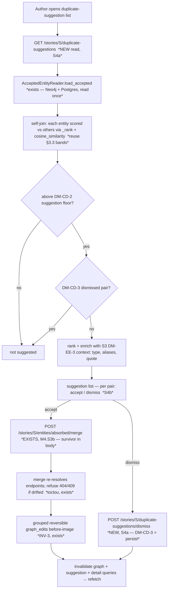

# Graph-quality S4 — suggest duplicate clusters over the accepted graph

> **✅ Status: ACCEPTED — register RESOLVED with the owner (2026-07-06, Session 77).** Authoritative home
> for the resolution: `docs/PLAN_SHORT.md` Decided (Session 77). The forward-design body below is kept
> intact (public-portfolio history — append the resolution, don't delete the thinking). Mirrored to
> [[open-questions]] OQ-32.
>
> **Resolutions (owner, 2026-07-06):**
> - **DM-CD-1 (cluster model) → (a) pairwise for V1.** Flat A–B pairs, ranked strongest-first; the merge
>   is pairwise anyway, and this sidesteps *cluster drift*. Transitive [[connected-components]] (star-guarded)
>   is a **named later refinement**, not a gap. *Rejected:* (b) transitive-now, (c) guarded-clusters-now.
> - **DM-CD-2 (rungs + floor) → eager / recall-first.** Stage 1 name **+** Stage 2 embeddings, floored at
>   the **ambiguous** band (nothing auto-merges → surface the diminutive/inflection zone; a false positive
>   costs one dismiss click), ranked strongest-first, **deterministic-only** (no live judge). A
>   `duplicate_suggest_floor` config knob tunes noise. Type stays a **soft** ranking signal, never a hard
>   filter (INV-4). *Rejected:* high-precision auto-merge-bar floor; name-only. *`verify-at-build` stands:*
>   a zero-mention-vector entity falls back to name-only (cosine raises on a zero-magnitude vector).
> - **DM-CD-3 (dismissal memory) → (b) persist dismissals.** Record a "not a duplicate" in a small Postgres
>   pair-store (unordered entity-pair + project_id, staging-side — INV-9 holds), consulted to suppress
>   re-suggestion; suggestions themselves stay computed-on-open; **none-at-PoC retention** (OQ-4), reversible
>   un-dismiss. The [[intra-batch-dedup|DM-rej]] precedent. **ADR-worthy — draft at build** (adds stored
>   state / fills the Evidence station). *Rejected:* (a) ephemeral, (c) materialize the full queue.
> - **DM-CD-4 (review surface) → (a) a dedicated list.** A "possible duplicates" list, each row = the pair +
>   S3 (DM-EE-3) verification context (type, aliases, quote) + accept→merge / dismiss, reusing the
>   review-queue pattern. Canvas-annotation overlay → `docs/BACKLOG.md`. *Rejected:* canvas-annotation as the
>   V1 surface.
> - **DM-CD-5 (slice split) → confirmed:** **S4a** (pure `domain/duplicate_clusters.py` self-join + `GET
>   …/duplicate-suggestions` read + the DM-CD-3 dismissal store + `POST …/duplicate-suggestions/dismiss`) /
>   **S4b** (the review list feeding the existing merge). S4a first, test-first.
> - **DM-CD-6 (reuse-not-fork) → confirmed:** the merge is unchanged (one existing endpoint); exactly one
>   new read + one new dismiss write; **project-scoped** (as the matcher already is).
>
> This is the **S4 step-0 decompose** (`docs/specs/graph-quality.md` §3 S4, promoted from
> `docs/BACKLOG.md`, owner Session 69 — recorded in [[graph-curation-surface]]'s resolution banner). It
> is a **design slice**: the deliverable is *this note*. The test-first build (S4a) starts in a **fresh
> conversation** (one-unit-per-conversation).
>
> **Source of truth for scope:** `docs/specs/graph-quality.md` (owner-approved S66) — *not* the frozen
> PoC spec. Key sections this decompose answers: **§3 S4** (the suggestion pass), **§5** (the fork —
> curation-time suggestion is IN scope, extraction-time suggestion is OUT), **§6** (a hand-cleanable
> graph is the deliverable), **§8** (invariants carried in: INV-1/INV-9 human gate, INV-4 open-world).
> The reused machinery is spec **§3.3** (the cascade matcher + Stage-4 merge path).

## The one finding that reframes the whole slice

**The matcher and the commit path both already exist; S4 adds only a *read/analysis* surface and a
*review* surface — no net-new graph write.** Two pieces already ship and compose exactly into S4:

1. **The matcher already scores a name/vector against a set of accepted entities.**
   `MatchingAgent.stage1`/`stage2` (`agents/matching_agent.py`) take a query + a `list[ExistingEntity]`
   / `list[EntityVectors]` and return a §3.3-banded match — deterministic, local, no LLM. Its ranking
   core `_rank` (RapidFuzz `token_set_ratio` over `canonical_name` + aliases) and `cosine_similarity`
   are already pure and CI-tested. **`AcceptedEntityReader.load_accepted(project_id)`
   (`adapters/accepted_entity_reader.py`) already assembles the `AcceptedSnapshot`** — every accepted
   entity's names+aliases (Neo4j), mention vectors and recent mention texts (Postgres), read once per
   run. That snapshot was built to match *one new candidate* against the accepted set at intake; S4 is
   the **self-join**: run each accepted entity *as the query* against the *others*, using the same
   bands. The only net-new backend logic is a small pure clustering function (the `entity_merge.py` /
   `predicate_consolidation.py` analogue) that enumerates the above-floor pairs.

2. **The merge commit path already ships (M4.S3b / S3-S5 surface).** `plan_merge`
   (`domain/entity_merge.py`, pure) → `EntityEditService.merge_entities` → **`POST
   …/entities/{entity_id}/merge`** (absorbed = path `entity_id`, survivor = body `target_entity_id`),
   human-gated (INV-1/INV-9), grouped-reversible (INV-3), with the S3 (DM-EE-3) enriched merge context
   already surfacing type + aliases + quote for verification. **S4 *suggests* pairs and feeds them into
   this existing merge — it never merges anything itself** (INV-1/INV-9 hold, exactly as the spec
   demands: "it suggests, never auto-merges").

So S4 is the **entity twin of S6** (predicate-name synonym suggest): a curation-time, human-gated
*suggest-then-you-decide* pass over the already-accepted graph. Naming this up front keeps the slice
honest — a reviewer should not hunt for a new merge write path, nor a new matcher: both exist; S4 wires
a self-join over the first into a review surface that feeds the second.

---

## 0b. Operation-surface completeness sweep (the duplicate-suggestion surface)

S4 is one slice; it may split be/fe (see DM-CD-5), so the sweep enumerates the operations "suggest
duplicate clusters" must deliver and each one's home. The line that matters: **exists** (already
shipped — S4 only calls it) vs **NEW** (genuinely net-new).

| Object | Operation | Backend | Home |
|---|---|---|---|
| **Duplicate-suggestion** | compute + list (self-join over the accepted graph) | ❌ **NEW** read | **S4a — new pure fn + read endpoint** |
| **Duplicate-suggestion** | accept a pair → commit the merge | ✅ `POST …/entities/{id}/merge` (M4.S3b) | **S4b — new caller, existing endpoint** |
| **Duplicate-suggestion** | dismiss / suppress ("not a duplicate") | ❌ **NEW** (DM-CD-3 = **persist**) | **S4a — new Postgres pair-store + endpoint** |
| **Entity** | merge (the commit itself) | ✅ exists (M4.S3b) | reuse unchanged |
| **Entity** | edit / delete (curation the human may reach for mid-review) | ✅ exists (M4.S3a/b) | out of S4 — S5 brings them to the canvas |

**Every operation has a home; no slicing gap.** Two routing notes:

1. **The merge is *not* S4's to build** — it is the reused commit (finding #2). S4b is a new *caller*.
2. **Explicitly deferred (named, routed):** *transitive* multi-entity clusters (vs pairwise) → **DM-CD-1**
   (may be a V1 pairwise-only choice with transitive as a named refinement); a *canvas-annotation*
   surface (highlight suggested-duplicate clusters on the graph) → `docs/BACKLOG.md` (S4b ships the list;
   the canvas overlay is a later nicety, not a gap); **blocking / LSH** for a large graph → Layer 9 named,
   revisited when O(n²) bites (trivial at PoC scale).

---

## Layers (nine-layer pass — Concise density; G=31, L=59)

1. **User / personas.** One author, full trust, local ([[project]] L1). **No new [[trust-boundary]]** —
   the self-join is local deterministic compute, no egress, **no LLM** (name it so INV-2/INV-5 aren't
   hunted for). The payoff is the milestone's thesis (§6): surface the duplicates the author would
   otherwise hunt for by eye, so a dense over-extracted graph becomes hand-cleanable.
2. **Business.** Both drivers. Authoring: proactive dedup is a direct step toward the clean-graph
   deliverable (§6). Portfolio: it *reuses* the §3.3 cascade on a new axis (accepted-vs-accepted) and
   showcases the human gate acting on machine *suggestions* — INV-1 as a positive feature, not a brake.
3. **Domain.** No new persisted graph *noun*. New *verb*: **suggest duplicates** (compute likely-same
   accepted entities — an [[entity-resolution|entity-resolution]] pass turned inward on the committed
   graph, distinct from intake [[cascade-matching]] which matches a *new* candidate). If DM-CD-1 picks
   transitive grouping, the language gains a **duplicate cluster** ([[connected-components]] over the
   above-floor similarity graph). If DM-CD-3 lands memory, the language gains a **dismissed pair** (the
   human's recorded "these are genuinely different" — the [[intra-batch-dedup|DM-rej]] rejected-memory
   analogue, at pair granularity).
4. **Data.** **Read-side, mostly.** Reads the `AcceptedSnapshot` (Neo4j entities + Postgres mention
   vectors) already assembled by `AcceptedEntityReader`. The *only* candidate new persisted state is
   **DM-CD-3's dismissal store** — a Postgres table keyed by the unordered entity-id pair (+
   project_id), staging-side, so INV-9's graph-vs-staging line holds (it writes Postgres, never Neo4j).
   The commit path writes nothing new (it *is* the existing merge, which already owns its `graph_edits`
   evidence).
5. **Behavior.** **No new lifecycle for the graph.** A suggestion is an ephemeral *derived view* over
   the accepted graph (recomputed per open), not a persisted state machine — unless DM-CD-3 adds a
   `dismissed` terminal for a *pair*, which is a tiny two-state record (`suggested → dismissed`), not a
   graph transition. Accepting a suggestion *is* the existing [[graph-operation]] merge — S4 adds no
   transition to it. The suggestion recompute is **idempotent** ([[idempotency]]): same accepted graph
   → same suggestions; an accepted merge removes an entity so that pair cannot recur; a dismissed pair
   is suppressed (DM-CD-3).
6. **Errors.** [[fail-closed]]. The self-join is pure over an in-memory snapshot — it cannot partially
   write. The real error surface is **[[toctou]] at the merge**: a suggestion computed against snapshot
   T is accepted at T+1 after the author merged/deleted one of the pair in between → the existing merge
   re-resolves endpoints and refuses 404/409 (the guard M4.S3b already ships). S4 surfaces the stale
   suggestion, the merge fails closed, the list refetches. An entity with **zero mention vectors** must
   degrade to name-only scoring, not crash (`cosine_similarity` raises on a zero-magnitude vector —
   confirm the fallback, DM-CD-2 `verify-at-build`).
7. **Security.** Author's own data, no egress, no LLM (INV-2/INV-5 n/a — named). The standing concern
   stays **stored-XSS over the author's own input**: suggested names/aliases/quotes render into the
   list + must stay React-escaped (no `dangerouslySetInnerHTML`), as M4/S3 held. No new boundary.
8. **Compliance / Audit.** The *merge* records its grouped reversible before-image as today (INV-3) —
   S4 adds nothing there. The only new evidence question is DM-CD-3: is a **dismissal** recorded (so the
   author's "not a duplicate" is durable and auditable) or ephemeral? That is the Evidence-station call,
   and it ties Expiry (OQ-4) — a dismissal store has the same none-at-PoC retention posture as the
   staging tables (the [[intra-batch-dedup|DM-rej]] precedent).
9. **Operations.** No new infra, no LLM (INV-5 n/a — named). One ops note: the self-join is **O(n²)**
   over accepted entities (Stage 1 fuzzy every pair; Stage 2 cosine over mention vectors is heavier).
   Trivial at Oakhaven scale (~186 nodes → ~17k pairs, sub-second); name **[[blocking]]** (partition
   into candidate blocks so only likely pairs are scored — the standard entity-resolution O(n²)
   mitigation, e.g. LSH over embeddings) as the revisit-lever for a future multi-thousand-node graph, so
   the cost isn't pretended free. Compute-on-open keeps it a read, not a background job.

---

## Stations (enforcement-lifecycle checklist — empty boxes named)

| Station | State | Note |
|---|---|---|
| **Identity** | n/a | single local user, no auth ([[overview]]) |
| **Intent** | ✅ | the author opens the suggestion list and, per pair, deliberately accepts (→ merge) or dismisses — an explicit gesture; the pass only *proposes* |
| **Policy** | ✅ | only **accepted-graph** entities are compared (never staged candidates — the read-side echo of INV-1); a pair is suggested only above the DM-CD-2 floor; a DM-CD-3-dismissed pair is suppressed |
| **Decision** | ✅ deterministic | RapidFuzz + cosine bands only — **no live judge** ([[prefer-deterministic]]); the *human* is the judge (INV-1). The machine ranks; the author decides |
| **Access** | n/a | localhost binding is the only gate |
| **Monitoring** | n/a | no LLM call, nothing to meter (INV-5 n/a) |
| **Evidence** | ✅ (DM-CD-3 = **persist**) | the *merge* records grouped before-image evidence (reused, INV-3); a **dismissal** now leaves a durable row too — the Postgres pair-store records the human's "not a duplicate" (staging-side, INV-9 holds), reversible |
| **Expiry** | ⚠ (carried) | suggestions are ephemeral (recomputed, nothing to expire). A DM-CD-3 dismissal store inherits the **none-at-PoC** retention posture (OQ-4 / [[intra-batch-dedup|DM-rej]]) — named, not a fresh gap |
| **Review** | ✅ | the suggestion review **is** the human review acting on the graph (the §3.3 Stage-4 spirit, turned on the accepted set) |

The one genuinely-new station question is **Evidence** (does a dismissal persist?) — it *is* DM-CD-3.
Expiry is the carried none-at-PoC posture, not new.

---

## Data flow

The author opens the duplicate-suggestion surface. The backend assembles the `AcceptedSnapshot` (reusing
`AcceptedEntityReader`), runs the **self-join** (each entity's name+vector scored against the others via
the existing `_rank` / `cosine_similarity`), keeps pairs above the DM-CD-2 floor, drops any DM-CD-3
dismissed pair, and returns them ranked — each enriched with the S3 (DM-EE-3) verification context
(type, aliases, a mention quote). The author reviews each: **accept** feeds the *existing* merge
endpoint (survivor + absorbed, resolved-properties on conflict), which commits + records reversible
evidence; **dismiss** records a "not a duplicate" (only if DM-CD-3 persists it). After either, the list
invalidates + refetches.

The **merge is unchanged** — S4 only adds the *read* (self-join → suggestions) and, conditionally, the
*dismiss* write. The stale-suggestion case rides the merge's existing [[toctou]] guard: a suggestion is
a snapshot-T view, and the commit re-resolves at T+1.

---

## State & invariants

**No new graph state machine.** A suggestion is a derived view, not a persisted lifecycle. The *only*
candidate new persisted state is DM-CD-3's **pair-dismissal** (`suggested → dismissed`, Postgres,
staging-side), folded into a note only on acceptance.

**Invariant pressure (all carried from `graph-quality.md` §8; this slice keeps them honest):**

- **INV-1 (human gate) — upheld and *showcased*.** The pass *suggests*; every merge is human-accepted.
  A hypothetical "auto-merge all above-threshold clusters" would **violate** INV-1 — it is explicitly
  not built (the spec's "suggests, never auto-merges").
- **INV-9 (only human-reached handlers write the graph) — held, no new graph writer.** The suggestion
  read writes nothing. The commit is the *existing* merge path (no new writer class). A DM-CD-3
  dismissal store writes **Postgres only** — the staging side of the line INV-9 draws (the
  [[intra-batch-dedup]] re-match precedent: staging writes are not graph writes). Confirm at build that
  no graph write is introduced.
- **INV-3 (reversible + evidence) — reused.** Accepting a suggestion inherits the merge's grouped
  before-image verbatim. A dismissal, if persisted, is itself reversible (un-dismiss) but is not a graph
  edit — it carries no `graph_edits` row (it never touched the graph).
- **INV-4 (open-world types) — upheld.** The self-join scores names + embeddings; it never constrains or
  reads `type` as a closed enum. (A note for DM-CD-2: type *may* inform ranking — e.g. a same-type prior
  — but must stay a soft signal, never a hard filter, or two duplicates typed differently by
  over-extraction would never be suggested — the very case S4 exists to catch.)
- **INV-2 / INV-5 — n/a** (no egress, no LLM). Named so a reviewer doesn't hunt.

---

## Decision register (✅ RESOLVED 2026-07-06 — DM-CD-1..6; mirrored to [[open-questions]] OQ-32)

> Each entry: **Context / Options / My proposal / Open.** I *propose*; the owner *resolves*.
> `verify-at-build` marks any call resting on un-inspected behaviour. **Plain-language versions of the
> calls that need the owner are in "Gaps for the product owner" below** — do not lift this register's
> shorthand into the question put to the owner (root `CLAUDE.md` communication rule).

### DM-CD-1 — Cluster model: pairwise suggestions vs transitive clusters **(the central modelling call)**
> **✅ Decision (owner, Session 77): (a) pairwise for V1** — flat A–B pairs, ranked; transitive
> [[connected-components]] (star-guarded) is a named later refinement. *Rejected:* (b) transitive-now, (c)
> guarded-clusters-now.
- **Context.** The self-join yields *pairwise* similarities. A "duplicate cluster" (the spec's word) can
  be surfaced as (a) a flat list of **pairs** the author reviews one at a time, or (b) **transitive
  clusters** — [[connected-components]] via union-find over the above-floor pairs, so A~B and B~C group
  into one `{A, B, C}` unit. The merge is *inherently pairwise* (survivor + one absorbed), so a cluster
  of N still commits as **N−1 sequential merges** regardless. The risk of transitivity is **cluster
  drift**: A~B and B~C both pass the floor but A≁C (a common near-name chains unrelated entities into
  one over-grouped blob), so the human is shown a cluster that isn't really one identity.
- **Options.** (a) **pairwise only** — simplest, safest, maps 1:1 to the merge; more review units. (b)
  **transitive connected-components** — fewer, higher-level units; risks cluster drift. (c) **transitive
  but guarded** — group, but require each member to match the cluster *representative* (star-clustering,
  not chaining), and/or let the author pick which members actually fold.
- **My proposal.** **(a) pairwise, presented ranked** for V1: it is the honest unit (the merge is
  pairwise), avoids cluster drift entirely, and the human is the gate. Optionally *group visually* (show
  a name's several suggested partners together) while keeping the **review + commit unit pairwise**.
  Transitive grouping (c, star-guarded) is a clean later refinement once the pairwise surface is proven.
- **Open.** Owner: pairwise-only V1 (my lean) vs transitive clusters now? If transitive later, confirm
  it's a named refinement, not a gap.

### DM-CD-2 — Which matcher rungs + the *suggestion* floor (permissive-for-recall vs auto-merge parity)
> **✅ Decision (owner, Session 77): eager / recall-first** — Stage 1 name + Stage 2 embeddings, floored at
> the ambiguous band, ranked, deterministic-only (no live judge), with a `duplicate_suggest_floor` knob;
> type stays a soft signal (INV-4). `verify-at-build` stands (zero-vector → name-only fallback). *Rejected:*
> high-precision auto-merge-bar floor; name-only.
- **Context.** The intake cascade *auto-merges* above 85 (Stage 1 fuzzy) / 0.85 (Stage 2 cosine). Here
  **nothing auto-merges** (INV-1) — every suggestion is human-reviewed, so the threshold is a
  *suggestion floor*, not an auto-merge bar. S4's whole purpose (surface what the author would hunt for
  by eye — the diminutive/inflection zone like "Bronek"↔"Bronisław") argues for a floor *more permissive*
  than the auto-merge bar, since a false positive costs the author one dismiss click, while a missed
  duplicate stays hidden. Too permissive, though, and the list is noise.
- **Options.** Rungs: **Stage 1 name-only** (cheapest) vs **Stage 1 + Stage 2 embeddings** (catches
  semantic near-dupes names miss). Floor: at the **auto-merge bar** (85/0.85 — few, high-precision) vs
  the **ambiguous floor** (60 fuzzy — recall-first, the diminutive band) vs a **new tuned suggestion
  floor** knob. Live Stage-3 judge: **no** ([[prefer-deterministic]] — the human is the judge).
- **My proposal.** **Stage 1 + Stage 2, floored at the *ambiguous* band (recall-first), ranked by score
  so the strongest float to the top; deterministic-only (no live judge).** Reuse the existing
  `match_stage1_*` / `match_stage2_*` config as the floor, and add a `duplicate_suggest_floor` knob
  (spec-defaulted, not user-facing) so the recall/noise balance is tunable without a code change. Type
  may be a *soft* ranking nudge, never a hard filter (INV-4 note above).
  **`verify-at-build`:** (i) an accepted entity with **zero stored mention vectors** must fall back to
  name-only cleanly — `cosine_similarity` *raises* on a zero-magnitude vector, so the self-join must skip
  the cosine rung for a vector-less entity, not crash; (ii) confirm `list_mention_vectors_for_entities`
  returns per-entity vectors keyed as `stage2` expects.
- **Open.** Owner: recall-first ambiguous floor (my lean) vs high-precision auto-merge-bar floor? Both
  rungs (my lean) vs name-only for V1?

### DM-CD-3 — Suggestion persistence + dismissal memory **(the Evidence/Expiry-station call; likely ADR-worthy)**
> **✅ Decision (owner, Session 77): (b) persist dismissals** — a small Postgres pair-store (staging-side,
> INV-9 holds), consulted to suppress re-suggestion; suggestions stay computed-on-open; none-at-PoC
> retention (OQ-4); reversible un-dismiss. **ADR-worthy — draft at build.** *Rejected:* (a) ephemeral, (c)
> materialize the full queue.
- **Context.** Compute-on-open (no storage) is simplest, but a **dismissed** suggestion ("no — Bronek the
  boy vs Bronek the dog are genuinely different") **reappears every time the list opens** unless the "no"
  is recorded. The project already set the precedent that *remembering a human's rejection is a feature*,
  not clutter — [[intra-batch-dedup|DM-rej]] persists rejected candidates so the matcher doesn't
  re-propose them. Persisting a dismissal needs a small new Postgres store (the pair-granularity analogue
  of `candidate_decisions`), staging-side (INV-9 holds).
- **Options.** (a) **ephemeral** — recompute each open, no memory; a dismissed pair recurs (annoying, and
  breaks the DM-rej precedent). (b) **persist dismissals only** — a `duplicate_suggestion_dismissals`
  table (unordered entity-pair + project_id), consulted to suppress re-suggestion; suggestions
  themselves stay computed-on-open. (c) **persist all suggestions** as a materialized review queue (like
  `candidates`) — heavier, buys little at PoC scale (the compute is cheap).
- **My proposal.** **(b) persist dismissals only.** It respects the human's "no" (the DM-rej precedent),
  keeps the compute a cheap read (no materialized queue to maintain/invalidate), and an *accepted* pair
  needs no memory (the merge removes one entity, so the pair can't recur). Retention: **none at PoC,
  documented** — the same posture as the staging tables (OQ-4 / DM-S4a-5). This is the one call that
  **crosses a data-storage boundary + fills the Evidence station**, so it is **ADR-worthy — draft at
  build** on owner confirmation.
- **Open.** Owner: persist dismissals (my lean b) vs ephemeral (a) vs materialize the full queue (c)? If
  (b): confirm none-at-PoC retention and the un-dismiss (reversal) affordance.

### DM-CD-4 — Where the suggestions surface (a dedicated list vs canvas annotation)
> **✅ Decision (owner, Session 77): (a) a dedicated list** — reuse the review-queue + S3 (DM-EE-3)
> merge-context components; canvas-annotation overlay → `docs/BACKLOG.md`. *Rejected:* canvas-annotation as
> the V1 surface.
- **Context.** S2 built canvas navigation, S3 the edge-evidence panel, S5 will bring editing to the
  canvas. A duplicate-suggestion review could live in (a) a **dedicated review-queue-like list** (reuse
  the extraction review-queue interaction + the S3 DM-EE-3 merge-context components), (b) **canvas
  annotations** (highlight suggested-duplicate clusters on the graph), or (c) both.
- **Options / My proposal.** **(a) a dedicated list for V1.** Each row: the pair + the S3-enriched
  verification context (type, aliases, a mention quote) + **accept → merge** / **dismiss**. It is the
  fluid "work down the suggestions" surface and reuses the review-queue pattern + the S3 merge-context
  components (folding the cross-cutting shared-`useReviewQueue` where it overlaps). Canvas highlighting
  is a genuinely nice *overlay* but is a later nicety → `docs/BACKLOG.md`, not a V1 gap.
  **`verify-at-build`:** the reused review-queue components accept a pair (two accepted entities) as
  cleanly as they accept a staged-candidate-vs-existing pair.
- **Open.** Owner: dedicated list (my lean) vs canvas annotation vs both?

### DM-CD-5 — Slice boundaries (is S4 itself branchy? be/fe split)
> **✅ Decision (owner, Session 77): confirmed** — **S4a** (pure self-join + read + the DM-CD-3 dismissal
> store/endpoint) / **S4b** (the review list feeding the existing merge). S4a first, test-first.
- **Context.** S4 = a pure clustering fn + a read/compute endpoint (+ a conditional dismiss store/endpoint
  per DM-CD-3) on the backend, and the review list on the frontend — the same shape S3 split cleanly.
- **My proposal.** **S4a (backend)** — pure `domain/duplicate_clusters.py` (self-join over the
  `AcceptedSnapshot`, reusing `_rank` / `classify` / `cosine_similarity`; the `entity_merge.py`
  analogue), the `GET …/duplicate-suggestions` read endpoint, and — *only if DM-CD-3 = (b/c)* — the
  dismissal store + `POST …/duplicate-suggestions/dismiss`. **S4b (frontend)** — the review list feeding
  the *existing* merge endpoint. S4a lands first (pure fn + read, test-first); S4b consumes it.
- **Open.** Owner: confirm the S4a/S4b cut? (If DM-CD-3 = (a) ephemeral, S4a has no new write at all.)

### DM-CD-6 — New endpoints needed, or does the existing merge suffice? (confirm, not fork)
> **✅ Decision (owner, Session 77): confirmed reuse-not-fork** — the merge is unchanged; exactly one new
> read (`GET …/duplicate-suggestions`) + one new dismiss write; project-scoped.
- **Context.** The *commit* is the existing `POST …/entities/{id}/merge` (finding #2) — no new write
  there. A new *read* endpoint is needed for the suggestions (compute); a new *dismiss* write only if
  DM-CD-3 persists memory.
- **My proposal.** **Reuse the merge unchanged**; add exactly one new read (`GET …/duplicate-suggestions`)
  and, conditionally, one new write (`POST …/duplicate-suggestions/dismiss`). INV-9's enumeration grows by
  the dismiss path only (staging-side), not by any graph writer. *No `verify-at-build`* — the merge
  endpoint is read directly above.
- **Open.** Confirm reuse-not-fork (my lean), and that suggestions are **project-scoped** (the matcher /
  `AcceptedEntityReader` already are).

---

## But what if (edge cases — name the failure, teach the name)

- **…an accepted entity has zero stored mention vectors?** `cosine_similarity` raises on a zero-magnitude
  vector — the self-join must **skip the cosine rung** for a vector-less entity and score it name-only,
  never crash (DM-CD-2 `verify-at-build`). A brand-new single-mention entity or one whose vectors never
  persisted is exactly this case.
- **…a suggestion is accepted after one of its pair was merged/deleted in another tab (or earlier in the
  same session)?** A **stale suggestion** over a drifted graph — a [[toctou]] (time-of-check to
  time-of-use) race. The suggestion is a snapshot-T view; the existing merge **re-resolves endpoints at
  commit** and refuses 404/409 if either entity is gone. S4 surfaces the stale row, the merge fails
  closed, the list refetches. S4 introduces no new write, so no new drift guard is needed — it inherits
  the merge's.
- **…the floor is set so permissive the list is hundreds of noisy pairs?** A **recall/precision
  mis-tune**. Ranking floats the strongest up, and the `duplicate_suggest_floor` knob (DM-CD-2) tunes it
  without a code change; DM-CD-3's dismissal memory stops re-showing the rejected noise. Name it so the
  floor is a *decision*, not a silent constant.
- **…transitive clustering chains A~B~C where A≁C?** **Cluster drift** (DM-CD-1) — an over-grouped blob
  from chaining pairwise matches through a common near-name. The pairwise-V1 proposal sidesteps it
  entirely; the transitive refinement must guard with star-clustering (match the representative), not
  raw connected-components.
- **…two genuine duplicates were over-extracted with *different* types (a `Person` "Bronek" and an `Org`
  "Bronek")?** If S4 hard-filtered by type they'd never be suggested — the exact case S4 exists to catch.
  So **type is a soft ranking signal at most, never a hard filter** (INV-4; DM-CD-2 note).
- **…the same pair is dismissed, then the author later realises it *was* a duplicate?** A dismissal must
  be **reversible** (un-dismiss), or a mistaken "no" is permanent. DM-CD-3(b) records the dismissal;
  confirm an un-dismiss affordance so it's not a one-way door.
- **…the graph is thousands of nodes?** The self-join is **O(n²)** — fine at PoC scale, but named
  ([[blocking]], Layer 9) as the revisit-lever (partition into blocks / LSH over embeddings so only
  likely pairs are scored), so a future large graph doesn't discover the cost by surprise.
- **…the author accepts a suggestion whose merge has an unresolved property conflict?** The existing merge
  **rejects 400** and asks for the resolved value (the M4.S3b flow) — S4's list must route that back into
  the merge's conflict-resolution UI (the S3 enriched-context surface already carries what's needed), not
  swallow it.

---

## Gaps for the product owner (plain language — the calls only you can make)

> The register above is architect shorthand for the vault. Here are the calls that actually need you, in
> plain words (root `CLAUDE.md` communication rule). One at a time when we resolve them.

1. **When two entities look like duplicates, do we show them one pair at a time, or gather a whole group?
   (DM-CD-1.)** If A looks like B, and B looks like C, we can either show you three separate "is this a
   duplicate?" pairs, or bundle {A, B, C} as one group. Grouping is fewer decisions — *but* it can wrongly
   chain things that aren't actually all the same (A and C might be unrelated, only both a bit like B).
   Merging is always two-at-a-time under the hood regardless. **My lean: show pairs, one at a time, for
   now** (safest, and you're the one deciding each) — we can add smart grouping later once the simple
   version is proven.
2. **How eager should the suggestions be? (DM-CD-2.)** The existing matcher has a "confident enough to
   auto-merge" bar. Here nothing auto-merges — *you* approve every one — so we can afford to be **more
   eager and surface the borderline ones too** (the "Bronek / Bronisław" near-misses you'd otherwise hunt
   for), because a wrong suggestion just costs you one "dismiss" click, while a missed duplicate stays
   hidden. **My lean: eager (catch more, you filter), ranked so the strongest are on top**, with a dial we
   can turn down if it's too noisy. The alternative is cautious (fewer, surer suggestions, but misses the
   sneaky duplicates).
3. **Should the app remember when you say "no, these two are different"? (DM-CD-3 — the one real
   design/storage decision.)** If you dismiss a suggested pair, it can either come back every time you open
   the list (mildly annoying), or the app can **remember your "no" and stop showing it**. We already do
   exactly this for rejected extraction candidates, so it'd be consistent. **My lean: remember dismissals**
   (small new bit of storage, reversible if you change your mind). This is the piece I'd write a short
   decision record (ADR) for, since it adds a stored thing.
4. **Where do the suggestions live? (DM-CD-4.)** My lean: **a dedicated "possible duplicates" list** you
   work down — each row shows the two entities with enough context (type, other names, a quote) to judge,
   and an accept/dismiss — reusing the review list you already have. Highlighting duplicates *on the graph
   canvas* is a nice extra we can add later.
5. **Confirm the smaller things (DM-CD-5/6):** build it in two steps — the backend "find the duplicates"
   part first, then the review list; reuse the existing merge (nothing new needed to actually combine two
   entities); and keep it project-wide (the same scope the matcher already uses).

---

## Hand-off (✅ register RESOLVED Session 77 — next is the S4a build, a fresh conversation)

> **✅ Register resolved (owner, 2026-07-06, Session 77).** All six decided (see the banner + per-entry
> Decision lines): **DM-CD-1** pairwise · **DM-CD-2** eager/recall-first, deterministic · **DM-CD-3**
> persist dismissals (ADR at build) · **DM-CD-4** dedicated list · **DM-CD-5/6** S4a be / S4b fe, reuse the
> merge. The build starts at **S4a** in a fresh conversation (one-unit-per-conversation).

**When S4a is built:** the first failing test is the **pure self-join function**
(`domain/duplicate_clusters.py`: given an `AcceptedSnapshot` + the `duplicate_suggest_floor`, produce the
deterministic ranked list of above-floor **pairs** — pure, no store, reusing `_rank` / `cosine_similarity`
/ `classify`, skipping the cosine rung for a zero-vector entity; the `entity_merge.py` analogue), then the
`GET …/duplicate-suggestions` read endpoint **+ the DM-CD-3 dismissal store + `POST …/dismiss`** (the
`candidate_decisions` analogue at pair granularity) + OpenAPI regen, then (S4b) the review-list frontend
feeding the existing merge. **Draft the DM-CD-3 ADR at the S4a build** (it crosses the data-storage
boundary → ADR-worthy; on explicit confirmation, per the never-write-an-ADR-unasked rule).

**Reconciliation done at acceptance (Session 77):** this note flipped to `accepted` with the resolution
banner + per-entry Decision lines + the Mermaid/sweep dismiss-path activated; OQ-32 struck in
[[open-questions]]; INDEX row + narrative + `CHANGELOG` updated; the DM-CD decisions recorded in
`docs/PLAN_SHORT.md` Decided (Session 77). **No `graph-quality.md` §3 S4 amendment needed at decompose
time** — DM-CD-3's dismissal store is *staging-side plumbing*, not a change to what §3 S4 already scopes
("suggest duplicate clusters … the human commits via the existing merge"); it lands as a build detail
(confirm by reading §3 S4 at the S4a build — the M4.S3b "delete → §3.5" miscue). On build, fold the new
pair-dismissal two-state (`suggested → dismissed`) + the widened INV-9 staging-write note into
[[invariants]].
