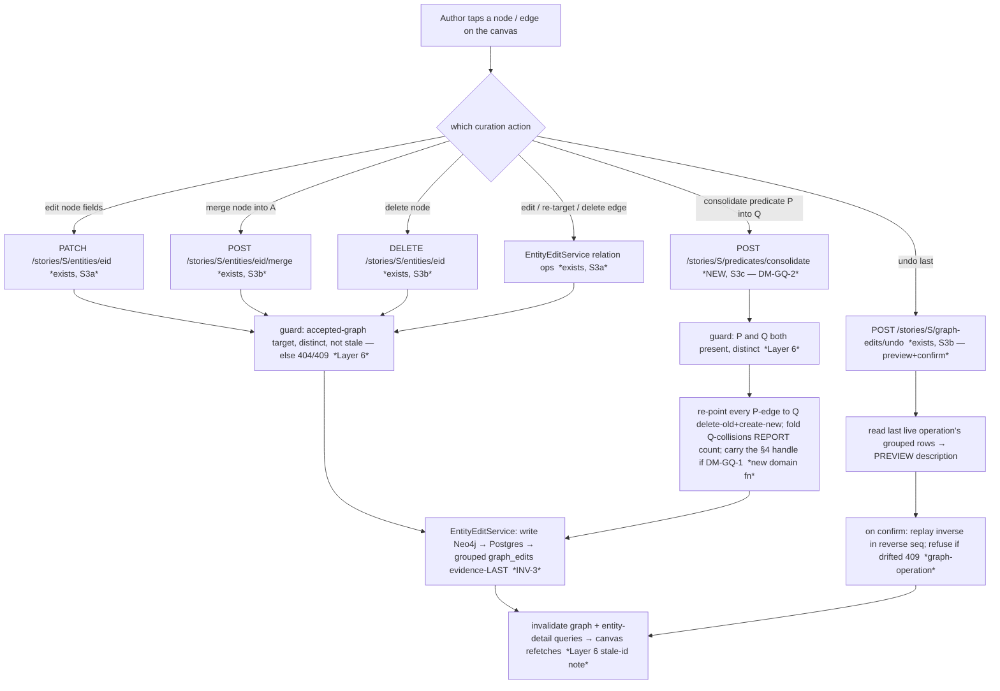

# Graph-quality S0 — the graph view as a direct in-place curation surface

> **✅ Status: ACCEPTED — register RESOLVED with the owner (2026-06-26, Session 69).** Authoritative
> home for the resolution: `docs/PLAN_SHORT.md` Decided (Session 69); the milestone was **reshaped** and
> `docs/specs/graph-quality.md` **amended** (§3 slices, §4 the edge-handle decision, §5 the curation-time-
> suggest boundary, §6 criteria, §8 the suggest passes). The original forward-design body is kept intact
> below (public-portfolio history — append the resolution, don't delete the thinking). Mirrored to
> [[open-questions]] OQ-29.
>
> **Resolutions (owner, 2026-06-26):**
> - **DM-GQ-1 (§4 edge addressability) → (b) reserve a stable handle now.** An opaque `uuid4` `edge_uid`
>   carried alongside the content-addressed `uuid5` id; content id stays the MERGE/dedup key (ADR 0005
>   unbroken), the surrogate is the addressable hook for a future qualifier ([[reification]]), preserved
>   through re-point/merge/rename. **Build no feature.** Fold rule: survivor keeps its handle, the folded
>   one's goes to the undo before-image. **ADR-worthy — draft at build.** *Rejected:* (a) content-only
>   (re-keys the future), (c) document-only (the reminder rots).
> - **DM-GQ-2 → graph-wide tool, REFRAMED by the owner as *naming normalisation*, not edge-joining.** The
>   goal is to cut the *vocabulary* of synonymous predicate **names** (rename P→Q graph-wide); identical-
>   triple collapses are a **reported side-effect**, never the aim. **Owner added a *suggest* layer:** an
>   NLP/embedding pass proposes which predicate names look synonymous. Predicates stay open-world free
>   strings (INV-4). Amends `graph-quality.md` §3 (now milestone slice **S6**).
> - **NEW (owner) — promote a proactive entity *dedup-suggest* pass** (milestone slice **S4**): re-point the
>   §3.3 cascade matcher at the *already-accepted* graph to surface duplicate clusters; the human commits via
>   the existing merge (INV-1/9 hold — suggests, never auto-merges). The entity twin of DM-GQ-2's
>   predicate-suggest. Promoted from `docs/BACKLOG.md` (graph-traversal discovery).
> - **NEW (owner) — pull navigation early + add a layout algorithm** (milestone slice **S2**, was S4): the
>   graph is an unnavigable hairball *now*, so filters + node search + a better layout land *before* the
>   curation slices — you can't curate what you can't see. The layout-algorithm dimension is new (the
>   planned filters alone don't fix the hairball).
> - **DM-GQ-3 → (b) selection-driven editable panel + (a) right-click shortcut**, reusing the reader's edit
>   panel. *Rejected:* canvas-only context menu as the spine (no home for edit forms / undo preview).
> - **DM-GQ-4 / DM-GQ-5 → confirmed as proposed:** reuse the existing endpoints (only the S6 predicate op +
>   the S4 suggest pass are new); the canvas undo is the same project-scoped `…/graph-edits/undo` with
>   preview+confirm.
> - **DM-GQ-6 → the reshaped slice order** (see the updated register entry): S1 chunker → **S2 navigate** →
>   S3 edge evidence → **S4 entity dedup-suggest** → **S5 in-place editing** (S5a node / S5b edge) → **S6
>   predicate-name normalise+suggest** → S7 reader loop.
> - **DM-GQ-7 → bulk/multi-select OUT → `docs/BACKLOG.md`** (S4/S6 suggest passes cover the top bulk need).

> **Status: PROPOSED — register OPEN (DM-GQ-1..7 / OQ-29). The owner resolves before any S3 code.**
> This is the **Graph-quality milestone opener** (`docs/specs/graph-quality.md` §3 S0): the step-0
> forward design of "the graph view as a direct in-place curation surface." It is a **design slice**
> — the deliverable is *this note* (data-flow, decision register, edge-case enumeration, affected
> components, and **the slice boundaries for S3**), not code. The test-first rule resumes at S1.
>
> **Source of truth for scope:** `docs/specs/graph-quality.md` (owner-approved S66) — *not* the
> frozen PoC spec. Key sections this decompose answers: **§3 S3** (the in-place editing surface),
> **§4** (the forward-compat edge-addressability call — decide in S0/S2, *don't build the feature*),
> **§8** (invariants carried in: INV-1/INV-9 human gate, INV-3 undo, INV-4 open-world predicates).

## The one finding that reframes the whole slice

**The write plumbing already exists; only its *home* is wrong for this milestone.** M4.S3a/S3b/S3c
built the full destructive-write surface — `EntityEditService` (`agents/entity_edit.py`) does entity
field-edit, entity↔entity **merge**, whole-entity **delete**, relation add / re-predicate / remove,
and grouped **undo** (`undo_last`), all human-gated (INV-1/INV-9) with a grouped reversible
`graph_edits` log (INV-3, ADR 0006/0007). But that surface was wired onto the **reader's**
`ReaderEntityPanel` (`features/text-reader/`). The **graph viewer** (`features/graph-viewer/`) is
*still the read-only M2.S5 projection*: `GraphCanvas` taps **nodes only** (`cy.on("tap", "node", …)`
— no edge tap, no right-click, no multi-select), and `NodeDetailsPanel` is read-only (type / canonical
/ aliases / first-seen; its own comment still says "Read-only this milestone — editing … is M3's
review UI"). So **S3 is overwhelmingly a UX-surfacing job**: bring the existing endpoints onto the
canvas. Exactly **one** new *write* is genuinely net-new plumbing — **predicate consolidation** (§3 S3:
"consolidate two synonym predicates into one"), the relation analogue of entity merge — and exactly
**one** modelling decision must be made before it: **edge addressability (§4)**.

This matches the milestone's own thesis (`graph-quality.md` §1): *largely a UX-surfacing job, not
net-new write plumbing.* Naming it up front keeps the slice honest — a reviewer should not hunt for a
write path that already ships.

---

## 0b. Operation-surface completeness sweep (the curation canvas)

This *is* a multi-slice feature, so before fixing S3's boundaries, the full operation surface of "the
graph view as a curation canvas" and each operation's home. The line that matters: **endpoint exists**
(backend already shipped, S3 only adds the canvas affordance) vs **NEW** (genuinely net-new).

| Object | Operation | Backend | Canvas UI home |
|---|---|---|---|
| **Node** | select (tap) | — | ✅ exists (M2.S5) |
| **Node** | edit name/type/aliases/properties | ✅ `PATCH …/entities/{eid}` (S3a) | **S3a — new affordance** |
| **Node** | merge into another | ✅ `POST …/entities/{eid}/merge` (S3b) | **S3a — new affordance** |
| **Node** | delete | ✅ `DELETE …/entities/{eid}` (S3b) | **S3a — new affordance** |
| **Edge** | select (tap) + evidence (predicate + source sentence) | read exists (`staged_relations` provenance) | **S3** (the edge-evidence slice — *reconciled 2026-06-29*; was mis-stated as S2, see note 1) |
| **Edge** | edit predicate (re-predicate) | ✅ add/remove via `EntityEditService` (S3a) | **S3b — new affordance** |
| **Edge** | re-target an endpoint | ✅ composable delete-old + create-new (S3a) | **S3b — new affordance** |
| **Edge** | delete | ✅ `DELETE …/relations` (S3a) | **S3b — new affordance** |
| **Predicate** | consolidate two synonyms → one (graph-wide) | ❌ **NEW** (no endpoint, no domain fn) | **S3c — NEW** |
| **Edge** | addressability — a stable handle surviving curation | ❌ **§4 decision** | **S0 decides · S3+ edge-write slices respect** (S2 has no edge surface — DM-GN-3) |
| **Operation** | undo (preview + confirm) | ✅ `POST …/graph-edits/undo` (S3b) | **S3a — new affordance** |

**Every operation has a home; no slicing gap.** Two routing notes a sweep must make explicit:

1. **Edge-tap selection + the edge detail panel is S3's, not S2's.** *(Reconciled 2026-06-29 — DM-GN-3 /
   OQ-30, the S2 [[graph-navigation]] decompose. This note originally claimed the reverse — that the spec
   put edge-tap in S2 — which was **drift**: `graph-quality.md` §3 puts "click an edge → predicate + source
   sentence(s)" in **S3** (the edge-evidence slice), and S2 is navigation-only. Per `architecture/AGENTS.md`
   the spec wins; the owner confirmed S2 stays navigation-only — option A.)* So the edge-evidence panel is
   introduced by the **S3** edge-evidence slice, and the later edge-*write* affordances (the editing slices)
   build on **that** panel — not on anything S2 ships. S2 (navigation) and S3 (edge evidence) are
   independent slices in the reshaped order; S2 does **not** introduce an edge surface.
2. **Explicitly deferred (named, routed):** relation *deep-modelling* (modality, arity, temporal
   validity) → post-PoC (`graph-quality.md` §5), **beyond** the §4 addressability call; **bulk**
   merge/delete/consolidate (multi-select) → see DM-GQ-7 (likely a backlog ride-along, surfaced not
   silently dropped); entity **split** of a conflated node → post-PoC (named at the M4.S3b seam).

---

## Layers (the nine-layer pass — Balanced density)

1. **User / personas.** One author, full trust, local ([[project]] L1). **No new [[trust-boundary]]**
   — no egress, no LLM (name it so INV-2/INV-5 aren't hunted for). The payoff is the milestone's whole
   point: the author *owns* the graph and cleans it **where they see the problem** (on the canvas),
   not in a separate reader pane. Accessibility + fluid in-place editing is the owner's stated emphasis
   (§3 S3) — a dense graph is only curatable if acting on a node/edge is one gesture away.
2. **Business.** Both drivers ([[project]] L2). Authoring: a hand-cleanable graph is the milestone's
   deliverable (§6), and the canvas is where density is legible. Portfolio: this surfaces the
   already-built human-gate invariants on the most visual surface in the app — a reviewer *sees* INV-1
   /INV-3/INV-9 acting on a live graph. **The §4 call is the portfolio set-piece of this slice**:
   "design the constraint now, defer the feature" is a demonstrable discipline.
3. **Domain.** No new persisted *nouns* except possibly an edge **handle** (§4, DM-GQ-1). New *verb*:
   **consolidate predicates** (fold predicate P into Q across the whole graph — distinct from ADR 0005's
   triple-dedup, which collapses only *identical* triples; consolidation collapses *different*
   predicates the author judges synonymous). The ubiquitous language gains "consolidate **into**"
   (direction matters, like merge — P-edges become Q-edges) and, if DM-GQ-1 lands a handle, the concept
   of an edge that has an **identity independent of its endpoints/predicate** ([[surrogate-key]]).
4. **Data.** **The §4 call lives here.** Today `relation_edge_id = uuid5(subject_id, predicate,
   object_id)` is **content-addressed** (`domain/candidates.py`): the id *is* the triple, so it
   idempotently MERGE-dedups identical facts (ADR 0005) — but it *changes the moment any endpoint or
   the predicate changes*. Merge already lives with this (re-point = delete-old + create-new,
   `entity_merge.py:17`). Predicate consolidation has the *same* shape (change the predicate → new id).
   The §4 question: should an edge also carry a **stable surrogate handle** ([[surrogate-key]]) that
   survives re-point/consolidation, so a later temporal/modality model can attach a qualifier to *that
   edge* and have it survive curation? See DM-GQ-1. Consolidation also touches the `graph_edits` log
   (new op-kinds) and the Postgres `staged_relations` provenance (the source sentences S2 surfaces).
5. **Behavior.** **No new lifecycle — consolidation reuses [[graph-operation]] + [[relation-lifecycle]].**
   A predicate consolidation is one [[graph-operation]] (`applied → undone`), exactly like a merge: it
   re-points each affected edge (`written → removed` on the old id + a fresh `[*] → written` on the new
   id — the edge-id-is-content rule, [[m4-entity-editing]] DM-S3a-3), folds collisions, and records the
   whole fan-out as one grouped reversible operation. The undo machine already covers it; the only new
   work is the *forward* op. Canvas selection itself is UI state, not a domain transition.
6. **Errors.** [[fail-closed]] throughout, reusing the patterns S3b already proved. A consolidation /
   edit against an edge whose endpoint was merged-away or deleted in another tab → a **dangling
   reference** ([[referential-integrity]]) → refuse (404/409), re-resolve at commit (the [[toctou]]
   guard `RelationReviewService`/`undo_last` already model). A half-completed consolidation → retryable,
   never a half-fold. The canvas adds one *new* error surface: an action fired against a **stale
   cytoscape element id** — the canvas element id *is* the content-addressed edge id, so after any
   re-pointing write the id changes and a click on the pre-refetch element 404s; the fix is the same
   invalidate-then-refetch the viewer already does (DM-GQ-3 names it).
7. **Security.** Author's own data, no egress, no LLM (named — INV-2/INV-5 n/a). The standing concern
   stays **stored-XSS over the author's own input**: a consolidated predicate / edited name renders
   into the canvas + panels and must stay React-escaped (no `dangerouslySetInnerHTML`), as M4 held. No
   new boundary.
8. **Compliance / Audit.** INV-3 is already *executed* (the undo machine, [[graph-operation]]). This
   slice's only audit addition is **consolidation's grouped before-image** — each re-pointed/folded
   edge is a grouped `graph_edits` row under one `operation_id` with a human-readable description
   ("consolidated *PASSENGER_ON* into *ON_SHIP* — 7 edges"), so undo previews + reverses it as one atom
   (DM-S3b-1's see-what-I-undo, reused). If DM-GQ-1 lands a handle, the before-image must also capture
   the handle so undo restores it.
9. **Operations.** No new infra, no LLM (INV-5 n/a — named). One ops note: a graph-wide predicate
   consolidation is the heaviest single write yet (every edge bearing predicate P), but trivial at one
   author's scale; the read-view invalidation (graph + any open detail panel) fires after it, and the
   canvas must tolerate edges *vanishing/re-id-ing* between fetches (the benign single-user consistency
   window, now on the canvas).

---

## Stations (enforcement-lifecycle checklist — empty boxes named)

| Station | State | Note |
|---|---|---|
| **Identity** | n/a | single local user, no auth ([[overview]]) |
| **Intent** | ✅ | the author explicitly taps a node/edge and invokes edit / merge / delete / consolidate / undo — a deliberate, often destructive gesture on the canvas |
| **Policy** | ✅ | only **accepted-graph** nodes/edges are curatable (never a staged candidate / held relation — the read-side echo of INV-1); consolidation needs **two distinct predicates** present in the project graph |
| **Decision** | ✅ deterministic | the human picks the survivor / target / the predicate-to-keep / confirms — no model ([[prefer-deterministic]]); consolidation is a deterministic graph-wide re-point, never LLM-suggested (predicate auto-suggestion is deferred, §5) |
| **Access** | n/a | localhost binding is the only gate |
| **Monitoring** | n/a | no LLM call, nothing to meter (INV-5 n/a) |
| **Evidence** | ✅ (reused) | every canvas write records a (possibly grouped) `graph_edits` before-image — the S3a/S3b machinery; consolidation adds a grouped op-kind. The **§2** edge-evidence panel (source sentences) is the *read* evidence that makes the write verifiable |
| **Expiry** | ⚠ (carried) | `graph_edits` retention — the same **none-at-PoC** posture as the decision/staging logs (OQ-4), with the noted undo depth-cap (ADR 0007). Consolidation adds rows but no new Expiry question |
| **Review** | ✅ | the curation action **is** the human review acting on the graph — the human is the reviewer (§3.3 Stage-4 spirit, post-commit) |

No empty station is *new* — the substrate filled them at S3a/S3b. The one open mark (**Expiry**) is the
carried `graph_edits`-unbounded posture, not a fresh gap.

---

## Data flow

The author works the canvas directly. Tap a node → its panel (now with edit/merge/delete actions);
tap an edge → its panel (S2's evidence view + S3b's edit/re-target/delete actions); a graph-level
"consolidate predicates" affordance; a global undo affordance that **previews what it will reverse**
before acting. Each write goes to the **existing** human-reached endpoint (only consolidation is new),
runs under the human gate, records grouped reversible evidence, then invalidates the graph query so the
canvas refetches.

The **`graph first → evidence last`** order keeps a crash retryable (re-run re-reads state, idempotent);
the **operation group** lets undo treat a consolidation as one reversible atom — both inherited verbatim
from S3b, so S3c writes only the new *forward* op and the undo machine handles the rest.

---

## State & invariants

**New transition (folded into the state-machine notes / `invariants.md` only on acceptance):**

- **Predicate consolidation = one [[graph-operation]].** No new state machine. Forward: for each edge
  `(X, P, Y)` the author folds into `Q`, re-point `written(old id) → removed` + `[*] → written(new id
  on Q)` ([[relation-lifecycle]]); a `(X, Q, Y)` that already exists **folds** (MERGE-collapse, count
  reported — the merge collision pattern). Reverse: the undo executor restores each original predicate
  (replay inverse, [[graph-operation]]). The grep set widens by the consolidation method only.

**Invariant pressure (all carried from `graph-quality.md` §8; this slice keeps them honest):**

- **INV-1 (human gate) — upheld.** Every canvas action is human-initiated; no automated stage performs
  edit/merge/delete/consolidate. (A future "auto-consolidate synonymous predicates" would *violate*
  this, not optimise it — predicate auto-suggestion is explicitly deferred, §5.)
- **INV-9 (only human-reached handlers write the graph) — enumeration grows by one path.** Consolidation
  lives in `EntityEditService` (the existing edit handler), reached only from a human endpoint — the
  ADR-0005/0006 *broaden-don't-mint* precedent again (the *seventh* witnessed path; no new writer class).
  Confirm at build the grep guard widens to the consolidation re-point SQL.
- **INV-3 (reversible + evidence) — reused, executed.** Consolidation's grouped before-image must be
  **complete** (every re-pointed/folded edge, *and* the §4 handle if DM-GQ-1) or undo restores a stale
  graph — the same before-image-completeness guard merge carries. Test-first: "consolidate then undo
  restores the exact prior predicates + edges."
- **INV-4 (open-world predicates) — upheld and load-bearing here.** Consolidation is human-gated
  *normalisation* of free-string predicates, never a closed enum (`graph-quality.md` §8 carries this in
  explicitly). The consolidation op must keep `predicate` a free `str` — it folds *instances*, never
  constrains the *type*.
- **INV-2 / INV-5 — n/a** (no egress, no LLM). Named so a reviewer doesn't hunt.
- **Edge addressability (DM-GQ-1) is a *design constraint*, not yet an invariant.** If the owner lands a
  stable handle, it becomes a contract ("an edge's handle survives re-point/consolidation") worth an
  invariant *when the temporal/modality feature lands* — not now (no feature ⇒ no enforcer ⇒ minting an
  invariant would be a wish, per `invariants.md`'s own rule). Recorded here as a constraint to honour.

---

## Decision register (OPEN — DM-GQ-1..7; mirrored to [[open-questions]] OQ-29)

> Each entry: **Context / Options / My proposal / Open.** I *propose*; the owner *resolves*.
> `verify-at-build` marks any call resting on un-inspected behaviour. **Plain-language versions of the
> calls that need the owner are in "Gaps for the product owner" below** — do not lift this register's
> shorthand into the question put to the owner (root `CLAUDE.md` communication rule).

### DM-GQ-1 — Edge addressability: the §4 forward-compatibility call **(THE central decision; spec §4 mandates deciding it in S0)**
> **✅ Decision (owner, Session 69): (b) reserve a stable `edge_uid` handle now** — an opaque `uuid4`
> alongside the content-addressed id; ADR 0005 dedup unbroken; preserved through curation; **build no
> feature**; ADR at build; survivor keeps the handle on a fold (folded one's → undo before-image).
> *Rejected:* (a) content-addressing only (re-keys the future), (c) document-only (the reminder rots).
- **Context.** `graph-quality.md` §4 sets a standing constraint: **design the constraint now, defer the
  feature.** Relation deep-modelling (modality, arity, temporal validity — §5) is out, but the spec
  forbids baking in a *bare, un-addressable* triple a later model can't hang a qualifier on. Today an
  edge's identity *is* its content: `relation_edge_id = uuid5(subject_id, predicate, object_id)`
  (`domain/candidates.py`). This is elegant — it idempotently dedups identical facts (ADR 0005) — but
  the id **changes whenever an endpoint or the predicate changes** (merge re-point, consolidation). So a
  future qualifier attached to "edge X" would be **orphaned** the first time the author curates X. The
  §4 call: give an edge a **stable handle** ([[surrogate-key]] — an identity independent of its content)
  now, so a later [[reification]] (turning the edge into a thing qualifiers can attach to) survives
  curation? **This is a modelling-discipline decision, not scheduled feature work** — we are *not*
  building modality/temporal modelling.
- **Options.**
  - **(a) Keep content-addressing only (status quo).** Cheapest; no schema change. Cost: any future
    qualifier is endpoint/predicate-fragile — curating an edge orphans whatever hangs on it. Accepts
    that the future model will have to re-key. *This is the "we decided not to add a handle" answer —
    still a §4 decision, recorded, not a non-decision.*
  - **(b) Add a stable surrogate handle now (`edge_uid`), carried through re-point/consolidation.**
    Mint a content-independent `edge_uid` (a `uuid4` stored as an edge property) at edge-write time;
    re-point/consolidation **preserve** the survivor edge's `edge_uid` onto the new content-id'd edge.
    Content id stays the MERGE/dedup key (ADR 0005 unbroken); `edge_uid` is the *addressable* handle a
    future qualifier hangs on. Cost: every re-point/consolidation/merge path must thread the uid (incl.
    a "which uid survives a fold?" rule — the survivor question, like merge), and the before-image must
    capture it for undo. **No feature is built** — just the handle is reserved and preserved.
  - **(c) Defer the handle but reserve the seam explicitly.** Document that the next temporal/modality
    decompose *must* introduce the handle as its first step, and ensure nothing this milestone makes the
    introduction *harder* (e.g. don't add a second content-derived id). A middle path: no schema change
    now, but a recorded, located obligation.
- **My proposal.** **(b) — add the stable handle now**, because it is the cheapest moment to do it (every
  edge-write path is already open in this slice) and it is exactly the discipline §4 names: the handle
  costs one `uuid4` property + a "preserve on re-point" rule, and it makes the future model *additive*
  (hang qualifiers on `edge_uid`) instead of *migrational* (re-key every edge). On a fold, the **survivor
  edge keeps its handle and the folded edge's handle is recorded in the before-image** (so undo can
  un-fold) — the merge-survivor pattern. *Considered & rejected:* (a) re-keys the future, defeating §4's
  intent; (c) is (b) minus the cheap half — it pays the analysis cost without banking the result, and
  "the next decompose must remember" is exactly the kind of un-forced obligation that rots.
  **`verify-at-build`:** (i) that a Neo4j edge property survives the delete-old+create-new re-point
  cleanly (it's re-applied on create, not preserved by the store — confirm the create path carries it);
  (ii) that adding `edge_uid` does **not** become a second MERGE key that breaks ADR 0005 triple-dedup
  (content id stays the only MERGE key; `edge_uid` is a carried attribute).
- **Open.** Owner: handle now (my lean **b**) / status-quo (a) / reserve-the-seam (c)? If (b): on a fold,
  survivor-keeps-handle (my lean) — confirm. **This is the one call §4 says must be made in S0** and it
  **gates S3c** (consolidation re-points edges, so it must already know the handle rule).

### DM-GQ-2 — Predicate consolidation semantics **(the one genuinely-new write; `graph-quality.md`-silent → likely a §3 amendment to *that* spec)**
> **✅ Decision (owner, Session 69): graph-wide tool — REFRAMED as predicate-*name normalisation*, not
> edge-joining.** Goal = cut the *vocabulary* of synonymous predicate **names** (rename P→Q graph-wide);
> identical-triple collapses are a **reported side-effect**, never the aim. **Owner added an NLP/embedding
> *suggest* layer** (propose which predicate names look synonymous — the relation twin of the S4 entity
> dedup-suggest). Predicates stay open-world free strings (INV-4). Milestone slice **S6**; `graph-quality.md`
> §3 amended Session 69. *Rejected:* per-edge re-label only (that's just S5's edge edit).
- **Context.** `graph-quality.md` §3 S3 names "consolidate two synonym predicates into one" but **never
  defines the operation**: is it graph-wide (every `(*, P, *)` → `(*, Q, *)`) or per-edge? what happens
  on a `(X,Q,Y)` collision? does direction matter? This is the relation analogue of entity merge and the
  *only* net-new backend plumbing in S3. The authoritative home is **`docs/specs/graph-quality.md`** (the
  milestone source of truth), **not** the frozen PoC spec — so the stop-and-amend, if needed, lands
  there. **`verify-at-build`/read-the-section:** confirm the exact §3 S3 wording before asserting the
  amendment target (root `CLAUDE.md` "name a spec section → read it first" — the M4.S3b "delete → §3.5"
  miscue).
- **Options.** Scope: **(a) graph-wide** (consolidate predicate P into Q across the whole project graph —
  one author gesture, one operation) vs **(b) per-edge** (re-predicate one edge at a time — already
  covered by S3b's edge edit, so "consolidate" would add nothing). Collision `(X,Q,Y)` already exists:
  fold + **report the count** (the merge pattern) vs silent fold. Direction/asymmetry: P→Q is directional
  like merge (Q survives).
- **My proposal.** **(a) graph-wide, P-into-Q directional**, reusing the merge mechanics: re-point every
  edge bearing P to Q (delete-old + create-new, content id recomputed — DM-GQ-1 carries the handle), fold
  `(X,Q,Y)` collisions and **report the count** (don't silently lose that a fact was stated under two
  predicate names), record one grouped reversible operation. Per-edge re-predicate (b) is *already* S3b —
  consolidation earns its slice precisely by being the graph-wide one. Amend `graph-quality.md` §3 S3
  with the semantics. *Considered:* surface a "which edges will change?" preview before commit (cleaner
  V1 UX) — record as a ride-along if cheap, else backlog.
- **Open.** Owner: graph-wide consolidation (my lean) vs leave it as per-edge re-predicate (S3b only,
  drop S3c)? Report collisions (my lean) vs silent fold? Confirm the `graph-quality.md` §3 amendment.

### DM-GQ-3 — The canvas interaction model (how a write is invoked on the graph)
> **✅ Decision (owner, Session 69): a selection-driven editable panel + a right-click shortcut**, reusing
> the reader's edit panel/hooks. *Rejected:* canvas-only context menu as the spine (no home for multi-field
> edit forms or the undo preview).
- **Context.** The graph viewer today taps nodes only and shows a read-only panel. The owner's stated
  emphasis is **accessibility + fluid in-place editing** (§3 S3). How does the author invoke
  edit/merge/delete/consolidate/undo *on the canvas*?
- **Options.** **(a) Right-click context menu** on a node/edge (curation actions in a menu at the
  cursor). **(b) Selection → an action panel** (tap selects; the side panel — extended from the
  read-only `NodeDetailsPanel` + the S3 edge-evidence panel — grows action buttons + an inline edit mode). **(c)
  Both** (right-click for speed, panel for discoverability + the edit forms). Component reuse: extend the
  graph viewer's own `NodeDetailsPanel` into an editable panel, vs **reuse the reader's already-editable
  `ReaderEntityPanel`** (which has edit mode + the mutation hooks) on the canvas.
- **My proposal.** **(b) selection → an editable panel as the spine, with (a) right-click as a
  fast-path** added where it's cheap — the panel is where the edit *forms* (rename, resolve a merge
  conflict, pick the predicate to keep) and the undo *preview* naturally live, and it's the discoverable
  surface; a context menu is a speed affordance over the same actions, not a separate code path. For
  reuse: **lift the reader panel's edit affordances into a shared hook/components** rather than fork —
  the `ReaderEntityPanel` edit mode + mutation hooks already invalidate reader+graph+detail, so the
  canvas panel should consume the same hooks (this also retires the cross-cutting `CandidateView`/error-
  mapper/`useReviewQueue` duplication where it overlaps). *Considered & rejected:* canvas-only context
  menu (a) as the *spine* — no good home for multi-field edit forms or the undo preview.
  **`verify-at-build`:** an embedded edit panel + a context menu inside the cytoscape container don't
  fight the canvas's own pan/zoom/right-click (cytoscape's `cxttap` event vs the browser context menu).
- **Open.** Owner: panel-spine + context-menu-fast-path (my lean) vs one or the other? Reuse the reader's
  panel components (my lean) vs a graph-native panel?

### DM-GQ-4 — Reuse the existing write endpoints (confirm, not fork)
> **✅ Decision (owner, Session 69): confirmed — reuse the existing endpoints**; the only net-new backend
> is the S6 predicate-name op + the S4 entity dedup-suggest pass. Consolidation is project-scoped.
- **Context.** S3a/S3b shipped `PATCH …/entities/{eid}`, `…/merge`, `DELETE …/entities/{eid}`, the
  relation add/remove ops, and `…/graph-edits/undo`. S3 should **reuse** them from the canvas, not mint
  parallels.
- **My proposal.** **Reuse all of them unchanged**; the canvas is a *new caller*, not a new contract.
  The **only** new endpoint is `POST …/predicates/consolidate` (DM-GQ-2). INV-9's enumeration grows by
  the consolidation path only. *No `verify-at-build`* — these endpoints are read directly above.
- **Open.** Confirm reuse-not-fork (my lean). Any endpoint that needs a story-vs-project *scope* arg on
  the canvas (the §3.4 scope toggle is already in `GraphViewer`) — confirm consolidation respects scope
  (graph-wide = project-scoped, my lean).

### DM-GQ-5 — Undo on the canvas (preview + confirm)
> **✅ Decision (owner, Session 69): confirmed — the canvas undo is the same project-scoped
> `POST …/graph-edits/undo` with preview+confirm.** No backend change.
- **Context.** DM-S3b-1 resolved that undo must **show what it reverses** before acting (the operation's
  human-readable description). The reader surfaces this; the canvas needs the same affordance.
- **My proposal.** Surface the **same** `POST …/graph-edits/undo` on the canvas with the preview+confirm
  UX (read the latest-live operation's description → confirm → reverse). Project-scoped undo stack
  (already `latest_live_operation` scoped by `project_id`, [[graph-operation]]). No backend change.
- **Open.** Confirm the canvas undo is the same project-scoped "undo last" (my lean), not a per-selection
  undo.

### DM-GQ-6 — Slice boundaries for S3 **(the deliverable `graph-quality.md` §3 S0 asks for)**
> **✅ Decision (owner, Session 69): the milestone was RESHAPED, not just S3-sliced.** Final order (authoritative
> in `docs/PLAN_SHORT.md` + `graph-quality.md` §3): **S1** chunker → **S2 navigate** (pulled early + a layout
> algorithm — you can't curate a hairball you can't see) → **S3** edge evidence + verifiable merges → **S4
> entity dedup-suggest** (NEW — re-point the cascade matcher over the accepted graph) → **S5 in-place editing
> on the canvas** (S5a node / S5b edge; reserves the §4 handle) → **S6 predicate-name normalise + synonym
> suggest** (the reframed consolidation) → **S7** reader loop. My original S3a/b/c cut below is **superseded
> by this order** (kept as history): node/edge editing is now S5; consolidation is now S6 (reframed); two new
> suggest passes (S2 navigate was promoted; S4 dedup-suggest is net-new) were added by the owner.
- **Context.** S3 is too big for one session (canvas substrate × node writes × edge writes × the new
  consolidation write × the §4 handle). It must be cut into one-conversation slices, respecting that
  **the S3 edge-evidence slice introduces the edge-tap + evidence panel** (DM-GN-3; *not* S2, which is
  navigation-only) so the later edge-write work builds on it, and that **the consolidation slice depends on
  DM-GQ-1** (the handle rule) + DM-GQ-2 (consolidation semantics).
- **My proposal (the slice boundaries).**
  - **S3a — Node curation on the canvas** *(frontend-led; backend exists).* Bring edit / merge / delete
    / **undo** onto the graph viewer's node panel (DM-GQ-3 interaction model). Reuses the S3a/S3b
    endpoints; the work is the canvas affordances + reusing the reader panel's edit hooks. Lands first —
    no new backend, no §4 dependency.
  - **S3b — Edge curation on the canvas** *(frontend-led; builds on S2's edge panel).* On the edge panel
    S2 introduced, add edit-predicate / re-target / delete. Mostly existing endpoints (re-target =
    delete+create); a small backend only if re-target wants a first-class op. Depends on S2.
  - **S3c — Predicate consolidation** *(NEW backend + frontend; the branchy one).* The graph-wide
    consolidation op (DM-GQ-2) + the §4 edge-handle (DM-GQ-1, if owner picks (b)). New pure domain fn
    (`domain/predicate_consolidation.py`, the `entity_merge.py` analogue) → `EntityEditService` op →
    `POST …/predicates/consolidate` → grouped undo → frontend. **Gated on DM-GQ-1 + DM-GQ-2 resolved**
    (and the §3 amendment). Its own step-0 may be warranted if the handle work proves branchy.
  - **The §4 handle (DM-GQ-1):** if owner picks **(b)**, the *schema seam* (add `edge_uid` at edge-write
    time + preserve-on-re-point) is cheapest folded into **S3c** (where the re-point paths are already
    open) — *unless* the owner wants it landed independently of consolidation, in which case it's a tiny
    standalone slice **S3a.5** before S3c. Flagged so the cut isn't a surprise.
- **Open.** Owner: confirm the S3a/S3b/S3c cut (and the S2→S3b dependency)? Land the §4 handle inside S3c
  (my lean) or as a standalone slice before it?

### DM-GQ-7 — Bulk / multi-select curation (scope check)
> **✅ Decision (owner, Session 69): out of scope → `docs/BACKLOG.md`** — keep curation one-object-at-a-time;
> the S4/S6 suggest passes cover the highest-value bulk need without a generic multi-select.
- **Context.** The owner wants curation *at scale* on a dense graph; the natural canvas affordance is
  multi-select → bulk merge/delete/consolidate. But `graph-quality.md` §5 defers "bulk-accept and other
  intake review-queue polish," and bulk destructive ops multiply the drift/undo surface.
- **My proposal.** **Out of S3 — surface, don't silently drop.** Keep S3 one-object-at-a-time (each op
  already its own reversible operation); record multi-select bulk as a **`docs/BACKLOG.md` ride-along /
  post-S3 refinement**, because predicate *consolidation* (DM-GQ-2) already delivers the highest-value
  "bulk" need (graph-wide predicate fold) without a generic multi-select. *Considered:* multi-select
  delete is genuinely handy on a hairball — but it's a UX affordance over existing single ops, cheaply
  added later, and bulk *undo* semantics (one op or N?) is a real design question not worth opening now.
- **Open.** Owner: confirm bulk multi-select is out of S3 / backlog (my lean)?

---

## But what if (edge cases — name the failure, teach the name)

- **…the author consolidates P→Q and a `(X,Q,Y)` edge already exists?** A **MERGE-collision** — re-pointing
  `(X,P,Y)`'s content id onto Q hits an existing id and folds, losing that the fact was stated under two
  predicate names. **Report the fold count** (DM-GQ-2), record the original in the before-image so undo
  restores the distinct edge — the entity-merge collision pattern.
- **…consolidate P→Q where P and Q are the same string (no-op), or Q isn't present in the graph?** Reject
  409/400 — a no-op or a consolidation with no target. Guard explicitly (the self-merge analogue).
- **…the author edits/consolidates an edge whose endpoint was merged-away or deleted in another tab?** A
  **dangling reference** ([[referential-integrity]]). Re-resolve endpoints at commit; refuse 404/409
  ([[toctou]]) — never write to a ghost. The undo machine's drift check already models this.
- **…a click fires against a stale cytoscape element id after a re-pointing write changed it?** The canvas
  element id *is* the content-addressed edge id, so after merge/consolidation/re-target the id no longer
  exists → 404. The fix is the invalidate-then-refetch the viewer already does (DM-GQ-3); the in-flight
  action against the old id fails closed and the refetched canvas shows the new edge. **DM-GQ-1(b)'s
  `edge_uid` does *not* rescue this** (the *element* id is still content-derived) — a reason the handle is
  forward-compat plumbing, not a fix for canvas staleness.
- **…consolidation crashes after re-pointing some edges but before the rest?** A **partial graph-wide
  write**. The op is idempotent (re-run re-reads state, already-re-pointed edges no-op) — the merge
  cross-store retry pattern, here single-store (Neo4j) + the evidence-last order. Never a half-fold.
- **…undo of a consolidation when an affected edge was since edited?** A **[[lost-update]] in reverse** —
  the drift check refuses (409), tells the author what drifted (the [[graph-operation]] guard, reused).
- **…DM-GQ-1(b): two edges with different `edge_uid`s fold into one on consolidation — which handle
  survives?** The **survivor question** (merge again): the surviving edge keeps its handle; the folded
  edge's handle goes to the before-image (so undo un-folds and restores both). Name it now so S3c doesn't
  silently pick one.
- **…the author consolidates across hundreds of edges (a very common predicate)?** The heaviest single
  write yet — fine at one author's scale, but the operation + its before-image are O(edges); name it
  (Layer 9) so a future multi-thousand-edge graph revisits batching, don't pretend it's free.
- **…right-click on the canvas — cytoscape's `cxttap` or the browser context menu?** A UI race (DM-GQ-3
  `verify-at-build`): the in-canvas context menu must intercept before the browser's, without breaking
  cytoscape pan/zoom. A real-browser smoke boundary, not a jsdom test.

---

## Gaps for the product owner (plain language — the calls only you can make)

> The register above is in architect shorthand for the vault. Here are the calls that actually need you,
> in plain words (root `CLAUDE.md` communication rule). One at a time when we resolve them.

1. **Should an edge get a permanent "name tag" now? (DM-GQ-1 — the big one, and §4 says decide it here.)**
   Today an edge is identified *by its contents* (which two things it connects + the relation word). That
   means the moment you clean it up — merge an endpoint, or rename the relation — it effectively becomes a
   *new* edge with a new internal id. That's fine for cleaning, but **later** (a separate, much-later
   project) you might want to attach extra facts to a specific relationship — "this was true only in
   chapter 3," "this is rumoured, not certain." If edges have no permanent tag, those future notes would
   fall off the moment you curate. **My lean: give each edge a cheap permanent tag now** (one extra hidden
   id that survives cleanup) — we are *not* building the future feature, just making sure we don't block
   it. The alternative is to leave it and accept that the future feature will have to re-tag everything.
2. **What exactly does "merge two relation words into one" do? (DM-GQ-2 — the milestone spec names it but
   doesn't define it.)** My lean: it's **graph-wide** — pick two relation words you consider the same
   ("PASSENGER_ON" and "ON_SHIP"), keep one, and every edge using the other switches over in one action,
   fully undoable, and we **tell you** if two edges collapse into one ("7 edges merged"). The alternative
   is to *not* have a special tool and just re-label edges one at a time (which the edge-editing tool
   already does) — but a dense graph is exactly where a one-shot "fix all of these at once" earns its
   place. This would add a sentence to the Graph-quality spec defining it.
3. **How do you want to act on the graph — right-click menu, a side panel with buttons, or both?
   (DM-GQ-3.)** My lean: **a panel as the main way** (it's where edit forms and the "here's what undo will
   reverse" preview live) **plus right-click as a shortcut**. And reuse the editing panel you already have
   in the *reader* rather than building a second one.
4. **How should we cut S3 into sessions? (DM-GQ-6.)** My lean: **(S3a)** node clean-up on the canvas first
   (all the plumbing exists — it's mostly wiring buttons), **(S3b)** edge clean-up next (builds on the
   edge-evidence panel the **S3** edge-evidence slice introduces — *not* S2; DM-GN-3), **(S3c)** the new "merge two relation words" tool last (it's the only
   genuinely new code, and it needs your call on #1 and #2 first).
5. **Confirm the smaller things:** reuse the existing save/merge/delete/undo endpoints (only "merge
   relation words" is new); keep undo as the same project-wide "undo last" with a preview; and leave
   *bulk* "select many and delete/merge at once" out of this milestone (backlog), since the new
   relation-word tool already covers the biggest bulk need.

---

## Hand-off (register RESOLVED Session 69 — next is the S1 build)

> **✅ Register resolved (owner, Session 69).** The build now starts at **S1** (auto-chunker completeness
> check — test-first, independent of this register). The §4 edge handle (DM-GQ-1) lands at the first
> edge-write path (S5/S6) with an ADR drafted there; the S4 entity dedup-suggest pass gets its own step-0.
> The original open-register hand-off framing is kept below for history.

Per the project's **spec- and test-driven** rule, **no production code until the owner resolves the
register** — and **DM-GQ-1 (§4 addressability) + DM-GQ-2 (consolidation semantics)** are the two that
gate S3c, with DM-GQ-2 likely carrying a **`docs/specs/graph-quality.md` §3 amendment** (read §3 S3
first — the M4.S3b "delete → §3.5" miscue). S3a/S3b are frontend-led on **already-shipped** endpoints and
do **not** wait on §4. The slice order is **S3a (node writes) → S3b (edge writes, after S2) → S3c
(consolidation + the §4 handle)**.

When S3c is reached, the first failing test is the **pure consolidation-plan function**
(`domain/predicate_consolidation.py`: given a predicate P→Q and the affected edges, produce the
deterministic list of re-point/fold/discard steps + the carried handles — pure, no store, the
`entity_merge.py` analogue), then the `EntityEditService` op + `POST …/predicates/consolidate` + grouped
undo + OpenAPI regen, then the frontend canvas affordances.

**On acceptance:** reconcile this note to *resolved* (flip `status`, rewrite each register entry
`My proposal → Decision`, deactivate rejected options across the body + the Mermaid diagram); strike OQ-29
in [[open-questions]]; record the §4 decision + consolidation contract in `docs/PLAN_SHORT.md` Decided;
amend `docs/specs/graph-quality.md` §3 (consolidation) via the stop-and-amend flow if DM-GQ-2 lands; draft
an **ADR** only on owner confirmation (the §4 addressability decision is ADR-worthy — it crosses the
data-model identity boundary); and on build, fold the consolidation transition + the widened INV-9 grep
guard into [[invariants]] / [[graph-operation]]. No ADR is written without explicit confirmation.
