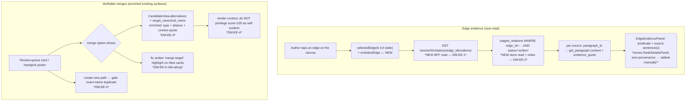

# Graph-quality S3 — Edge evidence + verifiable merges

> **Status: PROPOSED — register OPEN (DM-EE-1..6 / OQ-31). The owner resolves before any S3 code.**
> Step-0 forward design of `docs/specs/graph-quality.md` §3 **S3** ("Edge evidence + verifiable
> merges"). The deliverable is *this note*; the test-first rule resumes at the S3 build. **Source of
> truth for scope:** `docs/specs/graph-quality.md` §3 S3 + §4 (the reserved edge handle) + §8
> (invariants). Prior slices: [[graph-curation-surface]] (S0, the parent) and [[graph-navigation]] (S2).

## The one finding that shapes the slice

**S3 is a *read/verify* slice, and the data it must show is real but not yet on the wire.** Every fact
S3 surfaces — an edge's source sentence(s), a merge target's identity context — **already exists in the
stores**, but **none of it reaches the client today**, and fetching it needs genuinely-new *read*
surfaces (a focused edge-evidence endpoint + enrichment of the merge payloads). Concretely, code-verified:

- **Edge [[provenance]] survives commit but is unreachable.** A committed relation's source paragraph +
  LLM `evidence_quote` persist in Postgres `staged_relations` as `status='written'` rows keyed by
  `edge_id` (`postgres_relation_store.py:94-112`; `mark_written` flips status + fills ids, **never nulls
  `paragraph_id`/`evidence_quote`**). But the `/graph` payload's `GraphEdge` carries **only** `type` +
  `confidence` + endpoint ids (`stories.py:452-459`) — no provenance — and there is **no store method or
  index** to fetch `staged_relations` by `edge_id` today (only `list_staged` by status + `get_relation`
  by primary id; the sole index is `(story_id, status)`). So the read exists in *data*, not in *code*.
- **The graph viewer has no edge selection at all** — `GraphCanvas` taps nodes only
  (`cy.on("tap", "node", …)`, `GraphCanvas.tsx:106`); edges render + label but are inert.
- **The merge surfaces show a bare score and a generic target.** The review card renders an alternative
  as `name (100)` with no framing (`CandidateCard.tsx:131-132`), and a merge whose target isn't in the
  RapidFuzz top-3 falls back to `"an existing entity"` because `CandidateView` has **no
  `target_canonical_name`** (`CandidateCard.tsx:75-81`, the standing cross-cutting item) and the
  `alternatives` carry neither type nor aliases nor a context quote.

So the milestone thesis (`graph-quality.md` §1: "*largely a UX-surfacing job*") holds **for the write
plumbing** — but S3 specifically is the slice where a **small, honest set of new *read* endpoints** is
unavoidable, because the human gate is only as good as the context it shows and that context isn't
projected yet. Naming this up front keeps the slice honest: a reviewer should expect **new read
surfaces here**, unlike the pure-frontend S2.

**S3 writes nothing** — INV-1 / INV-3 / INV-9 are untouched (the read-side echo of INV-1 already holds).
No egress, no LLM (INV-2 / INV-5 n/a). The §4 edge handle is **not** consumed here — see State & invariants.

---

## 0b. Operation-surface completeness sweep (the read/verify surface of S3)

S3 is one slice of the multi-slice curation feature. Its job is the **read/verify** surface that the
write slices (S5 editing, S6 predicate-normalise) will act *through*. Each read/verify operation, homed:

| Verify operation | Data needed | In stores today? | On the wire today? | Home |
|---|---|---|---|---|
| **Edge select (tap)** | — | — | ❌ node-tap only | **S3 — new frontend affordance** |
| **Edge evidence** (predicate + source sentence(s)) | `staged_relations.{paragraph_id, evidence_quote}` by `edge_id` + paragraph `content` | ✅ (survives commit) | ❌ not on `GraphEdge`; no by-`edge_id` read | **S3 — NEW read (DM-EE-1/2)** |
| **Merge-target identity context** (quote + type + aliases) for a review-queue merge option | node `type`+`aliases` (Neo4j) + a sample mention quote | ✅ | ⚠ `alternatives` carry only name+score; no `target_canonical_name` | **S3 — enrich payload (DM-EE-3)** |
| **Merge-target identity context** for a handpick picker option | `EntitySearchResult.{type,aliases}` | ✅ (already on the wire) | ⚠ UI shows only `type` | **S3 — frontend render (DM-EE-3)** |
| **Safeguard: don't privilege a score-100 exact-name match** | — | — | — | **S3 — DM-EE-4 (frontend + context)** |
| **Safeguard: gate exact-name duplicate creation** | exact-name existence check | ✅ (`alternatives` / accepted graph) | — | **S3 — DM-EE-5** |
| **Safeguard: fix the amber "merge target" highlight on *New* cards** | — | — | — | **S3 — frontend fix (DM-EE-6 ride-along)** |
| Edge **write** (edit / re-target / delete predicate) | — | — | — | **S5b** (not S3 — S3 reads) |
| Merge **action** on the canvas | — | — | — | **S5a** (not S3 — the review-queue merge already exists) |

**Every read/verify operation has a home; no slicing gap.** Two routing notes:

1. **S3 reads + verifies; it does not *write* the graph.** The edge-*write* affordances (edit / re-target
   / delete a predicate) are **S5b**; the entity-*merge action* is **S5a** (and already ships on the
   review queue). S3's "verifiable merges" enriches the **existing** merge surfaces (the review-queue
   `alternatives` + the handpick picker) with identity context — it does not add a new merge action.
2. **Explicitly deferred (named, routed):** resolving `evidence_quote` to character-offset *sentences*
   → out (offsets are null on the LLM route, `domain/highlights.py:7`); S3 shows the quote + its
   paragraph. Multi-select / bulk verify → post-PoC (DM-GQ-7 → backlog).

---

## Layers (nine-layer pass — Concise density, G=31→32)

1. **User / personas.** One author, full trust, local ([[project]] L1). No persona change vs the M2.S5
   read-only viewer. The payoff: the human gate (INV-1) is only as trustworthy as the *context* shown at
   the decision — S3 brings the source text to the edge and the merge, exactly `graph-quality.md` §1's thesis.
2. **Business.** Authoring: verifiable curation is the milestone's whole point — you can't trust a merge
   or an edge you can't see the evidence for. Portfolio: "show the source sentence behind every edge" is a
   legible demonstration of human-in-the-loop done right.
3. **Domain.** No new persisted nouns, no new verbs. New *read* vocabulary only: an edge's **[[provenance]]**
   (the source paragraph(s) + evidence quote(s) that assert the fact) and a merge option's **identity
   context** (a sample quote + type + aliases that let the author confirm two names are the same thing).
4. **Data.** **No schema change; two new *read* paths.** (i) A by-`edge_id` read over `staged_relations`
   (the rows survive commit — `postgres_relation_store.py:94-112`), which today has **no method and no
   index** on `edge_id` (DM-EE-1/2 — a `get_written_by_edge_id` + an index). (ii) Enrichment of the
   `CandidateView.alternatives` projection (+ a `target_canonical_name`) with type/aliases/a context quote
   (DM-EE-3). The `evidence_quote` is the LLM-provided string, **not** an offset-resolved sentence; the
   paragraph text is fetchable via `get_paragraph` (`postgres_repo.py:256-263`). **Provenance is
   one-to-many:** the content-addressed `edge_id = uuid5(subject,predicate,object)` means the *same fact*
   in N paragraphs yields N `written` rows under one edge — so "all source sentences behind this edge" is
   a list, not a single row (a feature, not a bug — see But what if).
5. **Behavior.** No domain state machine. Edge selection + panel = UI state (`useState`, mirroring the
   `selectedNodeId` pattern at `GraphViewer.tsx:56`). A filter/refetch never changes the read result's
   meaning. The graph data is unchanged (S3 reads).
6. **Errors.** [[fail-closed]] is mild — nothing writes. Real modes are UX: an **edge with zero
   provenance** (a *manually-added* edge — M4.S3a's `EntityEditService` writes Neo4j directly and creates
   **no** `staged_relations` row — or a future hand-authored edge) must render "no recorded source
   (added manually)", never a broken/empty panel; a **stale edge id** after a background refetch (the id
   *is* content-addressed) 404s the evidence read → show "select again", the invalidate-then-refetch the
   viewer already does. See But what if.
7. **Security.** **n/a — no new attack surface.** No egress, no LLM, no write, no new [[trust-boundary]].
   The one standing concern is **stored-XSS over the author's own text**: the evidence quote + paragraph
   text render into the panel and must stay React-escaped (no `dangerouslySetInnerHTML`), as M4 held.
   Named so INV-2/INV-6 aren't hunted for.
8. **Compliance / Audit.** **n/a — read-only.** S3 records no Evidence; it *surfaces* the [[provenance]]
   that earlier write slices already recorded. (It is, pleasingly, the *read* side of the Evidence station
   the write slices fill — making a committed edge's audit trail visible to the human.)
9. **Operations.** No new infra, no LLM (INV-5 n/a). One ops note: the edge-evidence read is
   **fetch-on-tap** (one edge at a time), so it never loads all provenance for a dense graph up front —
   the reason DM-EE-1 leans BFF over payload-enrichment.

---

## Stations (enforcement-lifecycle checklist — empty boxes named)

S3 ships **no enforced control** (a read/verify surface), so most stations are honestly empty:

- **Identity / Intent / Policy / Decision / Access** — **n/a — no gated action.** Selecting an edge and
  reading its evidence, or reading a merge option's context, are unprivileged local reads. (The *merge
  action* they inform is the review queue's existing gate — S3 makes it *legible*, it doesn't add a gate.)
- **Monitoring** — **n/a — read-only**; no operational logging exists (OQ-15) and S3 adds none.
- **Evidence** — **n/a to *write*; ✅ to *read*.** S3 records nothing, but its whole purpose is to *surface*
  the [[provenance]] the write slices recorded — the read half of Evidence.
- **Expiry** — **n/a** — panel/selection state is ephemeral (dies on reload).
- **Review** — S3 is the surface that makes the human's curation review *informed*; it enforces nothing itself.

Every empty station is a named non-applicability (read/verify), not a blind spot. The write stations light
up at S5.

---

## Data flow

Two independent read paths, both fetch-on-demand. Left: edge-tap → focused evidence read. Right: the
existing merge surfaces, enriched so identity is verifiable before the (existing) merge action fires.

The `edge_id` the tap carries is the **content-addressed** id already on `GraphEdge.id` and the cytoscape
element id (`graphElements.ts:51-56`) — S3 addresses edges by it for a *read*; it neither needs nor builds
the §4 surrogate handle (State & invariants).

---

## State & invariants

- **No new invariant.** S3 reads; INV-1 / INV-3 / INV-9 (write-gating + reversibility) are not engaged.
- **The read-side echo of INV-1 already holds** — `/graph` and the evidence read return only *accepted*
  entities / *written* relations; showing evidence can never reveal un-accepted state.
- **INV-4 (open-world types) constrains DM-EE-4.** The score-100 safeguard must **not** classify types
  into "common-noun / group" via a closed enum (the two-different-"crew"s trap the spec names is a *type*
  intuition, but types are free strings — `EntityCandidate.type` is a bare `str`, no `Enum`). The
  INV-4-safe fix is to *always show verification context and never render a 100 as self-evidently correct*
  — solve by evidence, not by enumerating "group types". Named so the build honours it.
- **The §4 edge handle is NOT consumed by S3 (a correction to carry forward).** The Session-73 handoff
  read "S3 consumes the reserved §4 edge handle (DM-GQ-1 surrogate id) for addressing." Code-verified,
  **there is no surrogate handle built yet** — the edge id *is* the content-addressed `uuid5`
  (`domain/candidates.py:137-140`; the `uuid4` default on `GraphRelation` is never used on the commit
  path), and the §4 handle lands at the **first edge-*write* path (S5/S6)** per DM-GQ-1 / `graph-quality.md`
  §4. S3 **reads** edges by the content id, which is stable *because S3 writes nothing to re-key it*. So
  S3 neither needs nor builds the handle; the handoff phrasing is a minor drift, reconciled here (and in
  `docs/PLAN_SHORT.md` at wrap). A content-addressed id is a fine *read* address; it is only fragile under
  *curation*, which is S5's concern, not S3's.
- No state-machine note to draw (panel/selection is UI state, not a domain lifecycle).

---

## Decision register (OPEN — DM-EE-1..6; mirrored to [[open-questions]] OQ-31)

> Each entry: **Context / Options / My proposal / Open.** I *propose*; the owner *resolves*. Plain-language
> versions of the calls that need the owner are in "Gaps for the product owner" (root `CLAUDE.md` rule —
> don't lift this shorthand into the question put to the owner).

### DM-EE-1 — Edge-evidence delivery: enrich the `/graph` payload vs a focused per-edge BFF read **(THE central decision)**
- **Context.** The evidence a tapped edge must show (source paragraph(s) + quote(s)) lives in
  `staged_relations` (survives commit, keyed by `edge_id`) but reaches no client. Two shapes can deliver
  it: bake it onto every `GraphEdge` in the whole-graph payload, or fetch it per-edge on tap. This is the
  exact fork [[m4-side-panel]] resolved (DM-SP-1 — focused per-entity endpoint won over composing the
  whole-graph fetch).
- **Options.** (a) **Focused per-edge BFF read** `GET /stories/{id}/relations/{edge_id}/evidence`
  ([[backend-for-frontend]]) — returns `{predicate, source_provenance: [{paragraph_id, paragraph_text,
  evidence_quote}]}` on tap. New endpoint + a store read (DM-EE-2). (b) **Enrich `GraphEdge` in the
  `/graph` payload** — add the provenance to every edge up front. (c) Add only the single
  `source_paragraph_id` the Neo4j edge already stores (`neo4j_repo.py:182`, read into `GraphRelation` but
  dropped by the projection at `stories.py:541-550`) to `GraphEdge` — cheapest, but wrong (see DM-EE-2:
  the Neo4j property is only the *triggering* paragraph, not the full one-to-many set).
- **My proposal.** **(a) focused BFF read.** [[prefer-deterministic]] + the DM-SP-1 precedent: provenance
  is **one-to-many** per edge, so baking it into a dense-graph payload (b) inflates every edge's payload
  for data the author reads on only a few — the whole reason the side panel chose fetch-on-click. (a)
  loads exactly what a tap needs, keeps the cross-store join (staged_relations → paragraph text) server-
  side and Python-testable, and mirrors `GET …/entities/{eid}`. `verify-at-build`: confirm the endpoint
  path shape fits the existing `stories.py` router conventions.
- **Open.** Owner: focused per-edge read (my lean **a**) vs payload-enrichment (b)?

### DM-EE-2 — Provenance source, shape, and the one-to-many read
- **Context.** Two provenance homes exist: the **Postgres `staged_relations`** rows (the complete set —
  one `written` row per paragraph that asserts the fact, `paragraph_id` + `evidence_quote` intact) and a
  **single `source_paragraph_id`** property on the Neo4j edge (only the *first/triggering* commit's
  paragraph — `relation_review.py:198`). Neither has a by-`edge_id` fetch today: `staged_relations` has
  no such method and **no index on `edge_id`**; the Neo4j property is dropped by the `GraphEdge` projection.
- **Options.** Source: (a) **`staged_relations` by `edge_id`** — the full one-to-many set of source
  paragraphs + quotes (add `get_written_by_edge_id` + an index). (b) The Neo4j edge property only — one
  paragraph, no quote. Shape: show `{paragraph_id, paragraph_text (via get_paragraph), evidence_quote}`
  per source; **don't** attempt offset-resolved sentences (LLM-route offsets are null). Zero-provenance
  edge (manually-added — no staged row): render "no recorded source (added manually)".
- **My proposal.** **(a) `staged_relations` by `edge_id`, all `written` rows** — it's the complete
  provenance ("*all* source sentences behind this edge"), which is the point of "edge evidence"; the Neo4j
  single-paragraph property is a partial view that would silently under-report a multiply-attested fact.
  Add the store method + the `edge_id` index (a one-line migration; the table is small but the read should
  be indexed). Show the quote + a link/expander to the full paragraph. Handle the zero-provenance edge
  explicitly. `verify-at-build`: confirm a `written` row is never pruned (it isn't — `mark_written` only
  updates status/ids) so the history stays complete.
- **Open.** Owner: full one-to-many from `staged_relations` (my lean **a**) vs the single Neo4j paragraph
  (b, cheaper, lossy)? Show the whole paragraph, or just the quote with an expander (my lean)?

### DM-EE-3 — Merge-verification context: enrich the existing merge surfaces
- **Context.** "Each entity-merge option shows a context quote + type + aliases so identity is verifiable"
  (§3 S3). Today the review-queue `alternatives` carry only `{entity_id, canonical_name, score}`
  (`reviewQueue.ts:47-56`), `CandidateView` has **no `target_canonical_name`** (so a non-top-3 merge target
  shows `"an existing entity"`, `CandidateCard.tsx:75-81` — the standing cross-cutting item), and the
  handpick picker *has* type+aliases on `EntitySearchResult` but renders only `type` (`EntityPicker.tsx:57-60`).
- **Options.** (a) **Enrich the backend projections:** add `type`, `aliases`, and a **context quote** (a
  sample mention of the target entity) to `CandidateView.alternatives`, and add `target_canonical_name` to
  `CandidateView`; render type+aliases+quote in both the review card and the handpick picker. (b)
  Frontend-only for the handpick path (data's already there) + `target_canonical_name` only for the card,
  deferring the alternatives' type/aliases/quote. Context-quote source for an accepted entity: its
  mentions (`entity_mentions`) / `first_seen_paragraph_id` → `get_paragraph` — `verify-at-build` the
  cheapest source.
- **My proposal.** **(a) enrich fully**, because a merge decision is exactly where under-context bites
  (the two-"crew"s trap), and this also **closes the cross-cutting `CandidateView`-no-target-name item**
  (`docs/PLAN_SHORT.md`) rather than leaving it. Keep the quote cheap (one sample mention, not all). The
  handpick picker just renders its already-present `type`+`aliases` + adds the quote if cheap.
- **Open.** Owner: enrich all merge surfaces incl. a context quote (my lean **a**) vs a lighter first cut
  (b — target name + handpick type/aliases now, alternatives' quote later)? Confirm the context-quote
  source (a sample mention).

### DM-EE-4 — The score-100 / exact-name "self-evident" trap — solve by context, not type-classification
- **Context.** §3 S3: "don't present a score-100 exact-name match as self-evidently correct for
  common-noun / group types (the two-different-'crew's trap)." Today a score renders as a bare `(100)` with
  no framing (`CandidateCard.tsx:131-132`) and nothing special-cases an exact match. The trap: two distinct
  entities named "crew" score 100 on name alone, and a bare `(100)` reads as "obviously the same".
- **Options.** (a) **Always show verification context (DM-EE-3) and never render a 100 as self-evidently
  correct** — label the score ("name match: 100"), and rely on the type+aliases+quote to disambiguate;
  make *no* type-based judgement. (b) A **type heuristic** — treat "group/common-noun" types specially
  (extra warning). (b) collides with **INV-4**: types are open-world free strings, so "which types are
  common-noun/group" can't be a closed enum without violating the invariant.
- **My proposal.** **(a) — solve by evidence, not by classifying types.** The trap is a *missing-context*
  problem, not a *type* problem; DM-EE-3's context is the fix. Frame the score honestly (a *name* match,
  not an identity verdict) and let the author read the quote+type+aliases. This is INV-4-safe (no type
  enum) and simplest. *Considered & rejected:* (b) a type heuristic — it needs an enum INV-4 forbids and
  still under-serves the general case (any two same-named distinct entities, not just "groups").
- **Open.** Owner: solve by always-show-context + honest score label (my lean **a**) vs a type-based
  warning (b, INV-4-fraught)?

### DM-EE-5 — Gate exact-name duplicate creation
- **Context.** §3 S3: "gate exact-name duplicate creation (warn / offer the merge)." Today "create new"
  fires immediately with no check (`CandidateCard.tsx:159-167`; `reviewQueue.ts:96-101`) — so the author
  can mint a second "Janek" when one exists.
- **Options.** (a) **Client-side check against the loaded `alternatives`** — if an alternative's name
  exactly equals `candidate.candidate_name`, warn + offer the merge before creating. Cheap, no round-trip;
  an exact name scores 100 on RapidFuzz so it's almost always in the top-3 `alternatives`. (b) **Backend
  exact-name lookup** over accepted entities before create (robust to the false-negative where the exact
  match isn't in the top-3). (c) Both — client check now, backend lookup if the false-negative bites.
- **My proposal.** **(a) client-side against `alternatives`** as the cheap guard, with the false-negative
  named (an exact-name entity outside the fuzzy top-3 is rare — 100-scoring matches almost always rank).
  Backend lookup (b) is the robust version, deferred unless the gap bites — [[prefer-deterministic]] +
  simplicity-first. The gate is a **warn + offer merge**, never a hard block (the author may legitimately
  want two same-named entities — INV-1 keeps them in control).
- **Open.** Owner: client-side warn-and-offer against the alternatives (my lean **a**) vs a backend
  exact-name lookup (b, robust, a round-trip)?

### DM-EE-6 — Slice boundaries for S3 (+ the amber-highlight safeguard ride-along)
- **Context.** S3 spans a backend read (edge evidence + merge-context enrichment) and frontend work (edge
  panel, merge-context render, the three safeguards). It's likely two conversations. The **amber
  "merge target" highlight fix** is a concrete frontend bug: the amber alternatives block + always-amber
  Merge button render on **New**-proposal cards too (`CandidateCard.tsx:104-139, 179`), so a New card can
  visually read as "this will merge" — decouple the amber affordance from New cards. It's a fix, not a
  decision; it rides the frontend slice.
- **Options.** (a) **Backend-first / frontend-second:** S3a = the two read surfaces (edge-evidence
  endpoint + `staged_relations` read/index; `CandidateView` enrichment + `target_canonical_name`; OpenAPI
  regen) test-first from the pure store read; S3b = the frontend (edge-tap + `EdgeEvidencePanel`; merge-
  context render; DM-EE-4/5 safeguards + the amber fix). (b) Split by *feature* instead — S3a = edge
  evidence (be+fe), S3b = verifiable merges + safeguards (be+fe). (c) One slice if it fits.
- **My proposal.** **(a) backend-first / frontend-second** — it mirrors the M4.S2a/S2b and multi-story
  be/fe splits, lets the pure store read + the enriched projections land test-first behind stable
  contracts, and keeps each conversation one-unit-sized. The amber fix + DM-EE-4/5 + the merge-context
  render all live in the frontend slice. *Considered:* (b) feature-split — also clean, but the two reads
  share the same backend session and OpenAPI regen, so backend-first batches them once.
- **Open.** Owner: backend-first / frontend-second (my lean **a**) vs feature-split (b)? Confirm the amber
  fix + the two safeguards ride the frontend slice.

---

## But what if (edge cases — name the failure, teach the name)

- **…a tapped edge has *zero* provenance rows?** A **manually-added edge** (M4.S3a's `EntityEditService`
  writes Neo4j directly via `create_relation`, creating **no** `staged_relations` row) — or a future
  hand-authored edge — has no source to show. Render "no recorded source (added manually)", never an empty
  or broken panel. This is the read-side face of the graph-vs-staging line INV-9 draws.
- **…one edge maps to many `written` rows?** The content-addressed `edge_id` collapses the *same fact*
  across N paragraphs to one edge, so the evidence read is **one-to-many** ([[provenance]]). Show *all*
  source sentences (the feature: "everywhere this fact is stated"), ordered by paragraph. Never assume one.
- **…the tapped edge id is stale after a background refetch / an accept elsewhere?** The cytoscape element
  id *is* the content-addressed edge id, so a curation write elsewhere (S5, another action) can re-key it →
  the evidence read 404s. Fail closed: "select the edge again" + the invalidate-then-refetch the viewer
  already does. (S3 itself writes nothing, so this only arises alongside a concurrent write.)
- **…the evidence quote doesn't substring-match its paragraph?** `evidence_quote` is a *soft-flag* LLM
  string (may paraphrase; `candidates.py:186-195`), so a highlight-in-paragraph can miss. Show the quote
  *and* the paragraph without asserting an offset; don't hard-fail on a non-match (the DM-IH-1 lesson).
- **…an exact-name entity isn't in the fuzzy top-3 when the author creates?** DM-EE-5's client check
  false-negatives. Named, low-probability (a 100 name-score almost always ranks); the backend lookup (b)
  is the escape hatch if it bites.
- **…a merge target's context quote is itself empty** (an entity with no surfaced mention)? Fall back to
  type+aliases only; never block the merge on a missing quote (fail-open on *display*, since S3 writes nothing).
- **…the author taps an edge on a very dense graph repeatedly?** Fetch-on-tap means one read per tap
  (DM-EE-1a); a slow store read shouldn't block the canvas — the standard query hook (loading state in the
  panel), not a blocking fetch.

---

## Gaps for the product owner (plain language — the calls only you can make)

> The register above is architect shorthand. Here are the calls that actually need you, in plain words.
> One at a time when we resolve them.

1. **How should an edge's "source sentences" get to the screen? (DM-EE-1 — the main one.)** The evidence
   (which paragraphs a relationship came from, plus the model's supporting quote) is *saved* but never sent
   to the browser. My lean: **fetch it when you click an edge** (a small dedicated request), rather than
   cramming it into the big graph download for every edge at once — because one relationship can come from
   *several* paragraphs, and you only look at a few edges at a time. Same choice we made for the entity
   side panel.
2. **Show *all* the source sentences, or just one? (DM-EE-2.)** A relationship stated in three paragraphs
   is stored as three little records but drawn as one edge. My lean: **show all of them** ("here's every
   place the text says this"), because that's the whole value of "edge evidence"; the quick-but-lossy
   alternative shows only the first one. And when an edge was added *by hand* (no recorded source), we say so.
3. **How much context on a merge choice? (DM-EE-3.)** When you're about to merge one entity into another,
   today you see the other's name and a number. My lean: **also show its type, its aliases, and a sample
   sentence it appeared in**, so you can tell two same-named things apart before merging — and finally show
   the real *name* of what you're merging into (today it sometimes just says "an existing entity"). This
   also fixes a known rough edge we'd tracked separately.
4. **The "two different crews" trap. (DM-EE-4.)** A perfect name match (score 100) can still be two
   *different* things (two crews both literally called "crew"). My lean: **stop treating a 100 as
   obviously-correct** and instead always show the context from #3 so you can judge — rather than trying to
   guess which *kinds* of things are risky (we can't, by design our types are open-ended).
5. **Warn before making a duplicate? (DM-EE-5.)** If you click "create new entity" for a name that already
   exists, my lean is a **gentle warning that offers the merge instead** (never a hard block — you're
   always in control). The simple version checks the suggestions already on screen; a more thorough version
   would double-check the whole graph, which we can add if the simple one misses cases.
6. **How to split the work? (DM-EE-6.)** My lean: **the data/plumbing first** (make the evidence and the
   richer merge info available), **then the screen work** (click-an-edge panel, the richer merge display,
   and the small fixes — including a visual bug where a "new entity" card can look like it'll merge).

---

## Hand-off (register OPEN — the owner resolves before S3 code)

Per the **spec- and test-driven** rule, **no production code until the owner resolves the register.** The
gating calls are **DM-EE-1** (how edge evidence reaches the client) and **DM-EE-2** (which provenance,
one-to-many). DM-EE-3/4/5 shape the merge-verification surface; DM-EE-6 cuts the slices.

When the build starts (my proposed cut, DM-EE-6a — **backend first**):

1. **S3a (backend, test-first):** the pure/near-pure store read `get_written_by_edge_id` over
   `staged_relations` (+ the `edge_id` index migration) and the cross-store assembly
   (`{paragraph_id, paragraph_text, evidence_quote}[]`) behind `GET …/relations/{edge_id}/evidence`; the
   `CandidateView` enrichment (`target_canonical_name` + `alternatives` type/aliases/quote). Failing tests
   first (the store read + the assembly are the pure boundaries). OpenAPI regen.
2. **S3b (frontend, test-first per `frontend/src/AGENTS.md`):** `cy.on("tap", "edge", …)` + `selectedEdgeId`
   + `EdgeEvidencePanel` (clones `NodeDetailsPanel`; zero-provenance → "added manually"); render the merge
   context in the review card + handpick picker; DM-EE-4 (honest score + context) + DM-EE-5 (dup-create
   gate) + the amber-highlight fix. Pure logic (e.g. the exact-name check) factored out and unit-tested;
   the canvas edge-tap is browser-smoke-verified at Oakhaven scale (jsdom can't drive the canvas).

**On acceptance:** reconcile this note to *resolved* (flip `status`, rewrite each register entry
*My proposal → Decision*, de-activate rejected options across the body + the Mermaid diagram); strike OQ-31
in [[open-questions]]; record the resolution in `docs/PLAN_SHORT.md` Decided (authoritative home) + tick the
`CandidateView` cross-cutting item that DM-EE-3 closes; correct the handoff's "S3 consumes the §4 handle"
line. **No spec amendment anticipated** (S3 reads what §3 S3 already scopes). **No ADR anticipated** — S3
crosses no data-model identity boundary (it reads existing provenance; the §4 handle's ADR stays with the
first edge-write slice, S5/S6). If DM-EE-1 lands (a), the new endpoint is a BFF read, not a decision record.
