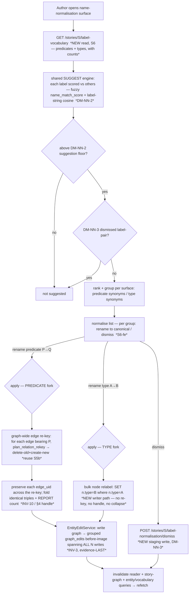

# Graph-quality S6 — predicate- AND entity-type-name normalisation + synonym suggestion

> **Status: PROPOSED — register OPEN (DM-NN-1..6 / OQ-34). The owner resolves before any S6 code.**
> Step-0 forward design for `docs/specs/graph-quality.md` §3 **S6** (+ §4 the reserved edge handle, §6).
> S6 is **branchy** — it normalises **two** open-world vocabularies (relationship predicates *and* entity
> types) — so it opens with this decompose, not a build. The deliverable is *this note* (data-flow,
> register, edge cases, the slice cut); the test-first rule resumes at the S6 build in a fresh
> conversation, after the owner resolves the register one decision at a time.
>
> **Source of truth for scope:** `docs/specs/graph-quality.md` (owner-approved S66), §3 **S6** (the
> suggest-then-you-decide normalisation pass over predicate names *and* entity-type labels — scope extended
> to types by the owner, Session 81), §4 (the reserved `edge_uid` handle a predicate rename re-keys
> through), §6 criterion 4/5 (be *shown* synonymous names; normalise so one relationship isn't split
> across synonyms). Invariants carried in (§8): **INV-4** (types/predicates stay free strings — nothing
> auto-collapses), **INV-1/INV-9** (human gate; the rename *applies* under a human-reached handler),
> **INV-3** (grouped reversible undo), **INV-10** (a predicate rename preserves the edge handle). The big
> already-made calls this builds on live in [[graph-curation-surface]] (DM-GQ-1 handle, DM-GQ-2 reframe to
> *naming normalisation not edge-joining*, owner Session 69) and [[graph-canvas-editing]] (the S5b atomic
> edge re-key) — this decompose does **not** re-litigate them; it resolves the S6 build-detail calls.

## The one finding that frames the slice

**The suggest half is one shared engine; the apply half forks in two — because a predicate and an entity
type are stored differently.** A code-level survey (2026-07-13) settles the task's central "one engine or
two" question at the storage layer, not by taste:

- **A relationship predicate *is* the Neo4j relationship type.** `create_relation` writes
  `MERGE (s)-[r:{_escape_rel_type(relation.type)} {id: $props.id}]->(o)` (`adapters/neo4j_repo.py:175`) —
  the predicate is interpolated as the *rel type*, and it is a component of the content-addressed
  `relation_edge_id = uuid5(subject, predicate, object)` (`domain/candidates.py`). So **renaming a
  predicate graph-wide re-keys every edge that bears it** — Cypher cannot `SET` a relationship's type in
  place, it must delete-old + create-new. That is *exactly* the S5b atomic re-key
  (`domain/relation_rekey.plan_relation_rekey` → `EntityEditService.retarget_relation`), applied per edge
  across the whole graph: it **preserves each edge's `edge_uid`** (INV-10) and, where the rename makes two
  edges an identical triple, **folds** them — the spec's "2 edges merged" *reported side-effect*, never the
  goal. **S6 is the near-term consumer of the §4 handle** that S5 predicted ([[graph-canvas-editing]]
  DM-S5-3).
- **An entity type is a *node property*.** `create_entity` / `update_entity` write `{type: entity.type}` as
  a plain property (`neo4j_repo.py:86,129`); the graph payload carries it per node (`domain/graph.py:34`,
  free string, INV-4). So **renaming a type graph-wide is a bulk in-place `SET n.type = $new`** over every
  node whose `type == old` — **no re-key, no handle, no collapse** (two nodes sharing a type do not merge;
  types are just labels on independent nodes). This is the *one genuinely-new write path* in S6, and it is
  trivial — the graph-wide analogue of the `update_entity` field-edit that already ships.

So the honest shape of S6 is **one SUGGEST engine, two APPLY paths**:

| Half | Predicate vocabulary | Entity-type vocabulary |
|---|---|---|
| **Suggest** (shared) | name-similarity over the *distinct label strings* — reuse `name_match_score` (fuzzy) + optionally embed the label via `EmbeddingAgent.encode` | **same engine, same code** — a different vocabulary in, synonymous-name groups out |
| **Apply** (forked) | graph-wide **edge re-key** — reuse `plan_relation_rekey` per edge; preserve `edge_uid` (INV-10); fold identical triples + **report** the count (INV-3 grouped undo) | graph-wide **node-property relabel** — bulk `SET n.type`; no re-key, no handle, no collapse; the one net-new writer path (INV-3 grouped undo) |

Naming this up front keeps the slice honest: a reviewer should expect the suggest layer to be **the S4
self-join turned on a vocabulary instead of on entities** (fewer units — *tens* of distinct labels, not
*hundreds* of entities), the predicate apply to be **an S5b re-key in a loop** (no new edge-write symbol —
INV-9 enumeration grows by a *path*), and the type apply to be **the only genuinely-new backend**. It is
the milestone thesis again (`graph-quality.md` §1: *largely a UX-surfacing job*) with one honest exception.

**A second finding that shapes the suggest rung (DM-NN-2).** Unlike S4's entity dedup — where duplicates
are usually *surface-similar* names ("Bronek"↔"Bronisław") a fuzzy score catches — S6's synonyms are often
**fuzzy-distant but semantically close**: `PASSENGER_ON` and `ON_SHIP` share almost no tokens, yet mean the
same relationship. So the **embedding rung matters *more* here than for S4**, and the unit embedded is the
**label string itself** (via `EmbeddingAgent.encode`), *not* an entity's mention vectors (S4's Stage 2). A
fuzzy-only suggest layer would miss the very synonyms S6 exists to surface. This is the one place S6 is
*not* a straight re-point of the S4 matcher.

---

## 0b. Operation-surface completeness sweep (the two-vocabulary normalisation surface)

S6 is a multi-slice feature over **two** domain objects (the *predicate vocabulary*, the *type
vocabulary*). The sweep enumerates every operation the feature must deliver and each one's home — the line
that matters: **exists** (already ships — S6 only calls it) vs **NEW** (genuinely net-new).

| Object | Operation | Backend today | Home |
|---|---|---|---|
| **Predicate vocab** | read the distinct predicate set (with counts) | ❌ **NEW** read (no `DISTINCT type(r)` read exists) | **S6 — new read** |
| **Type vocab** | read the distinct type set (with counts) | ❌ **NEW** read (types derived client-side from `/graph` today) | **S6 — new read** |
| **Predicate / Type** | suggest synonymous names (fuzzy + label-embedding) | ❌ **NEW** pure fn (the shared engine; the S4 `duplicate_clusters` analogue over labels) | **S6 — new pure fn (shared)** |
| **Predicate** | rename graph-wide (P→Q) | ⚠ per-edge re-key **exists** (`retarget_relation`); graph-wide loop is **NEW** | **S6 — new op, reusing `plan_relation_rekey`** |
| **Predicate** | report identical-triple folds on rename ("2 edges merged") | ❌ **NEW** (count the fold branch) | **S6 — rides the rename op** |
| **Type** | rename graph-wide (A→B) | ❌ **NEW** bulk node-property `SET` (the one genuinely-new writer path) | **S6 — new op** |
| **Predicate / Type** | dismiss a suggested rename ("these are genuinely different") | ❌ **NEW** (DM-NN-3 — persist vs ephemeral) | **S6 — new staging-side store (per DM-NN-3)** |
| **Operation** | undo a graph-wide rename | ✅ grouped `graph_edits` + `undo_last` (INV-3) | reuse — but **one op spans N writes** (DM-NN-4/5 scale) |
| **Predicate / Type** | *auto*-collapse synonyms | ❌ — **explicitly never built** (INV-4; human-gated suggest) | out of scope by invariant |
| **Predicate** | single-edge re-predicate on the canvas | ✅ S5b `retarget_relation` | out of S6 (S5b owns one-edge edits) |

**Every operation has a home; no slicing gap.** Routing notes a sweep must make explicit:

1. **The type-rename apply is the only genuinely-new *writer*.** Everything else is a new *read*, a new
   *pure fn*, or a *loop over a shipped op* (the predicate re-key). Its NEW-ness is that no graph-wide node
   mutation exists yet — per-node `update_entity` ships, graph-wide does not.
2. **Explicitly deferred (named, routed):** **bulk / multi-select** consolidation → already
   `docs/BACKLOG.md` (DM-GQ-7; S4+S6's suggest passes cover the top bulk need); **relation deep-modelling**
   (the qualifiers the handle is *for*) → post-PoC (§5); a **canvas overlay** highlighting synonymous
   labels → `docs/BACKLOG.md` (the S4 DM-CD-4 precedent — the dedicated list is the V1 surface). **LSH /
   [[intra-batch-dedup|blocking]]** is *not* even a deferred lever here — the vocabulary is tens of labels,
   so the suggest self-join is trivially small (unlike S4's O(n²) over entities).

---

## Layers (nine-layer pass — Concise density; G=35, L=74)

1. **User / personas.** One author, full trust, local ([[project]] L1). **No new [[trust-boundary]]** — the
   suggest is local deterministic compute; the *embedding* rung (DM-NN-2) loads the local
   sentence-transformers model but makes **no network call and no [[model-tier-routing|router]] call**, so
   there is no egress and nothing to meter (INV-2/INV-5 **n/a** — named so a reviewer doesn't hunt). The
   payoff is §6 criteria 4–5: the author is *shown* synonymous predicate/type names instead of hunting the
   filter list, and normalises so one relationship/type isn't split across synonyms.
2. **Business.** Both drivers ([[project]] L2). Authoring: a normalised vocabulary is a direct step to the
   clean-graph deliverable (§6) — a graph split across `PERSON`/`Person` or `PASSENGER_ON`/`ON_SHIP` reads
   as noise. Portfolio: S6 showcases [[open-world-ontology]] curated *without closing it* — a
   [[controlled-vocabulary]] reached by human-gated suggestion, INV-4 intact.
3. **Domain.** No new persisted *noun*. New *verbs*: **suggest synonymous names** (an
   [[entity-resolution]] pass turned on a *vocabulary of labels* rather than on entities) and **rename a
   predicate / type graph-wide** (a bulk curation write). New *concept*: a **[[controlled-vocabulary]]** —
   the smaller normalised label set the author converges the open-world types/predicates toward, *by hand*,
   never auto-enforced.
4. **Data.** **The apply fork lives here** (see the framing finding). Predicate = Neo4j *relationship type*
   inside `uuid5(subject, predicate, object)` → rename **re-keys** every bearing edge (delete-old +
   create-new, `plan_relation_rekey`), preserving `edge_uid` (INV-10), folding identical triples (report
   the count). Type = node *property* → rename is a bulk `SET n.type` (no re-key, no handle, no collapse).
   Two **NEW reads** assemble the vocabularies (`DISTINCT type(r)` over edges; `DISTINCT n.type` over
   nodes, with counts). The *only* candidate new persisted state is the **DM-NN-3 dismissal store** (a
   label-pair-per-surface record, Postgres, staging-side — INV-9's graph-vs-staging line holds).
5. **Behavior.** **No new lifecycle for the graph.** A suggestion is an ephemeral derived view over the
   vocabulary (recomputed per open), [[idempotency|idempotent]]: same graph → same suggestions; an applied
   rename removes the old label so that suggestion can't recur; a dismissed label-pair is suppressed
   (DM-NN-3). A predicate rename reuses [[relation-lifecycle]]'s `written → removed` + fresh `written` per
   edge and records **one grouped** [[graph-operation]] spanning *all* re-keyed edges; a type rename records
   one grouped operation spanning *all* relabelled nodes. The new wrinkle vs S5b: **one author action = N
   writes** (S5b's re-key was one edge; S6's is the whole graph) — DM-NN-4/5.
6. **Errors.** [[fail-closed]], reusing S5b patterns. A rename computed against snapshot T applied at T+1
   after the graph drifted (an edge re-targeted, a node deleted) → the per-edge re-key **re-resolves at
   commit and refuses 404/409** ([[toctou]], the guard S5b/`undo_last` already ships). A **partial failure
   mid-graph-wide-rename** (store dies after re-keying k of N edges) is the sharpest new error surface — see
   "but what if": the operation must be recoverable/retryable, and the grouped before-image must record only
   what actually applied. A **zero-label vocabulary** (a story with no edges/types yet) → empty suggestions,
   never a crash.
7. **Security.** Author's own data, no egress, no LLM (INV-2/INV-5 n/a — named). Standing concern:
   **stored-XSS over the author's own input** — suggested/edited label strings render into the list + must
   stay React-escaped (no `dangerouslySetInnerHTML`), as M4/S3/S5 held. The predicate rename interpolates
   the new label as a Cypher *relationship type* — `_escape_rel_type` (backtick-quoting, `neo4j_repo.py:46`)
   already makes an arbitrary string injection-safe; **confirm the graph-wide path routes through it**
   (`verify-at-build`, DM-NN-4). No new boundary.
8. **Compliance / Audit.** INV-3 is already *executed* (the undo machine, [[graph-operation]]). S6's audit
   additions: (a) each graph-wide rename records **one grouped** `graph_edits` before→after operation
   (reusing the S5b/merge pattern) — the before-image must be **complete over all N affected edges/nodes**
   (including each re-keyed edge's `edge_uid`, INV-10) or undo restores a partial graph; (b) a **dismissal**,
   if persisted (DM-NN-3), leaves a durable "these labels are genuinely different" row (the
   [[intra-batch-dedup|DM-rej]] precedent, at label granularity). Expiry: the dismissal store inherits the
   **none-at-PoC** posture (OQ-4), reversible un-dismiss.
9. **Operations.** No new infra. The suggest self-join is over *tens of labels* → trivially cheap (no
   [[intra-batch-dedup|blocking]] lever needed, unlike S4). The one real ops note is the **graph-wide write
   at scale**: renaming a common predicate re-keys potentially hundreds of edges in one operation — bounded
   at one author's Oakhaven scale, but the grouped before-image + undo must hold *all* of them as one atom,
   and the canvas tolerates the graph re-id-ing between fetches (the benign single-user consistency window,
   now over a bulk write). The embedding rung loads the ~2 GB model once per suggest (the same cost S4's
   Stage 2 already pays); embedding tens of short labels is sub-second.

---

## Stations (enforcement-lifecycle checklist — empty boxes named)

| Station | State | Note |
|---|---|---|
| **Identity** | n/a | single local user, no auth ([[overview]]) |
| **Intent** | ✅ | the author opens the normalise surface and, per synonym group, deliberately **renames** (→ graph-wide apply) or **dismisses** — an explicit gesture; the pass only *proposes* |
| **Policy** | ✅ | only the **accepted-graph** vocabulary is compared; a suggestion is shown only above the DM-NN-2 floor; a DM-NN-3-dismissed label-pair is suppressed; nothing auto-collapses (INV-4) |
| **Decision** | ✅ deterministic | fuzzy + label-embedding bands only — **no live judge** ([[prefer-deterministic]]); the *human* is the judge (INV-1). The machine ranks synonym candidates; the author renames |
| **Access** | n/a | localhost binding is the only gate |
| **Monitoring** | n/a | no router/LLM call, nothing to meter (INV-5 n/a); the embedding rung is local compute |
| **Evidence** | ✅ (+ DM-NN-3) | each graph-wide rename records **one grouped** reversible `graph_edits` before-image (reused, INV-3, extended to span N writes + carry each edge's `edge_uid`); a **dismissal** leaves a durable staging row (DM-NN-3) |
| **Expiry** | ⚠ (carried) | `graph_edits` + the dismissal store inherit the **none-at-PoC** retention posture (OQ-4 / [[intra-batch-dedup|DM-rej]]); undo depth-cap noted (ADR 0007). No new Expiry question |
| **Review** | ✅ | the normalise review **is** the human review acting on the graph (the §3.3 Stage-4 spirit, turned on the vocabulary) |

No station is *newly* empty — the S3/S4/S5 substrate filled them. **Evidence** is the one that *grows* (a
grouped op now spans N writes; the dismissal store is the DM-NN-3 call).

---

## Data flow

The author opens the name-normalisation surface. The backend assembles the two **distinct-label
vocabularies** (predicates via `DISTINCT type(r)`, types via `DISTINCT n.type`, with counts), runs the
**shared suggest engine** — each label scored against the others by fuzzy `name_match_score` **and** (per
DM-NN-2) label-string cosine via `EmbeddingAgent.encode` — keeps synonym candidates above the DM-NN-2
floor, drops any DM-NN-3-dismissed pair, and returns them ranked and grouped per surface. The author picks
a group and either **renames** (types a canonical target, INV-4 open — it need not already exist) or
**dismisses**. A **predicate rename** forks to the graph-wide edge re-key (reuse `plan_relation_rekey` per
bearing edge; preserve `edge_uid`; fold identical triples and **report** the count); a **type rename**
forks to the bulk node-property relabel. Either records **one grouped reversible** `graph_edits` operation,
then invalidates the graph query so the canvas/list refetches.

The **`graph first → evidence last`** order and the **operation group** are inherited from S3a/S5b; the
*new* weight is that one group now spans **N** writes (a whole graph-wide rename) rather than one edge.

---

## State & invariants

**No new state machine.** A predicate rename reuses [[relation-lifecycle]] (`written → removed` + fresh
`written`) per edge + one grouped [[graph-operation]]; a type rename reuses the committed-node
self-transition ([[candidate-lifecycle]]) per node + one grouped [[graph-operation]]. A dismissal, if
persisted, is a tiny two-state record (`suggested → dismissed`, Postgres, staging-side). Folded into notes
only on acceptance/build.

**Invariant pressure (all carried from `graph-quality.md` §8; this slice keeps them honest):**

- **INV-4 (open-world types/predicates) — upheld and *showcased*.** S6 reduces vocabulary *by human
  choice*; it never closes the type/predicate set to an enum, never auto-collapses. The suggest layer
  *proposes* synonyms; a hypothetical "auto-merge all above-threshold labels" would **violate** INV-4 (and
  INV-1) and is explicitly not built. The rename target is a free-typed string (need not pre-exist).
- **INV-1 (human gate) — upheld.** Every rename is human-initiated; the pass only suggests.
- **INV-9 (only human-reached handlers write the graph) — enumeration grows by *paths*, one new writer
  method.** The predicate rename reuses the *existing* `create_relation`/`delete_relation` writers (no new
  graph-write symbol — the S5b re-key precedent), reached from a new human endpoint. The type rename is a
  **new bulk writer path** (`SET n.type`) on the existing `EntityEditService` node-writer, reached only
  from a new human endpoint — the ADR-0005/0006 *broaden-don't-mint* precedent (another witnessed path; the
  exact ordinal is the build's to assign — `invariants.md` names instances through the seventh today).
  Confirm at build the grep guard widens to the new bulk-relabel Cypher.
- **INV-10 (an edge's handle survives re-key) — the near-term consumer arrives.** S5 reserved `edge_uid`
  and predicted "S6 also re-keys edges → a real consumer" ([[graph-canvas-editing]] DM-S5-3). S6's predicate
  rename **is** that consumer: each re-keyed edge must carry its `edge_uid` across the change, and the
  grouped before-image must capture it so undo restores handle-and-all. Test-first: "rename P→Q graph-wide,
  every edge keeps its handle; undo restores the exact prior predicate **and** handle."
- **INV-3 (reversible + evidence) — reused, extended to N-write scale.** One grouped before-image must be
  **complete over every affected edge/node** or undo restores a partial graph. The completeness guard
  [[graph-operation]] already carries, widened from one edge to a graph-wide set.
- **INV-2 / INV-5 — n/a** (no egress, no router/LLM; the embedding rung is local). Named so a reviewer
  doesn't hunt.

---

## Decision register (OPEN — DM-NN-1..6; mirrored to [[open-questions]] OQ-34)

> Each entry: **Context / Options / My proposal / Open.** I *propose*; the owner *resolves*.
> `verify-at-build` marks any call resting on un-inspected behaviour. **Plain-language versions are in
> "Gaps for the product owner" below** — do not lift this register's shorthand into the owner's question
> (root `CLAUDE.md` communication rule).

### DM-NN-1 — One engine or two? The shared-vs-per-surface machinery **(the central call the task names)**
- **Context.** S6 normalises two vocabularies. The task asks whether that is *one engine* or *two*. The
  code-level survey (framing finding) shows an asymmetry: the **suggest** half is genuinely identical for
  both (name-similarity over a set of label strings — same fuzzy + embedding math, a different vocabulary
  in), but the **apply** half is fundamentally different (predicate = graph-wide *edge re-key* preserving
  `edge_uid` and folding triples; type = bulk *node-property relabel*, no re-key/handle/collapse).
- **Options.** (a) **One fully-shared engine** treating both as "rename a label graph-wide" — forces the
  two storage models behind one interface (leaky: the type path would carry dead re-key/handle machinery).
  (b) **Two independent engines** end-to-end — duplicates the suggest math and the review surface for no
  gain. (c) **Shared suggest + forked apply** — one pure suggest function over `(labels, floor)` reused for
  both vocabularies + one review surface parameterised by *which* vocabulary, and **two** apply ops (the
  predicate re-key loop reusing S5b; the type bulk relabel).
- **My proposal.** **(c) shared suggest, forked apply.** The storage asymmetry is real and shouldn't be
  hidden behind a false abstraction (Karpathy: no abstraction that fights the data); the suggest math and
  the review list *are* genuinely shared and shouldn't be duplicated. One suggest engine, one list, two
  thin apply paths. *Rejected:* (a) leaky-shared, (b) duplicated.
- **Open.** Owner: shared-suggest/forked-apply (my lean **c**) vs one engine (a) vs two (b)?

### DM-NN-2 — Suggest rungs + floor: fuzzy-only vs fuzzy + **label-string** embeddings
- **Context.** S4 (entity dedup) floored recall-first on fuzzy **+** entity *mention-vector* cosine. S6's
  unit is a **label string**, and its synonyms are frequently **fuzzy-distant but semantically close**
  (`PASSENGER_ON`↔`ON_SHIP` share no tokens; `LOCATION`↔`PLACE` share none) — so a fuzzy-only rung would
  miss the very synonyms S6 exists to surface. The embedding rung here embeds the **label itself** via
  `EmbeddingAgent.encode` (confirmed it takes arbitrary text, `agents/embedding_agent.py:54`), *not* mention
  vectors. Case/inflection variants (`PERSON`/`Person`, `GROUP`/`group`) are caught by fuzzy alone; true
  synonyms need the embedding.
- **Options.** Rungs: **fuzzy-only** (catches case/spelling, misses semantic synonyms) vs **fuzzy +
  label-embedding** (catches both). Floor: **recall-first** (surface borderline, the author dismisses noise
  — a false suggestion costs one click, a missed synonym stays hidden) vs a tighter precision floor. A
  tunable `name_normalise_suggest_floor` knob (the S4 `duplicate_suggest_floor` precedent), spec-defaulted,
  not user-facing.
- **My proposal.** **Fuzzy + label-string embeddings, recall-first, with a `name_normalise_suggest_floor`
  knob; deterministic-only (no live judge).** The embedding rung earns its place *here* (unlike S4, where
  names are usually surface-similar) precisely because predicate synonyms are token-disjoint.
  **`verify-at-build`:** (i) `EmbeddingAgent.encode` on a short, symbol-y label (`ON_SHIP`) yields a
  meaningful vector — confirm on the real vocabulary that cosine actually separates synonyms from unrelated
  labels (short strings can embed noisily); if it doesn't, fall back to fuzzy + a light morphological
  normalisation (case-fold, underscore-split) rather than ship a noisy embedding rung.
- **Open.** Owner: fuzzy + label-embeddings (my lean) vs fuzzy-only for V1? Recall-first floor (my lean) vs
  tighter?

### DM-NN-3 — Dismissal memory for a rejected rename suggestion **(the Evidence/Expiry-station call)**
- **Context.** The direct twin of S4's DM-CD-3. A dismissed synonym suggestion ("`SHIP` and `VESSEL` are
  genuinely different in my world") reappears every open unless the "no" is recorded. The project already
  set the precedent that remembering a human's "no" is a feature ([[intra-batch-dedup|DM-rej]]; S4's
  `duplicate_suggestion_dismissals`, ADR 0010). The unit here is a **label pair scoped to a surface**
  (predicate-vs-predicate or type-vs-type), not an entity pair.
- **Options.** (a) **ephemeral** — recompute each open; a dismissed pair recurs (annoying; breaks the
  precedent). (b) **persist dismissals** — a small staging-side store (label-pair + surface + project_id),
  consulted to suppress; suggestions stay computed-on-open; reversible un-dismiss. (c) **materialize the
  full suggestion queue** — heavier, buys nothing at this scale (the vocabulary is tiny).
- **My proposal.** **(b) persist dismissals**, mirroring S4 exactly (staging-side — INV-9 holds; none-at-PoC
  retention — OQ-4; reversible). **Likely no new ADR** — ADR 0010 already records the dismissal-store
  pattern; S6 either reuses that table with a `surface`/`kind` discriminator or adds a sibling table by the
  same design (a build-time call, *not* a new data-model boundary). Flag it so the build doesn't decide
  silently. *Rejected:* (a) ephemeral, (c) materialize.
- **Open.** Owner: persist dismissals (my lean **b**) vs ephemeral (a)? If (b): reuse the S4 store shape
  (confirm at build) — no fresh ADR expected, but say so explicitly.

### DM-NN-4 — Predicate apply: graph-wide edge re-key reusing S5b, at N-write scale
- **Context.** Renaming a predicate P→Q re-keys **every** edge bearing P (the framing finding). The per-edge
  atom already ships (`plan_relation_rekey` → `retarget_relation`, S5b): delete-old + create-new, preserve
  `edge_uid`, fold a collision. S6 applies it **graph-wide in one operation** — the new weight is *scale*,
  not mechanism: one author action = N edge re-keys recorded as **one grouped reversible** `graph_edits` op,
  with identical-triple folds **counted and reported** ("renaming merged 2 edges") but never the goal.
- **Options.** (a) **Reuse `plan_relation_rekey` per bearing edge inside one grouped op** — a thin
  graph-wide driver over the shipped atom; the before-image spans all N edges (+ their handles). (b) A
  bespoke single-Cypher graph-wide re-key — faster but re-implements the handle-preserve + fold logic S5b
  already proved, and Cypher can't `SET` a rel type anyway (still delete+create).
- **My proposal.** **(a) loop the shipped atom in one grouped op.** It reuses the tested handle-preserve +
  fold-report + evidence machinery; the only new code is the graph-wide driver + its before-image
  aggregation. **`verify-at-build`:** (i) the grouped `graph_edits` before-image + `undo_last` handle an
  N-write operation as one atom (S5b proved it for one edge, merge proved it for a fan-out — confirm at
  graph-wide N); (ii) the new-label Cypher routes through `_escape_rel_type` (injection-safe rel type);
  (iii) folds are *reported*, and a rename where **Q already exists** on some edges folds those (INV-3
  before-image captures the folded edges + their handles per the DM-S5-3 survivor rule).
- **Open.** Owner: loop the shipped re-key in one grouped op (my lean **a**) vs a bespoke bulk op (b)? (Both
  are build-time; recorded so the before-image-completeness question isn't decided silently.)

### DM-NN-5 — Type apply: the one genuinely-new writer — a bulk node-property relabel
- **Context.** Renaming a type A→B is a bulk `SET n.type = B WHERE n.type = A` over nodes (the framing
  finding) — **no** re-key, **no** handle, **no** collapse (two nodes sharing a type don't merge). It is the
  graph-wide analogue of the shipped per-node `update_entity` field-edit, and the *only* net-new graph
  writer in S6.
- **Options.** (a) **A new bulk relabel op** on `EntityEditService` (one grouped reversible op; the
  before-image records each node's old type) reached from a new human endpoint. (b) **Loop the existing
  per-node `update_entity`** across the matched nodes inside one grouped op — reuses the shipped writer
  verbatim, at the cost of N single-node writes vs one `SET`.
- **My proposal.** **(a) a new bulk relabel op** — a single Cypher `SET` is the honest, cheap primitive for
  "relabel every A-node to B"; wrap it in the grouped-evidence pattern so undo restores the prior labels.
  *Considered:* (b) if reviewers prefer zero new Cypher, looping `update_entity` is a fine fallback (same
  observable result, slower). Either way it grows INV-9's enumeration by one human-reached path.
  **`verify-at-build`:** confirm the bulk `SET` records a complete grouped before-image (the set of node ids
  + their old type) so undo is exact; no `edge_uid`/re-key involved (name it so a reviewer doesn't hunt for
  the handle on this path).
- **Open.** Owner: a new bulk `SET` relabel op (my lean **a**) vs looping the shipped per-node edit (b)?

### DM-NN-6 — Surface + slice boundaries (dedicated list; be/fe and/or predicate/type split)
- **Context.** S6 = two new vocabulary reads + the shared suggest fn + the dismissal store + the two apply
  ops on the backend, and a review list on the frontend — the same shape S3/S4/S5 split cleanly. The review
  surface reuses the S4 review-queue + merge-context pattern (a dedicated list, DM-CD-4 precedent), not the
  canvas.
- **Options.** Surface: **(a) a dedicated "normalise names" list** (reuse the review-queue + the shared
  `useReviewQueue` extracted at S4b) vs (b) canvas annotation (→ `docs/BACKLOG.md`, the S4 precedent). Slice
  cut: **(i)** S6a be (both reads + shared suggest + dismissal store + **both** apply ops) → S6b fe (the
  list), or **(ii)** split by surface — predicate normalisation as one sub-slice (reuses S5b heavily), type
  normalisation as another (the new writer) — if the owner wants the smaller, lower-risk type-relabel to
  land first.
- **My proposal.** **(a) a dedicated list**, and **(i)** be-then-fe** with *both* vocabularies in one
  backend slice** — the suggest engine and the review list are shared (DM-NN-1c), so splitting by surface
  would duplicate the frontend for little gain; the two apply ops are small enough to land together. Fold
  the shared `useReviewQueue` as S4b did. **`verify-at-build`:** the shared list component renders a
  predicate synonym group and a type synonym group from the same shape.
- **Open.** Owner: dedicated list + be/fe split with both surfaces together (my lean **a/i**) vs split
  predicate/type into separate slices (ii)?

---

## But what if (edge cases — name the failure, teach the name)

- **…a predicate rename P→Q lands on edges that already bear Q (identical triples now)?** A **MERGE-collision
  fold** — the re-key's new content id hits an existing edge and folds (`plan_relation_rekey` `kind="fold"`).
  Apply the **survivor handle rule** (DM-S5-3): the surviving edge keeps its `edge_uid`, the folded one's
  rides the before-image so undo un-folds; **report** the fold count ("renaming merged 2 edges") — the
  spec's stated side-effect, never the goal. Distinct from ADR 0005's intake triple-dedup (that only ever
  collapsed *identical* triples at write; this collapses triples made identical *by the rename*).
- **…a type rename A→B lands on nodes that already have type B?** **Nothing collapses** — types are node
  properties, so the B-nodes and the newly-relabelled ex-A-nodes coexist as independent nodes with the same
  label. The asymmetry that proves the apply fork: *predicate* rename can collapse edges, *type* rename
  never collapses nodes. Name it so "why didn't my type-rename merge anything?" is answered, not a surprise.
- **…the store dies after re-keying k of N edges in a graph-wide predicate rename?** A **partial graph-wide
  write** — the sharpest new error surface (S5b's re-key was one edge; this is N). Reuse S5b's
  create-new-before-delete-old ordering *per edge* so a mid-op crash leaves recoverable duplicates, never a
  gap; the grouped before-image records only edges that actually re-keyed; a retry must be
  [[idempotency|idempotent]] (re-keying an already-Q edge is a no-op). **`verify-at-build` the retry/resume
  posture** — at PoC this is the accepted single-author LWW window (DM-S3a-6), but a graph-wide op makes the
  window wider, so name it rather than assume S5b's one-edge guarantee scales for free.
- **…the author renames to a label that doesn't currently exist in the vocabulary?** **Allowed** — INV-4
  open-world: the target is a free-typed string, not a pick from a closed set. The suggest layer proposes
  existing synonyms, but the human may normalise toward an entirely new canonical name.
- **…a suggested rename pair is dismissed, then the author later realises they *were* synonyms?** A dismissal
  must be **reversible** (un-dismiss) — DM-NN-3(b) records it; confirm the un-dismiss affordance so a
  mistaken "no" isn't a one-way door (the S4 DM-CD-3 precedent).
- **…the embedding rung scores two unrelated short labels as similar (noisy embedding on symbol-y
  strings)?** A **recall/precision mis-tune** specific to short-string embeddings — the ranked list floats
  stronger candidates up, the `name_normalise_suggest_floor` knob tunes it, and DM-NN-2's `verify-at-build`
  is exactly the check that the embedding rung *helps* rather than adds noise (fall back to fuzzy +
  case/underscore normalisation if it doesn't).
- **…the new predicate label contains Cypher-hostile characters?** It becomes a Neo4j *relationship type* —
  `_escape_rel_type` backtick-quoting already makes an arbitrary string injection-safe; confirm the
  graph-wide path uses it (DM-NN-4 `verify-at-build`). The type label is a *property* (parameter-bound), so
  the type path has no interpolation surface.
- **…undo of a graph-wide rename after the graph drifted (an edge re-targeted since)?** A **[[lost-update]]
  in reverse** — the [[graph-operation]] drift check refuses (409) and names what drifted. Reused, now over
  an N-write operation.

---

## Gaps for the product owner (plain language — the calls only you can make)

> The register is architect shorthand for the vault. Here are the calls that actually need you, in plain
> words (root `CLAUDE.md`). One at a time when we resolve them.

1. **One tool or two? (DM-NN-1.)** S6 tidies up two kinds of names — the *relationship* names (like
   `PASSENGER_ON` vs `ON_SHIP`) and the *entity-type* names (like `PERSON` vs `Person`). Under the hood
   these are stored very differently, so *renaming* them is two different jobs — but *finding* which names
   look like synonyms is the exact same job for both. **My lean: build one "find the synonyms" engine and
   one review list shared by both, with two small "do the rename" actions behind them** — rather than one
   forced-together tool (messy) or two entirely separate tools (wasteful).
2. **How do we spot synonyms — spelling-similarity, or meaning too? (DM-NN-2.)** For entity types, most
   duplicates are just casing (`Person`/`PERSON`), which simple spelling-matching catches. But relationship
   synonyms are the tricky ones — `PASSENGER_ON` and `ON_SHIP` mean the same thing but share no letters, so
   spelling-matching alone would miss them. **My lean: use both spelling *and* meaning (the same AI
   sentence-embeddings we already use elsewhere, run locally — nothing leaves your machine), and lean
   toward showing you the borderline ones** (a wrong suggestion costs one "dismiss" click; a missed synonym
   stays hidden), with a dial to turn it down if noisy. I want to *test on your real vocabulary at build*
   that the "meaning" part actually helps rather than adds noise — short labels can embed unreliably.
3. **Should the app remember when you say "no, these aren't synonyms"? (DM-NN-3.)** Same question we settled
   for duplicate entities in S4 — **my lean: yes, remember your dismissals** (small, reversible), reusing
   exactly what S4 already built. Probably no new decision-record needed since S4's covers the pattern.
4. **The renames themselves (DM-NN-4/5) — mostly confirmation.** Renaming a *relationship* graph-wide reuses
   the "edit one edge" machinery you already approved in S5, just applied to every matching edge at once
   (and it keeps the permanent edge tags from S5); if that makes two relationships become identical, it
   quietly merges them and *tells you* ("merged 2 edges"). Renaming an *entity type* graph-wide is a simple
   relabel (no merging — two things with the same type just... have the same type). Both are fully
   undoable. **My lean: reuse the S5 edge machinery for relationships; add one small new "relabel" action
   for types.**
5. **Where does this live, and how do we slice it? (DM-NN-6.)** **My lean: a dedicated "normalise names"
   list** (like the duplicates list from S4), and build it backend-first then the list — with *both* kinds
   of names in one go, since the finding-synonyms part is shared. If you'd rather ship the simpler
   entity-type cleanup first and relationships second, we can split it that way instead.

---

## Hand-off (register OPEN — the owner resolves DM-NN-1..6 before any S6 code)

Per the **spec- and test-driven** rule, the register is resolved with the owner **before** the build. The
big shape (naming normalisation not edge-joining, human-gated suggest, the reserved handle) is already
settled in [[graph-curation-surface]] (DM-GQ-1/2) and [[graph-canvas-editing]] (the S5b re-key); this
register is the S6 build-detail only.

**Spec:** **no `docs/specs/graph-quality.md` amendment expected** — §3 S6 already scopes normalisation over
*both* predicate names and entity-type labels (the owner extended it to types, Session 81) and §4 already
reserved the handle a predicate rename re-keys through. *Confirm by re-reading §3 S6 + §4 at the build* (the
M4.S3b "delete → §3.5" miscue: a section named from memory can be the wrong one).

**ADR:** **none expected.** The predicate re-key's identity/handle boundary is already covered by the S5b
§4-handle ADR (ADR 0011); the dismissal store's pattern is already covered by ADR 0010; the type relabel is
a new *write path* but crosses no new data-model identity boundary (broaden-don't-mint, INV-9). If the build
surfaces a genuine new boundary, draft the ADR then — **never write an ADR unasked**.

**When S6 is built** (fresh conversation, after the register resolves): the first failing test is the
**shared pure suggest function** (given a vocabulary of labels + the `name_normalise_suggest_floor`, produce
the deterministic ranked synonym groups — pure, no store, reusing `name_match_score` + label-embedding
cosine; the S4 `duplicate_clusters` analogue over labels), then the two `DISTINCT`-vocabulary reads + the
`GET …/label-vocabulary` endpoint + the DM-NN-3 dismissal store, then the **two apply ops** (predicate:
graph-wide `plan_relation_rekey` loop in one grouped op preserving `edge_uid` + fold-report; type: the bulk
relabel op) + OpenAPI regen, then the frontend normalise list feeding both (reusing `useReviewQueue`).

**On acceptance:** reconcile this note to *resolved* (flip `status`, rewrite each register entry
`My proposal → Decision`, deactivate rejected options across the body + the Mermaid diagram); strike OQ-34
in [[open-questions]]; record the resolutions in `docs/PLAN_SHORT.md` Decided; and at the S6 build fold the
graph-wide re-key path (INV-10 consumer) + the new bulk-relabel writer path into [[invariants]] INV-9/INV-10
+ the [[controlled-vocabulary]] glossary term into the vault.
