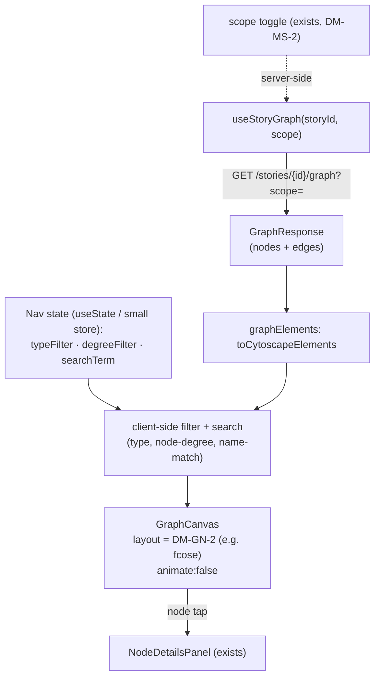

# Graph-quality S2 — Navigate the graph (filters · name search · a layout that isn't a hairball)

> **✅ ACCEPTED — register RESOLVED (DM-GN-1..4 / OQ-30, owner Session 72, 2026-06-29).**
> **Resolution:** DM-GN-1 = **client-side filtering** over the existing payload (no new backend; reuse the
> binary `scope` toggle for the story axis); DM-GN-2 = **`cytoscape-fcose`** layout (pin via
> `/add-dependency`, `verify-at-build` the version); DM-GN-3 = **(a) spec-faithful — S2 is navigation-only,
> the edge-tap evidence panel stays S3** (the parent [[graph-curation-surface]]'s "edge panel is S2's" note
> is the drift and is reconciled — see that note's §3 operation-sweep); DM-GN-4 = **AND-combine +
> hide-and-relayout + search-as-focus**. Authoritative decision home: `docs/PLAN_SHORT.md` Decided S72. No
> ADR (frontend read-only slice). **Next: build S2 test-first** from the pure filter/degree/search functions.
> The first *navigation* slice of the Graph-quality milestone (`docs/specs/graph-quality.md` §3 S2,
> lines 90-95). A dense, real (Oakhaven-scale) graph is uncuratable until you can focus and read it —
> so this lands **before** the curation slices (S3+). **Read-only, frontend-led:** S2 writes nothing
> to the graph, so INV-1 / INV-3 / INV-9 are *untouched* (the read-side echo of INV-1 — show only
> accepted state — already holds via the existing `/graph` endpoint). The whole slice sits inside the
> author's machine ([[project]] L1) — **no new [[trust-boundary]], no egress, no LLM** (so INV-2 /
> INV-5 are not in play; named so they aren't hunted for).

## Operation-surface completeness sweep (step 0b)

S2 is one slice of the multi-slice "graph as a curation surface" feature. The **navigation/read
surface** the milestone must eventually deliver, each operation with a home:

| Navigation capability | Data needed | Source | Home |
|---|---|---|---|
| Filter by **entity type** | `node.type` | ✅ in `GraphResponse` payload | **S2 — client-side** |
| Filter by **connection density** | node degree = incident-edge count | ✅ derivable from `edges[]` | **S2 — client-side (derive)** |
| Filter by **story** | story membership per entity | ⚠ *not* on the node payload; server derives it (`list_entity_ids_for_story`) | **already shipped** as the binary `scope=story\|project` toggle (DM-MS-2); finer N-story filter → DM-GN-1 |
| **Node search by name** | `canonical_name_pl/en` + `aliases` | ✅ in payload | **S2 — client-side** |
| **Layout algorithm** (spread the hairball) | — | frontend render | **S2 — new dep (DM-GN-2)** |
| **Edge-tap selection + evidence** (predicate + source sentence) | `staged_relations` provenance | read exists | **⚠ boundary conflict — DM-GN-3** (spec says S3; parent proposal says S2) |
| Node-tap selection | — | ✅ exists (M2.S5) | done |
| Ride-alongs ("X of N", empty-queue→onward) | — | review queue, not the graph | separate (not navigation) |

**Every navigation capability has a home; one genuine boundary question — DM-GN-3** (does S2 own the
edge-tap evidence panel, or is that S3?). The sweep's job is to surface exactly that, not bury it.

## Layers (nine-layer pass — Concise density, G=31)

1. **User / personas.** One author, full trust, local. The payoff is the milestone's premise: you
   can only curate a hairball you can *read*. No persona change vs M2.S5's read-only viewer.
2. **Business.** Authoring driver: navigation is the precondition for every curation slice (§6). Portfolio:
   a force-directed hairball is a *bad* demo; a filterable, searchable, well-laid-out graph is a good one.
3. **Domain.** No new persisted nouns, no new verbs. New *frontend* vocabulary only: a **filter
   predicate** over nodes, **node degree** (count of incident edges — the "connection density" axis),
   and a **layout algorithm** choice. Nothing enters the ubiquitous language of the graph itself.
4. **Data.** **No schema change, no new endpoint** (modulo DM-GN-1's finer story filter and DM-GN-3's
   edge panel). The existing `GET /stories/{id}/graph?scope=` already returns the full node/edge set;
   `GraphNode` carries `type` + names + aliases, `GraphEdge` carries endpoints — enough for type-filter,
   name-search, and degree-filter **entirely client-side**, over the payload `useStoryGraph` already
   fetches. The one field the payload lacks is **per-node story membership** (it's server-derived, not
   projected onto the node) — see DM-GN-1.
5. **Behavior.** No domain state machine. All of S2 is **UI state**: the active filter set, the search
   term, the selected node — `useState`/a small store, not a persisted transition. The graph data
   itself is unchanged (a filter *hides*, it never deletes).
6. **Errors.** [[fail-closed]] is mild here because nothing writes. The real failure modes are UX, not
   data: an empty filter result (show "0 of N — clear filters", never a blank canvas with no
   explanation), a search term matching a node the active filter has hidden, and **layout
   nondeterminism** (a force-directed layout that animates/settles differently each run is unverifiable
   in the browser smoke — keep `animate:false` and a fixed seed where the algorithm allows). See "But what if".
7. **Security.** **n/a — no new attack surface.** No egress, no LLM, no write, no new input crossing a
   [[trust-boundary]] (the search box filters an already-trusted local payload in the browser; it never
   reaches Cypher — unlike the `/entities?q=` handpick, which is already parameterised by `project_id`
   alone). Named explicitly so INV-2/INV-6 aren't hunted for.
8. **Compliance / Audit.** **n/a — read-only.** No Evidence to record; navigation leaves no trail by design.
9. **Operations.** One operational note: the layout dep (DM-GN-2) is the only new **supply-chain**
   surface — it goes through `/add-dependency` (exact pin, ≥14-day soak, OSV-clean), like any package.

## Stations (the nine-station enforcement-lifecycle checklist)

S2 ships **no enforced control** — it is a read/navigation surface — so most stations are honestly empty:

- **Identity / Intent / Policy / Decision / Access** — **n/a — no gated action.** Filtering and searching
  are unprivileged local view operations; there is no actor to authenticate, no policy to evaluate, no
  access to grant or deny. (Contrast the write slices S3+, where these light up.)
- **Monitoring** — **n/a — read-only**, no operational logging exists yet (OQ-15) and S2 adds none.
- **Evidence** — **n/a — read-only**, nothing to record.
- **Expiry** — **n/a** — view state is ephemeral by construction (lives in the component/URL, dies on reload).
- **Review** — the human *is* the review loop this whole slice serves (it makes the later human-gated
  curation legible), but S2 itself enforces nothing to review.

Every empty station above is a *named non-applicability* (read-only navigation), not a blind spot. The
stations populate at S3+ when the canvas grows write affordances.

## Data flow

All client-side except the already-existing story-scope server toggle. The filter/search state sits
between the fetched payload and the canvas; the canvas gets a filtered element set + a better layout.

## State & invariants

- **No new invariant.** S2 reads; INV-1 / INV-3 / INV-9 (write-gating + reversibility) are not engaged.
- **INV-4 (open-world types) constrains the type filter.** Types are never a closed enum, so the
  filter's option list must be **derived from the data present** (the distinct `type` values in the
  payload), never a hardcoded set — the same discipline `colorForType` already uses (hash, don't
  enumerate). A fixed type dropdown would silently drop any future type. Naming it so the build honours it.
- **The read-side echo of INV-1 already holds** — `/graph` returns only accepted entities/relations; a
  filter narrows that set, it can never *reveal* un-accepted state. No new guard needed.
- No state-machine note to draw (view state is not a domain lifecycle).

## Decision register (✅ RESOLVED — owner Session 72, 2026-06-29)

### DM-GN-1 — Where the filters run: client-side over the existing payload vs new backend query params — ✅ **(a) client-side**
- **Context.** `useStoryGraph` already fetches the whole project/story node+edge set. `GraphNode`
  carries `type` + names + aliases; node **degree** is derivable from `edges[]`. So type-filter,
  name-search, and density-filter need **no backend** — they're pure functions over the loaded payload.
  The **one** gap: filtering "by story" *within a multi-story project to a specific one of N stories*.
  Membership is server-derived (`list_entity_ids_for_story`) and **not** projected onto the node, so a
  client-side N-story filter isn't possible over today's payload.
- **Options.** (a) **Client-side for type/density/name; reuse the existing binary `scope=story|project`
  toggle for the story axis** — no backend change; the finer "which of N stories" filter is deferred as
  YAGNI (the owner has one real graph; multi-story-with-many-stories isn't a PoC reality yet). (b) Add
  `type=`/`min_degree=`/`q=` query params to `/graph` and filter server-side. (c) Project story-membership
  onto `GraphNode` (a `story_ids: list[UUID]`) so a client-side N-story filter becomes possible.
- **Decision (owner): (a).** [[prefer-deterministic]] + simplicity-first: every filter the spec §3.4 names
  works client-side over data already on the wire, with zero new endpoint, zero round-trip per filter
  keystroke, and instant interactivity. The "by story" axis is *already shipped* as the scope toggle for
  the only multi-story shape that exists. (b) was rejected — it buys nothing at PoC scale (the whole graph
  already fits one fetch) and adds a round-trip per filter change. (c) (per-node story membership for a
  finer N-story filter) is **deferred-as-YAGNI** — the right move *if and when* a project genuinely holds
  many stories; the owner confirmed no many-stories-per-project graph is foreseen this milestone, so it is
  not pre-built (a named later refinement, not a slicing gap).

### DM-GN-2 — Which layout algorithm replaces `cose` (and the dependency it adds) — ✅ **(a) `cytoscape-fcose`**
- **Context.** `GraphCanvas` uses cytoscape's built-in `cose` (`GraphCanvas.tsx:36`) — a force-directed
  layout that hairballs at Oakhaven density. A better spread means a **layout extension dependency**
  (only `cytoscape@3.33.4` is pinned today; no layout add-on). This is a `/add-dependency` (exact pin,
  ≥14-day soak, OSV-clean).
- **Options.** (a) **`cytoscape-fcose`** — "fast CoSE", a near drop-in for `cose` with markedly better
  spread on dense graphs and good large-graph performance; the most common upgrade path. (b)
  `cytoscape-cola` — constraint-based, higher quality but heavier/slower, animates by default. (c)
  `cytoscape-cise` (cluster-aware) or `elk`/`dagre` (hierarchical — but the graph is a general digraph,
  not a DAG, so hierarchical layouts mis-fit). (d) Stay on `cose` but tune params (margin/repulsion) — no
  dep, but the owner's own finding is the *algorithm* is the limit, not the tuning.
- **Decision (owner): (a) `cytoscape-fcose`** — best spread-for-effort on a dense general graph, a small
  well-maintained extension, and a minimal-diff swap (`layout: { name: "fcose", animate: false }`). Keep
  `animate:false` for a deterministic settle the browser smoke can verify. The owner is fine adding one
  frontend dep for layout quality; (d) (`cose` param-tuning only) was rejected — the owner's own finding is
  the *algorithm* is the limit, not the tuning.
- **`verify-at-build` (still open at *build* time, by design):** the exact `cytoscape-fcose` version's
  **publish age** (≥14 days at pin time) and OSV status are confirmed via `/add-dependency` before pinning
  — the *algorithm* choice (fcose) is settled, the specific *pin* is a build-time check that may shift the
  version (not the decision).

### DM-GN-3 — Does S2's scope include the edge-tap evidence panel? (spec ↔ parent-proposal conflict) — ✅ **(a) spec-faithful: edge panel stays S3**
- **Context — a real boundary conflict to resolve, not a silent pick.** The current spec
  `docs/specs/graph-quality.md` §3 puts **"click an edge → predicate + source sentence(s)" in S3**
  (Edge evidence + verifiable merges, lines 97-105); S2 (lines 90-95) is filters + search + layout only.
  But the **accepted parent proposal** [[graph-curation-surface]] (§ operation sweep, lines 110/120-122)
  asserts the opposite — that edge-tap + the evidence panel "is **S2's, not S3's**", claiming the spec
  places it in S2, so that S3's edge *writes* (S3b) build on a panel S2 introduces. **The spec and the
  vault disagree.** Per `architecture/AGENTS.md`'s governing rule (*the source wins; the vault is what
  drifted*), the spec is authoritative — but the parent proposal was owner-accepted, so this is worth an
  explicit call, not a unilateral correction.
- **Options.** (a) **Spec-faithful: S2 is navigation-only; the edge-tap evidence panel stays S3.** S2
  ships filters + search + layout; S3 introduces edge selection + the predicate/source-sentence panel
  (and its write affordances). Then reconcile the parent proposal's drifted note to match. (b) **Honour
  the parent proposal: pull the edge-tap *read* panel into S2** as the "navigation enabler" S3b depends
  on, and amend spec §3 S2 to say so (stop-and-amend-spec-first).
- **Decision (owner): (a) spec-faithful.** S2 is **navigation-only**; the edge-tap evidence panel stays in
  **S3** (where spec §3 already puts it, alongside the merge-verification it serves). No spec amendment
  needed. (b) (pull the edge panel into S2) was rejected — it would enlarge S2 and force a §3 stop-and-amend
  for internal-tidiness gain. **The parent [[graph-curation-surface]] note is the drift** (it claimed the
  spec puts edge-tap in S2): its §3 operation-sweep is reconciled to show the edge panel home as **S3**,
  with a dated pointer to this decision, so spec and vault now agree.
- **Minor spec wording nit — ✅ fixed (owner OK, 2026-06-29):** spec §4 originally said "*and S2's edge
  surface must respect [the edge-addressability handle]*", but under this decision S2 has **no** edge
  surface. With the owner's go-ahead the §4 header + that line were amended to read "respected by the S3+
  edge slices" (S2 is navigation-only — DM-GN-3). The §4 *constraint* is unchanged; only the forward-reference moved from S2 to S3+.

### DM-GN-4 — Filter mechanism + interaction model — ✅ **AND-combine + hide-and-relayout + search-as-focus**
- **Context.** Three filter axes (type, degree, name-search) plus the existing scope toggle can be
  active at once. Two sub-questions: how filters *combine*, and whether a hidden node is *removed from
  layout* or just *visually dimmed*.
- **Options.** Combine: (a) **AND across axes** (a node shows only if it passes every active filter) —
  the predictable default. (b) OR/per-axis toggles — more flexible, more confusing. Hide mechanism: (i)
  **`display:none` + re-run layout on the visible subset** (the hairball actually thins — the point of
  the slice); (ii) dim/fade hidden nodes in place (keeps spatial memory but doesn't de-clutter). Search:
  treat a name match as **(x) a focus/highlight + pan-to** (graph stays whole) vs **(y) a filter** (non-matches hidden).
- **Decision (owner): AND-combine (a) + hide-and-relayout (i) + search-as-focus (x).** Filters AND across
  axes; a hidden node is removed and the layout re-spreads the visible subset (decluttering is the goal);
  search **focuses/highlights + pans-to** the match rather than hiding everything else (you usually want to
  *find* a node and see its neighbourhood, not erase the rest). Re-run the layout when the visible set
  changes; keep `animate:false`. Clear the current selection if a filter hides the selected node (mirrors
  the existing `handleScopeChange` selection-clear at `GraphViewer.tsx:55`). Rejected: OR-combine (b,
  confusing), dim-in-place (ii, doesn't de-clutter), search-as-hard-filter (y).

## But what if (edge cases, races, failure modes)

- **Empty filter result.** Every active filter ANDs down to zero nodes → a blank canvas reads as "the
  graph broke". Show a **"0 of N entities match — clear filters"** affordance (the read-only echo of the
  "X of N remaining" ride-along), never an unexplained empty canvas.
- **Search hits a filtered-out node.** The matched node is hidden by an active type/degree filter →
  searching for it appears to "do nothing". Decide (DM-GN-4): either surface "match is hidden by a filter"
  or let search override filters for the matched node. Don't leave it silently dead.
- **Layout nondeterminism vs the browser smoke.** A force-directed layout that animates/re-seeds settles
  differently each run, so the **only** test surface (the real-browser smoke — jsdom can't drive the
  canvas, per `GraphCanvas`'s note) can't assert a stable result. Keep `animate:false`; prefer a layout
  whose seed is fixable. The *logic* (filter predicates, degree computation, type-option derivation,
  search-match) must be **pure functions factored out of `GraphCanvas`** (the `frontend/src/AGENTS.md`
  rule) so CI unit-tests them without a canvas — the layout swap itself is smoke-only.
- **Degree under the scope toggle.** "Connection density" = node degree must be computed over the
  **currently-scoped** edge set (story vs project), or a node's density lies when you flip scope. Derive
  degree from the rendered `edges[]`, not a cached project-wide count.
- **Performance at 500+ nodes.** Spec §3.4 sets a 500+-node bar. Re-running an expensive layout on every
  filter keystroke can jank. Debounce the search box; only re-layout on filter *commit*, not per character.
  fcose is chosen partly for large-graph speed (DM-GN-2) — but `verify-at-build` the real Oakhaven feel.
- **Filter set staleness across an extraction run.** A "Run extraction" or an accept invalidates the graph
  query (existing `invalidateQueries`); the refetched payload may not contain a type the active filter
  selected. The derived type-option list must recompute from the *new* payload, and a now-absent selected
  filter value should degrade gracefully (drop it, don't show an empty graph).
- **Selection survives a filter.** A node selected then filtered out leaves the details panel showing a
  node no longer on the canvas. Clear the selection when a filter hides it (as scope-change already does).

## Gaps for the product owner — ✅ all resolved (owner Session 72)

1. **DM-GN-3 (resolved): (a) spec-faithful** — S2 navigation-only; edge panel stays S3; the parent-proposal
   note is the drift and is reconciled. No spec §3 amendment.
2. **DM-GN-2 (resolved): one frontend dep** (`cytoscape-fcose`) — owner OK; lands via `/add-dependency`.
3. **DM-GN-1 option (c) (resolved): deferred-as-YAGNI** — owner confirmed no many-stories-per-project graph
   this milestone; the finer N-story filter is a named later refinement, not a slicing gap.
4. **No *substantive* spec change** (decision A keeps S2 aligned with spec §3). One tiny §4 wording nit
   (spec §4's "S2's edge surface" forward-reference) was **fixed with owner OK 2026-06-29** → now "the S3+
   edge slices respect it" (S2 is navigation-only).

## Hand-off (the build plan — register resolved, ready to build)

Frontend-led, read-only, test-first per `frontend/src/AGENTS.md`:

1. **Pure logic first (CI-testable, no canvas):** factor `filterGraph(elements, {types, minDegree})`,
   `nodeDegrees(edges)`, `distinctTypes(nodes)`, and `matchNodes(term, nodes)` into a pure module beside
   `graphElements.ts`; write the failing unit tests that encode each (the `graphElements` mapper is the
   precedent). 2. **Nav UI state** (`useState` or a small focused store) + the filter/search controls in
   `GraphViewer`, shaped-with-their-tests (presentational-component nuance). 3. **The layout swap** in
   `GraphCanvas` (DM-GN-2) — `/add-dependency` for the extension, then `layout: { name: …, animate:false }`;
   verified in the **real-browser smoke** at Oakhaven scale (not jsdom). 4. If DM-GN-3 → (b) or DM-GN-1 →
   (b)/(c): the spec amendment / backend change lands first, test-first, before the frontend consumes it.
No ADR anticipated (frontend read-only slice; the layout dep is a `/add-dependency`, not a decision record).
