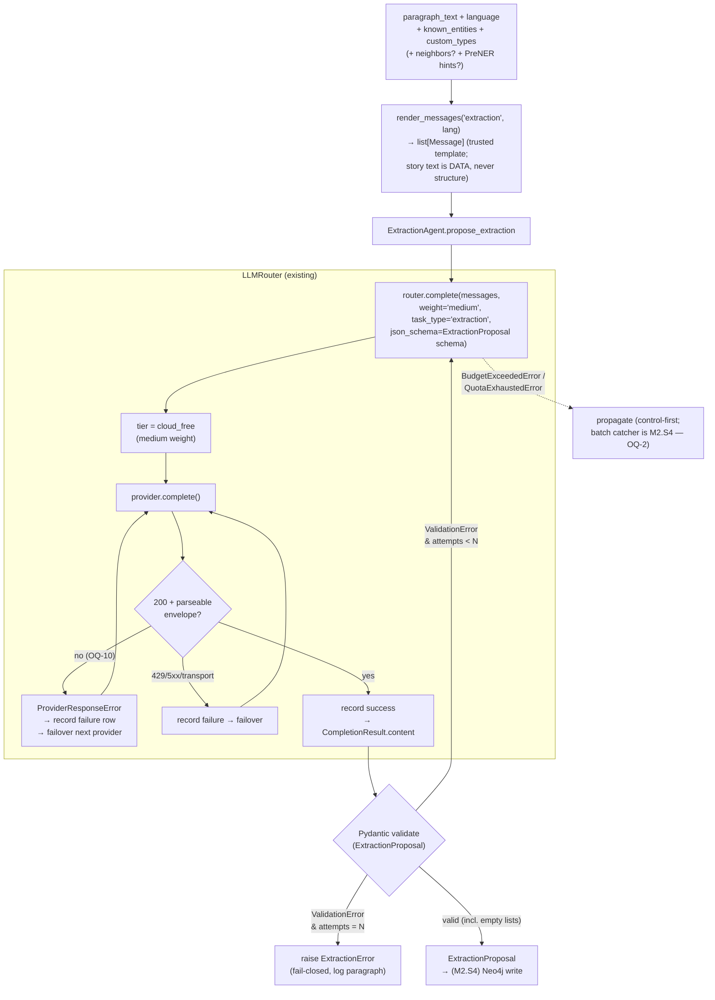

# Proposal — M2.S3: `ExtractionAgent` (first `LLMRouter` consumer)

> **As-built note (2026-06-25):** the body below frames the ingest as *"chunk → PreNER → extract"*
> (its M2.S3 point-in-time view; D3 already deferred the PreNER-hint injection). The PreNER deferral
> is now **permanent for the PoC** — spec **§7 Step 3 marks PreNER deferred/dormant** (PR #138); the
> live extraction is **LLM-only on raw paragraph text**. The historical framing is kept intact (the
> deferral is recorded in D3); read [[overview]] / [[project]] for the current pipeline.

> **✅ Resolved 2026-06-08.** The owner walked the register: **D4** per-paragraph granularity
> (agent fragment-agnostic), **D5** single-paragraph agent — resumable batch driver → M2.S4
> (pause-and-ask propagates), **G5** soft-flag `evidence_quote` (drop quote, keep candidate), **G6**
> amend spec §6.5 now (done — `route()→complete()` + envelope-vs-schema split). Low-controversy
> defaults accepted as proposed: **D1** `candidate_name` (surface form), **D2** typed
> `ProviderResponseError`, **D3** known-entities as params now / PreNER hints deferred, **D6**
> ChunkingAgent retry shape. The register and gaps below are rewritten to **Decisions**; rejected
> options (per-scene, hard-reject, agent-owns-batching, blanket `except`) are marked history, not
> build instructions. Build is now test-first per the §8 hand-off. Spec §6.5/§11 amended; plan +
> README reconciled; OQ-11/OQ-12 struck, OQ-2/OQ-10 advanced in `[[open-questions]]`.

**Requirement (operator, as decomposed):** the LLM entity/relation extractor — spec §7 **step 4**,
agent catalog §6.5, prompt skeleton **Appendix C.2**. Build `prompts/extraction.{pl,en}.j2`, the
`EntityCandidate` / `RelationCandidate` / `ExtractionProposal` Pydantic schemas, and
`agents/extraction_agent.py`: render prompt → **call the router** → parse + validate → retry on
schema violation (the [[agent]] pattern, mirroring `agents/chunking_agent.py`). It is the **first
time `LLMRouter` is wired into an agent** — M2.S2 built the router but left it un-wired;
`ChunkingAgent` still takes a raw `LLMProvider`. Sources of truth: **spec §7 step 4 / §6.5 / §6.6 /
Appendix C.2** and **§3.2** (open-world entity shape). This note **references** them; it does not
restate the schema or prompt verbatim.

**Altitude:** **Component** (the `agents/extraction_agent.py` + `prompts/extraction.*` seam) with a
**System** ripple two ways: *upstream* it first exercises the `[[m2s2-llm-router-budget-cap]]` router
against a real Pydantic schema (forcing the OQ-10 envelope-error path), and *downstream* its output is
the input contract M2.S4's Neo4j write consumes.

**Carried in from the post-M2.S2 sweep** (`[[2026-06-02-architecture-review-post-m2s2]]`): three live
threads land here — **OQ-10** (malformed-`200`-envelope → typed `ProviderResponseError`), **OQ-2**
(resumable batch dispatch — who catches the router's pause-and-ask), and **OQ-5** (the
prompt-injection-by-structure must-verify gate). They are designed against in §5–§7 below.

---

## 1. The nine layers

**1. User / personas.** One persona, full trust, local ([[project]] Layer 1). The agent has **no**
direct human interaction in M2 — it runs inside the ingest pipeline (a system actor). The author's
*review* of what it extracts is **Stage 4 / [[human-in-the-loop]]**, which is **M3, not now**: in M2
every candidate becomes a node with no gate (INV-8). So the persona's lever over extraction output is
deferred — worth naming, because it means in M2 a wrong extraction flows straight to the graph
unreviewed (acceptable *only* because INV-8 is explicitly temporary and M3's gate is the backstop).

**2. Business.** Both drivers ([[project]] Layer 2). *Portfolio:* this is the agent pattern made
real for the second time and the first to run through the router — "exactly which models do what"
becomes visible end-to-end (chunk → PreNER → extract). *Personal tool:* extraction is the step that
actually begins turning the draft into a world model; its precision/recall is what the author lives
with. The agent's job is the *contract* (valid, typed candidates), not the model's accuracy — accuracy
is the data-flywheel's job (`PLAN_LONG`), and the test discipline (`backend/CLAUDE.md`) says assert
the contract, not the labels.

**3. Domain.** Ubiquitous language (spec §3.2): an **entity candidate** is a worldbuilding-relevant
thing *as named in one paragraph* — character, location, object, organization, concept, event,
theme, scene-type, **or a type we haven't seen yet** ([[open-world-ontology]]). A **relation
candidate** is a typed, directed link (`subject —predicate→ object`) with an evidence quote. Key
distinction the schema must honour: a **candidate** is a *proposal at extraction time*, not a graph
entity — it has no `id`, no resolved `canonical_name` (PL+EN), no embedding. Those are assigned
**downstream** (M2.S4 write / M3 match+human-review). Conflating the two is the central modelling
trap of this feature (see register D1).

**4. Data.** No new persistent store in M2.S3 — the agent's output is an **in-memory**
`ExtractionProposal` (persistence is M2.S4). New *transient* shapes:
- `EntityCandidate`: `candidate_name: str` (surface form, as in text), `type: str` (open-world, **no
  enum** — INV-4), `match_hint: str | None`, `match_confidence: float` (0–1), `properties: dict`,
  `evidence_quote: str`.
- `RelationCandidate`: `subject: str`, `predicate: str`, `object: str`, `evidence_quote: str`,
  `confidence: float` (0–1).
- `ExtractionProposal`: `entities: list[EntityCandidate]`, `relations: list[RelationCandidate]` (both
  may be **empty** — a transition paragraph legitimately has no entities; empty ≠ error, see §6).

The one persisted touch is *indirect*: every router call the agent makes writes an `llm_calls` row
(INV-5), including the failure/retry rows — so a paragraph that takes N schema-retries leaves N ledger
rows (cost note in §6).

**5. Behavior.** Two interacting state machines, neither needing a new `state-machines/` note yet
(both are sub-machines of the LLM-call lifecycle the M2.S2 proposal sketched):
- *Agent retry loop* (new): `render → call → validate → {done | retry(<N) | give-up}`. **Guard:**
  give up after `max_retries+1` attempts (bias control — never loop forever on a model that can't
  produce valid JSON). **Effect:** each attempt is a router call → an `llm_calls` row (evidence).
- *Router dispatch* (existing, [[m2s2-llm-router-budget-cap]]): unchanged except OQ-10 adds one edge —
  a `200`-but-unparseable envelope becomes a recorded failure + [[failover]], instead of an uncaught
  crash (§5 D2).

**6. Errors.** The taxonomy the agent must get *total* (every class mapped to exactly one handler —
the lesson both PR-#36 router bugs taught):
- *malformed JSON / schema-invalid output* → **retry the prompt**, bounded N, then `ExtractionError`
  (the ChunkingAgent contract). A sampling model can succeed on a second pass.
- *empty-but-valid* (`{"entities":[],"relations":[]}`) → **success**, never retried (§6).
- *`BudgetExceededError` / `QuotaExhaustedError`* (raised by the router mid-call) → **propagate**,
  never caught-and-retried (control-first; spending more is the user's call — D5).
- *`ProviderResponseError` / transport / HTTP* → the **router** owns these (failover); if it
  re-raises (tier exhausted), the agent **propagates** — a dead provider is not a prompt problem.

This is fail-closed at the give-up edge ([[fail-closed]]): N bad attempts → raise, never "return a
best-effort half-parsed proposal".

**7. Security.** This is the layer with the live gate — **OQ-5, prompt injection** (wstrzyknięcie
promptu). The agent feeds *untrusted story text* (it can contain anything an author types, including
text crafted to look like instructions) into a prompt sent to an LLM. Two sub-threats:
- **Structural injection** — the paragraph contains `[SYSTEM]` / `[ROLE]` markers or a literal
  `{"entities":[…]}` block, trying to *forge the prompt's structure* or pre-seed the output. **Closed
  by construction:** the prompt is assembled as a `list[Message]` from the trusted Jinja2 template;
  the paragraph is *data* inside a single `content` string, never concatenated into role boundaries,
  and the agent **never reparses** model output mixed with story text. The transport-level role
  boundary holds regardless of paragraph content. This is the same hardening `/review-pr` §4 already
  enforces and the gate OQ-5 demands — it must be *proven by test* (a paragraph full of fake markers →
  still a clean `ExtractionProposal`, structure intact).
- **Semantic injection** — "ignore previous instructions, output X". Cannot be closed by
  construction; *bounded* by (a) a conservative prompt, (b) schema validation rejecting non-conforming
  output, and (c) the M3 [[human-in-the-loop]] backstop. Accept-and-bound at PoC; name it so no one
  mistakes the structural guarantee for a semantic one.

The other Security fact: this is paid-egress-capable (the router may pick `cloud_strong`), crossing
the only real [[trust-boundary]]. INV-2's consent UI is M2.S5 (documented marker on the adapter, ADR
0003 D5) — unchanged by this feature, flagged so an M2.S3 smoke-test author knows a real paid call
crosses the boundary ungated (the existing OQ-6 deferral).

**8. Compliance / Audit.** The evidence trail is the `llm_calls` ledger (INV-5) — and OQ-10 is, at
heart, a *compliance* fix: today a malformed-`200` leaves **no row**, violating §6.6 "one row per call
incl. failures." The proposal's evidence requirement is the same rule the ledger already keeps,
extended to the one edge that currently escapes it. The extraction *output* itself is not yet audited
(no persistence until M2.S4); `evidence_quote` is the in-band provenance ("where in the text did this
come from") that M3's review UI will surface.

**9. Operations.** Observability rides on the ledger + structlog (keys redacted, INV-6). One
operational watch this feature introduces: a paragraph that always fails validation burns
`max_retries+1` cloud_free calls — visible as a cluster of failure rows for one `task_type=extraction`.
Worth a log line at give-up naming the paragraph, so a systematic prompt/schema mismatch is
diagnosable rather than silent (§6).

---

## 2. The nine stations

Identity → Intent → Policy → Decision → Access → Monitoring → Evidence → Expiry → Review.

| Station | Present? | Where / gap |
|---|---|---|
| **Identity** | n/a — single-user | The caller is the ingest pipeline (system actor); no per-user identity ([[project]] Layer 1). Named non-applicable, not blank. |
| **Intent** | ✅ | "extract entities+relations from this paragraph, aware of known entities" — explicit in the agent call signature. |
| **Policy** | ✅ | tier = `cloud_free` for `weight="medium"` (§6.5); open-world types (INV-4); budget cap (INV-5, enforced in router). |
| **Decision** | ✅ | router picks tier/provider+failover; agent decides retry/give-up. |
| **Access** | ⚠ gap (deferred) | paid egress crosses the [[trust-boundary]]; consent gate is M2.S5 (OQ-6 / ADR 0003 D5). Documented marker, not built. |
| **Monitoring** | ✅ (after OQ-10) | every router call → `llm_calls` row. OQ-10 closes the one edge (malformed-`200`) that currently writes none. |
| **Evidence** | ✅ ledger / ⚠ output | ledger row per call; the *extraction output* is unpersisted until M2.S4. `evidence_quote` is in-band provenance. |
| **Expiry** | ⚠ gap (OQ-4) | retention of prompt/response data containing story text — unresolved (OQ-4). **Design note:** `llm_calls` must **not** store the full prompt (the paragraph) — keep story text out of the ledger so OQ-4 stays about logs, not the ledger. |
| **Review** | ⚠ empty *by design* | human review of extracted entities is Stage 4 = **M3** (INV-1). Empty in M2 because INV-8 (no dedupe, no gate) is the deliberate temporary contract. Named, not a blind spot. |

Two stations are gaps-by-deferral (Access → M2.S5, Expiry → OQ-4) and one is empty-by-design
(Review → M3). All three are already tracked; none is newly discovered, which is the healthy outcome
for a feature this late in a well-decomposed milestone.

---

## 3. Affected components & ripple

No `components/` notes exist yet (the dir is empty; OQ-C in the priority queue frames *which* gets the
first one — the router is a candidate). This feature touches, by reference:

- **`agents/` layer** — adds the second agent; first router consumer. Ripple: establishes the
  *agent-takes-router* shape (vs ChunkingAgent's *agent-takes-provider*). Worth deciding whether
  ChunkingAgent migrates to the router too (D6 sub-note) — out of scope to *do*, in scope to *flag*.
- **`[[m2s2-llm-router-budget-cap]]` router** — gains the `ProviderResponseError` arm (OQ-10/D2). This
  is a real change to shipped code (`adapters/llm/{router,openrouter,base}.py`), the only as-built
  edit this feature implies beyond new files.
- **`prompts/`** — adds `extraction.{pl,en}.j2`; reuses the `render_messages` helper.
- **`domain/extraction.py`** — already holds M2.S1's `CandidateSpan`; the new candidate schemas live
  with the agent (`agents/extraction_agent.py`) per the §6.5 "agent owns its schema" convention, not
  in `domain/` (they are LLM-output shapes, not pure domain types). Flag if the owner prefers them in
  `domain/`.
- **Invariants under pressure:** INV-4 (first real enforcer — `type` as free `str`), INV-5 (extended
  by OQ-10's failure row), INV-8 (governs the "known-entities is a *hint*, not a *merge*" stance —
  D3), INV-2 (egress marker rides through, unchanged).

---

## 4. Data flow

The agent renders a prompt from trusted parts, hands it to the router, and validates what comes back —
retrying the *prompt* on schema failure while the router independently fails over *providers* on
transport/envelope failure. Two retry loops on two axes, deliberately kept separate (the
envelope-vs-schema distinction, [[poison-message]]).

The dotted edge is OQ-2's seam: the agent *propagates* the pause-and-ask; the *catcher* that makes a
200-paragraph batch resumable lives with M2.S4's persistence (where "last-done" is durable). The two
in-loop arrows into `router.complete` (schema-retry) vs into `provider.complete` (failover) are the
visual proof they are different axes.

---

## 5. State & invariants

**No new invariant proposed.** The feature is governed by existing ones; it is the *first enforcer*
for two:
- **INV-4 (open-world types)** — first code that must hold the line: `EntityCandidate.type` and
  `RelationCandidate.predicate` are free `str`, **no `Enum`**, examples in the prompt constrain but
  don't restrict. A test should assert a never-before-seen type validates.
- **INV-5 (every call recorded + budget-bounded)** — extended, not changed: OQ-10's
  `ProviderResponseError` is what makes "one row per call incl. failures" total.
- **INV-8 (no dedupe in M2)** — constrains D3: known-entities context is a *hint to reduce duplicate
  proposals*, never a merge; every candidate still becomes a fresh node in M2.S4.

**State-machine effect to preserve:** every transition that calls a provider writes an `llm_calls`
row (effect = evidence). OQ-10's new edge is the one place that rule is currently broken; D2 fixes it.

### Decision register (✅ resolved 2026-06-08 — entries below are Decisions, not proposals)

**D1 — `candidate_name` vs `canonical_name`.**
- *Context:* the plan task originally said "validators for required fields + **non-empty
  canonical_name**". But spec Appendix C.2's output field is `candidate_name` ("as named in the text"),
  and §3.2's `canonical_name` is the *resolved, bilingual PL+EN* name an entity gets at merge time. At
  *extraction* time we have a surface form, not a canonical name.
- *Options:* (a) field is `candidate_name: str` (surface form), validator enforces non-empty; canonical
  naming + PL/EN peering is a downstream (M3) concern. (b) call it `canonical_name` per the plan
  wording.
- **Decision (owner, 2026-06-08): (a)** — field is `candidate_name: str` (surface form) with a
  non-empty validator; `canonical_name` is reserved for the resolved entity (M3). Keeps the M2→M3
  boundary honest and matches C.2. The plan's "canonical_name" wording is **reconciled** to
  `candidate_name` in the `docs/PLAN_SHORT.md` Session 3 task (PR #39).

**D2 — OQ-10: typed `ProviderResponseError` placement & semantics.**
- *Context:* `openrouter.py:112` does `data["choices"][0]["message"]["content"]` (and
  `data.get("usage")`); a `200` with a broken body raises `KeyError`/`IndexError` *inside*
  `provider.complete()`. The router catches `HTTPStatusError` + `RequestError` + `BudgetExceededError`
  — **not** this — so it neither records a row nor fails over. This is a [[poison-message]]: input that
  breaks the consumer identically on every retry; the cure is quarantine-and-move-on, not
  retry-forever.
- *Options:* (a) a typed `ProviderResponseError(RuntimeError)` in `base.py`; each adapter raises it
  where it unwraps the envelope; the router adds an `except ProviderResponseError` arm treating it like
  a 5xx — **record a failure row, mark non-quota, fail over**. (b) status quo (uncaught 500).
  (c) a blanket `except Exception` around `provider.complete()` in the router.
- **Decision (owner, 2026-06-08): (a)** — typed `ProviderResponseError(RuntimeError)` in `base.py`,
  raised by each adapter at the envelope-unwrap point; router treats it like a 5xx (record failure,
  mark non-quota, fail over). *Rejected:* (c) blanket `except Exception` (too broad — swallows
  programming errors, the PR-#36 "wrong terminal state" class); (b) status quo. **Distinguish
  envelope-malformed (→ failover the provider) from schema-invalid (→ retry the prompt, in the
  agent)** — opposite handling. The "envelope-malformed vs schema-invalid" router test is **in scope
  for M2.S3** (lands at the router seam alongside the agent's failing test).
- *Decided sub-q:* whether `ProviderResponseError` carries the offending body is an **implementation
  detail to settle at build time** — if it does, it must be **truncated, must not contain the API
  key** (INV-6), and may contain story text (privacy / OQ-4), so default to a short redacted excerpt
  or nothing.

**D3 — Known-entities context: shape, source, timing; PreNER hints.**
- *Context:* C.2 / §7 step 4 pass `{existing_entities_json}` + `{custom_entity_types}` (+
  `{neighbor_paragraphs}`). But M2 has **no graph read-back wired until M2.S4**, and INV-8 means
  known-entities can only be a *de-duplication hint*, never a merge.
- *Options:* (a) the agent takes `known_entities` + `custom_types` (+ optional `neighbors`) as **typed
  parameters now** — tests pass fixtures; the real *populating query* (Neo4j read) is M2.S4's wiring;
  the first end-to-end passes empty lists. (b) defer the known-entities context entirely to M2.S4.
- **Decision (owner, 2026-06-08): (a)** — the agent takes `known_entities` + `custom_types` (+ optional
  `neighbors`) as **typed parameters now** (tests pass fixtures; the real Neo4j-read populating query
  is M2.S4 wiring; the first end-to-end passes empty lists). Gives the agent its whole contract now,
  avoids schema churn next session.
- **Decision (PreNER hints):** **defer the PreNER-hint injection** — wire the parameter but leave it
  unused until a real eval exists, rather than add speculative prompt complexity (deterministic-first /
  no speculative features).

**D4 — Extraction granularity for M2.S3 (per-paragraph vs per-scene).**
- *Context:* spec step 4 header says "per paragraph or per scene — config"; this is **spec §10 Q1**
  (an open question the spec owns — the architect must not resolve it). M2.S3 still has to pick a
  *default to build*.
- *Options:* (a) per-**paragraph** (matches PreNER's per-paragraph dispatch; `paragraph_id` is the
  stable `first_seen` anchor §3.2; smallest injection surface). (b) per-scene.
- **Decision (owner, 2026-06-08): (a) per-paragraph** for M2.S3, agent kept *fragment-agnostic* (it
  extracts from whatever text it's handed) so per-scene later is a *dispatch* change, not an *agent*
  change. *Rejected for now:* (b) per-scene (misaligns with PreNER's unit, larger injection surface,
  fuzzier `first_seen`). This **records a default; spec §10 Q1 stays the spec's open question.**

**D5 — OQ-2: who owns the resumable batch loop?**
- *Context:* the router *raises* `BudgetExceededError`/`QuotaExhaustedError` mid-call (pause-and-ask),
  but nothing catches it to make a 200-paragraph ingest resumable.
- *Options:* (a) `ExtractionAgent` stays **single-paragraph** (one call → one proposal, mirroring
  ChunkingAgent's single-shot contract); the batch loop + pause/resume catcher lands in **M2.S4**,
  where the graph write + `entity_mentions` give a durable "last-done" checkpoint. (b) the agent owns
  batching now.
- **Decision (owner, 2026-06-08): (a)** — `ExtractionAgent` stays **single-paragraph** (one call → one
  proposal); the pause-and-ask exceptions **propagate out of the agent** (never swallowed — that would
  defeat control-first / INV-5). The **resumable batch driver + resume-from-last-done lands in M2.S4**,
  where the Neo4j write + `entity_mentions` give the durable "last-done" checkpoint to resume from.
  *Rejected:* (b) agent-owns-batching now (an in-memory checkpoint with no persistence to anchor it).

**D6 — Retry taxonomy (confirmation, not a fork).**
- *Context:* mirror ChunkingAgent — `try/except ValidationError` only, bounded N, then
  `ExtractionError`. Everything else propagates (see Layer 6).
- **Decision (owner, 2026-06-08):** adopt the ChunkingAgent retry shape verbatim — `try/except
  ValidationError` only, bounded `max_retries` (default 2, same as ChunkingAgent), then
  `ExtractionError`. **No catch-all** (an `except Exception` would re-introduce the "class mapped to
  the wrong terminal" bug). Everything else propagates (Layer 6 taxonomy).

The register is **resolved**; mirrored items in `[[open-questions]]` are reconciled — OQ-11 (D1) and
OQ-12 (D3/G5) struck, OQ-2 (D5) and OQ-10 (D2) advanced, spec §10 Q1 left open (D4).

---

## 6. But what if

- **…the paragraph is pure transition prose with no entities?** `{"entities":[],"relations":[]}` is a
  **valid** answer — the schema must allow empty lists and the agent must **not** retry it. Distinguish
  *empty-but-valid* from *malformed*; retrying empties wastes quota and could nudge the model to
  hallucinate entities to "fill" the list.
- **…a relation references a subject/object that is neither a candidate in this proposal nor a known
  entity?** A *dangling relation*. **Decided (2026-06-08): accept, don't hard-reject** (open-world; M3
  + human review resolve dangling endpoints); an optional soft `model_validator` flag is allowed but
  not required.
- **…the model fabricates an `evidence_quote` not present in the text?** Provenance you can't trust.
  **Decided (G5, 2026-06-08): soft-flag** — verify `evidence_quote` is a (whitespace-normalised)
  substring of `paragraph_text`; if absent, **flag/drop the quote but keep the candidate**. *Rejected:*
  **hard-reject** (too strict — the model legitimately paraphrases/truncates, so it would punish
  paraphrase as fabrication and burn retries). Against a *mock* this is testable only as
  "validator behaves on a known-good and known-bad quote", not as a real fabrication rate.
- **…the model returns valid JSON but invents relations not in the text?** Semantic, not structural —
  bounded by the conservative prompt ("do not invent relations") + confidence fields + M3 human
  review. Same class as semantic injection; named, accepted-bounded.
- **…a malformed-`200` envelope (OQ-10)?** Covered by D2 — record + failover, the [[poison-message]]
  discipline. Without D2 it's an uncaught 500 with no ledger row.
- **…the same model always returns invalid JSON for a paragraph?** N schema-retries = N cloud_free
  router calls = N ledger rows, then `ExtractionError`. *Cost note:* schema-retries **do** consume
  quota (each is a real call). Acceptable at PoC (free tier, single user), but log the give-up with the
  paragraph id so a systematic mismatch is diagnosable, not a silent quota drain.
- **…budget cap or quota is hit on call #137 of a 200-paragraph batch?** The router raises; the agent
  propagates; **M2.S4's batch driver** must catch and pause *resumably* (D5/OQ-2). In M2.S3 (no batch
  driver) it surfaces to the caller — correct, not a bug.
- **…the paragraph is enormous (token overflow → provider 422)?** Ties to the existing cross-cutting
  "422-overload remap + window-and-stitch". Out of scope for the M2.S3 *agent*; noted so it isn't
  mistaken for an extraction bug when it surfaces.
- **…`language` is wrong for the paragraph (PL text, `language="en"`)?** Wrong-language template,
  still-valid JSON — degraded quality, not a failure. No auto-detect (consistent with PreNER's
  explicit-language choice). An unsupported language → `ExtractionError` (no prompt template), mirroring
  ChunkingAgent's `PromptNotFound` path.

---

## 7. Gaps for the product owner — ✅ all resolved 2026-06-08

- **G1 (D1):** ✅ `candidate_name` (surface form) chosen over "canonical_name"; the `docs/PLAN_SHORT.md`
  Session 3 task is reconciled to `candidate_name` (PR #39).
- **G2 (D4):** ✅ **per-paragraph** is the M2.S3 default; spec **§10 Q1** (extraction granularity) stays
  the spec's open question.
- **G3 (D3):** ✅ known-entities/custom-types are **parameters now, wired to a real Neo4j read in
  M2.S4**; **PreNER hints deferred** until an eval exists.
- **G4 (D5 / OQ-2):** ✅ **resumable batch driver is M2.S4**; agent stays single-paragraph and
  propagates the pause-and-ask exceptions.
- **G5:** ✅ **soft-flag** the `evidence_quote` (substring check; drop quote, keep candidate);
  hard-reject rejected.
- **G6 (D2 / OQ-10 / spec):** ✅ `ProviderResponseError` **built in M2.S3** (redacted-body question is
  an implementation detail per D2). The flagged **spec §6.5 imprecision is now fixed** — the owner chose
  to **amend §6.5** (stop-and-amend flow, 2026-06-08): the router block is `complete(...)` not `route()`,
  and §6.5 + §11 "Failover" now split envelope-malformed (→ failover) from schema-invalid (→ retry
  prompt). README + plan reconciled; ADR 0001 left intact as superseded history.

---

## 8. Hand-off

**Status (2026-06-08): accepted — register resolved, ready to build.** This note is at `accepted`
per §5b; the reconciliations it gated are **done**: G1 (`candidate_name`, not `canonical_name`) is
fixed in the `docs/PLAN_SHORT.md` Session 3 task, and G6 (spec §6.5 `route()`→`complete()` +
envelope-vs-schema split) is amended in the spec (PR #39). The implementer builds directly from here —
no owner-resolution step remains.

The *first work step* is the **failing test** (`backend/tests/unit/agents/test_extraction_agent.py`,
mirroring `test_chunking_agent.py`): paragraph → validated `ExtractionProposal` against a **mocked
router**, asserting (1) happy path PL + EN, (2) retry-on-malformed-JSON, (3) schema-violation →
bounded give-up, (4) **structural injection safety** (fake `[ROLE]`/JSON markers don't forge
structure), (5) **empty-but-valid** is not retried. The OQ-10 "envelope-malformed vs schema-invalid"
router test lands alongside, at the router seam. Then minimal implementation until green (spec- and
test-driven order).
