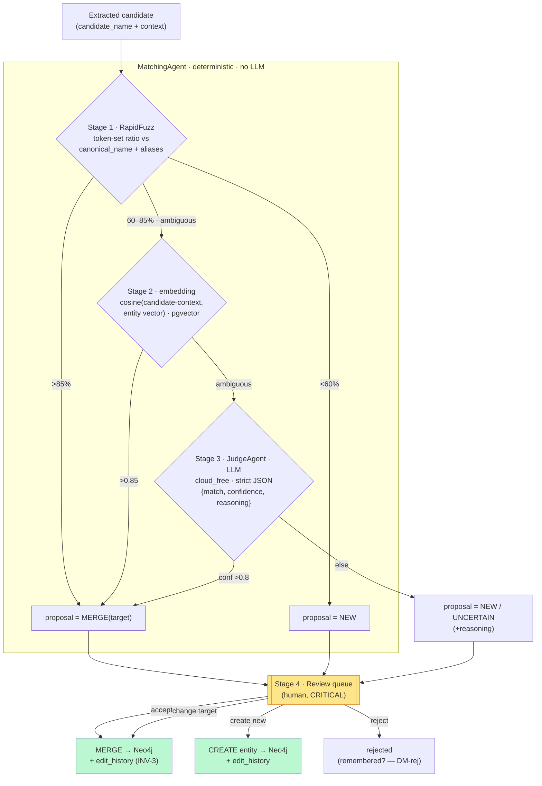

# M3 — Cascade matching (dedupe) · forward design pass (step-0)

> **Status: partially accepted — DM1–DM4 + DM6 RESOLVED, DM5/DM7/DM-rej still open.** This was the
> milestone-boundary "step 0" the M2→M3 roll queued: it frames the branchy M3 cascade and draws the
> **candidate lifecycle** as the vault's first `[[state-machine|state machine]]` note. **Resolutions
> are authoritative in `docs/PLAN_SHORT.md` Decided (2026-06-11, S19 DM6 + S20 DM1–DM4)** — the per-DM
> bodies below keep their "My proposal" framing for the record; treat the proposal each names as the
> chosen option for DM1–DM4 + DM6 (a later `review-architecture` sweep will fold the ✅ markers
> inline). M3.S1 shipped Stage 1 (PR #56); M3.S2 is Stage 2 + the pgvector switch. Authoritative
> contract: spec **§3.3** (the four stages + thresholds) and **§9 Milestone 3**; the vault references,
> never restates them.

**The product's heart.** §3.3 is "the core mechanism": given an extracted candidate, decide *is this a
new entity or one we already know?* — cheapest checks first, a human always last. M2 deliberately
skipped it ([[invariants]] **INV-8**, no dedupe → duplicate nodes on purpose, to expose the problem).
M3 is where that temporary invariant is **retired and replaced by INV-1** (the human-in-the-loop gate),
the single most consequential transition in the build so far.

**Opener feature:** `MatchingAgent` (Stage 1 RapidFuzz + Stage 2 embeddings — no LLM), which also
carries the **embedding read-path wiring** (the `pgvector` switch). Then `JudgeAgent` (Stage 3) and the
**review-queue UI** (Stage 4).

---

## Layers (nine-layer pass)

**1 · User / personas.** One persona, full trust (`[[project]]`). M3 adds the author's *highest-leverage
control surface*: the Stage-4 review queue, where the author commits every graph decision. No new trust
boundary — but the existing machine ↔ provider boundary ([[trust-boundary]]) is crossed again by the
Stage-3 JudgeAgent, and the §3.4 review-queue UI is the natural home to finally land **INV-2's consent
gate** (currently unscheduled — see [[2026-06-11-architecture-review]] §1).

**2 · Business.** Ladders to *both* drivers (`[[project]]`): the personal tool gets a clean,
non-duplicated graph ("I control every decision, the graph is clean" — §9 M3 outcome); the portfolio
gets its showpiece — a cheapest-first, fail-closed, human-in-the-loop cascade with four visibly distinct
stages. This is the feature the repo exists to demonstrate.

**3 · Domain — ubiquitous language.** New/sharpened nouns: **Candidate** (a proposed entity *before* a
human accepts — already in the language), **Match** (a proposed identity between a candidate and an
existing entity), **canonical_name** (the *resolved, bilingual PL+EN* name assigned **at merge**, §3.2 —
distinct from M2.S3's `candidate_name` surface form, `[[m2s3-extraction-agent]]` D1), **alias** (an
alternate surface form folded into an entity on merge). Verbs: *match, judge, merge, reject*. Authority:
spec App. A + §3.2/§3.3.

**4 · Data — entities, ownership, keys.** The load-bearing layer for M3. Today `adapters/postgres_repo.py`
selects **`NULL AS embedding`** (paragraphs never stored vectors; M1 scaffold). M3 turns embeddings on:
add the `pgvector` dependency, `register_vector_async` on the asyncpg/psycopg connection, switch the
`NULL AS embedding` SELECTs to real `vector(768)`, and **start writing** the column. The open question is
*what* carries the vector and *where Stage 2 queries it* (DM3/DM4). The two-store seam (Neo4j identity ↔
Postgres occurrences, OQ-1 resolved for M2.S4) gains a third actor: the embedding store (Postgres/pgvector),
keyed to the Neo4j entity id.

**5 · Behavior — the candidate lifecycle (state machine, not a status flag).** This is the spine of M3
and is drawn below + as the first `[[candidate-lifecycle]]` note. The crux: **no candidate reaches a
graph-committed terminal state (`merged`/`created`) except via a human transition** — that guard *is*
INV-1. Stage 1/2/3 only move a candidate between *proposal* states (`auto-merge-proposed`,
`ambiguous`, `new-proposed`); the commit edge is human-only.

**6 · Errors — fail-open vs fail-closed.** The cascade is the project's loudest [[fail-closed]] surface:
every stage that *can't* resolve with confidence **falls through toward the human**, never auto-commits.
Concretely — Stage 1 `<60%` doesn't silently create, it queues a "new" *proposal*; Stage 1 `>85%`
doesn't silently merge, it queues a "merge" *proposal*. A failed embedding model load or a pgvector
outage must **fall through to Stage 3/4**, not crash or silently skip dedupe. The JudgeAgent inherits the
M2.S2 router's failover + the typed `ProviderResponseError` path ([[failover]], [[poison-message]]).

**7 · Security.** Same two axes as the system overview. (a) The Stage-3 JudgeAgent prompt must render
structure **only from the trusted Jinja2 template**, never reparse model output mixed with story text —
the [[prompt-injection]] rule that hardened ChunkingAgent/ExtractionAgent (encoded in `/review-pr` §4).
The judge prompt embeds *existing entity properties + candidate context* (both ultimately author-derived
but one is now graph-stored) → confirm the structural guarantee with a failing test, as M2.S3 did. (b)
Stage 3 crosses the provider trust boundary → INV-2 consent (DM7).

**8 · Compliance / Audit.** Every Stage-4 human decision is an **effect** that must write an
`edit_history` row (`(before, after, intent, source, model, prompt, accepted)` — §4.2/§11; the future
training dataset). This is INV-3 (reversibility) made concrete: a merge/create/reject must be undoable,
so the transition that performs it is also the transition that records it. Every JudgeAgent call is an
`llm_calls` ledger row (INV-5, already built) + visible in the §8.5 panel.

**9 · Operations.** The JudgeAgent adds cloud_free token spend on *ambiguous* cases only (cost
optimization, §3.3) — observable via the existing budget/ledger. The review queue is a new long-lived UI
surface; no alerting/runbook beyond the single-user-local baseline (named n/a).

---

## Stations (enforcement-lifecycle checklist)

| Station | Present? | Where / gap |
|---|---|---|
| **Identity** | n/a — single local user | (no auth by design) |
| **Intent** | ✅ | the human explicitly accepts/merges/rejects each candidate at Stage 4 |
| **Policy** | ⚠ **needs a home** | the §3.3 thresholds (Stage 1 85/60, Stage 2 cosine 0.85, Stage 3 conf 0.8) are Policy values the code has **nowhere** today → **DM1** |
| **Decision** | ✅ | Stage 1/2/3 propose; **the human decides** at Stage 4 (INV-1) |
| **Access** | n/a — no inter-user access | localhost binding is the only gate |
| **Monitoring** | ✅ | JudgeAgent → `llm_calls` ledger (INV-5) + §8.5 panel; MatchingAgent is deterministic (no token spend) |
| **Evidence** | ⚠ **must be built** | each Stage-4 commit writes an `edit_history` row (INV-3) — the table/append path is **not built yet** → DM6 effect |
| **Expiry** | ◻ gap | **rejected** candidates: remembered (don't re-surface) or discarded? retention of judge prompts (story text)? ties OQ-4 → DM-rej |
| **Review** | ✅ | Stage 4 **is** the Review station, by design (§3.3 "CRITICAL") |

Empty/weak stations (**Policy home, Evidence build, Expiry gap**) are mirrored to `open-questions.md`.

---

## Data flow

The cascade runs **per extracted candidate**, against the current graph. Cheapest-first; the human is
always the terminal authority. **Nothing is committed to the graph by an automated stage** — Stages 1–3
only set the *proposal* a human then confirms.

Note the colour: the **only** edges that write to the graph (green) leave the **human** box (amber). That
visual *is* INV-1.

---

## State & invariants

### New state machine — `[[candidate-lifecycle]]` (drawn as the first `state-machines/` note)

States: `extracted → {auto-merge-proposed | ambiguous | new-proposed}` (set by Stage 1/2) `→ judged`
(only if it passed through Stage 3) `→ review-queued →` **(human)** `→ {merged | created | rejected}`
(terminal). Guards & effects:

- **Guard on every commit edge (`review-queued → merged|created`):** requires a human action — this
  guard *is* INV-1. No automated transition may target `merged`/`created`.
- **Effect on every terminal edge:** write an `edit_history` row (INV-3 evidence) — the Compliance layer
  happening in real time. A `rejected` edge also writes evidence (so a re-extraction can consult it —
  DM-rej).
- **Idempotency** ([[idempotency]]): a candidate re-extracted after a crash must not double-create; the
  paragraph-level `entity_mentions` checkpoint from M2.S4 anchors resume.

### Invariant changes (folded into `invariants.md` **only on acceptance**)

- **INV-8 (no dedupe) is RETIRED at M3 start** — not merely "turned off". Its purpose (expose
  duplicates) is served; it is **superseded by INV-1**. The hand-off must be a **tested transition**
  (DM6): the M2.S4 test asserting "two identical extractions → two nodes" is **replaced** by a test
  asserting "no graph node is created/merged without a human action". A half-state where matching exists
  *and* INV-8's CREATE-everything test still guards is contradictory.
- **INV-1 (human-in-the-loop) gets its first enforcer** — the Stage-4 commit guard above. Until M3 it
  was "the contract M3 must honour" with no code holding it.
- *Candidate new invariant?* — possibly **INV-9: "no automated stage writes to the graph"** (the green-
  from-amber-only rule). Propose; fold on acceptance.

---

## Decision register (OPEN — owner decides; mirrored to `open-questions.md`)

### DM1 — Where do the §3.3 thresholds live? (Policy home)
- **Context.** Stage 1 (85% / 60%), Stage 2 (cosine 0.85), Stage 3 (conf 0.8) are spec-given Policy
  values with **no home** in the code today.
- **Options.** (a) named constants in a `matching` config module (`config.py` / Pydantic settings),
  spec values as defaults, env-overridable; (b) hard-coded literals at the call sites; (c) per-project
  user-tunable in the DB now.
- **My proposal.** (a) — one named, documented home, spec values as defaults, tunable without a code
  change; **not** user-facing yet (YAGNI — `[[prefer-deterministic]]` discipline applied to scope). Open:
  whether thresholds are global or per-task.

### DM2 — Embedding model + dimension
- **Context.** §3.3 names `paraphrase-multilingual-mpnet` as the *example*; §9 says sentence-transformers
  + pgvector; `postgres_repo.py` already reserves **`vector(768)`**.
- **Options.** (a) `paraphrase-multilingual-mpnet-base-v2` — **768-dim**, multilingual PL/EN, matches the
  reserved column; (b) `paraphrase-multilingual-MiniLM-L12-v2` — 384-dim, ~3× smaller/faster, but needs
  a column migration off 768; (c) another multilingual ST model.
- **My proposal.** (a) — it matches the reserved column (no migration), is the spec's own example, and is
  strong on PL/EN. **`verify-at-build`:** confirm the model emits exactly 768 dims and runs on the 8 GB
  host; the model artifact is a **separate download** (like the spaCy wheels) → pin through `/add-dependency`'s
  §6.7 wheel/model channel, not a bare PyPI dep. Open: accept the ~1 GB model footprint on the local host?

### DM3 — What is embedded, and what is an entity's vector? (Stage 2 semantics)
- **Context.** §3.3: "Compare with embedding of **context (source sentence)**." But an existing entity has
  *many* mentions — so what vector represents *the entity* on the other side of the cosine?
- **Options.** (a) store a per-**mention** vector on `entity_mentions`; an entity's "vector" is an
  aggregate (mean / most-recent / first) computed at query time; (b) store one representative vector
  **per entity**, updated on each accepted merge; (c) compare candidate-context against *each* mention
  vector and take the max.
- **My proposal.** (a) per-mention vectors on `entity_mentions` (the table already bridges the two stores),
  Stage 2 = pgvector cosine of candidate-context vs the entity's mention vectors, **max** similarity
  (option (c) blended in). Open: aggregation choice is a real accuracy knob — `verify-at-build` with the
  App. B "Bronek/Bronisław" fixture.

### DM4 — Embedding storage & the pgvector read-path switch (Data)
- **Context.** Turn on the column `postgres_repo.py` stubs as `NULL`.
- **Options.** (a) embeddings on **`entity_mentions`** (per DM3a); (b) on `paragraphs` (the column the M1
  stub implies); (c) a new `entity_embeddings` table.
- **My proposal.** (a) — co-locate with the mention that already keys Neo4j↔Postgres. Wire `pgvector` +
  `register_vector_async`, switch the `NULL AS embedding` SELECTs, write the vector when a mention is
  recorded. **`verify-at-build`:** `register_vector_async` API shape for the async driver in use; the
  `pgvector` image already in compose (Issue #22 CVE treadmill) covers the DB side.

### DM5 — JudgeAgent model tier
- **Context.** Spec §6.5 agent table + §7 step 6 both say **cloud_free** for the JudgeAgent (Stage 3).
- **Options.** (a) route via the M2.S2 `LLMRouter` with a new `task_type="judging"`, weight `medium` →
  cloud_free per spec, cloud_strong on failover only; (b) a heavier default for accuracy.
- **My proposal.** (a) — spec settles the tier; reuse the router (INV-5/INV-7 for free; strict-JSON +
  schema-retry mirroring ExtractionAgent). Low controversy — confirm the weight mapping.

### DM6 — **The central fork: does matching gate the write, or dedupe after it?** (INV-8→INV-1 hand-off)
- **Context.** M2.S4 writes every candidate to Neo4j on extract (`CREATE`, INV-8). M3 must honour INV-1
  ("no entity created/merged without a human decision") and §3.3 Stage 4 ("no UI = no graph data").
- **Options.**
  - **(A) intercept-before-write** — extraction produces candidates that flow through matching → review
    queue; **only human-accepted** candidates are written to Neo4j. INV-8 is fully *replaced*; the graph
    only ever holds approved nodes.
  - ~~**(B) write-then-dedupe**~~ — *(rejected)* keep M2's CREATE-on-extract; matching proposes merges of
    already-written duplicate nodes; the graph is "dirty" until reviewed.
- **✅ Decision (owner, 2026-06-11) — (A) intercept-before-write.** Matching *gates* the graph write:
  extraction no longer commits to Neo4j directly — it **stages** candidates (Postgres), and Neo4j is
  written **only** when the human accepts in the Stage-4 queue. Rationale: it is what INV-1 ("only the
  author commits") and §3.3 ("no graph data without the human") demand, and INV-8 was *explicitly*
  temporary scaffolding to be superseded — so it is **retired**, not layered on. **Cost accepted:**
  M2.S4's "CREATE every candidate on extract" write path is **refactored**; the graph is empty until the
  author reviews (vs M2's deliberate duplicate-filled graph). *Rejected (B):* a dirty graph until review
  contradicts INV-1 and would need a separate cleanup path. **Still open (the build details):** do staged
  candidates live in a new `candidates` table (Postgres), with the existing `entity_mentions` + Neo4j
  writes moving to *accept* time? — settle when the gating code is designed.
- **Lands with code:** the INV-8 retirement + INV-1's enforcer fold into `invariants.md`, the
  `[[candidate-lifecycle]]` finalisation, and **ADR 0004** (this pipeline decision) all land **with the
  M3 gating code**, test-first — the invariant flip is witnessed by the failing test, not asserted ahead
  of it (the vault's as-built-honesty discipline).

### DM7 — Review-queue UX (Stage 4) + INV-2 consent gate
- **Context.** §3.3 Stage 4 elements (quote ±200 chars, NEW-vs-MERGE proposal, LLM reasoning, top-3
  alternatives, accept / change-target / create-custom-type / decide-relations / reject); §9 "keyboard
  nav"; `features/extraction-review/` (spec §6.4 tree). Also the natural home for **INV-2's consent gate**
  (now unscheduled).
- **Options.** keyboard scheme — vim-style vs `J/K/A/N` (spec §10 q9, owner pref). Consent gate — land it
  here (per-fragment "send to provider?" before the Stage-3 call) vs keep deferred.
- **My proposal.** Build the queue with the §3.3 elements + keyboard nav; **land INV-2's consent gate
  here** (re-pointed from its lapsed M2.S5 target). Keyboard scheme is the owner's pick. Open.

### DM-rej — Rejected-candidate memory (Expiry/Evidence)
- **Context.** A candidate the human rejected (or an entity they declined to merge) may re-appear in a
  later extraction with the same surface form → re-surfaced every run is annoying and pollutes the queue.
- **Options.** (a) remember rejections (a `rejected` evidence row consulted before re-queueing); (b)
  re-surface every time (stateless); (c) remember per-(surface-form, paragraph).
- **My proposal.** (a) — the `rejected` terminal edge writes evidence (INV-3) that the matcher consults.
  Ties OQ-4 (retention). Open.

> **Also surfaced (spec §10, now live):** **q8 multilingual entity naming** — `canonical_name_pl`/`_en`
> peers vs main — becomes concrete at M3 *because merge is where `canonical_name` is assigned*. Frame it
> when the merge effect is designed; it stays the **spec's** open question to resolve (the vault never
> resolves a §10 item unilaterally).

---

## But what if (edge cases, races, partial failures)

- **Two candidates in the *same* batch that are each other's duplicates** (e.g. "Janek" extracted from ¶3
  and ¶7, graph empty). §3.3 only compares against the *existing graph* → both score "new" → two queue
  items → the human merges manually. *Should the matcher also dedupe **within** the batch* before
  queueing? Open — propose intra-batch Stage-1 pass to pre-group, human still confirms.
- **TOCTOU at the review gate** ([[toctou]]). MatchingAgent computes "top-3 alternatives" against graph
  state at time *T*; the human reviews at *T+5min* after accepting another merge that changed the graph →
  the alternatives are **stale**. Mitigation: re-run Stage 1/2 at *render* time, or stamp the proposal
  with the graph version and re-validate on accept. Real, needs a call.
- **Embedding model fails to load / pgvector outage mid-cascade.** Must **fail-closed toward the human**:
  Stage 2 unavailable → fall to Stage 3, or straight to Stage 4 as "uncertain". Never crash, never
  silently mark "new" (that would smuggle duplicates back in).
- **JudgeAgent returns a malformed `200` envelope / schema-invalid body.** Inherits M2.S2/S3:
  `ProviderResponseError` → router records + fails over ([[poison-message]]); schema-invalid → agent
  prompt-retry then give up. The give-up path must **queue the candidate as "uncertain"**, not drop it.
- **Relations dangle across a merge.** M2 accepted dangling relations (endpoints unresolved). When two
  candidate entities merge, their relations must **re-point** to the surviving node, and the §3.3 Stage-4
  "decide on relations" step is where the human resolves endpoints. A merge that orphans a relation is a
  bug.
- **Concurrent JudgeAgent calls** — the `last_call()` tiebreaker cross-cutting (no monotonic column)
  bites only if M3 introduces batched concurrency. If Stage 3 stays sequential (single-user), it doesn't.
- **The human rejects, then the same surface form re-extracts** → DM-rej (don't re-surface forever).

---

## Gaps for the product owner

1. **DM6 — the pipeline fork** (intercept-before-write vs write-then-dedupe). The biggest M3 decision; it
   reshapes the §7 pipeline and M2.S4's write path. *My strong proposal: (A) intercept-before-write.*
2. **DM2/DM3/DM4 — embeddings**: exact model (768-dim mpnet?), per-mention vs per-entity vector, storage
   table. Carries the `pgvector` dependency add + read-path switch.
3. **Keyboard scheme** (spec §10 q9) and whether **INV-2's consent gate** lands in the Stage-4 UI (DM7).
4. **Multilingual `canonical_name`** (spec §10 q8) — surfaces at merge; stays the spec's to resolve.
5. **Rejected-candidate memory** (DM-rej) + log/candidate **retention** (OQ-4 Expiry).
6. **Sequencing** (settled S20): `MatchingAgent` Stage 1 (RapidFuzz) ✅ PR #56 → Stage 2 (embeddings +
   the pgvector wiring, M3.S2) → `JudgeAgent` (M3.S3) → the review-queue UI + the DM6 write-path refactor
   (M3.S4) — each its own `/review-pr` → PR → squash-merge.

---

## Hand-off

- **Register status (updated S20): DM1–D4 + DM6 resolved; DM5/D7/DM-rej open.** DM6 (intercept-before-
  write) determined INV-8 is *replaced*, not layered. The INV-8→INV-1 fold, the ADR(s), and finalising
  the `state-machines/` note still land **test-first with the M3.S4 write-path code** (not yet) — Stage 1
  (PR #56) and Stage 2 (M3.S2) are proposal-only and leave INV-8 live.
- **What this pass writes** (vault only): this proposal; the three **freshness fixes** the 06-11 review
  recommended (re-point INV-2 → the M3 review-queue UI; flip INV-5/OQ-9 latency → as-built M2.S5; refresh
  `overview.md` to M2.S6/M3) — applied because they are honest as-built corrections independent of the M3
  decisions; the `[[candidate-lifecycle]]` note as **draft**; glossary + learning-log + INDEX + open-
  questions updates.
- **On acceptance** (next session, after the owner resolves the register): fold INV-1's enforcer +
  retire INV-8 (+ possible INV-9) into `invariants.md`, finalise `[[candidate-lifecycle]]`, draft the
  ADR(s) for DM6 + DM2, and reconcile the host homes (spec §3.3/§9 already authoritative; plan tasks).
- **First code:** `MatchingAgent` Stage 1 (RapidFuzz, deterministic — smallest blast radius, no LLM, no
  embeddings yet), **failing test first** with the App. B "Bronek/Bronisław" fixture; then Stage 2 +
  the pgvector wiring.
