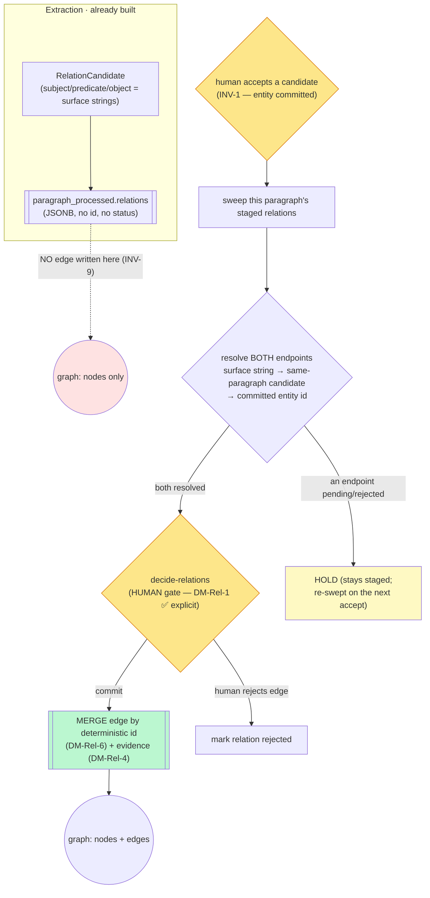

# M3 relation-write — committing graph edges under human control (step-0)

> **Status: ACCEPTED — register FULLY RESOLVED. Built in M3.S4e (2026-06-16); recorded in ADR 0005.**
> This was the step-0 decompose for the M3 slice that completes *"the graph is clean"* (§9 M3) **for
> relations**. Entity dedupe (S4a–S4d) is done; before S4e a merge orphaned a candidate's staged
> relations because **no code wrote graph edges**. Owner framing (2026-06-16): an **M3 slice**, not an
> M3→M4 roll — relations are part of M3's clean-graph outcome.
>
> **Resolved (owner + build, 2026-06-16; authoritative in `docs/decisions/0005`, `docs/PLAN_SHORT.md`
> Decided S29, `[[invariants]]` INV-1/INV-9):**
> - **DM-Rel-1 → (b) an EXPLICIT human gate** over relations (the §3.3 5th action "decide on relations"),
>   *not* auto-write (a) and *not* the hybrid (c, kept as a fallback). Slice **split BACKEND-now (S4e) /
>   UI-next (S4f)**. Anywhere this note still poses "auto vs human gate" as a *live* fork resolves to the gate.
> - **DM-Rel-2/4/5/6/7 → confirmed at build as the architect proposed** (the S4a pattern): normalised-exact
>   same-paragraph resolution reading the committed id from `candidates` (the create-id derivation promoted
>   to the shared `domain.candidates.committed_entity_id` helper — the drift fix DM-Rel-2 flagged); a
>   `staged_relations` table; M3 writes / M4 re-points; idempotent MERGE on `uuid5(subject_id, predicate,
>   object_id)` (one edge per fact across paragraphs — with the *lost-per-mention-provenance* follow-up noted
>   in ADR 0005); dangling-to-known endpoints held. INV-1 was **broadened** (not INV-10 minted) to cover edges.
>
> **Authoritative contract (referenced, never restated):** spec **§3.2** (entity/relation data model),
> **§3.3** (the Stage-4 human actions — incl. the 5th, *"decide on relations (which entities it links
> to and how)"*), **§9 M3** ("the graph is clean"). Vault homes this builds on: `[[m3s4a-intercept-write-path]]`
> (the intercept-before-write model this inherits), `[[candidate-lifecycle]]`, `[[invariants]]` (INV-1
> human gate, INV-9 only-the-accept-path-writes). Disclosure: balanced (G=21) — known terms linked, one
> new term (`[[referential-integrity]]`) defined.

**The one-sentence shape.** Extraction already *stages* each paragraph's relations as raw
`RelationCandidate` dicts (surface-form `subject`/`predicate`/`object`) in `paragraph_processed.relations`
(JSONB), but **nothing writes a Neo4j edge**. This slice resolves each staged relation's two surface
endpoints to **accepted entity ids** and writes the edge — but an edge can only be written once **both**
endpoints are accepted entities, the write must be **idempotent** (today `create_relation` uses `CREATE`,
which would double an edge on a retried accept), and the *who-commits* gate (§3.3's 5th human action) is
the central open decision. The reuse targets exist (`neo4j_repo.create_relation`/`get_relations`); the work
is **endpoint resolution + the commit trigger + the human gate + idempotency + an evidence trail**, not new
graph plumbing.

---

## The reframe that shrinks this slice (read first)

The handoff (and the m3s4a "but what if") describe **"a merge must re-point edges to the surviving
entity."** That worry comes from an **eager-write** mental model (M2's `CREATE`-on-extract). Under
**intercept-before-write** it largely dissolves, and saying why is the most important architectural finding
here:

- A staged relation endpoint is a **surface string** (`"Janek"`), scoped to one paragraph. It carries **no
  entity id** — entity ids do not exist until a human accepts.
- Therefore an edge can only be written **lazily**, *after* review, by resolving each surface string to the
  **committed** entity id of its candidate. A candidate that was **merged** into an existing entity resolves
  to that existing entity's id (`candidates.target_entity_id`); a candidate **created** new resolves to its
  deterministic id (`uuid5(_ACCEPT_NS, "entity:{cid}")`).
- So a merge is handled **by construction at resolution time** — there is no separate "re-point" write,
  because we never wrote a provisional edge to re-point. The edge is born already pointing at the survivor.
- The *only* case that would need re-pointing an **already-written** edge is an **accepted-entity ↔
  accepted-entity merge** (folding two *committed* nodes into one). **That action does not exist in M3** —
  M3 merges fold a *pending candidate* into an *existing* entity (the existing keeps its id), and S4c
  on-accept re-match only flips *pending* proposals; it never merges a committed node away. Accepted-entity
  merge is an M4 "edit relations/entities in UI" concern. **DM-Rel-5** records this boundary explicitly so a
  future contributor knows the deferred edge.

Net: the slice is **resolve-then-write**, not **write-then-repoint**. That is smaller and safer — provided
resolution always targets the *committed* id (never a provisional create-id for a merged endpoint).

---

## Layers (nine-layer pass · per-feature altitude — all nine ripple)

**1 · User / personas.** One persona, full trust (`[[project]]`). The author is already the only writer of
*entities* (INV-1); this slice decides whether they are likewise the explicit committer of *edges* (§3.3's
5th action) or whether edges ride on entity accepts (**DM-Rel-1**). No new trust boundary.

**2 · Business.** This is what makes §9 M3 literally true: today a "clean graph" has correct nodes but **no
edges** — a knowledge graph with no relations is not yet the worldbuilding artifact the spec promises. The
portfolio payoff is the visible completion of the human-gated graph.

**3 · Domain — ubiquitous language.** New verbs land on the seam: **resolve** (map a relation's surface
endpoint → an accepted entity id), **commit a relation** (write the edge), **hold** (a staged relation whose
endpoints are not both accepted yet). A staged relation has a **lifecycle** it does not have today (it is an
inert JSONB blob). The endpoint strings are open-world surface forms (`[[open-world-ontology]]`), the same as
`candidate_name`. Authority: spec §3.2 / App. C.2.

**4 · Data — entities, ownership, keys (the load-bearing layer).** The shapes, as-built:
- `RelationCandidate` (`agents/extraction_agent.py`) — `subject: str`, `predicate: str`, `object: str`,
  `evidence_quote`, `confidence`. **Endpoints are surface strings**, one paragraph's scope.
- `GraphRelation` (`domain/graph.py`) — `id`, `type`, `subject_id: UUID`, `object_id: UUID`, `confidence`,
  `source_paragraph_id`, `properties`. **Endpoints are entity UUIDs.** The resolution gap *is* the
  `str → UUID` mapping.
- **Staging today:** `paragraph_processed (paragraph_id PK, story_id, relations jsonb, processed_at)` —
  relations are `RelationCandidate.model_dump()` dicts, with **no per-relation id and no status**. There is
  no `project_id` column (only `story_id`). For a relation to carry a lifecycle (held → written/rejected) and
  be idempotently writable, this shape must grow — **DM-Rel-4**.
- **The resolution source:** an endpoint string resolves via the `candidates` table — the candidate in the
  **same paragraph** whose `candidate_name` matches the endpoint, then that candidate's committed entity id
  (`status='created'` → deterministic create-id; `status='merged'` → `target_entity_id`). A `rejected` or
  still-`review-queued` endpoint = not resolvable yet. **DM-Rel-2** settles the match rule + where the
  committed id is read.
- **Dangling-to-known endpoint:** a relation endpoint that is *not* an entity candidate in its paragraph but
  *is* a known accepted entity (e.g. "the King", referenced but not re-extracted). Resolve against the
  accepted graph by name? **DM-Rel-7.**
- **Evidence home:** a relation commit is a graph write that INV-3 says must be reversible — but
  `candidate_decisions` is **entity-keyed** (`candidate_id`). A relation decision has **no audit home** today
  → a gap (station Evidence, below).

The §6.4 Neo4j write already exists and is **dangling-safe + injection-safe**: `create_relation` does
`MATCH (s),(o) ... CREATE (s)-[r:`type`]->(o)` — it writes no edge if an endpoint node is absent, and the
relationship type is backtick-escaped (the Cypher analogue of `[[prompt-injection]]`-by-structure). The one
defect for *this* use: `CREATE` (not `MERGE`) means a **retried** accept writes a **second** parallel edge —
**DM-Rel-6**.

**5 · Behavior — a relation lifecycle appears.** Staged relations need a state machine they do not have:
`staged → (both endpoints resolvable) → committable → written | rejected`, with a **held** resting state
while either endpoint is unresolved. Its shape depends on **DM-Rel-1** (auto vs human gate), so it is
*sketched* below but the standalone `state-machines/relation-lifecycle.md` note is **deferred until the
register resolves** (drawing it now would bake in an undecided gate).

**6 · Errors — fail-open vs fail-closed.** The edge write is a graph mutation, so it inherits the accept
path's posture. Concretely: (a) a partial failure between the entity accept and the relation write must not
leave the candidate flipped-but-edge-missing in a non-retryable way — the relation write must be **idempotent
and re-runnable** (`[[idempotency]]`, DM-Rel-6); (b) an **unresolvable** endpoint is **not** an error — it is
a *held* relation (`[[fail-closed]]` toward "don't write a wrong/half edge"), never a crash; (c) a store
outage during the write → **503**, the relation stays held, a retry re-commits idempotently.

**7 · Security.** No new egress — this slice writes the local graph only, no LLM call. The injection surface
(an LLM-produced relation `type` reaching Cypher) is **already closed** by `_escape_rel_type` in
`neo4j_repo.py`; this slice changes *when* `create_relation` is called, not *how*, so the structural
guarantee holds. Endpoint strings reach Cypher only as **bound parameters** (`$sid`/`$oid`), never
interpolated.

**8 · Compliance / Audit.** INV-3 (every automatic action reversible) covers edges too: a wrongly-committed
relation must be undoable, and ideally there is a durable record of *which* relations the human committed and
on what evidence. Today there is **none** for relations — the `candidate_decisions` table is entity-shaped.
Whether to extend it, add a sibling `relation_decisions`, or rely on the edge itself + `delete_project_graph`
reversibility is part of **DM-Rel-1/DM-Rel-4** (Evidence station, below).

**9 · Operations.** Modest: per accepted candidate, a bounded lookup of its paragraph's staged relations + at
most a few edge writes. Observable via `get_relations` / the §3.4 graph viewer (edges now appear). No new
alerting beyond the single-user-local baseline (n/a).

---

## Stations (enforcement-lifecycle checklist)

| Station | Present after this slice? | Where / gap |
|---|---|---|
| **Identity** | n/a — single local user | localhost binding |
| **Intent** | ✅ **resolved** | the explicit `decide-relations` human action *is* the intent (DM-Rel-1 ✅ — the §3.3 5th action, not auto-write) |
| **Policy** | ⚠ | which surface→entity resolution counts; same-paragraph match rule; a confidence floor on edges? → **DM-Rel-2/7** |
| **Decision** | ✅ **resolved** | the human commits each edge at `decide-relations` (DM-Rel-1 ✅), mirroring INV-1's entity guard |
| **Access** | n/a | no inter-user access |
| **Monitoring** | ✅ | committed edges visible via `get_relations` + the §3.4 graph viewer |
| **Evidence** | ⚠ **gap** | a relation commit has **no audit row** (`candidate_decisions` is entity-keyed) — INV-3 reversibility for edges → **DM-Rel-4** |
| **Expiry** | ◻ **inherited gap** | a relation whose endpoint is never accepted is **held forever** in `paragraph_processed` — same posture as DM-S4a-5 (none at PoC) but now a concrete second instance |
| **Review** | ⚠ | the §3.3 5th action's *surface* — backend gate this slice; the UI is a likely follow-on (mirrors the S4a→S4b split) |

Empty/weak stations still open (**Evidence = DM-Rel-4; Expiry**; Intent/Decision now ✅ via DM-Rel-1) are mirrored to
`open-questions.md` (OQ-19).

---

## Data flow

Resolution and the edge write happen **only on the human path** (INV-9), never in the coordinator. With
DM-Rel-1 resolved to the **explicit human gate**, the commit edge leaves a human `decide-relations` action
(not an auto-sweep). An on-accept sweep may still *resolve/hold* relations as endpoints land (DM-Rel-3,
confirm-at-build), but the **commit** is the human's — the amber `GATE` box below is that human action.



The green (graph-writing) edge leaves **only** an amber human-reachable box — same INV-1/INV-9 shape as the
entity accept. The red node (graph has nodes, no edges) is exactly today's incomplete state this slice closes.

---

## State & invariants

### Relation lifecycle (sketched; standalone note deferred to register-resolution)
```
staged ──(an endpoint accepted)──> [re-evaluate]
   ├─ both endpoints resolve ──(commit gate)──> written      (terminal)
   ├─ both resolve, human declines ──────────> rejected      (terminal)
   └─ an endpoint pending/rejected ──────────> held ──(re-swept on next accept)── …
```
A **held** relation is the resting state the current design lacks. Whether `written` is reached by an
auto-transition (DM-Rel-1 = auto) or only through a human action (DM-Rel-1 = explicit gate) is the open call;
the machine cannot be finalised until it resolves.

### Invariant changes (framed; folded into `invariants.md` only on acceptance, test-first)
- **INV-9 already covers this.** "No automated stage writes the graph" applies to **edges** as much as nodes:
  the relation write must be reachable **only** from a human-accept path (`CandidateReviewService` or a
  sibling reached by a human endpoint), never from the `ExtractionCoordinator`. This slice must not weaken
  INV-9 — the greppable guard (no `create_relation` reachable from the coordinator/agents) extends to the new
  write. **No change to INV-9; it gains a second witnessed instance.**
- **INV-1 broadened (DM-Rel-1 ✅ explicit gate; resolved at build M3.S4e).** With the explicit gate the
  human commits each edge, so the invariant takes the strong form. **Decision: broaden INV-1**
  ("human-in-the-loop on every entity create/merge **and every relation edge**") rather than mint a
  near-duplicate INV-10 — the single human-gate principle now covers nodes and edges (`[[invariants]]` INV-1,
  witnessed test-first by the "accept both endpoints → decide → exactly one edge" integration test). (The
  auto-write branch — only the *transitive* guarantee "an edge between two human-accepted entities" — is
  rejected with option (a).)

---

## Decision register (PARTLY RESOLVED — DM-Rel-1 + slice decided 2026-06-16; DM-Rel-2/4/5/6/7 open; mirrored to `open-questions.md` OQ-19)

### DM-Rel-1 — The human gate for relations (THE central call) — ✅ RESOLVED: (b) explicit gate
- **Context.** §3.3 lists *"decide on relations (which entities it links to and how)"* as a Stage-4 human
  action. But entity dedupe already puts a human gate on both endpoints. Does an edge between two
  human-accepted entities need its **own** human decision, or does it ride on the entity accepts?
- **Options.**
  - **(a) Auto-write on both-endpoints-accepted.** When the second endpoint is accepted, the edge is written
    automatically. Lightest; no new UI; relations are a byproduct of entity review. Cost: a hallucinated
    *predicate/direction* (wrong "how") is committed even though both nodes are right — exactly the LLM error
    `[[human-in-the-loop]]` exists to catch; relies on INV-3 (delete the bad edge) as the safety net.
  - **(b) Explicit 5th review action (spec-faithful).** A `decide-relations` surface lists *committable*
    relations (both endpoints accepted); the human confirms / re-targets endpoints / edits the predicate /
    rejects. Matches §3.3's letter and the graph-as-source-of-truth philosophy. Cost: a new endpoint set + a
    likely follow-on UI slice (the S4a→S4b shape) — bigger.
  - **(c) Hybrid — auto-resolve, human-confirm in bulk.** The system resolves + pre-stages a *proposed* edge
    (deterministic, no LLM); the human confirms the batch with one action (accept-all / prune). Middle cost;
    keeps the human veto without a per-edge ceremony.
- **Decision (owner, 2026-06-16) — (b), the explicit human gate** (as proposed). A `decide-relations`
  surface lists committable relations (both endpoints accepted) and the human confirms / re-targets / edits
  the predicate / rejects each — the spec-faithful §3.3 5th action and the graph-as-source-of-truth posture.
  The *resolution* stays fully deterministic (`[[prefer-deterministic]]`) so the human's job is a thin
  confirm/prune, not data entry. *Rejected:* **(a) auto-write** — it commits a hallucinated predicate/direction
  even when both nodes are right, the exact LLM error `[[human-in-the-loop]]` exists to catch; **(c) hybrid**
  — kept as a fallback if the explicit gate proves heavy in practice, but not the build target.
- **Slice (owner, 2026-06-16) — split BACKEND-now (S4e) / UI-next (S4f)** (the S4a→S4b cut): the backend
  (resolution + idempotent edge + the `decide-relations` endpoints + the invariant flip) is test-first
  witnessable at the API boundary; the React relation-review surface follows. *Rejected:* one combined slice
  (too big for one conversation, the reason S4 itself was split).

### DM-Rel-2 — Endpoint resolution mechanism
- **Context.** A surface string must become an accepted entity id. The natural key: the **same-paragraph**
  entity candidate whose `candidate_name` equals the endpoint, then its committed id
  (`created` → `uuid5(_ACCEPT_NS, "entity:{candidate.id}")`; `merged` → `target_entity_id`).
- **Options.** Match rule: **(a) exact string match** on `candidate_name` within the paragraph; **(b)**
  case-/whitespace-normalised match; **(c)** reuse the `MatchingAgent` Stage-1 fuzzy match. Read the committed
  id from: **(i)** the `candidates` row (`status` + `target_entity_id` + the deterministic create-id formula),
  or **(ii)** the `candidate_decisions` evidence row.
- **My proposal.** **(b)** normalised-exact within the paragraph (the LLM emitted both the entity candidate
  and the relation endpoint from the same text, so surface forms align; fuzzy here would silently mis-link —
  `[[prefer-deterministic]]` argues for the tightest rule that works, with mis-resolution surfaced, not
  guessed) + **(i)** read from `candidates` (the decision row is the audit trail, not the live-state source).
  Cost accepted: a relation whose endpoint string doesn't match any same-paragraph candidate falls to
  DM-Rel-7.
- **Open.** Exact vs normalised; the create-id derivation is a **coupling** to `CandidateReviewService`'s
  private `_ACCEPT_NS` — should that id-derivation be promoted to a shared, tested helper so two homes can't
  drift? (`verify-at-build`.)

### DM-Rel-3 — When the edge-write fires (trigger / timing)
- **Context.** Resolution can only succeed once both endpoints are accepted, which happens at different times.
- **Options.** **(a) On-accept sweep** — each entity accept re-checks its paragraph's staged relations and
  commits any now-complete ones (mirrors `_maybe_rematch`, S4c). **(b) Explicit finalize** — a
  `decide-relations`/`commit-relations` endpoint the human runs after the entity queue drains. **(c) Batch at
  end-of-review** — auto on queue-empty.
- **My proposal.** Couples to DM-Rel-1: if **(a-auto)**, the **on-accept sweep** is the clean hook (and is
  **fail-closed/best-effort** exactly like `_maybe_rematch` — a relation-write failure must never roll back
  the human's entity accept). If **(b-explicit gate)**, an **explicit endpoint** is the surface. Lean: the
  on-accept sweep for *resolution/holding*, an explicit action for the *commit* if (b).
- **Open.** Down to DM-Rel-1.

### DM-Rel-4 — Staged-relation persistence + evidence (the data-layer call)
- **Context.** `paragraph_processed.relations` is an inert JSONB array with **no per-relation id and no
  status**, so a relation cannot be marked held/written/rejected, and a commit leaves no reversible evidence
  (INV-3) — `candidate_decisions` is entity-keyed.
- **Options.** **(a) Promote relations to a `staged_relations` table** (id, project/story/paragraph ids,
  subject/predicate/object surface strings + confidence + evidence_quote, resolved subject/object entity ids,
  status, timestamps) with a deterministic edge id for idempotency — symmetric with the `candidates` table.
  **(b) Keep the JSONB blob** and track written-ness only by a deterministic edge id existing in Neo4j (no
  Postgres status; idempotency via `MERGE`). **(c) JSONB + a thin `relation_decisions` evidence table** for
  the audit trail only.
- **My proposal.** **(a)** — a `staged_relations` table. It is the shape that makes the lifecycle, the
  held/written/rejected status, idempotency, and the evidence trail all first-class, and it mirrors the
  `candidates` design the team already validated. Cost: a migration + a store, larger than (b). (b) is the
  minimal-PoC option if DM-Rel-1=(a-auto) and we accept "the edge's existence is its own record." `verify-at-build`
  the migration `down_revision` against `alembic heads` (do **not** hardcode).
- **Open.** Table vs blob is largely a function of DM-Rel-1 (an explicit human gate strongly wants a row with
  status; pure auto-write can live with the blob + idempotent MERGE).

### DM-Rel-5 — Re-point scope (name the deferred edge)
- **Context.** The handoff feared "a merge must re-point edges." Under intercept-before-write + lazy
  resolution it dissolves (see "The reframe" above): edges are born pointing at the committed survivor.
- **Proposal (a boundary to *record*, not a build task).** **No re-point of written edges in M3.** Resolution
  always targets the *committed* entity id, so candidate-merges need no re-point. The only re-point case —
  **merging two already-accepted entities** — is an **M4** concern (the spec's "edit relations in UI") and is
  **explicitly out of scope**; when it lands it must re-point or `DETACH`-rewrite incident edges. Record this
  in the ADR so the deferred edge is visible, not forgotten.
- **Open.** Owner confirms the boundary (M3 writes, M4 re-points on entity-merge).

### DM-Rel-6 — Idempotent edge write (a concrete must-fix)
- **Context.** `create_relation` uses `CREATE`, so a **retried** accept (the accept path is explicitly
  retry-safe by design) would write a **second** parallel edge — breaking the idempotency contract the entity
  path holds (`create_entity` is `MERGE`-on-id; see `[[idempotency]]`).
- **Options.** **(a) Deterministic edge id** (e.g. `uuid5` of subject_id + predicate + object_id, or of the
  staged-relation id) + **`MERGE` on that id** (the same pattern `create_entity` already uses). **(b)** A
  uniqueness guard in Cypher (`MERGE (s)-[r:TYPE {id:$id}]->(o)`). **(c)** Accept duplicate edges at PoC
  (rejected — it dirties the very graph this slice exists to keep clean).
- **My proposal.** **(a)** — deterministic id + MERGE-on-id, the proven entity-path pattern. This makes the
  relation write a true upsert and the sweep safely re-runnable. *Rejected (c):* duplicate edges contradict
  §9 M3.
- **Open.** Edge-id derivation (from the staged-relation id vs from the (subject,predicate,object) triple —
  the latter natural-keys "the same fact stated twice" into one edge, which may be desirable or may hide a
  real second mention; owner's call).

### DM-Rel-7 — Dangling-to-known-entity endpoints
- **Context.** A relation endpoint may name a **known accepted entity** that was *not* re-extracted as a
  candidate in this paragraph ("the King" referenced in passing). Same-paragraph candidate resolution (DM-Rel-2)
  finds nothing, yet a valid entity exists.
- **Options.** **(a)** Resolve such an endpoint against the **accepted graph** by name (canonical/alias),
  reusing the matcher, so the edge can still be written. **(b)** Treat it as truly dangling → **held**
  (never written) until/unless the entity is re-extracted and accepted. **(c)** Surface it in the
  decide-relations action for the human to bind manually (ties the S4d handpick pattern).
- **My proposal.** **(b)** for the first slice (simplest, no silent fuzzy graph writes), noting **(c)** as the
  natural refinement if DM-Rel-1=(b) gives us a human relation surface anyway. *Rejected as default (a):*
  auto-binding an endpoint to a fuzzily-matched existing entity writes a graph edge with no human in the loop
  on the binding — against the slice's spirit.
- **Open.** Down to whether DM-Rel-1 gives a human surface to do (c).

---

## But what if (edge cases, races, partial failures)

- **Self-loop relation** (subject string == object string, e.g. a reflexive predicate, or two distinct
  surface forms that resolve to the *same* merged entity). After merges, `subject_id == object_id` is
  possible. Decide: write a self-edge, or drop it? Likely drop (a self-relation is rarely meaningful and may
  be a merge artifact) — but name it; `create_relation` would happily write `(e)-[r]->(e)`.
- **Both endpoints resolve to the same entity via different merges.** "Janek" and "Jan" both merged into J1;
  a "Janek KNOWS Jan" relation collapses to a self-loop — same call as above. A merge artifact, not a fact.
- **Endpoint accepted, then its candidate's status is *rejected* later?** Not possible — terminals are final
  (`[[candidate-lifecycle]]`); a candidate is accepted **or** rejected once. But a relation's *other* endpoint
  may be rejected → the relation is **permanently un-writable** → stays held (Expiry/DM-Rel-4). Should a
  rejected endpoint **drop** the held relation (it can never complete) rather than hold it forever? Worth a
  rule: on a candidate reject, prune that paragraph's staged relations that reference it.
- **Retry after a crash between entity-accept and relation-sweep.** The entity accept already flipped the
  candidate status (its last write); the relation sweep had not run. A re-accept is a `terminal_noop` (the
  candidate is already terminal) — **so the sweep would be skipped on retry.** This is a real ordering trap:
  the relation sweep must **not** hang off only the *first* (non-noop) accept, or a crash strands the edge.
  Mitigation: make the sweep idempotent **and** reachable on a re-accept noop, or run it from a separate
  idempotent finalize (favours DM-Rel-3=(b)/(c)). **Flag — this wants its own test.**
- **TOCTOU at the resolve gate** (`[[toctou]]`). An endpoint's committed entity could (in a future M4
  entity-merge) be merged away between resolution and the edge write. Out of scope in M3 (DM-Rel-5), but the
  `MERGE`-on-id idempotency (DM-Rel-6) plus the `create_relation` `MATCH`-then-`CREATE` (no edge if a node is
  gone) already fail safe.
- **Duplicate identical relations across paragraphs** ("Janek loves Marysia" in ¶3 and ¶9). DM-Rel-6's edge-id
  derivation decides whether these are one edge or two — surface it as the owner's call (dedupe the fact vs
  preserve each mention's provenance via distinct `source_paragraph_id`).
- **Predicate is wrong but endpoints are right** (the core risk of DM-Rel-1=(a-auto)). No automated guard can
  catch a plausible-but-wrong predicate — only the human can. This is the single strongest argument for the
  explicit gate (b); name it so the auto-write choice is made with eyes open.
- **Store-chatty sweep.** Each accept now also reads the paragraph's staged relations + maybe writes edges,
  on top of S4c's re-match. Bounded (one paragraph's relations), but it compounds the C4 "store-chatty
  cascade" watch — fail-closed to 503 on a store blip, never a partial edge.

---

## Gaps for the product owner

> **All resolved at build (M3.S4e, 2026-06-16) — recorded in `docs/decisions/0005` + `[[invariants]]`.**
> Items 1–9 below are kept for the record; each was decided as the proposal proposed unless noted.

1. ~~**DM-Rel-1 — the human gate (auto-write vs the §3.3 5th action vs hybrid).**~~ ✅ **Resolved (owner,
   2026-06-16): the explicit §3.3 5th-action gate; slice split backend-now (S4e) / UI-next (S4f).** INV-1
   was **broadened** to cover edges (not INV-10 minted).
2. **DM-Rel-4 — `staged_relations` table vs JSONB blob**, and the **relation evidence/audit home** (INV-3 for
   edges). Largely a function of (1).
3. **DM-Rel-6 — idempotent edge write** is a **must-fix regardless** (today's `CREATE` doubles edges on retry);
   only the edge-id derivation is open.
4. **DM-Rel-2/7 — resolution rule** (same-paragraph normalised-exact) and the **dangling-to-known** policy.
5. **DM-Rel-5 — confirm the re-point boundary** (M3 writes; M4 re-points on accepted-entity merge).
6. **Reject-prunes-held-relations?** Should rejecting an endpoint candidate drop that paragraph's now-impossible
   staged relations (vs holding them forever)?
7. **Self-loop / merge-collapse policy** — write or drop a relation whose endpoints resolve to one entity?
8. **The retry-after-accept sweep trap** (a re-accept noop must still let the edge land) — a build-time test,
   noted so the implementer designs for it.
9. ~~**ADR**~~ ✅ **`docs/decisions/0005`** — DM6's intercept-before-write is ADR 0004; this slice is its
   natural completion. ADR 0005 states the accepted cost of the chosen **explicit gate** (a heavier slice +
   a UI follow-on + the lost-per-mention-provenance follow-up).

---

## Vault hygiene this run flagged (not part of the feature)

- **INDEX priority queue is stale** (handoff-confirmed): "Next steps" items 13–14 still frame *"Next: M3.S4c —
  intra-batch dedup"*, but **S4c and S4d both shipped** (PRs #67, #70). The M3 state machine + invariants
  already reflect S4a–S4d; only the INDEX "Next steps" narrative lags. This run refreshes those lines as part
  of the mandated INDEX regenerate; a fuller `meta-architect:review-architecture` re-sync (a dated
  `reports/` snapshot of the post-S4d as-built) is **overdue** and recommended at this milestone boundary —
  added to OQ-19's note.

---

## Hand-off

- **First code is a FAILING TEST**, test-first per the workflow rule. With DM-Rel-1 resolved to the explicit
  gate, the witness is settled: *"accepting both endpoints of a staged relation, then the `decide-relations`
  human action, results in exactly one graph edge between the two committed entities; accepting only one (or
  not deciding the relation) writes none; a retried accept/decide does not double the edge."* That pins
  resolution + the both-endpoints gate + the human commit + idempotency (DM-Rel-2/-3/-6) at once.
- **DM-Rel-1 + the slice are resolved; DM-Rel-2/4/5/6/7 are not** — so do not fold invariants, draw the
  standalone relation-lifecycle note, or author the ADR until those resolve at build (the invariant flip is
  witnessed by the failing test, not asserted ahead of it). On full resolution, this proposal goes to
  `accepted` (the remaining register entries → Decision, OQ-19 fully struck) and the host homes are reconciled
  (spec §3.3 if the gate *mechanism* needs an amendment — the gate *existence* is already §3.3; the plan's
  Decided + the S4e/S4f tasks; `[[invariants]]`; `[[candidate-lifecycle]]` or a new `relation-lifecycle`).
- **Reuse, don't rebuild:** `neo4j_repo.create_relation`/`get_relations` (make the write idempotent —
  DM-Rel-6), the `CandidateReviewService` accept path + its `_maybe_rematch` fail-closed pattern (the sweep
  hook), the `candidates`/`candidate_decisions` table design (the `staged_relations` mirror — DM-Rel-4), and
  `api/stories.py`'s `ErrorResponse`/`responses=` discipline for any new endpoint.
