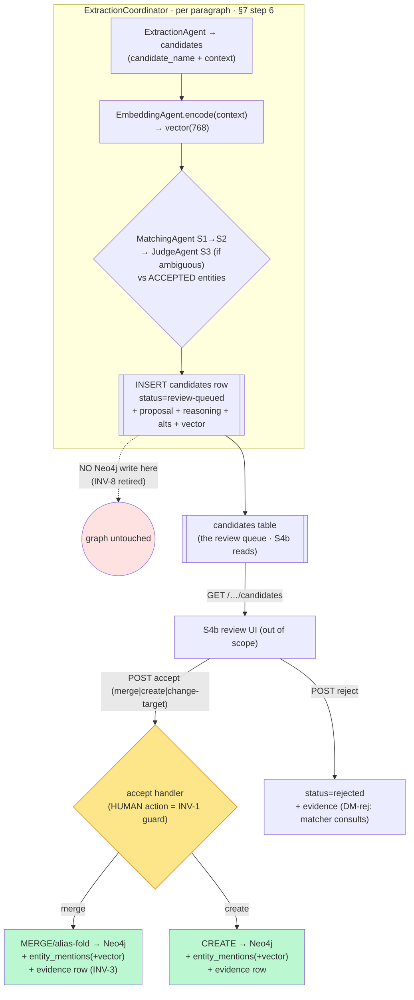

# M3.S4a — Intercept-before-write: staging + cascade wiring + the human-accept path (step-0)

> **Status: accepted — register resolved (owner, 2026-06-15; recorded in `docs/PLAN_SHORT.md` Decided
> 2026-06-15 S23, the authoritative home). Build is test-first next session.** The
> React review-queue UI is **S4b** (out of scope here). This pass designs the write-path refactor that
> **retires INV-8 and lands INV-1's first enforcer**, test-first.
>
> **Decisions (owner, 2026-06-15 — authoritative in `docs/PLAN_SHORT.md` Decided S23; each register
> entry below now reads as the Decision):**
> **DM-S4a-1** → new Postgres `candidates` table; **DM-S4a-2** → **add INV-9** ("no automated stage
> writes the graph"); **DM-S4a-3** → resume checkpoint = "candidates staged" + a zero-candidate marker;
> **DM-S4a-4** → a focused append-only **`candidate_decisions`** evidence table now, defer the full §4.2
> `edit_history` (text-edit dataset) to the editing milestone; **DM-S4a-5** → no retention at PoC
> (rejected-memory is a feature, unreviewed backlog the only growth risk). ADR 0004 to author test-first
> with the code. Resolved inputs carried in (do **not** re-open): DM6 =
> **intercept-before-write** (owner 2026-06-11); DM-rej = **remember rejections** (owner 2026-06-15);
> **INV-2 consent gate DEFERRED past M3** (owner 2026-06-15 — the cascade wires with no consent prompt).
> Authoritative contract: spec **§3.3 / §3.4 / §7 steps 6–7 / §4.2 / §11**; `[[m3-cascade-matching]]`
> (the milestone register) and `[[candidate-lifecycle]]` (the state machine this finalises). The vault
> references those; it never restates them. Disclosure: balanced (G=20) — known terms linked.

**The one-sentence shape.** Today the `ExtractionCoordinator` writes **every** candidate straight to
Neo4j (`CREATE`, INV-8). After S4a it **stages** each extracted candidate into a new Postgres
`candidates` table, runs the §3.3 cascade to attach a *proposal* (NEW / MERGE-target + reasoning +
alternatives), and **writes nothing to the graph** until a human hits an accept endpoint — at which
point, and only then, Neo4j is written and an evidence row is recorded. The cascade agents already
exist (`MatchingAgent`, `EmbeddingAgent`, `JudgeAgent`, all proposal-only); S4a is the **wiring +
the staging store + the accept path + the invariant flip**, not new agent logic.

---

## Layers (nine-layer pass · per-feature altitude — all nine ripple)

**1 · User / personas.** One persona, full trust (`[[project]]`). S4a builds no UI but creates the
**API contract** the S4b queue consumes: list-pending / accept / reject. The author becomes the *only*
writer of the graph — the machine proposes, the human commits. No new trust boundary; the machine↔provider
([[trust-boundary]]) crossing now fires **at extraction time** (Stage 3), and with INV-2 deferred it is
**ungated** — accepted, persona-justified, but named (Layer 7 + C2 below).

**2 · Business.** This is the milestone's payoff — *"I control every decision, the graph is clean"* (§9
M3). The portfolio gets the visible proof that the cascade *gates* the write rather than deduping a dirty
graph after the fact. It is also the riskiest single refactor in the build: it rewrites a working write
path, so the test-first discipline (witness the flip) is load-bearing.

**3 · Domain — ubiquitous language.** Sharpened: **Candidate** is now a *persisted, staged* row with a
lifecycle (not just an in-flight `ExtractionProposal`). New verbs land on the seam: **stage** (persist a
candidate + its cascade proposal, no graph write), **accept** (human commits → MERGE/CREATE), **reject**
(human declines → remembered). **canonical_name** is assigned **at accept-time merge** (§3.2), the first
place the bilingual resolved name exists. Authority: spec App. A + §3.2/§3.3.

**4 · Data — entities, ownership, keys (the load-bearing layer).** Three stores now interact:
- **Neo4j** — entity identity. Was written on extract (`CREATE`); **moves to accept-time** (`CREATE` on
  *create-new*, `MERGE`/alias-fold on *accept-merge*).
- **Postgres `entity_mentions`** — the cross-store occurrence + the Stage-2 vector. Today written on
  extract. Under intercept-before-write there is **no accepted entity at extract time**, so a mention can
  only be written **at accept** (it references the now-committed Neo4j entity). The per-mention
  `embedding` therefore also lands at accept-time — **copied from the candidate's context vector**.
- **Postgres `candidates` (NEW)** — the staging store. Holds, per extracted candidate: `id`, `project_id`,
  `story_id`, `paragraph_id`, `candidate_name`, `type`, `properties` (JSONB), `context` (±200 chars,
  §3.3 Stage-4 element), `context_embedding vector(768)` (embed-on-extract), the cascade result
  (`proposal` NEW|MERGE, `target_entity_id` nullable, `stage_reached`, `confidence`, `reasoning`,
  `alternatives` JSONB top-3 — §3.3 Stage-4 elements for S4b to render), `status` (the lifecycle state),
  and timestamps. **This table is what makes the queue, the rejection-memory (DM-rej), and resume
  possible.** Keyed by `id`; `(project_id, status)` indexed for the queue read; `target_entity_id`
  references a Neo4j id (a soft cross-store key, not an FK — same seam as `entity_mentions`, OQ-1).
- **Evidence home** for the accept/reject decision — DM-S4a-4 below (the §4.2 `edit_history` vs a focused
  table vs status-on-candidates).

The §3.3 Stage-2 "existing entity's mention vectors" now means *vectors of already-**accepted** entities*
— which is exactly right: a new candidate is matched against what the author has already committed.

**5 · Behavior — the candidate lifecycle becomes real.** `[[candidate-lifecycle]]` moves `draft →
living`. The crucial guard (`review-queued → merged|created` requires a human action) gets its **first
code enforcer** — this *is* INV-1. The cascade only moves a candidate between *proposal* states; the
commit edge is human-only and is the **only** Neo4j-writing transition. See the diagram below.

**6 · Errors — fail-open vs fail-closed.** The cascade is the project's loudest [[fail-closed]] surface
and S4a makes it executable: any stage that can't resolve **routes toward the human**, never auto-commits.
Concretely for S4a: a pgvector/embedding failure mid-cascade must **fall through to Stage 3 or straight to
`review-queued` as "uncertain"**, never crash and never silently stage a candidate as NEW (that would
smuggle duplicates back in — the very thing retiring INV-8 is meant to kill). A store-connectivity error
mid-cascade should surface as **503** (the existing cross-cutting), fail-closed. The JudgeAgent inherits
the M2.S2 router failover ([[failover]], [[poison-message]]).

**7 · Security.** (a) The Stage-3 prompt already renders structure only from the trusted Jinja2 template
([[prompt-injection]], hardened M3.S3) — S4a changes *when* it is called, not *how*, so the structural
guarantee holds; no new test needed beyond the existing one. (b) **INV-2 is deferred** (owner 2026-06-15):
the Stage-3 cloud call fires at extraction time **without a consent gate**. This is the persona-justified
accepted cost; the egress stays observable via the `llm_calls` ledger (INV-5) and the ADR records it.

**8 · Compliance / Audit.** Every accept/reject is an **effect** that must leave durable evidence (INV-3
reversibility). The candidate-lifecycle's terminal edges *all* carry a mandatory evidence effect. Where
that evidence lives — the full §4.2 `edit_history` (which neither exists nor is text-shaped for an
entity decision) vs a focused decisions table vs the `candidates.status` row itself — is **DM-S4a-4**, the
session's main scoping call.

**9 · Operations.** The cascade adds, per extracted candidate: one embedding compute (local), a Stage-1
RapidFuzz pass (local), possibly a Stage-2 pgvector query, possibly a Stage-3 cloud call, and the staging
write — markedly **store-chattier** than M2.S4's path (C4). Observable via the existing budget/ledger +
§8.5 panel. No new alerting beyond the single-user-local baseline (n/a).

---

## Stations (enforcement-lifecycle checklist)

| Station | Present after S4a? | Where / gap |
|---|---|---|
| **Identity** | n/a — single local user | localhost binding |
| **Intent** | ✅ | the accept/reject endpoint *is* the explicit human intent |
| **Policy** | ✅ | the §3.3 thresholds already live in `config.py` (DM1, M3.S1–S3) |
| **Decision** | ✅ | cascade proposes; the human decides at the accept endpoint (INV-1) |
| **Access** | n/a | no inter-user access |
| **Monitoring** | ✅ | Stage-3 → `llm_calls` (INV-5); staging/accept counts observable |
| **Evidence** | ⚠ **the build target** | accept/reject must write a durable, reversible record → **DM-S4a-4** |
| **Expiry** | ◻ **new gap** | a staged candidate never reviewed lives in `candidates` forever; a `rejected` row is kept *on purpose* (DM-rej) — but for how long? ties OQ-4 → **DM-S4a-5** |
| **Review** | ✅ (contract) | S4a builds the accept/reject path; S4b is the human surface |

Empty/weak stations (**Evidence build, Expiry retention**) are mirrored to `open-questions.md`.

---

## Data flow

The cascade runs **per extracted candidate, synchronously inside the coordinator** (spec §7 step 6),
against the **already-accepted** graph. Nothing touches Neo4j until the human accepts.

The **green** (graph-writing) edges leave **only** the amber human box. That visual *is* INV-1, and the
red node (graph untouched at extract) *is* the retirement of INV-8.

**Resume checkpoint moves.** M2.S4's "paragraph is done when it has ≥1 `entity_mention`" no longer holds —
mentions are now accept-time artifacts. The new checkpoint: **a paragraph is done when its candidates are
staged** (a `candidates` row exists for it). Same idempotency shape ([[idempotency]]), different table. A
zero-candidate paragraph still needs a done-marker so a re-run doesn't reprocess it forever — **DM-S4a-3**.

---

## State & invariants

### `[[candidate-lifecycle]]` → `living`
The note's states/transitions are already drawn (and correct under DM6). S4a's job is to make the guards
real and flip `status: draft → living` **as the code lands, witnessed by the test** — not before. The
`status` enum on the `candidates` table is the lifecycle, persisted. One refinement S4a forces: the
machine needs the **`rejected` terminal to be queryable** (DM-rej) and a **`review-queued` resting state**
that the queue reads (already in the note).

### Invariant changes (folded into `invariants.md` only on acceptance, test-first)
- **INV-8 (no dedupe) RETIRED** — superseded by INV-1. The M2.S4 test "two identical extractions → two
  nodes" is **replaced** by "extraction stages candidates and writes **zero** Neo4j nodes; only the accept
  endpoint writes one." `neo4j_repo.py`'s `CREATE` stops being called by the coordinator; it is called by
  the accept handler. (`neo4j_repo` keeps `CREATE` for create-new and gains a `MERGE`/alias path for
  accept-merge.)
- **INV-1 (human-in-the-loop) gets its first enforcer** — the accept-handler guard.
- **INV-9 (proposed) — "no automated stage writes to the graph."** The general form of the green-from-amber
  rule: a property a reviewer can grep for (no `CREATE`/`MERGE` reachable from the coordinator or any
  agent). **DM-S4a-2.** Propose; fold on acceptance.

---

## Decision register (✅ RESOLVED owner 2026-06-15 — authoritative in `docs/PLAN_SHORT.md` Decided S23; mirrored to `open-questions.md` OQ-17)

> Each entry below was accepted **as proposed** — the "Decision" line states the outcome; the
> Context/Options are kept for the record.

### DM-S4a-1 — Staging store shape: a new `candidates` table
- **Context.** DM6 needs extracted candidates to persist *with* their cascade proposal, survive a crash,
  feed the S4b queue, and carry rejection memory. Nothing today holds a pre-accept candidate.
- **Options.** (a) a new `candidates` table (Postgres) carrying name/type/properties/context/vector +
  proposal + alternatives + reasoning + status; (b) overload `entity_mentions` with a "pending" flag;
  (c) keep candidates in-memory per ingest and only persist on accept.
- **✅ Decision (owner, 2026-06-15) — (a), as proposed.** — a dedicated table. (b) conflates an *occurrence of an accepted entity* with a
  *proposed entity* (different lifecycles); (c) loses the queue + rejection memory across restarts and
  breaks resume. Cost accepted: a second cross-store soft-key (`target_entity_id` → a Neo4j id, no FK,
  same OQ-1 seam). **Open:** exact column set for `alternatives`/`reasoning` (JSONB blob vs typed
  columns) — settle with S4b's render needs; `verify-at-build` the `vector(768)` column + index choice
  (ivfflat vs hnsw) against the pgvector image already in compose.

### DM-S4a-2 — Add INV-9 ("no automated stage writes the graph")?
- **Context.** DM6's guarantee is "only the human box has green edges." INV-1 states the *human-commit*
  half; the *no-automated-write* half is currently implied, not named.
- **Options.** (a) add INV-9 as the greppable structural rule (no graph write reachable from coordinator/
  agents); (b) treat it as already covered by INV-1 + the candidate-lifecycle guard (no new invariant).
- **✅ Decision (owner, 2026-06-15) — (a), as proposed.** — it is cheap, it is exactly what a future contributor would violate by
  "optimising" a confident auto-merge into a direct write, and it gives the test a name. *Rejected (b):*
  INV-1 is about *who commits*; INV-9 is about *what code paths may touch Neo4j* — a distinct, enforceable
  property. **Open:** owner's call on whether the extra invariant earns its place.

### DM-S4a-3 — Resume checkpoint under staging
- **Context.** M2.S4's resume keys off `entity_mentions`; those move to accept-time, so the checkpoint
  must change or the coordinator loses idempotency.
- **Options.** (a) a paragraph is "done" when ≥1 `candidates` row exists for it; a zero-candidate paragraph
  writes a tombstone/processed-marker row so it isn't reprocessed; (b) a separate `paragraph_processed`
  marker table; (c) accept reprocessing zero-candidate paragraphs (cheap LLM re-call, like M2.S4 did).
- **✅ Decision (owner, 2026-06-15) — (a), as proposed.** with an explicit zero-candidate marker — staged candidates *are* the durable
  checkpoint, and intercept-before-write means a re-run that re-stages is **safe** (no duplicate graph
  nodes, because nothing is in the graph yet) but should still be **idempotent on `candidates`** (don't
  double-stage the same paragraph). *But what if* a re-run re-stages → need a per-paragraph idempotency
  key so resume skips already-staged paragraphs. **Open:** marker shape (tombstone row vs marker table).

### DM-S4a-4 — Evidence/audit home for the accept/reject decision (the main scoping call)
- **Context.** INV-3 + the candidate-lifecycle effect require every terminal edge to write durable,
  reversible evidence. §4.2 defines `edit_history` (`before/after/intent/source/model/prompt/accepted` +
  context) — but it is **text-edit-shaped** and **does not exist** in the schema yet; an entity
  accept/merge/reject is a *graph* decision, not a text edit. DM-rej separately needs `rejected` rows the
  matcher can query before re-queueing.
- **Options.**
  - **(a) Build the full §4.2 `edit_history` now** and write entity-decision rows into it (mapping
    create/merge/reject onto the tuple). One audit home; but forces a text-shaped schema onto a graph
    decision and front-loads the §4.2 dataset table before the editing feature that owns it.
  - **(b) A focused `candidate_decisions` evidence table now** (candidate_id, decision, target, actor=human,
    timestamp, the proposal that was shown) — INV-3 satisfied for *this* feature; the full §4.2
    `edit_history` (text-edit dataset, §10 q7 export) lands with the editing milestone.
  - **(c) Status-on-`candidates` only** — the terminal `status` + timestamp *is* the record; no separate
    table. Lightest; but a single mutable status row is weak evidence (no immutable audit trail, INV-3
    reversibility wants the before-state).
- **✅ Decision (owner, 2026-06-15) — (b), as proposed.** A focused, append-only `candidate_decisions` table now. It satisfies INV-3 +
  DM-rej (the matcher reads rejected decisions) without prematurely committing to the §4.2 text-edit shape,
  which genuinely belongs to the editing feature (different columns, different export). Reconcile the
  *name* with §4.2 so the future `edit_history` doesn't collide. *Rejected (a):* premature + shape
  mismatch; *(c):* too weak for an "always reversible" invariant. **Open — owner's call**, and it touches
  a data-ownership boundary (the training-dataset asset, §4.2/§11) → if (a) or a hybrid, escalate to the
  fuller ADR. `verify-at-build`: confirm §4.2's intended columns before naming the table to avoid a future
  rename.

### DM-S4a-5 — Staging/rejection retention (Expiry)
- **Context.** Intercept-before-write means `candidates` accumulates: never-reviewed rows pile up, and
  `rejected` rows are kept **on purpose** (DM-rej) so the matcher can consult them. The nine-station
  **Expiry** box (OQ-4) now has a concrete instance.
- **Options.** (a) no retention policy at PoC, documented as accepted (single user, low volume); (b) an
  age-based cleanup for never-reviewed `review-queued` rows; (c) keep rejected forever, cap/expire only
  unreviewed.
- **✅ Decision (owner, 2026-06-15) — (a), as proposed.** documented for the PoC, noting (c) as the obvious V1 refinement — rejected
  memory is a *feature* (don't expire it), unreviewed backlog is the only growth risk and is bounded by how
  much the single author ingests. **Open:** ties OQ-4.

### Not re-opened (resolved inputs — stated for the implementer)
- **DM6 = intercept-before-write** (owner 2026-06-11). **DM-rej = remember rejections** (owner 2026-06-15)
  → the `rejected` status + DM-S4a-4 evidence is what the matcher consults. **INV-2 deferred past M3**
  (owner 2026-06-15) → the cascade wires with **no** consent prompt; the Stage-3 egress is ungated and
  observable (C2). The §3.3 cascade **runs synchronously at extraction time** (§7 step 6).

---

## But what if (edge cases, races, partial failures)

- **Two candidates in the same batch that are each other's duplicates** ("Janek" from ¶3 and ¶7, graph
  empty). The cascade matches only against the **accepted** graph → both stage as `new-proposed` → two
  queue rows → the human merges manually at S4b. *Should S4a pre-group intra-batch dupes?* Proposal: **no**
  for S4a — stage both, let the human merge; an intra-batch Stage-1 pre-pass is a possible S4b/V1
  refinement. Naming it so it isn't mistaken for a bug.
- **TOCTOU at the review gate** ([[toctou]]). The cascade computes proposal + top-3 alternatives against
  the graph at *stage time T*; the human accepts at *T+Δ* after another accept changed the graph → the
  alternatives are **stale**. Mitigation options: re-run Stage 1/2 at accept-time (re-validate the merge
  target still exists), or stamp the candidate with a graph-version and re-check on accept. S4a should at
  least **re-validate the `target_entity_id` still exists** on accept-merge (a deleted/merged-away target
  must not orphan the write). Real; needs a call at build.
- **Embedding model fails to load / pgvector outage mid-cascade.** **Fail-closed toward the human**: Stage
  2 unavailable → fall to Stage 3, or stage as `review-queued`/"uncertain". Never crash, never silently
  stage NEW. A store-connectivity error on the *staging write* itself → **503**, the paragraph stays
  un-checkpointed, re-run re-stages (idempotent per DM-S4a-3).
- **Crash between the Neo4j accept-write and the `entity_mentions`/evidence write** (OQ-1 seam, now at
  accept-time). Same posture as M2.S4: Neo4j-first then Postgres; a crash leaves an accepted node without
  its mention/vector → the candidate's `status` is still `review-queued` (not yet flipped), so a retry
  re-accepts. **Make the status-flip the *last* write**, after Neo4j + mention + evidence, so an
  un-flipped candidate is always safely retryable. Flag: this ordering is the accept-path's idempotency
  contract and wants its own test.
- **Relations dangle across a merge.** When the human accepts a merge, the candidate's relations must
  **re-point** to the surviving entity. M2 accepted dangling relations; S4a's accept-merge must not orphan
  them. The §3.3 Stage-4 "decide on relations" step is S4b's surface, but the **re-point write** is S4a's
  backend. A merge that orphans a relation is a bug — wants a test.
- **The human rejects, then the same surface form re-extracts** → DM-rej: the matcher consults
  `rejected` rows/evidence before re-queueing so it doesn't pester the author. *But what if* the author
  *wants* to reconsider? Rejected memory must be a *default suppression*, not a hard ban — the candidate
  can still surface if a later context differs. Frame the suppression grain at build (per surface-form vs
  per-(form,paragraph)) — leans on DM-rej's "remember", details open.
- **Store-chatty cascade vs store-down→503** (C4 of the 2026-06-15 review). The per-candidate embedding
  read + rejection-memory read + staging write multiply store round-trips. The existing cross-cutting
  *store-down→503 + Neo4j lifespan-close* should land **with** this refactor — a connectivity blip
  mid-cascade must 503 (fail-closed), never degrade to a silent NEW.

---

## Gaps for the product owner — ✅ all resolved (owner, 2026-06-15; `docs/PLAN_SHORT.md` Decided S23)

1. ~~**DM-S4a-4 — the evidence home**~~ ✅ a focused **`candidate_decisions`** table now; **defer** §4.2's
   `edit_history` text-edit table to the editing milestone. (Touches the §4.2/§11 training-dataset asset →
   ADR 0004 territory.)
2. ~~**DM-S4a-1 — the `candidates` table column set**~~ ✅ a new table; typed-vs-JSONB for
   alternatives/reasoning settled at build **with S4b's render contract** so the queue API isn't reshaped twice.
3. ~~**DM-S4a-2 — INV-9**~~ ✅ yes — add it.
4. ~~**DM-S4a-3 — resume marker**~~ ✅ "candidates staged" + a zero-candidate marker.
5. ~~**DM-S4a-5 / OQ-4 — retention**~~ ✅ none at PoC (rejected-memory is a feature; unreviewed backlog the only growth risk).
6. **§3.4 graph-endpoint scoping** (story-vs-project) — *still live* (a cross-cutting the S4b viewer needs);
   flag now, it may want a thin backend slice in S4a or S4b.
7. **ADR 0004** (DM6 intercept-before-write) — author **test-first with the code**, fuller MADR form
   (crosses a data-ownership boundary per the 2026-06-15 review C1), stating the accepted costs: graph
   empty until the author reviews, **and** the ungated Stage-3 egress (INV-2 deferred). Whether the
   evidence decision (DM-S4a-4) rides in ADR 0004 or its own ADR is an owner call.

---

## Hand-off

- **First code is a FAILING TEST** witnessing the flip: *"the coordinator stages candidates and writes
  zero Neo4j nodes; the accept endpoint is the only path that writes one."* This **replaces** M2.S4's
  "two identical extractions → two nodes." Per the test-first rule the invariant fold + ADR 0004 +
  `candidate-lifecycle` `→ living` land **with** the green code, not ahead of it.
- **Suggested within-session order** (S4a is heavy — if it overflows one conversation, this is the split
  seam): (i) `candidates` migration + the staging write + the resume-marker (DM-S4a-1/3), `down_revision`
  resolved against `alembic heads` at build (**do not hardcode** — current head is `cf0a36d67a73` today
  but verify); (ii) wire the cascade into the coordinator (embed-on-extract → Matching → Judge → stage),
  fail-closed; (iii) the accept/reject endpoints + the accept-time Neo4j/mention/evidence writes + the
  INV-1 guard; (iv) fold INV-8→INV-1 (+INV-9 if accepted), finalise the state machine, draft ADR 0004.
  Steps (i)–(iii) each end green. If split, the cut is **after (ii)** — but note the invariant flip cannot
  merge until (iii) exists (else the graph is write-less: an empty-graph window). Prefer keeping S4a whole.
- **Decisions:** DM-S4a-1..5 are **resolved** (register above; `docs/PLAN_SHORT.md` Decided S23). The
  vault homes are reconciled (DM7/DM-rej struck to Decision in `[[m3-cascade-matching]]`; OQ-16/OQ-17
  struck; INV-2 schedule updated in `[[invariants]]`). **Still to do with the S4a *code* (test-first):**
  fold INV-8→INV-1 + INV-9 into `[[invariants]]`, finalise `[[candidate-lifecycle]]` to `living`, and
  write **ADR 0004** — the invariant flip is witnessed by the failing test, not asserted ahead of it.
