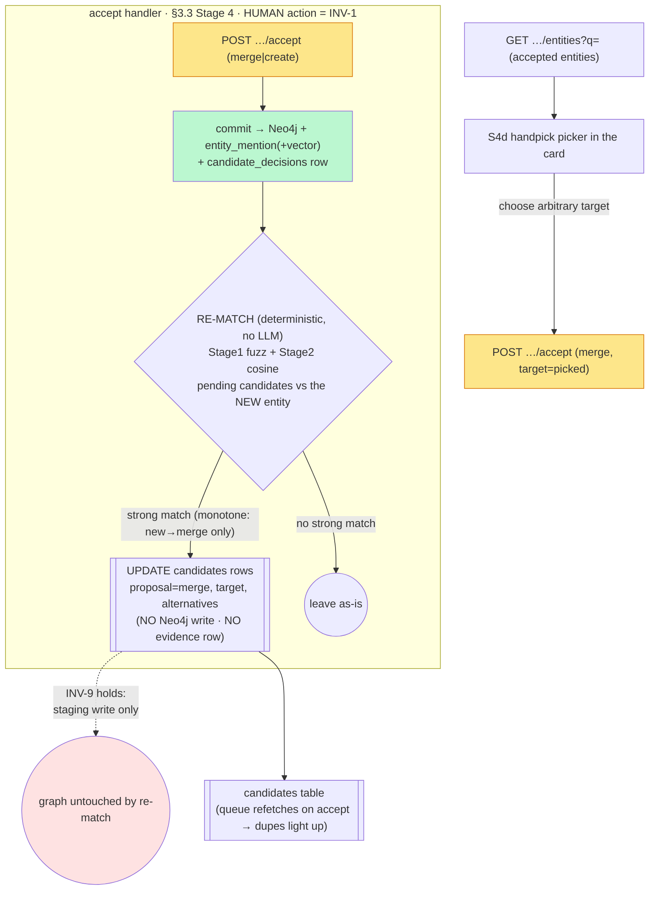

# M3.S4c — Intra-batch dedup: on-accept live re-match + manual handpick (step-0)

> **Status: accepted — register resolved (owner, 2026-06-15; authoritative home `docs/PLAN_SHORT.md`
> Decided / Blocked S25 + OQ-18). Build is test-first; spec §3.3 amended (on-accept re-match + manual
> handpick clarifications).** Outcomes: **slice S4c (live re-match, backend-only) + S4d (handpick)**;
> auto-flip on **Stage 1 `>85%` OR Stage 2 `cosine >0.85`** (owner chose +Stage-2 over the proposed
> Stage-1-only — see DM-S4c-3), **no live judge**; **monotone** re-proposal kept as the transition
> *guard* (not a new INV-10); handpick **project-scoped**; INV-1/INV-9 **hold** (re-match writes only
> the `candidates` staging table). Each register entry below now reads as the **Decision**; rejected
> options are marked history. The `[[candidate-lifecycle]]` self-loop + any INV-9 clarification fold in
> **on the S4c code, test-first**; ADR 0005 only if the owner deems the re-match-as-automated-staging-
> writer ADR-worthy at build.
>
> _Original framing of this pass:_ designs the work that makes a **single extraction pass** produce a clean (dedup'd) graph,
> closing the gap M3.S4a's "but what if" named and the 2026-06-15 browser walk made concrete (the
> sample story staged `Janek` ×3 as three NEW proposals → three Neo4j nodes the queue could not
> merge). It is **additive on top of S4a/S4b** — no invariant is retired; INV-1 + INV-9 must be
> shown to *hold*, not change. Authoritative contract: spec **§3.3** (the cascade + Stage-4 actions:
> *change merge target*), **§3.4 / §6.4** (graph scope + multi-tenancy seam, for the handpick search),
> **§9 M3** ("the graph is clean"). The vault references those; it never restates them. Disclosure:
> balanced (G≈20) — known terms linked, new term (`[[intra-batch-dedup]]`) defined.

**The one-sentence shape.** Today the §3.3 cascade matches each candidate **only** against the
graph as it stood at *extraction time*, so duplicates within one batch (and any duplicate a first
pass produces against an empty graph) stage as independent NEW proposals the review queue cannot
merge. S4c adds two complementary mechanisms: **(a) on-accept live re-match** — when the human
accepts an entity, re-run the *deterministic* matcher (Stage 1 RapidFuzz + Stage 2 cosine, reusing
the vectors already stored at stage time — **no LLM**) over the still-pending candidates so the
remaining duplicates flip `new → merge` and light up in the queue automatically; and **(b) manual
handpick** — let the human search *all* existing entities and pick any one as the merge target,
the safety net for the false negatives the matcher misses. Both write **only the Postgres
`candidates` staging table** (they change *suggestions*); neither writes Neo4j — the human still
commits every merge (INV-1, INV-9 intact).

**`intra-batch deduplication` (dedup wewnątrz partii)** — collapsing duplicate candidates produced
*within a single extraction run* (or against entities accepted *during the same review session*),
as opposed to *cross-pass* dedup (a later chapter's candidate matching an entity accepted earlier).
The cascade as built does only the latter; this is the former. See `[[intra-batch-dedup]]`.

---

## Layers (nine-layer pass · per-feature altitude — all nine ripple)

**1 · User / personas.** One persona, full trust (`[[project]]`). This is squarely a *usability*
feature: it removes the most confusing thing the author hits on their very first extraction (a graph
full of duplicate Janeks they can't merge). (a) live re-match is **invisible plumbing** — it needs
**no new UI** (the S4b card already renders a MERGE proposal + alternatives + the `M`/accept-merge
controls; re-match just updates the staged rows the queue refetches). (b) handpick **does** add UI:
a search/picker in the review card. The author stays the only writer of the graph.

**2 · Business.** This is what closes M3's own success criterion — §9 M3 *"dedupe works… the graph
is clean."* As the browser walk proved, S4a+S4b alone leave a single-story first pass *dirty*; S4c is
the difference between "the cascade exists" and "the cascade delivers a clean graph from the first
run." Portfolio-visible payoff. Cost: it makes the accept path do more work and adds the project's
**first automated writer of the staging store post-staging** (see Layer 6 / INV note).

**3 · Domain — ubiquitous language.** New verbs on the seam: **re-match** (re-run the deterministic
matcher over pending candidates against a freshly-accepted entity, updating their proposals) and
**handpick** (the human selects an arbitrary existing entity as the merge target, beyond the
cascade's top-3). A useful named property arrives: **monotone refinement** — re-match only *upgrades*
a proposal (`new → merge`), never downgrades or re-points one, so it can never yank away context the
author is mid-decision on (defined at DM-S4c-4).

**4 · Data — entities, ownership, keys.** No new table. Both mechanisms operate on the existing
**`candidates`** store (S4a):
- **Live re-match** *updates* pending rows in place: `proposal` (`new → merge`), `target_entity_id`,
  `alternatives` (JSONB), and the provenance trio (`stage_reached`/`confidence`/`reasoning`). The
  inputs already exist on the row — `context_embedding vector(768)` (stage-time) — and on the
  accepted side — the accepted entity's `entity_mention` vector + its `canonical_name`/aliases
  (Neo4j). So re-match reads what S4a/S2 already persist; it writes only staging columns.
- **Handpick** needs a **read endpoint** over **accepted entities** (id + `canonical_name` + type),
  sourced from Neo4j via the existing `accepted_entity_reader` (the same accepted snapshot the
  cascade matches against). No new write; accept-merge already takes a `target_entity_id`.
- The **`target_entity_id`** soft cross-store key (→ a Neo4j id, no FK, the OQ-1 seam) is reused
  unchanged — re-match and handpick both just *set* it on a staged row.

**5 · Behavior — the lifecycle gains a self-loop.** `[[candidate-lifecycle]]` gains one transition:
**`review-queued → review-queued` (re-proposal)**. Guard: *an accept grew the accepted set AND a
pending candidate now strong-matches the new entity*. Effect: update the proposal columns **only** —
**no Neo4j write, no `candidate_decisions` evidence row** (a suggestion refresh is not a terminal
human decision, so it triggers neither INV-9's graph-write nor INV-3's evidence effect). The
transition must be **monotone** (DM-S4c-4) so it is idempotent: re-running it on an unchanged
accepted set is a no-op (`[[idempotency]]`).

**6 · Errors — fail-open vs fail-closed.** Re-match is deterministic and local, so its own failure
modes are narrow, but the posture is the same [[fail-closed]] rule: **if re-match cannot run (a
pgvector hiccup), the accept itself must still succeed** — re-match is a *best-effort enhancement of
suggestions*, never a gate on the human's commit. A failed re-match leaves proposals as they were
(stale-but-safe: still a valid NEW the human can merge by hand) and must not roll back the accept.
Handpick search failure → the picker degrades to the cascade's top-3 (still usable). Neither may ever
*auto-commit* — they only change what the human is offered.

**7 · Security.** No new egress, no LLM (re-match is Stage 1/2 only — DM-S4c-3 forbids a live Stage-3
judge). The handpick search endpoint returns **only the author's own** accepted entities; its scope
(story / project / cross-project) is the one place a multi-tenancy question bites — **DM-S4c-5**,
tied to §6.4 and the deferred §3.4 graph scoping. No prompt path, so [[prompt-injection]] is n/a here.

**8 · Compliance / Audit.** Re-match writes **no** evidence row — and that is the correct call,
named so a reviewer doesn't read it as a gap: an INV-3 evidence row records a *human terminal
decision* (accept/reject); re-match changes a *machine suggestion* on a still-pending candidate, with
no graph effect to reverse. The audit trail that matters — the eventual accept-as-merge — still
writes its `candidate_decisions` row at commit time, and that row already captures *the proposal that
was shown*, which now correctly reflects the re-matched suggestion. So the evidence trail gets
*better*, not thinner.

**9 · Operations.** Cost per accept: re-match adds, over the still-pending candidates, a Stage-1
RapidFuzz pass (local, microseconds) and at most a Stage-2 cosine compare against the one new entity's
mention vectors (local, the vectors are in hand). Bounded by `O(pending)` per accept if incremental
(DM-S4c-2). Handpick adds one indexed name-search query per keystroke-debounce. Both observable via
the existing counts; no new alerting (single-user-local, n/a).

---

## Stations (enforcement-lifecycle checklist)

| Station | Present after S4c? | Where / gap |
|---|---|---|
| **Identity** | n/a — single local user | localhost binding |
| **Intent** | ✅ | accept (triggers re-match) + handpick-merge are explicit human acts |
| **Policy** | ✅ | re-match reuses the §3.3 thresholds in `config.py`; auto-flip = **Stage 1 `>85%` OR Stage 2 `cosine >0.85`**, no live judge (DM-S4c-3, resolved) |
| **Decision** | ✅ | re-match only changes the *default* suggestion; the human still decides (INV-1) |
| **Access** | ⚠ **the handpick scope** | the entity-search endpoint's tenancy scope (story/project/cross) — **DM-S4c-5** (§6.4 seam) |
| **Monitoring** | ✅ | re-match/handpick counts observable; no LLM ledger rows (no Stage-3) |
| **Evidence** | ✅ (by design) | re-match writes **none** (suggestion change); the accept it enables still writes `candidate_decisions` (Layer 8) |
| **Expiry** | n/a — no new durable state | re-match mutates existing `candidates` rows; retention unchanged (DM-S4a-5) |
| **Review** | ✅ | the queue *is* the review surface; S4c only enriches its proposals |

Weak stations (**Policy auto-flip strength, Access handpick scope**) are mirrored to
`open-questions.md` (OQ-18).

---

## Data flow

Live re-match fires **inside the accept handler**, after the Neo4j commit, against the **now-larger**
accepted set; it touches only the staging table. Handpick is a separate read path feeding the card.

The only **green** (graph-writing) edge is still the human accept; **re-match's `UPDATE` never
reaches the graph** (red node) — that visual is INV-9 holding under a new automated writer.

---

## State & invariants

### `[[candidate-lifecycle]]` → add the `review-queued → review-queued` self-loop
A new transition: **re-proposal**. Guard: *a just-accepted entity strong-matches a pending
candidate* (DM-S4c-3 defines "strong"). Effect: update `proposal`/`target_entity_id`/`alternatives`
in the `candidates` table — **no graph write, no evidence row**. It must be drawn **monotone**
(DM-S4c-4): only `new-proposed-flavored → merge-proposed-flavored` *within* `review-queued`, never
the reverse, never re-pointing an existing merge, never touching a terminal (`merged`/`created`/
`rejected`) row. Fold into the state machine **only on acceptance**.

### Invariants — none retired, two to *show holding* (+ one to consider)
- **INV-1 holds** — re-match changes the *default suggestion*; the human still commits every merge.
- **INV-9 holds — and this is the subtle part.** S4c introduces the project's **first automated
  writer that mutates a staged proposal after staging**. INV-9 is "*no automated stage writes the
  **graph***" — re-match writes the **Postgres `candidates`** table, never Neo4j, so INV-9 is intact.
  Name this explicitly so a reviewer doesn't misread re-match as an INV-9 violation: the line INV-9
  draws is *graph vs staging*, and re-match stays on the staging side. (Worth a one-line clarification
  in `invariants.md` INV-9 on acceptance.)
- **INV-10 — not minted (owner, 2026-06-15).** The candidate property *"automated re-proposal is
  monotone and never auto-commits"* is local to the one re-proposal transition, so it lives as that
  transition's **guard** in `[[candidate-lifecycle]]`, not as a system-wide invariant.

---

## Decision register (✅ RESOLVED owner 2026-06-15 — authoritative in `docs/PLAN_SHORT.md` Decided/Blocked S25; mirrored to `open-questions.md` OQ-18)

> Each entry's **Decision** line states the outcome; Context/Options are kept for the record.
> DM-S4c-3 was **overridden** (owner chose +Stage-2 over my Stage-1-only) — stated explicitly.

### DM-S4c-1 — Slice S4c (live re-match) + S4d (manual handpick)?
- **Context.** The requirement bundles two mechanisms of different size. **Live re-match is
  backend-only** — the S4b card already renders merge proposals, so re-match "just works" through the
  existing UI once the staged rows update. **Handpick needs both** a new backend entity-search
  endpoint *and* new frontend picker UI.
- **Options.** (a) two slices — **S4c = live re-match** (backend-only, the high-value common case),
  **S4d = manual handpick** (search endpoint + picker); (b) one combined session; (c) re-match only,
  defer handpick indefinitely.
- **Decision (owner, 2026-06-15) — (a), as proposed.** Split **S4c** (live re-match, backend-only) +
  **S4d** (handpick). Clean seam (backend-only vs full-stack); re-match alone makes the common case
  ("Janek ×3") clean. *Rejected:* (b) one combined session (too big); (c) re-match-only (leaves the
  false-negative gap the owner wants closed).

### DM-S4c-2 — Re-match trigger point & scope
- **Context.** *Where* re-match runs and *how much* it recomputes per accept.
- **Options.** Trigger: (i) **synchronously inside the accept handler** after the Neo4j commit; (ii) a
  separate endpoint the frontend calls post-accept; (iii) lazily recompute on each queue `GET`.
  Scope: **incremental** (re-match pending vs *just the newly-accepted entity* — `O(pending)`) vs
  **full** (re-match every pending candidate vs the *whole* accepted set each time — simpler, `O(pending
  × accepted)`).
- **Decision (owner, 2026-06-15) — (i) synchronous-in-accept + incremental, as proposed.** The queue
  already refetches on accept, so updated proposals appear with no extra round-trip; incremental
  (`O(pending)` vs just the new entity) avoids wasted full recompute. *Rejected:* (ii) separate endpoint
  (a round-trip for no gain), (iii) lazy-on-GET (recomputes on reads that changed nothing).
- **`verify-at-build`:** the accepted entity's mention vectors are cheaply in hand at accept time (they
  are written on the same accept); the small added accept latency is acceptable at single-user scale.

### DM-S4c-3 — Re-match strength & auto-flip policy
- **Context.** How confident must a re-match be to *flip* a pending candidate `new → merge` (vs merely
  refreshing its `alternatives`)? And does v1 ever re-run the Stage-3 LLM judge live?
- **Options.** (a) **Stage-1-only auto-flip:** flip `new → merge` only on a strong Stage-1 fuzz match
  (the `>85%` auto-merge band); a Stage-2 cosine hit only *adds to `alternatives`*, never flips. (b)
  Stage-1 **or** Stage-2 auto-flip (cosine `>0.85` also flips). (c) re-run the full cascade incl. the
  **Stage-3 judge** live on each accept.
- **Decision (owner, 2026-06-15) — (b), overriding my proposed (a).** Auto-flip `new → merge` on a
  strong **Stage-1 fuzz (`>85%`) OR a Stage-2 cosine (`>0.85`)** — the owner chose the wider net to
  catch semantic matches a name-only signal misses (a paraphrased context, a translated name). **(c)
  stays rejected** — no live Stage-3 judge on accept (latency + token cost + the LLM back in the human's
  commit loop, against [[prefer-deterministic]]). _My original (a) Stage-1-only is history:_ it was the
  conservative default; the owner accepted the slightly fuzzier Stage-2 signal as worth the recall,
  noting it is still **only a proposal** the human confirms (fail-closed holds either way).
- **Resolved:** sub-threshold matches still only enrich `alternatives` (never flip); the auto-flip set
  is exactly {Stage-1 `>85%`, Stage-2 `cosine >0.85`}.

### DM-S4c-4 — Monotone re-proposal (the safety property)
- **Context.** Re-match runs repeatedly as the author accepts. If it could *downgrade* (`merge → new`)
  or *re-point* an existing merge, it would change suggestions out from under a human mid-review, and
  re-runs could thrash.
- **Options.** (a) **monotone** — re-match only ever upgrades `new → merge` on a pending candidate;
  never downgrades, never re-points an existing merge proposal, never touches a terminal row; (b)
  free re-evaluation — recompute the best proposal each time, allowing any change.
- **Decision (owner, 2026-06-15) — (a) monotone, as proposed; kept as the transition *guard*, not a
  new invariant.** Monotonicity makes re-match **idempotent** (no-op on an unchanged accepted set —
  `[[idempotency]]`), keeps the queue stable under the author's eyes, and is the honest scope. A human
  who disagrees with a flipped proposal still has `N` (force new) and `M`/handpick. *Rejected:* (b) free
  re-evaluation (thrashes, surprises the human). **INV-10 not minted** — the property is local to the
  one re-proposal transition, so it lives as that transition's guard in `[[candidate-lifecycle]]`, not as
  a system-wide invariant.

### DM-S4c-5 — Handpick search scope (the multi-tenancy seam)
- **Context.** Handpick searches "all existing entities" — but the graph is **project-keyed** (§6.4;
  the §3.4 story-vs-project scoping is already a deferred cross-cutting). *Which* entities can the
  author merge into?
- **Options.** (a) **project-scoped** — search the current story's project (matches today's graph key
  and the accepted snapshot the cascade already uses); (b) story-scoped (narrower; but recurring
  characters are the whole point, so likely too narrow); (c) cross-project / world-scoped (richest;
  but crosses the §6.4 tenancy boundary and needs the world-graph the spec defers to M4).
- **Decision (owner, 2026-06-15) — (a) project-scoped, as proposed.** Matches the data the cascade
  already matches against and the graph's tenancy key; covers the real use case (dedup within a project).
  *Rejected:* (b) story-scoped (too narrow — recurring characters are the point); (c) cross-project/world
  (crosses the §6.4 tenancy boundary, needs the M4 world-graph). This **supersedes** the deferred
  "arbitrary-entity search" cross-cutting item (now `docs/PLAN_SHORT.md` M3.S4d) and reconciles with §3.4
  scoping when that lands.

### DM-S4c-6 — Handpick search endpoint & source
- **Context.** The picker needs a list of accepted entities (id + name + type) to search.
- **Options.** (a) a new **`GET /stories/{id}/entities?q=`** (project-scoped per DM-S4c-5) reading
  **Neo4j accepted entities** via the existing `accepted_entity_reader`; (b) read from Postgres
  (`entity_mentions` + a names projection); (c) reuse the graph endpoint client-side and filter in the
  browser.
- **Decision (owner, 2026-06-15) — (a), as proposed.** A new `GET /stories/{id}/entities?q=`
  (project-scoped) over Neo4j accepted entities via `accepted_entity_reader`. Neo4j is the identity +
  `canonical_name`/alias home; the reader exists; server-side `q=` keeps the payload small. *Rejected:*
  (c) ship-whole-graph-and-filter (wasteful, couples to the viewer shape); (b) Postgres name source
  (duplicates the names home).
- **`verify-at-build` (S4d):** match semantics — prefer the **same RapidFuzz** the matcher uses, so the
  human's "search" is consistent with the machine's "match"; a result cap/pagination; confirm the reader
  exposes names + aliases for search.

---

## But what if (edge cases, races, partial failures)

- **The author accepts `Janek #2` as NEW (override) instead of merging.** Now two `Janek` nodes
  exist. Re-match on that accept flips `Janek #3` to `merge → ?` — **which Janek?** The best-scoring
  one; on a fuzz tie, deterministic (first by id). The `alternatives` list shows *both* Janeks so the
  human can `M`/handpick the intended one. Honest behaviour, not a bug — name it.
- **Re-match flips a candidate the human is mid-decision on.** The queue refetches on accept, so a
  proposal can change under the author's cursor. **Monotonicity (DM-S4c-4) is the mitigation** — it
  only *adds* a merge option (the card gains a target + `alternatives`), never removes context; the
  card stays in place (S4b should not auto-reorder/auto-move selection on refetch — a small frontend
  contract worth stating for S4c even though S4c is backend).
- **False-positive re-match.** Two genuinely different "Bronek"s; accepting one flips the other to
  `merge → Bronek`. It is **only a proposal** — `N` (force new) and reject remain one keystroke away;
  [[fail-closed]] holds (the machine never commits). The strong-match policy (DM-S4c-3 — Stage-1 fuzz
  `>85%` OR Stage-2 cosine `>0.85`) keeps these to high-confidence collisions, which is exactly where a
  nudge helps more than it hurts; the human's `N`/reject is always one key away.
- **Idempotency / thrash.** Two accepts in quick succession, or a re-run of re-match, must not flip a
  proposal back and forth. Monotone + deterministic ⇒ a no-op on an unchanged accepted set
  (`[[idempotency]]`). `verify-at-build` with a "re-match twice → identical rows" test.
- **Re-match must not resurface a rejected candidate.** It operates on **`review-queued`** rows only;
  `rejected`/terminal rows are untouched (DM-rej's suppression stands). State it in the guard.
- **Handpick targets a stale entity** (merged-away/deleted between search and accept) — the existing
  S4b accept-merge **409 stale-merge-target** path already covers it ([[toctou]]); the picker surfaces
  the 409 like any other change-target.
- **Handpick-merge orphans relations.** Accept-merge (and now handpick-merge) must **re-point** the
  candidate's staged relations to the surviving entity — but the **relation edge-write itself is the
  deferred cross-cutting** (past S4b). So handpick-merge inherits that dependency: until relation-write
  lands, a merge folds the *entity* but relations still aren't written. Flag the ordering, don't
  silently couple.
- **Performance at scale.** A several-hundred-candidate story: incremental re-match is `O(pending)`
  per accept (one new entity vs the shrinking pending set) — bounded and local. Full-recompute
  (rejected in DM-S4c-2) would be `O(pending × accepted)`. Note the chosen bound in the build.

---

## Gaps for the product owner — ✅ all resolved (owner, 2026-06-15; `docs/PLAN_SHORT.md` Decided/Blocked S25)

1. ~~**DM-S4c-1 — the slice.**~~ ✅ split **S4c** (live re-match, backend-only) + **S4d** (handpick).
2. ~~**DM-S4c-3 — auto-flip strength.**~~ ✅ **Stage 1 `>85%` OR Stage 2 `cosine >0.85`** (owner chose
   +Stage-2 over my Stage-1-only); no live Stage-3 judge.
3. ~~**DM-S4c-5 — handpick scope.**~~ ✅ **project-scoped**; supersedes the deferred "arbitrary-entity
   search" cross-cutting (now `docs/PLAN_SHORT.md` M3.S4d).
4. **Relation re-point dependency — *still live*.** Accept-merge *and* handpick-merge need the
   **deferred relation-write** backend to avoid orphaning relations on a merge. Owner kept relation-write
   **deferred** for now, but S4c/S4d make merges *more frequent*, so its priority is **raised** (carried
   in `docs/PLAN_SHORT.md` cross-cutting) — sequence it soon after S4c/S4d.
5. ~~**Spec §3.3 amendment.**~~ ✅ **landed** (owner+main-agent, stop-and-amend, 2026-06-15): §3.3 gained
   the on-accept re-match + manual-handpick clarifications + the deterministic-only cost note.
6. ~~**INV-10?**~~ ✅ **not minted** — kept as the re-proposal transition's guard (owner).

---

## Hand-off

- **First code is a FAILING TEST** witnessing the live-re-match flip: *"with `Janek` accepted, a
  re-POST/accept re-matches the still-pending `Janek` candidates and their staged `proposal` flips
  `new → merge` targeting the accepted entity — with **zero** new Neo4j writes from re-match itself."*
  This is the S4c analogue of S4a's flip test.
- **Suggested within-session order (S4c, backend-only):** (i) the re-match service (reuse
  `matching_agent.stage1/stage2` + the stored `context_embedding` + the accepted entity's mention
  vectors; **monotone**, auto-flip on Stage-1 `>85%` OR Stage-2 `cosine >0.85` per DM-S4c-3/4) + its
  unit tests; (ii) wire it into the
  accept handler *after* the Neo4j/mention/evidence writes, fail-closed (a re-match failure never rolls
  back the accept) + an integration test ("accept Janek → pending Janeks flip to merge, graph
  unchanged by re-match"); (iii) the small S4b frontend contract (do not auto-reorder/auto-move
  selection when the queue refetches mid-review). No new migration; no new agent logic — re-match is
  *reuse* of the deterministic matcher.
- **S4d (separate slice):** the `GET …/entities?q=` endpoint (project-scoped, via `accepted_entity_reader`)
  + the handpick picker in the review card + tests; reconcile with §3.4 scoping.
- **Decisions:** DM-S4c-1..6 are **✅ RESOLVED** (register above; `docs/PLAN_SHORT.md` Decided/Blocked
  S25; OQ-18 struck). Spec §3.3 **amended** + `docs/PLAN_SHORT.md` reconciled (S4c/S4d in the feature
  order; the arbitrary-search cross-cutting folded into S4d; relation-write priority raised). **Still to
  do with the S4c *code* (test-first):** fold the `[[candidate-lifecycle]]` `review-queued → review-queued`
  self-loop (monotone guard) + the one-line INV-9 graph-vs-staging clarification into the vault, and write
  **ADR 0005** *if* the owner deems the re-match-as-automated-staging-writer ADR-worthy at build — the
  fold is witnessed by the failing re-match flip test, not asserted ahead of it. _(Historical hand-off
  note, pre-resolution — amend **spec §3.3** + reconcile `docs/PLAN_SHORT.md`, now done:)_ add
  M3.S4c/S4d to the feature order; fold the "arbitrary-entity search" cross-cutting into S4d).
- **Draft spec §3.3 amendment wording (for the owner+main-agent's stop-and-amend step, not the
  architect's to apply):** add to the Stage-4 description that *(1)* the cascade matches against the
  **accepted** graph and is **re-evaluated on each human accept** (intra-batch dedup — a just-accepted
  entity becomes a merge target for still-pending candidates, deterministically, without re-running the
  judge), and *(2)* the "change merge target" action includes **handpicking any existing entity**, not
  only the cascade's top-3.
