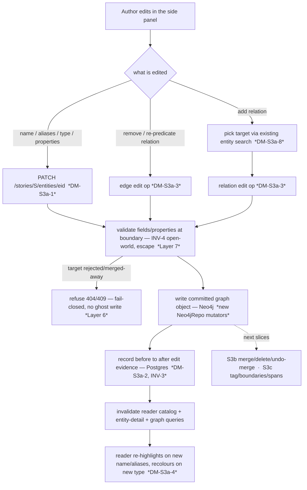

# M4.S3a — the side panel becomes editable (entity & relation editing)

> **Status: ACCEPTED — register RESOLVED with the owner (2026-06-19).** Step-0 forward design for the
> **first M4 slice that *writes* the graph**. Owner-confirmed scope: from the read-only entity side
> panel ([[m4-side-panel]], shipped), make the inspected entity **editable** — its scalar fields
> (`canonical_name`, `aliases`, `type`) and `properties`, and **add / re-predicate / remove** relations
> between two already-accepted entities. The original Context/Options reasoning is kept intact below
> (public-portfolio history — append the resolution, don't delete the thinking). Authoritative home for
> the resolution: `docs/PLAN_SHORT.md` Decided. Mirrored to [[open-questions]] OQ-23.
>
> **Resolutions (owner, 2026-06-19 — all four central calls = my recommended option, the rest = my leans, no objection):**
> - **DM-S3a-1 → reword INV-9, new named edit handlers.** Build explicit edit endpoints
>   (`PATCH …/entities/{eid}` + relation edit ops, a [[backend-for-frontend]] *write* surface); **reword
>   INV-9** "exactly two writers" → "only human-reached handlers — accept, decide, edit" (property
>   unchanged, enumeration grows — the ADR-0005 broadening precedent). *Rejected:* mint INV-10; reuse the
>   review services.
> - **DM-S3a-2 → keep a before→after edit-evidence log** (the graph-edit twin of `candidate_decisions`):
>   real undo (INV-3) + data-flywheel substrate. *Rejected:* no-record / re-type-to-undo (an INV-3 narrowing).
> - **DM-S3a-3 → route a manual add through the existing decide path** (`RelationReviewService` stays the
>   sole edge-writer; manual edge gets an audit row). Re-predicate = **delete + re-add** (edge id =
>   `uuid5(subject_id, predicate, object_id)`); **warn** on a MERGE-collision dedup; **allow** manual
>   self-loops. *Rejected:* direct `create_relation`/`delete_relation` from the edit service.
> - **DM-S3a-4 → invalidate the reader/entity-detail/graph queries on edit** — a corrected name
>   re-highlights for free (render-time search, no span migration).
> - **DM-S3a-5 → typed `properties` values** (number/bool/string/nested preserved), backend-validated,
>   keys free (INV-4). *Rejected:* string-only values.
> - **DM-S3a-6 → last-write-wins at PoC** (the [[lost-update]] anomaly named + accepted for one local author).
> - **DM-S3a-7 → split** **M4.S3a-be** (mutators + edit service + evidence + endpoints) / **M4.S3a-fe**
>   (panel edit UI + picker + hooks), the S2a/S2b rhythm. *Rejected:* one slice.
> - **DM-S3a-8 → reuse `search_entities_route`** as the relation-target picker (confirm-only).

**The slice plan it sits in (owner-confirmed, this session).** "Manual correction in the reader" was
sliced by **write-risk**, lowest first:

- **S3a (this proposal) — edit what's already accepted.** Entity scalar-field + `properties` edits and
  relation add/edit/remove **between existing accepted entities**. No merge, no re-point, no new text
  spans. The smallest first crossing of the human-gate invariants into *write* territory.
- **S3b (next) — graph mutations that need downstream cleanup.** Entity↔entity **merge** (the
  **DM-Rel-5** written-edge re-point + `entity_mentions.entity_id` re-point + **DM-Rel-6** idempotency),
  whole-entity **delete**, and **undo-merge**. Explicitly **out of S3a** — noted at the seam only.
- **S3c (later) — work the text.** Manual **tag** from a selection, **un-tag**, **change boundaries** —
  which reopens the **DM-IH-1** span-storage decision ([[m4-inline-highlights]]) the read slices dodged.
  Out of S3a.
- General **split** of a conflated entity and **relation temporal/source qualifiers** are post-PoC
  (already in `docs/BACKLOG.md`).

**Why this is the centre of gravity.** Everything M4 has shipped so far is a **read-only projection**
([[m4-inline-highlights]], [[m4-side-panel]]) — the panel's whole station fingerprint is `n/a` because
"a read view cannot violate the human-gate invariants." S3a flips that: it is the **first reader→graph
*mutation* path**. So the design weight is not the UI affordances — it is *what new graph-writers
exist, how each edit stays reversible with evidence ([[invariants]] INV-3), and how the named
"only-N-writers" contract (INV-9) is reworded when editing adds writers number three and four*.

**The as-built starting point (read before the register).** The graph today has **exactly two
writers** — `CandidateReviewService.accept` (nodes) and `RelationReviewService.decide` (edges), each
reached only from an explicit human action and each leaving an evidence row ([[candidate-lifecycle]] /
[[relation-lifecycle]], INV-1/INV-9). `Neo4jRepo` exposes **no mutation method for an already-committed
entity or edge**: `create_entity`, `add_alias`, `create_relation` (idempotent `MERGE` on
`relation_edge_id = uuid5(subject_id, predicate, object_id)`), the `get_*` reads, and a whole-project
`delete_project_graph` — but **no** `update`/`set`/`remove` of a node's fields/properties and **no**
`update`/`delete` of a single edge. So S3a's backend is *genuinely new write surface*, not a tweak to
the BFF read endpoint M4.S2a added.

---

## Layers (the nine-layer pass)

A **per-feature** altitude pass (all nine layers ripple); density is **Balanced** — known terms
`[[wikilinked]]`, only genuinely new ones defined inline. I name where the altitude is loud.

1. **User / personas.** One persona, full trust, local ([[project]] L1). No new [[trust-boundary]] —
   the author edits their own graph, no egress, no LLM. The payoff is *correction at the point of
   reading*: the reader is where mistakes actually surface (a paraphrased name that won't highlight, a
   wrong type, a missing or spurious relation — the Session-33 "reader is a correction surface" thread,
   `docs/BACKLOG.md`), so the fix belongs there. This is the slice the read-only panel was explicitly
   built *under*.
2. **Business.** Both drivers ([[project]] L2). The authoring driver is direct: a clean baseline graph
   needs hand-correction of what extraction got wrong. The portfolio driver is *higher-stakes than a
   read view* — this is the first place a reviewer sees the human-gate invariants tested by a **write**,
   so getting INV-1/3/9 visibly right here is the set-piece.
3. **Domain.** No new persisted *nouns* — **Entity**, **Relation**, **Mention**, **Property** all
   exist. New *verbs*: **edit** an entity (its scalar fields + `properties`), **add / re-predicate /
   remove** a relation. One latent noun this slice forces into existence: an **edit record** (the
   durable trace of a correction — see DM-S3a-2 / Layer 8). The relation verbs live in the ubiquitous
   language of the **edge gate** already drawn ([[relation-lifecycle]]); S3a extends that gate past its
   `written` terminal.
4. **Data.** **The first writes to committed graph state.** Entity field/property edits mutate the
   Neo4j node (`GraphEntity.canonical_name / aliases / type / properties`); relation edits mutate edges
   keyed by `relation_edge_id`. The **ownership seam** ([[overview]] L4) recurs: an entity edit is a
   Neo4j write, but its *evidence* (DM-S3a-2) and any provenance live in Postgres — a cross-store write,
   ordered so the evidence/last-write rule keeps it retryable ([[idempotency]], the candidate/relation
   gates' pattern). **Schema reality to confirm at build:** `properties` is a free JSON dict (§3.2,
   [[open-world-ontology]]) — editing must keep it open (INV-4), never coerce to a fixed key set.
5. **Behavior.** **This slice adds a state machine where the read slices had none.** The committed
   entity node and the `written` edge stop being immutable: each gains a **human `edit` self-transition**
   (and the edge a `written → removed` transition). This is *not* re-opening [[candidate-lifecycle]]'s
   terminal `created`/`merged` (those are about the *candidate proposal* row, which stays terminal) —
   it is a **new lifecycle over the committed graph object**. See **State & invariants**.
6. **Errors.** [[fail-closed]] again, now on the *write* side. Editing a target that was rejected /
   merged-away in another tab is a **dangling reference** ([[referential-integrity]]) — the endpoint
   must refuse (404/409), never write to a ghost. A half-completed cross-store edit (Neo4j written,
   Postgres evidence not) must leave a **retryable** state, never a silently lost correction. "Refuse,
   don't half-write."
7. **Security.** Author's own data, no egress (no LLM in S3a — name it so INV-2/INV-5 aren't hunted
   for). The live concern is **stored-XSS over the author's own input**: edited `canonical_name`,
   `aliases`, and `properties` values render back into the reader/panel — they must stay React-escaped
   (no `dangerouslySetInnerHTML`), the same flag M4.S1/S2 carried, now with *attacker-and-victim are the
   same user* but a portfolio reader will look. Backend strict-validates every edited field at the
   boundary (`backend/src/story_forge/AGENTS.md`: never accept input without validation).
8. **Compliance / Audit.** **This is the station the read slices left `n/a` and S3a must fill.** Every
   edit is an automatic decision the human must be able to **undo** (INV-3), which needs a durable
   **edit record** — the *effect* on each transition (Layer 5). The existing INV-3 home is the
   append-only `candidate_decisions` table — but that is *candidate-keyed* (a decision about a staged
   candidate), not "entity E's `type` changed from X to Y". So S3a must decide the edit-evidence shape
   (DM-S3a-2): a graph-edit log capturing **before→after**, the substrate both for *undo* and for the
   correction-as-training-signal data flywheel (`docs/PLAN_LONG.md`). The §4.2 `edit_history` is
   *text-edit*-shaped and deferred — a graph edit is a different record.
9. **Operations.** No new infra, **no LLM call ⇒ no `llm_calls` row, no cost, INV-5 simply doesn't
   apply** (named, not blank). One ops note: edits add write load, trivial for one author; the
   read-view consistency window (a stale tab) is the same benign single-user case [[m4-side-panel]]
   documented, now on the write side (DM-S3a-6).

---

## Stations (the enforcement-lifecycle checklist)

S3a is where the panel's all-`n/a` read fingerprint flips: **Intent / Decision / Evidence / Review go
live on a write.** Each empty station named, not blank (house rule).

| Station | State | Note |
|---|---|---|
| **Identity** | n/a | single local user, no auth ([[overview]]) |
| **Intent** | ✅ | the author explicitly invokes an edit (clicks "edit", types a value, confirms) — the human-gate gesture, now a *write* |
| **Policy** | ✅ | **only accepted-graph entities/edges are editable** — never a staged candidate or a held relation (the read-side echo of INV-1, now enforced on a write path) |
| **Decision** | ✅ deterministic | the human *types the new value* — no model, no proposal; the edit is pure human data entry ([[prefer-deterministic]] in the strongest form — there is nothing to confirm-or-prune, the human authors it) |
| **Access** | n/a | localhost binding is the only gate |
| **Monitoring** | n/a | no LLM call, nothing to meter (INV-5 n/a) |
| **Evidence** | ⚠ **the open station** | **DM-S3a-2** — an edit must leave a durable before→after record (INV-3 undo). This is the station S3a exists to fill; it is *not yet decided*. |
| **Expiry** | ⚠ | the edit-record's retention — the same **none-at-PoC** posture as `candidate_decisions` / `staged_relations` (OQ-4); name it so it isn't a blind spot. |
| **Review** | ✅ | the edit **is** the human review acting on the M3 cascade's output — no separate approval needed (the human is the reviewer). |

The **⚠ Evidence** station is the centre of the register. A write with no before-image cannot satisfy
INV-3's "undo an edit."

---

## Data flow

The author, reading, clicks a highlight → the (already-shipped) side panel opens. S3a adds **edit
affordances** to that panel. An edit is a deterministic human-authored mutation that (1) validates at
the boundary, (2) writes the committed graph object, (3) records before→after evidence (DM-S3a-2), and
(4) invalidates the read views so the reader's highlights/colours and the panel reflect the change. The
diagram shows my lean (new edit endpoints + an edit service that is a named graph-writer; relation-add
routed to keep `RelationReviewService` the sole edge-writer — DM-S3a-1/3).

The dashed (M) edge is the slice boundary. The **`I → J` order matters**: the durable evidence is the
**last** write (the candidate/relation gates' pattern), so a crash after the graph write but before the
evidence leaves a retryable state, not a lost correction.

---

## State & invariants

**A new lifecycle: the committed graph object becomes editable.** The read slices added no state machine
because they persisted nothing. S3a adds the first *post-commit mutation*. Proposed additions (folded
into the state-machine notes / `invariants.md` **only on acceptance** — proposed here, not yet written):

- **Entity (committed node).** Gains a human-only `edit` self-transition: `committed → committed` on
  *edit fields/properties*, guard = a human action (INV-1), effect = the Neo4j write **plus** the
  before→after edit record (INV-3, DM-S3a-2). Distinct from [[candidate-lifecycle]] — that machine's
  `created`/`merged` terminals describe the *candidate proposal*; the **graph node** is a different
  object, and S3a makes *it* mutable while the candidate decision row stays terminal. (Worth drawing as
  a short "committed-entity" note on acceptance so a future reader doesn't think terminal candidate
  states re-opened.)
- **Relation (committed edge — extends [[relation-lifecycle]]).** Today `written` is terminal. S3a adds:
  `written → removed` (human delete; effect = edge delete + evidence) and a **re-predicate** that is
  *not* an in-place mutation — because `relation_edge_id = uuid5(subject_id, predicate, object_id)`,
  changing the predicate is a **different edge id**, i.e. a *remove-old + add-new* (DM-S3a-3). And a new
  **origin**: a *manually-added* edge enters at `written` **without** passing through `staged /
  committable` — it has no surface-form `staged_relations` provenance. How that origin is modelled is
  DM-S3a-3 (route it through the existing decide path to keep one edge-writer, or write directly).

**Invariant pressure:**

- **INV-1 (human gate) — upheld, broadened to *edits*.** Every edit is human-initiated; no automated
  stage edits the graph. A future "auto-apply a suggested correction" would violate this, not optimise
  it. (Same broadening shape as the relation slice broadened INV-1 to edges — ADR 0005.)
- **INV-3 (reversible + evidence) — this is the invariant S3a must actively satisfy** (DM-S3a-2). The
  read slices were `n/a`; here it is the load-bearing one. An edit without a before-image is a
  one-way door — a violation.
- **INV-9 (only N human-reached handlers write the graph) — reworded, not minted-against.** INV-9
  currently says the graph is written by **"exactly two"** human-decision paths. S3a adds edit
  handlers (writer three, and four if relation-edit is a separate service). The honest fix follows the
  relation-write precedent (*broaden the wording, don't mint INV-10*): INV-9 becomes "the graph is
  written **only by human-reached handlers** — today: accept (nodes), decide (edges), and the S3a edit
  handlers — never by an automated stage." The *property* INV-9 guards (no automated graph write) is
  **unchanged**; only its enumeration grows. This rewording is DM-S3a-1's invariant consequence and
  lands in `invariants.md` **on acceptance**, test-first (a grep-able "writers are reachable only from a
  human action" check, the INV-9 enforcement style).
- **INV-4 (open-world types) — upheld.** `type` and `properties`-key editing must keep `type` a free
  string and `properties` a free dict — never introduce a closed enum or a fixed key schema (DM-S3a-5).
- **INV-2 / INV-5 — n/a (no egress, no LLM).** Named so a reviewer doesn't hunt for a consent prompt or
  a `llm_calls` row.

---

## Decision register (OPEN — DM-S3a-1..8)

> Each entry: **Context / Options / My proposal / Open.** I *propose*; the owner *resolves*. Mirrored
> to [[open-questions]] OQ-23. `verify-at-build` marks any call resting on un-inspected behaviour.

### DM-S3a-1 — The write path + the INV-9 rewording **(the central decision)**
> **✅ Decision (owner, 2026-06-19): (a) new, explicitly-named edit handlers + reword INV-9.** Build
> `PATCH …/entities/{eid}` + relation edit ops (a [[backend-for-frontend]] *write* surface); reword INV-9
> "exactly two writers" → "only human-reached handlers — accept, decide, edit" (property unchanged). The
> rewording is ADR-worthy (changes a named invariant's wording — ADR-0005 precedent) → draft the ADR at
> build, test-first. *Rejected:* (b) reuse the review services (conflates gate with edit).
- **Context.** Where do entity-field/property edits and relation edits land, and what does that do to
  INV-9's "exactly two writers"? `Neo4jRepo` has no committed-object mutators today; the two existing
  writer-services are *staging→commit gates* keyed on `candidates` / `staged_relations`, **not**
  post-commit edits of an already-written node/edge.
- **Options.**
  - **(a) New, explicitly-named edit handlers** — e.g. `PATCH /stories/{id}/entities/{eid}` for
    fields/properties (+ relation edit ops, DM-S3a-3) backed by a new `EntityEditService` (and new
    `Neo4jRepo` mutators). The **backend-for-frontend** ([[backend-for-frontend]]) *write* counterpart
    to M4.S2a's read endpoint. INV-9's writer-set grows from two to three/four, all human-reached;
    INV-9 is **reworded** (enumeration grows, property unchanged).
  - **(b) Reuse/extend the existing review services.** Awkward: an edit of an *accepted* entity is not
    a candidate decision; forcing it through `CandidateReviewService` overloads a gate whose whole
    contract is "stage → human-commit", and there is no staged row for an already-committed node.
- **My proposal.** **(a) new named edit handlers** — keep INV-9 honest by *adding visible writers*, not
  by smuggling edits into the cascade. Reword INV-9 to "only human-reached handlers" (relation-write
  precedent). *Considered & rejected:* (b) — it conflates the gate (proposes→commits) with editing
  (mutates a commit), and hides a graph-writer inside a service whose name says "review".
- **Open.** Owner: confirm new edit handlers + the INV-9 rewording (vs minting a new invariant). Does a
  single `PATCH …/entities/{eid}` carry **both** scalar fields and `properties`, or split them?

### DM-S3a-2 — Reversibility & the edit-evidence record (INV-3) **(the load-bearing call)**
> **✅ Decision (owner, 2026-06-19): (a) a minimal append-only before→after graph-edit log** — the
> graph-edit twin of `candidate_decisions`; satisfies INV-3 undo and doubles as flywheel substrate.
> `verify-at-build`: the exact columns + whether one table covers both node-field and edge edits.
> *Rejected:* (b) no before-image / re-type-to-undo (an explicit INV-3 narrowing the owner declined),
> (c) full-node snapshots (heavier).
- **Context.** INV-3 says every automatic action — including "an edit" — is **manually reversible**.
  Undo needs a **before-image** (the prior value). The existing INV-3 home, `candidate_decisions`, is
  *candidate-keyed*, not "entity E field F: X→Y". A graph edit is a new record shape; §4.2 `edit_history`
  is *text-edit*-shaped and deferred.
- **Options.**
  - **(a) A minimal append-only graph-edit log** — `(entity_or_edge_id, field/op, before, after,
    timestamp)` — the graph-edit twin of `candidate_decisions`. Gives first-class undo *and* feeds the
    correction-as-training data flywheel. Cost: a new table + the write on every edit.
  - **(b) No before-image — "undo = the author re-edits."** Cheapest; but it loses the prior value (if
    the author doesn't remember it, the edit is *not* reversible) — arguably an INV-3 gap, accepted as a
    PoC limitation only with eyes open.
  - **(c) Snapshot the whole node/edge before each edit** (heavier; simplest to restore, most storage).
- **My proposal.** **(a) the minimal before→after edit log** — it is the *effect* the new transitions
  must carry (Layer 5/8) and the honest INV-3 satisfaction, and it doubles as flywheel substrate (same
  rationale as `candidate_decisions`). *Considered:* (b) is tempting for slice-size but I'd only take it
  as an **explicit, owner-decided** INV-3-narrowing-at-PoC, not a silent gap. **`verify-at-build`:** the
  exact column shape and whether one table covers both node-field and edge edits.
- **Open.** Owner: a real edit-evidence log (a, my lean) **or** an explicit "no undo / no before-image
  at PoC" decision (b)? This is the INV-3 call and the slice's biggest scope lever.

### DM-S3a-3 — Relation add / re-predicate / remove mechanics + the sole-edge-writer property
> **✅ Decision (owner, 2026-06-19): (a) route a manual add through the existing decide path** —
> `RelationReviewService` stays the **sole edge-writer** (INV-9 unbroadened for edges) and the manual edge
> gets an audit row. Re-predicate = **delete + re-add** (edge id is `uuid5`-derived from the predicate);
> **warn** on a MERGE-collision dedup; **allow** manual self-loops (subject == object) as intentional.
> *Rejected:* (b) direct `create_relation`/`delete_relation` from the edit service (second edge-writer +
> provenance hole).
- **Context.** Add/edit/remove a relation between two **existing accepted** entities. Three sub-facts:
  (i) `relation_edge_id = uuid5(subject_id, predicate, object_id)` — so **re-predicate is a different
  edge** = remove-old + add-new, not an in-place update; (ii) `create_relation` already MERGEs
  idempotently; (iii) a *manually-added* edge has **no** `staged_relations` surface-form provenance.
- **Options.**
  - **(a) Route a manual add through the existing decide path** (synthesise/commit a `staged_relations`
    row, origin=`manual`) so `RelationReviewService` **stays the only edge-writer** (INV-9 unbroadened
    for edges) and the manual edge gets a provenance/evidence row. Remove/re-predicate become new
    edge-delete + (re)create ops on that same service. Cost: manufacturing a staged row for a
    human-authored edge.
  - **(b) Direct `create_relation` / a new `delete_relation`** from the edit service — simpler, but adds
    a *second* edge-writer (INV-9's edge-writer set grows too) and the manual edge has no
    `staged_relations` row (a provenance hole).
- **My proposal.** Lean **(a)** — keep `RelationReviewService` the single edge-writer and give every
  edge (even hand-authored) an audit row; it costs a synthetic staged row but preserves the cleanest
  INV-9 story for edges and reuses the TOCTOU re-resolve guard already there. *Considered:* (b) if the
  synthetic-staged-row feels like ceremony to the owner — then INV-9's edge-writer set also grows
  (consistent with DM-S3a-1's node story). **Name the edge-cases** (carried to "But what if"): a
  re-predicate whose new id **collides** with an existing edge between the pair → `MERGE` silently
  folds two predicates into one (e.g. "loves"→"betrays" when "betrays" exists); a manual **self-loop**
  (subject == object) — [[relation-lifecycle]] drops self-loops as merge artifacts, but a *manual* one
  may be intentional.
- **Open.** Owner: route manual edges through the decide path (a, sole-writer) or direct mutators (b)?
  Allow or reject a manual self-loop? Allow the silent MERGE-collision dedup on re-predicate, or warn?

### DM-S3a-4 — Field edits ripple into the read views (the render-time-search payoff)
> **✅ Decision (owner, 2026-06-19): (a) invalidate the reader catalog + entity-detail + graph queries
> on a successful edit.** Payoff: a corrected `canonical_name`/alias **re-highlights for free** (DM-IH-1
> render-time search — no persisted spans to migrate). Flip side (named in "But what if"): a name absent
> from the prose stops highlighting; aliases are the lever to restore coverage.
- **Context.** Editing `canonical_name`/`aliases` changes **what the reader highlights** (DM-IH-1
  render-time string search over name+aliases); editing `type` changes **highlight colour + legend**
  (DM-IH-5). The views must reflect an edit.
- **Options.** (a) **Invalidate** the reader catalog + entity-detail + graph queries on a successful
  edit (TanStack) → views refetch and re-render. (There is no real competing option; the sub-question
  is *which* queries and whether the reader catalog rides the edit response or refetches.)
- **My proposal.** **(a) invalidate-on-edit.** Flag the **teachable payoff**: because highlighting is
  *render-time search* (DM-IH-1), a corrected `canonical_name`/`alias` **re-highlights automatically**
  once the catalog refetches — **no persisted spans to migrate** (the cost DM-IH-1 paid buys this for
  free). The **flip side** (→ "But what if"): renaming to a value that **doesn't occur in the prose**
  makes the entity *stop* highlighting (zero occurrences) — correct (the highlight reflects the prose),
  but worth surfacing; *aliases are the lever* to add highlight coverage.
- **Open.** Confirm-only unless the owner wants a "this name no longer appears in the text" hint.

### DM-S3a-5 — Open-world `properties` editing: value typing + boundary validation
> **✅ Decision (owner, 2026-06-19): (b) typed key/value** (string/number/bool/nested preserved),
> backend-validated (reject a non-object `properties`, escape on render), keys free (INV-4 — never a
> fixed schema). *Rejected:* (a) string-only values, (c) raw JSON textarea.
- **Context.** `properties` is free JSON (`{"age": 23, "role": "priestess"}`, §3.2,
  [[open-world-ontology]]). INV-4 forbids a fixed key enum. Editing must keep it open and
  strict-validate at the boundary.
- **Options.** (a) **string-only** key/value pairs (simplest; loses JSON typing — `23` becomes `"23"`);
  (b) **typed** key/value (string/number/bool/nested preserved; needs a value-type affordance + backend
  validation that `properties` stays a JSON **object**); (c) **raw JSON textarea** (power-user; invites
  malformed input).
- **My proposal.** **(b) typed key/value**, backend-validated (reject a non-object `properties`, escape
  on render — already the read panel's posture), keys free (INV-4). *Considered:* (a) is materially
  simpler and fine if the owner accepts stringly-typed values at PoC; (c) rejected (malformed-JSON
  footgun for little gain at one author's scale).
- **Open.** Owner: typed values (b, my lean) or string-only (a) for slice-size?

### DM-S3a-6 — Concurrency: lost-update / stale-read posture
> **✅ Decision (owner, 2026-06-19): (a) last-write-wins at PoC** — the [[lost-update]] anomaly named +
> accepted (one local author makes true concurrency rare); optimistic concurrency is the V1 refinement.
> *Rejected:* (b) version/etag optimistic concurrency now (ceremony for one author).
- **Context.** Single author, but **multiple tabs**. Two edits to the same entity, or an edit racing a
  background refetch, risk a **lost update** ([[lost-update]] — a write silently overwriting a
  concurrent write it never saw; the write-side cousin of the [[toctou]] read race).
- **Options.** (a) **last-write-wins**, documented (simplest; the single-author reality makes a true
  conflict rare); (b) **optimistic concurrency** (a version/etag the edit must match, 409 on mismatch).
- **My proposal.** **(a) last-write-wins at PoC**, recorded as a conscious posture (the benign
  read-consistency window [[m4-side-panel]] already documented, now on the write side). Optimistic
  concurrency is a clean V1 refinement but ceremony for one author. *Note:* the edit-vs-*delete* race
  gets sharper once S3b/S3c land — for S3a (no delete/merge **in** the slice) the live race is
  edit-vs-edit / edit-vs-stale-read.
- **Open.** Confirm LWW-at-PoC?

### DM-S3a-7 — Slice size: split backend / frontend?
> **✅ Decision (owner, 2026-06-19): (a) split** → **M4.S3a-be** (mutators + edit service + the
> edit-evidence store + endpoints, test-first) then **M4.S3a-fe** (panel edit affordances + entity-picker
> + hooks), mirroring S2a/S2b. *Rejected:* (b) one slice.
- **Context.** Under DM-S3a-1a this is **new `Neo4jRepo` mutators + an edit service + the edit-evidence
  store (DM-S3a-2) + endpoints + OpenAPI regen** on the backend, and **inline field editing + a
  `properties` editor + relation add/edit/remove UI + the entity-picker + mutation hooks +
  optimistic-update/invalidation** on the frontend — meaningfully bigger than M4.S2.
- **Options.** (a) **split** → **M4.S3a-be** (mutators + service + evidence + endpoints, test-first:
  pure validation/field-merge logic → service over real Postgres + a graph writer) + **M4.S3a-fe**
  (panel edit affordances + hooks, test-first: pure view/edit mappers → hook → component), mirroring the
  S2a/S2b and S4a/S4b rhythm; (b) one slice (only if the owner picks the smallest options throughout).
- **My proposal.** **(a) split** — the backend is a coherent green slice on its own and the project's
  test-first rhythm fits it. *Tie:* the split point and per-side size depend on DM-S3a-2 (an evidence
  log adds backend weight).
- **Open.** Confirm the split (my lean) vs one conversation.

### DM-S3a-8 — Entity-picker for add-relation: reuse the handpick search (confirm, not fork)
> **✅ Decision (owner, 2026-06-19): reuse `search_entities_route`** (`GET …/entities?q=`, project-scoped,
> built for M3.S4d handpick) as the relation-target picker. Confirm-only; inherits the §3.4 project-vs-
> story scoping debt.
- **Context.** Adding a relation needs to **pick the target entity**. A project-scoped accepted-entity
  search already exists — `search_entities_route` (`GET …/entities?q=`), built for M3.S4d manual
  handpick.
- **My proposal.** **Reuse `search_entities_route`** as the relation-target picker — the same "find an
  accepted entity by name, project-scoped" need; no new endpoint. *Recorded, not decided-anew.*
- **Open.** none — confirm-only (inherits the same §3.4 project-vs-story scoping debt the search already
  carries).

---

## But what if (edge cases — name the failure, teach the name)

- **…the author renames `canonical_name` to a string not in the prose?** The entity **stops
  highlighting** (zero render-time matches — DM-IH-1/DM-S3a-4). Correct (highlight follows the prose),
  but surprising; *aliases* are the lever to restore coverage. Candidate for a soft "no longer appears
  in text" hint, not an error.
- **…the new `canonical_name` collides with an existing accepted entity's name?** Now two nodes share a
  surface form → the reader's longest-match search highlights **both** for that string (an ambiguity),
  and it is exactly the **exact-name-duplicate** hazard `docs/BACKLOG.md` flagged at the *accept* gate,
  now reachable post-accept via edit. S3a has **no merge** (that's S3b), so: **allow but warn**
  (fail-closed toward surfacing, not silently creating a twin) — don't auto-merge.
- **…re-predicate produces an edge id that already exists between the pair?** `relation_edge_id` MERGE
  **silently folds** the two predicates into one edge (DM-S3a-3). Surface it (warn) rather than silently
  dedup a distinct relation away.
- **…the author adds a self-loop (subject == object)?** [[relation-lifecycle]] drops self-loops as
  *merge artifacts*, but a manual one may be intended ("the artifact corrupts itself"). DM-S3a-3 must
  decide allow-vs-reject explicitly — don't inherit the auto-drop by accident.
- **…an edit targets an entity/edge rejected or merged-away in another tab?** A **dangling reference**
  ([[referential-integrity]]). **Fail-closed: refuse** (404/409), never write to a ghost (Layer 6). The
  endpoint must handle "entity no longer exists" now, before S3b makes it common.
- **…two tabs edit the same entity?** **Lost update** ([[lost-update]]) — last-write-wins silently
  clobbers (DM-S3a-6). Benign at one author's scale; documented, not guarded, at PoC.
- **…the graph write succeeds but the evidence write fails (or vice-versa)?** A **partial cross-store
  write**. Order the durable evidence **last** (the candidate/relation gates' rule) so a crash leaves a
  retryable state; never a graph change with no audit trail you can't undo.
- **…`properties` is edited to an empty object, or a key to a huge/nested value?** Empty → render
  "none" (the read panel's posture). Huge/nested → validate it stays a JSON object, stringify+escape on
  render (Layer 7); open-world data can be any JSON.
- **…the author blanks `canonical_name` or `type`?** **Reject at the boundary** — an entity must have a
  non-empty name and a non-empty (open-world) type. Emptying `aliases` is fine.

---

## Gaps for the product owner

> **✅ All resolved (owner, 2026-06-19)** — see the resolution banner at the top: DM-S3a-1 reword INV-9 +
> new edit handlers; DM-S3a-2 keep a before→after edit log; DM-S3a-5 typed property values; DM-S3a-7
> split be/fe; and the leans (DM-S3a-3 route-through-decide + warn-on-collision + allow self-loops;
> DM-S3a-4 invalidate-on-edit; DM-S3a-6 last-write-wins; DM-S3a-8 reuse the search) confirmed. Items
> below kept as the original plain-language framing (history).

1. **DM-S3a-1 — how editing writes the graph, and what it does to the "only two writers" rule.** My
   lean: add new, clearly-named edit endpoints/handlers, and **reword** the existing rule from "exactly
   two writers" to "only human-reached handlers — accept, decide, and now edit" (the same way we
   broadened the human-gate rule to cover relation edges, rather than inventing a new rule). The
   alternative — bolting edits onto the review services — conflates "propose-then-commit" with
   "edit a commit." *This is the central call.*
2. **DM-S3a-2 — can every edit be undone? (the INV-3 call, and the slice's biggest size lever.)** My
   lean: keep a small **before→after edit log** (what changed, from what, to what) — that is what makes
   "undo this edit" real, and it doubles as training data for the future custom model. The cheaper path
   — *no record, "undo" means you re-type the old value yourself* — is a genuine narrowing of the "every
   edit is reversible" promise; I'd only take it as your **explicit** PoC decision, not a silent gap.
3. **DM-S3a-3 — how a hand-added relation is written.** My lean: route it through the existing relation
   commit path so there stays **one** piece of code that writes edges (cleaner to reason about, gives
   the manual edge an audit row), at the cost of a little plumbing. Two behaviours need your call:
   re-typing a relation's verb is really *delete + re-add* (the id is derived from the verb), and if the
   re-add lands on a verb that already connects the pair, the two **silently merge** — warn or allow?
   And: allow a relation from an entity **to itself**?
4. **DM-S3a-5 — editing properties: keep their data types, or treat every value as text?** Typed
   (`age = 23` stays a number) is truer to the model but a bit more UI; string-only is simpler. Your
   call on slice-size.
5. **DM-S3a-7 — one session or two?** My lean: **split** backend then frontend, like the side panel
   (S2a/S2b) — the backend stands alone green. Confirm.
6. **Confirm-only:** reuse the existing entity-search for the "pick the other entity" box (DM-S3a-8);
   refetch the reader/panel after an edit so highlights/colours update — with the nice side effect that
   a corrected **name re-highlights for free**, no span surgery (DM-S3a-4); last-write-wins if you ever
   edit in two tabs (DM-S3a-6).

---

## Hand-off (register RESOLVED 2026-06-19 — build M4.S3a-be test-first)

Per the project's **spec- and test-driven** rule, the register is now resolved with the owner, so the
build can begin. The first failing test is the **pure
boundary-validation / field-merge function** — given an entity and an edit payload (new name / aliases /
type / a `properties` patch), produce the validated next-state or a typed rejection (blank name/type
rejected, `properties` stays an open JSON object, INV-4 free keys) — pure, deterministic, no store, the
altitude the project unit-tests hardest. Then (test-first, layering per `backend/src/story_forge/
AGENTS.md`): the new `Neo4jRepo` committed-object mutators (integration) → the edit service emitting the
before→after evidence row (DM-S3a-2) → the `PATCH …/entities/{eid}` + relation edit endpoints (declare
**every** non-2xx on `responses=`; regenerate the OpenAPI snapshot + typed client) → then the **M4.S3a-fe**
frontend (pure edit/view mappers → `useEntityEdit` hook → the panel's edit affordances + the entity
picker + optimistic update/invalidation), mirroring the M4.S1/S2 pure-logic → hook → component shape.

On acceptance: fold the **INV-9 rewording** + the **committed-entity / extended-relation** transitions
into `invariants.md` / the state-machine notes (test-first), draft any ADR the owner confirms (the INV-9
broadening is ADR-worthy — it changes a named invariant's wording, the relation-write/ADR-0005
precedent), and reconcile the register to *resolved* across this note + [[open-questions]] OQ-23 +
`docs/PLAN_SHORT.md` Decided.
