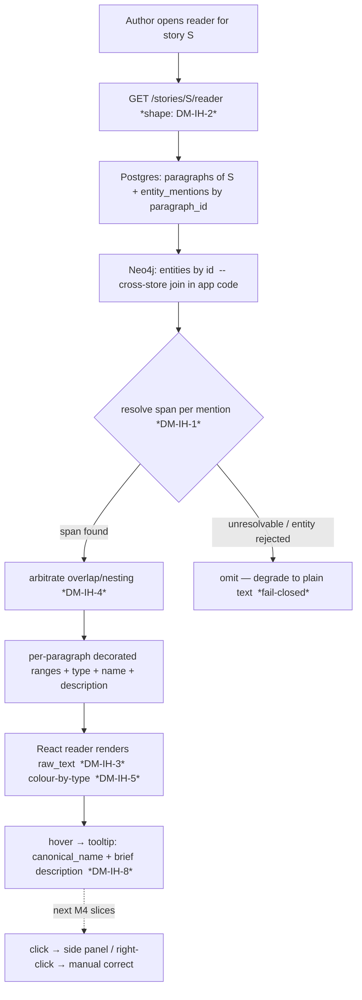

# M4 first slice — inline highlights (step-0 forward design)

**Requirement.** Render the full story text and highlight **accepted** entities inline (colour by
type), so the knowledge graph becomes *live over the prose*; hovering a highlight shows the entity's
name + a brief description. Owner-chosen first slice of M4 ("V1 polish"), 2026-06-17 roll. Spec
authority: **§3.5** ("Text reader with highlights") + §3.4 (the viewer it drills into). This is a
**read-only projection** of the accepted graph — the click-to-side-panel, manual tagging, and manual
correction that §3.5 also lists are the *next* M4 slices (side panel, manual annotation) and are
explicitly **out of scope here**; this slice ends at "text shown, entities highlighted, tooltip on hover."

**The one finding that dominates the design.** We do **not** reliably know *where* in a paragraph an
accepted entity appears. `entity_mentions` (migration `d721987b4168`) records `paragraph_id` +
`entity_id` but its `span_start`/`span_end` are **nullable**, and the comment is explicit: *"the LLM
extraction path yields an evidence quote, not reliable character offsets, so a mention may be written
without spans."* The accept path commits the LLM candidate, **not** the deterministic spaCy
`CandidateSpan` (`domain/extraction.py`, which *does* carry exact paragraph offsets). So inline
highlighting is not "render the offsets we have" — it is, first, **a span-resolution problem**. That is
the proposal's centre of gravity (DM-IH-1).

---

## Layers (the nine-layer pass)

This is a **per-feature** altitude pass (all nine layers ripple); I name where the altitude is loud.

1. **User / personas.** One persona, full trust, local ([[project]] L1). No new trust surface — this
   reads data the author already owns. The payoff is *legibility*: the graph stops being an abstract
   force-diagram and becomes annotations on the text the author actually thinks in.
2. **Business.** Both drivers ([[project]] L2): a real authoring aid (read your draft and see the
   world model overlaid) **and** a portfolio set-piece (the "graph is live over the text" demo is the
   most visceral proof the pipeline works). High portfolio value at low architectural risk is exactly
   why it's the milestone-opener.
3. **Domain.** No new nouns — **Entity**, **Mention** (where an entity appears in a paragraph),
   **Paragraph** (the document-tree leaf) already exist (spec App. A, [[overview]] L3). One new verb:
   *highlight* = project a mention onto a character range of rendered paragraph text. A *span* is a
   `[start, end)` character range within a single paragraph.
4. **Data.** Reads only: the Postgres document tree (`paragraphs.raw_text` — the rendered source) +
   `entity_mentions` (paragraph↔entity back-reference) + the Neo4j entity (canonical_name, aliases,
   type, properties). The **ownership seam** ([[overview]] L4) is in play read-side: a mention's
   `entity_id` points at a Neo4j node with **no Postgres FK**, so highlight assembly is a *cross-store
   join in application code* (Postgres mentions × Neo4j entities), never a SQL join. The nullable-span
   gap (above) is the data finding. No schema change is *required* by a render-time-search design;
   DM-IH-1 may choose to add one.
5. **Behavior.** No state machine — a highlight is a **pure projection** `(paragraph_text, mentions,
   entities) → decorated spans`, recomputed on read, owning no persisted state. (Manual annotation,
   the next slice, is the one that adds a write path + a lifecycle.)
6. **Errors.** [[fail-closed]] reads gracefully: an **unresolvable** mention (no span found, or its
   entity merged/rejected) must **degrade to plain text**, never throw, never highlight the wrong
   range. A wrong highlight (pointing the author at the wrong entity) is worse than a missing one — so
   the failure posture is *omit, don't guess* (mirrors S4e's "held endpoints are simply never
   committable; no fuzzy fallback").
7. **Security.** Story text is the author's own and never leaves the machine here (no LLM call in this
   slice — purely local read), so the [[trust-boundary]] is untouched. One small surface: rendering
   `raw_text` + entity names into the DOM must be **escaped** (React does this by default; flag it so a
   later `dangerouslySetInnerHTML` "optimisation" doesn't open stored-XSS over the author's own text —
   low stakes single-user, but a portfolio reader will look). `q`-style injection is n/a (no query).
8. **Compliance / Audit.** n/a — a read-only view mutates nothing, so there is no evidence to leave
   (named, not blank). The audit trail this feature *consumes* (which entities are accepted) was
   written by the M3 review queue.
9. **Operations.** No new infra; no LLM call ⇒ **no `llm_calls` row, no cost, no budget interaction**
   (INV-5 simply doesn't apply — name it so a reviewer doesn't look for a missing ledger row). The one
   ops concern is **client-side render performance** on a 50k-word story (DM-IH-6).

---

## Stations (the enforcement-lifecycle checklist)

A read-only projection leaves most stations legitimately empty — each named, not blank.

| Station | State | Note |
|---|---|---|
| **Identity** | n/a | single local user, no auth ([[overview]]) |
| **Intent** | ✅ | the author opens the reader for a story — an explicit navigation |
| **Policy** | ✅ | *which* entities highlight = **accepted graph entities only**, never staged/rejected candidates (the read-side echo of INV-1; DM-IH-7) |
| **Decision** | ✅ deterministic | span resolution + overlap arbitration are pure, deterministic rules (DM-IH-1/4) — no model, no human in this slice |
| **Access** | n/a | localhost binding is the only gate |
| **Monitoring** | n/a | no LLM call, nothing to meter; the existing graph viewer already surfaces the graph |
| **Evidence** | n/a | read-only — nothing mutated, nothing to record |
| **Expiry** | n/a | no new persisted state (render-time projection) |
| **Review** | n/a | the human review already happened (M3); this *shows its result* |

No station is an unacknowledged gap — the empties are the signature of a read-only view. (The next
slices flip several to ✅: manual annotation adds Intent→Evidence on a *write*; the side panel adds
Decision/Review.)

---

## Data flow

A read request resolves the document tree + its mentions from Postgres, joins each mention to its
Neo4j entity **in application code** (the cross-store seam), resolves each mention to a concrete span
within its paragraph (DM-IH-1), arbitrates overlaps (DM-IH-4), and returns per-paragraph decorated
ranges the React reader renders over `raw_text` (DM-IH-3), colour-by-type (DM-IH-5).

The dashed edge (K) is the boundary: this slice stops at the tooltip; side-panel + manual-correction
are later slices.

---

## State & invariants

- **No new state machine.** Highlighting persists nothing in this slice (it is the pure projection of
  L5). Recorded so a future contributor doesn't invent a "highlight cache" table speculatively.
- **Invariant pressure — none broken; one *read-side* rule worth naming.** This slice writes nothing,
  so INV-1/INV-3/INV-9 are untouched (good — a read view *cannot* violate the human-gate invariants).
  The rule it should honour is the **read-side echo of INV-1**: *the reader highlights only entities
  that exist in the accepted graph — never a staged or rejected candidate* (DM-IH-7). I am **not**
  proposing a new INV-N for it (it follows from "highlights read Neo4j, and only the human-accept path
  writes Neo4j"); flagged here so the design stays honest and so a future "preview staged highlights"
  idea is recognised as crossing INV-1. Fold into `invariants.md` only if the owner wants it named.
- **A latent coupling to record (not this slice's to fix).** A mention's `entity_id` is the *committed*
  id at accept time. When M4's later **entity↔entity merge** (properties/relations edit, the DM-Rel-5
  neighbourhood) absorbs one entity into another, every `entity_mentions.entity_id` (and every written
  edge) pointing at the absorbed id must be re-pointed — or the reader will silently drop those
  highlights (their entity "no longer exists"). This slice should *resolve gracefully* (omit), but it
  makes the merge-re-point debt visible from a new direction. Cross-linked to the cross-cutting item.

---

## Decision register (OPEN — the owner decides; I propose, I do not resolve)

### DM-IH-1 — Span resolution: how do we know *where* to highlight? **(the central decision)**
- **Context.** Accepted mentions have `paragraph_id` + `entity_id` but usually **null spans**; the
  spaCy `CandidateSpan` that *does* carry exact paragraph offsets is discarded at accept time. So the
  renderer has, per paragraph, a *set of entities known to appear* but not *where*.
- **Options.**
  - **(a) Render-time string search.** For each mention's entity, search the paragraph for its
    `canonical_name` + aliases (+ the stored `evidence_quote` if present), highlight the matches.
    *Pros:* zero schema change, robust to later text edits (re-search each render). *Cons:* ambiguous
    (multiple occurrences; which are "the" mention?), and **misses Polish inflection** — "Janek" as a
    `canonical_name` will not substring-match "Jankowi"/"Janka" in the prose (the exact gap the
    discarded spaCy span would have covered). `verify-at-build`: does the stored `evidence_quote`
    reliably substring-match `raw_text`? It was made a **soft-flag, whitespace-normalised** in M2.S3
    (`[[m2s3-extraction-agent]]` — may be absent or paraphrased), so it cannot be the sole anchor.
  - **(b) Persist real spans going forward + backfill.** Change the accept path to record the surface
    offsets (carry the spaCy `CandidateSpan` offset, or the matched `evidence_quote` offset, into
    `span_start/end`), and run a one-time backfill over existing mentions. *Pros:* exact, inflection-proof,
    O(1) at render. *Cons:* a backend + data change in a slice the owner picked *because* it was
    low-risk UI; backfill must handle the same ambiguity as (a) for already-accepted data; offsets
    drift when text is edited (V2) unless re-anchored.
  - **(c) Hybrid.** Persist spans for *new* accepts (cheap, exact going forward) + render-time search
    as the fallback for null-span (legacy) mentions. *Pros:* exact where we can be, graceful elsewhere.
    *Cons:* two code paths to test; the legacy path still has (a)'s inflection gap.
- **My proposal.** **(c) hybrid**, but treat it as **two sub-slices**: ship (a) render-time search
  *first* (it needs no backend change and proves the UI end-to-end), then add span persistence (b) as a
  follow-up once the UI exists and we've measured how often (a) actually fails on the real "Wody Święte"
  corpus. This keeps the owner's "low-risk first slice" intact while not pretending the inflection gap
  doesn't exist. **`verify-at-build`:** measure (a)'s hit-rate on real data before committing to whether
  (b) is needed at all.
- **Open.** Does the accept path even still have the spaCy span available to persist, or is the
  candidate→span link already lost by accept time? (Determines whether (b) is cheap or needs re-running
  PreNER.) — `verify-at-build`.

### DM-IH-2 — Backend read shape
- **Context.** The reader needs paragraphs + their resolved highlights. Today `GET /stories/{id}/graph`
  (project-scoped) returns the whole graph; there is no "story text + mentions" read endpoint.
- **Options.** (a) a new `GET /stories/{id}/reader` returning the document tree with per-paragraph
  resolved highlight ranges (server does the cross-store join + span resolution); (b) two existing-style
  endpoints (paragraphs; mentions-by-story) + resolve client-side; (c) extend the graph endpoint.
- **My proposal.** **(a)** — one purpose-built read endpoint keeps the cross-store join + span
  resolution on the server (testable in Python, not duplicated in TS), and matches the project's typed-
  client pattern. **Scope it story-scoped now**, but note it inherits the **§3.4 project-vs-story
  scoping** debt (cross-cutting): a mention is keyed to a paragraph, so a *story* reader is naturally
  story-scoped even though the graph endpoint is project-scoped — this endpoint may actually be where
  the per-story filter gets built first. Flag the alignment.
- **Open.** Page by chapter/scene, or whole story in one response? (ties DM-IH-6).

### DM-IH-3 — Rendering surface: Tiptap vs read-only renderer
- **Context.** Spec §6.1 names **Tiptap (ProseMirror)** as the editor "easy inline annotations";
  §3.5's reader is a single text column. This slice is read-only.
- **Options.** (a) Tiptap in read-only mode with ProseMirror **decorations** for highlights (the
  spec's tool; sets up manual annotation/V2 editing to reuse it); (b) a plain read-only React renderer
  that splits each paragraph's text at span boundaries into `<mark>` elements (far simpler; no editor
  dependency yet).
- **My proposal.** **(b) for this slice, with eyes open toward (a).** A read-only highlighter doesn't
  need ProseMirror's machinery, and deferring Tiptap until manual annotation (where editing actually
  begins) keeps this slice small. *Considered:* (a) now — but adopting the editor for a pure read view
  is ceremony ahead of need (the manual-annotation slice is the honest place to bring Tiptap in).
  `verify-at-build`: confirm a `<mark>`-splitting renderer handles overlapping ranges acceptably, else
  (a)'s decoration model may be needed sooner.
- **Open.** Owner may prefer to pay the Tiptap setup now so the next two slices inherit it.

### DM-IH-4 — Overlap / nesting arbitration
- **Context.** Two mentions can claim overlapping ranges ("Janek" inside "Janek Kowalski"; or two
  entities sharing a token). The DOM can't trivially render crossing ranges.
- **Options.** (a) longest-match wins (drop the shorter); (b) innermost/nested rendering (layered
  `<mark>`); (c) first-wins by document order.
- **My proposal.** **(a) longest-match wins** for V1 (one highlight per character, the most specific
  entity), with overlaps logged so DM-IH-6's measurement shows how often it happens. Layered nesting
  (b) is a polish refinement for later.
- **Open.** Is "the most specific entity" always the right one to surface, or does the author want the
  shorter alias sometimes? (a UX call, defer.)

### DM-IH-5 — Colour-by-type under an open-world type set (INV-4)
- **Context.** §3.5 says "colour by type", but entity `type` is **open-world** ([[open-world-ontology]],
  INV-4) — a free string, not a fixed enum — so a hand-built colour map can't be exhaustive.
- **Options.** (a) a small fixed palette for the common types (character/place/object/concept) +
  deterministic hash-to-colour for the long tail; (b) pure deterministic hash(type)→hue for all;
  (c) let the author assign colours (defer — that's preferences, a later feature).
- **My proposal.** **(a)** — readable, stable colours for the types that dominate, a deterministic
  fallback that never errors on a never-before-seen type (honouring INV-4), plus a legend. *Considered &
  rejected:* a fixed enum map (would silently fail the open-world invariant the moment a new type
  appears — the exact "tidying types into an enum" INV-4 guards against).
- **Open.** Accessibility — hash-colours can collide or be low-contrast; cap the palette + check contrast.

### DM-IH-6 — Whole-story render vs virtualisation (50k-word performance)
- **Context.** §3.4 demands the *graph* handle 500+ nodes; §3.5's reader must handle a **50k-word
  story** (the real "Wody Święte" draft).
- **Options.** (a) render the whole story DOM at once; (b) virtualise/paginate by chapter or scene
  (render visible paragraphs only); (c) render whole, optimise only if it stutters.
- **My proposal.** **(c) measure first** — render whole-story, profile on a real 50k draft, and add
  virtualisation only if it stutters (don't pre-optimise). Pair with DM-IH-2's paging decision: even a
  whole-render UI can fetch per-chapter. `verify-at-build`: profile before declaring (a) sufficient.
- **Open.** none beyond the measurement.

### DM-IH-7 — Which entities highlight (accepted-only)
- **Context.** The graph holds only accepted entities (INV-1/INV-9); staged candidates live in
  Postgres `candidates`, rejected ones leave evidence rows.
- **Options.** (a) highlight **accepted graph entities only**; (b) optionally preview staged candidates
  too (a "review-preview" mode).
- **My proposal.** **(a) only** — the reader projects the *committed world*, the read-side echo of
  INV-1. (b) is a different feature (a review aid) that would blur the accepted/staged line; out of
  scope. *Considered & rejected:* (b) now (crosses the INV-1 read-side rule for no first-slice benefit).
- **Open.** none.

### DM-IH-8 — Tooltip "brief description" — what is it?
- **Context.** §3.5's tooltip shows "canonical_name + brief description", but an entity has no
  dedicated `description` field — it has `properties` (a free dict) and `aliases`.
- **Options.** (a) show canonical_name + type + aliases (data we *have*) and defer a real description;
  (b) derive a description from `properties` (e.g. join a few key:value pairs); (c) generate/store a
  summary (an LLM call — out of scope for a read slice).
- **My proposal.** **(a) for this slice** — name + type + aliases is honest and needs no new data; a
  richer description is the side-panel slice's job (it shows full properties + local graph). *Rejected:*
  (c) (an LLM call in a read-only projection contradicts the slice's no-egress shape).
- **Open.** Owner may want one or two `properties` keys in the tooltip — cheap to add under (a).

---

## But what if (edge cases — name the failure, teach the name)

- **…a surface form appears 5× in a paragraph but only some are the entity?** We store a *paragraph-
  level* mention, not per-occurrence positions. Render-time search (DM-IH-1a) would highlight **all**
  occurrences — possibly over-highlighting. Persisted per-occurrence spans (1b) avoid it. This is the
  **granularity mismatch** between "entity appears in paragraph P" and "entity occupies chars [i,j)".
- **…the canonical_name is "Janek" but the prose says "Jankowi"?** Polish **inflection** — exact
  substring search misses it; the discarded spaCy span had the inflected surface form. The headline
  reason DM-IH-1 is non-trivial; (1a) under-highlights inflected mentions, and stemming/lemmatising at
  render time is its own rabbit hole.
- **…two entities overlap on a token?** DM-IH-4 (longest-match) — but log the rate; frequent overlaps
  argue for layered rendering sooner.
- **…a mention's entity was rejected, or merged into another after the mention was written?** A
  **dangling reference** ([[referential-integrity]]): `entity_id` resolves to nothing (rejected) or to
  an absorbed node (future M4 merge). **Fail-closed: omit the highlight** (plain text), never throw,
  never highlight a stale name. Surfaces the merge-re-point debt (State & invariants).
- **…the text was edited after extraction?** V1's reader is read-only so offsets don't drift *yet* —
  but it foreshadows why **persisted offsets are fragile under editing** (V2) and render-time re-anchoring
  (1a) is more edit-robust. A real tension between DM-IH-1's options, not a defect.
- **…a 50k-word story renders 30k DOM nodes?** Jank/stutter — DM-IH-6 (measure, virtualise if needed).
- **…`raw_text` or an entity name contains markup-looking characters?** Escape on render (Layer 7) —
  React's default; don't `dangerouslySetInnerHTML`.
- **…a paragraph has zero mentions?** The common case — render plain, no work. Good (highlights are
  sparse).
- **…the cross-store read is half-down (Postgres up, Neo4j down)?** Degrade: render the **text** from
  Postgres with **no highlights** rather than 500 the page (fail-closed toward "readable but
  un-annotated"). A store-availability posture mirroring the M3 `…→503` mapping, but read-side gentler.

---

## Gaps for the product owner

1. **DM-IH-1 is the real call** — render-time search (cheap, inflection-blind) vs persisting spans
   (exact, a backend/data change in a "low-risk" slice) vs the hybrid sub-slice plan. Everything else
   is downstream of it. My recommendation (ship 1a first, measure, add 1b if needed) keeps the slice
   small but needs the owner's OK that "highlights may miss inflected/legacy mentions in v1."
2. **Tiptap now or later (DM-IH-3)** — pay the editor setup in this read slice so the next two inherit
   it, or keep this slice a plain renderer and bring Tiptap in with manual annotation. A sequencing
   preference only you can weigh.
3. **§3.4 scoping alignment (DM-IH-2)** — the reader endpoint is naturally story-scoped and may be the
   first place the per-story filter is built; confirm we want to start paying down the project-vs-story
   debt here rather than in the world-graph slice.
4. **Scope confirm** — this slice ends at "text + highlights + hover tooltip." Click→side-panel,
   manual tagging, and manual correction (also in §3.5) are the next slices. Confirm that cut.

---

## Hand-off (when the register is resolved, test-first)

The first failing test is the **span-resolution pure function** (DM-IH-1): given a paragraph + a set of
(entity, name, aliases) → the decorated ranges, including the omit-on-unresolvable and longest-match-
overlap rules. Pure, deterministic, no store, no model — exactly the altitude the project unit-tests
hardest. Then the read endpoint (DM-IH-2) with an integration test over real Postgres + a stubbed
graph reader, then the React renderer (DM-IH-3). No production code before the owner resolves
DM-IH-1/2/3 — they change the shape of the test.
