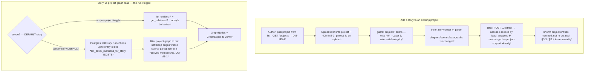

# M4 — narrowed multi-story (a new story reuses the project graph + per-story membership)

> **✅ Status: ACCEPTED — register RESOLVED with the owner (2026-06-23, Session 50).** Authoritative
> resolution home: `docs/PLAN_SHORT.md` Decided + this note. **No ADR** (resolves no open spec
> question, crosses no new data boundary — DM-MS-1 *removes* a would-be boundary by deriving). The
> forward-design body below is kept intact (public-portfolio history — the resolution is appended to
> each register entry, the thinking is not deleted). Mirrored to [[open-questions]] OQ-27 (struck).
>
> **Resolutions (owner, 2026-06-23):**
> - **DM-MS-1 → DERIVE per-story membership from `entity_mentions`** (resolved at the decompose). No
>   new storage; single [[source-of-truth]]; edge membership via `source_paragraph_id`'s story.
> - **DM-MS-2 → `scope=story|project` param on the existing `GET /stories/{id}/graph`, DEFAULT
>   `story` (owner refined my `project` default to `story`).** Rationale: for single-story projects
>   the two scopes return the *identical* graph (every accepted entity has a mention in the one
>   story), so the default flip is a no-op for existing projects and only diverges once a project has
>   a 2nd story — exactly when landing on "this story" first is wanted. **`verify-at-build`:** the
>   existing viewer is unchanged for single-story projects. Edge rule = **(i)** show an edge in
>   `scope=story` only when both endpoints are story-members *and* its source paragraph ∈ the story.
> - **DM-MS-3 → optional `project_id` on `POST /stories/upload`** (omitted ⇒ new project as today;
>   present ⇒ into existing). Owner: "same upload, pick project first."
> - **DM-MS-4 → add `GET /projects` + `GET /projects/{id}/stories`**; project creation stays
>   implicit-on-upload (explicit `POST /projects` deferred).
> - **DM-MS-5 → amend the spec** §8.4 line 734 + the §3.3 line 188 cross-reference "whole world" →
>   "whole project" (drop the dead "whole world graph" cross-ref). The host-repo spec stop-and-amend
>   + frontend schema regen run in the **main loop** (not the vault). The `world_id` cleanup rides
>   this slice.
> - **DM-MS-6 → VERIFIED already covered by M4.S3b** (merge re-points incident edges). Nothing to build.
> - **DM-MS-7 → split be/fe; backend one slice; the `world_id` cleanup is the low-risk opener.**

> **Status: PROPOSED — register OPEN (DM-MS-1..7 / OQ-27) [original forward-design framing, kept as
> history].** The slice's **central call is already RESOLVED** (DM-MS-1, owner, 2026-06-23: per-story
> membership is **derived** from `entity_mentions`, not stored) — so this decompose is unusually
> light on new persistence. The remaining OPEN items are API *shape* calls (how create-into-project
> and the story-vs-project graph read are exposed), not data-model calls.
>
> **Scope (spec §3.6, amended S44):** *"add a new story that reuses the existing project graph +
> per-story entity membership."* The cross-story **world graph** is **OUT of PoC** (`docs/BACKLOG.md`)
> — not modelled here. Folds in the **`world_id` vestigial cleanup** as a build input.

The defining finding of this decompose is **how little new machinery the narrowed slice needs**, once
you read the as-built. Three facts (verified Session 50) collapse most of the apparent work:

1. **Per-story membership is already derivable.** `entity_mentions.paragraph_id → paragraphs →
   scenes → chapters → stories.id` is a real foreign-key chain, and a rollup query *already exists*
   (`postgres_repo.py:437-458` `list_entity_mentions_for_story()`). "Which entities appear in story X"
   is answerable today — no new table, no Neo4j marker. This is a **derived view** ([[materialization]]
   — we *derive on read*, we don't *store*), and the single source of truth stays the mention rows.
2. **The matcher seed is already project-scoped.** `accepted_entity_reader.py:30-46`
   `load_accepted(project_id)` loads *all* the project's accepted entities; the coordinator
   (`extraction_coordinator.py:129`) reads it once per ingest run. A new story added to an existing
   project is **automatically** matched against the project's known entities — **no cascade change.**
3. **The reader is already multi-story-correct.** `GET /stories/{id}/reader` reads entities
   project-scoped but mentions story-scoped (`api/stories.py:628-739`) — so a second story's prose
   already highlights only *its* mentions against the *project's* entity catalogue.

So the genuine gaps are narrow: (a) you cannot create/upload a story **into an existing project**
(today every upload auto-creates a fresh project, `api/stories.py:146-188`); (b) there are **no
listing endpoints** (no `GET /projects`, no `GET /projects/{id}/stories`) so a UI cannot pick a
project to add to; (c) the graph read `GET /stories/{id}/graph` is **project-scoped only**
(`api/stories.py:479-523`) — it cannot yet answer "this story", which the §3.4 toggle needs.

---

## 0b. Operation-surface completeness sweep (CRUD over {project, story} + graph-scope)

The narrowed multi-story capability is small enough that it *may* be one backend + one frontend
slice — but it still touches the project/story object surface, so sweep it before fixing boundaries.

| Object | Create | Read (one) | List | Update | Delete |
|---|---|---|---|---|---|
| **Project** | implicit on upload ✅ (today) | `get_project` ✅ | **NONE — gap → DM-MS-4 (this slice)** | name/language edit — *deferred, post-PoC (no UI need yet)* | **deferred → backlog** (delete-project = orphaned-sandbox cleanup, cross-cutting) |
| **Story** | upload-as-new-project ✅; **into existing project — NEW → DM-MS-3 (this slice)** | `get_story` ✅ | **NONE — gap → DM-MS-4 (this slice)** | retitle — *deferred, post-PoC* | **deferred → backlog** (delete-story ties to orphaned-sandbox + undo robustness) |
| **Graph (read projection)** | — | project-scoped ✅ | **story-scoped read — NEW → DM-MS-2 (this slice)** | — | — |
| **Per-story membership** | *derived, not stored* (DM-MS-1 ✅ resolved) — no CRUD surface; it is a **read-time rollup**, not an object | | | | |

**Routing result — no silent slicing gap, two explicit deferrals:**
- **This slice owns:** create-story-into-existing-project, project + story **list** endpoints,
  story-scoped graph read, and the `world_id` cleanup.
- **Explicitly deferred-and-recorded:** **project/story rename** (no UI need at PoC — post-PoC),
  and **delete-project / delete-story** (named already as the **orphaned-sandbox cleanup**
  cross-cutting item + undo-robustness backlog; multi-story makes delete-story *desirable* but it
  is its own write-risk slice, not free here — keep this slice read-additive). Surfaced to the owner
  in *Gaps* so the deferral is a decision, not an omission.

---

## Layers (the nine-layer pass — Balanced density)

1. **User / personas.** One author, full trust, local ([[project]] L1). **No new [[trust-boundary]]**
   — no egress, no LLM on the read/scope paths (name it so INV-2/INV-5 aren't hunted for). The payoff:
   the author writes a *second* story in the same universe and the system **reuses what it already
   knows** — known characters/places are matched, not re-created — and can read the graph "for this
   story" or "for the whole project". This is the spec's "incrementality test" (§B.4) becoming real.
2. **Business.** Both drivers ([[project]] L2). Authoring: a worldbuilder's project is inherently
   multi-story; one-story-per-project was always a scaffold ("project selection arrives with the
   frontend", `api/stories.py` docstring). Portfolio: shows the graph as a *project-level* asset that
   accretes across stories — the knowledge-graph payoff, not a per-document toy.
3. **Domain.** No new persisted *nouns*. The ubiquitous language gains a sharpened distinction the
   one-story world let us blur: **[[multi-tenancy|tenancy key]]** — `project_id` is the scope key on
   every graph node (spec §6.4), the *tenant*; a **story** is now a *sub-scope within* a tenant, not a
   synonym for it. And **per-story membership** = "entity E *appears in* story S" = "E has an accepted
   mention whose paragraph rolls up to S" — a **derived** relationship, never stored ([[materialization]]).
4. **Data.** **The slice that adds almost no data.** Membership derives from the existing FK chain
   (fact 1); the seed is already project-scoped (fact 2). The only schema *change* is a **removal** —
   drop the vestigial `projects.world_id` column + its plumbing (5 files / 8 edits, all deletions;
   no `worlds` table ever existed, always-null). The [[source-of-truth]] discipline is the headline:
   storing membership separately would create a *second* home for a fact the mentions already own —
   exactly the duplication DM-MS-1 rejects. The cross-store [[referential-integrity]] seam (OQ-1)
   appears only on **read** here (a story's entity-id set comes from Postgres, filters the Neo4j
   graph) — no new write seam, so none of S3b's compound-write hazards recur.
5. **Behavior.** **No new state machine.** Adding a story to a project is a plain insert; the story
   then flows through the *existing* ingest → extract → review → accept lifecycle unchanged
   ([[candidate-lifecycle]]), only now seeded by a non-empty project graph. Membership has no
   lifecycle — it is a query. (Contrast S3b, which added terminal `deleted` states and an undo arc;
   this slice adds none.)
6. **Errors.** [[fail-closed]] and mostly read-only. Create-into-project must reject a **dangling
   `project_id`** ([[referential-integrity]]) — 404 if the project doesn't exist, never create a story
   under a ghost project. The story-scoped graph read of a story with **zero accepted mentions** is an
   *empty* graph, not an error. The cross-store read (Postgres rollup → Neo4j filter) tolerates the
   benign single-user consistency window (an entity deleted between the two reads simply drops from the
   filtered set). No partial-write failure modes (nothing here writes both stores in one action).
7. **Security.** Author's own data, no egress, no LLM (named). No new boundary. The list endpoints
   return only the local author's own projects/stories (single tenant in practice — there is no
   cross-user authz to get wrong).
8. **Compliance / Audit.** **Light.** No destructive action, so no new evidence requirement — the
   existing `candidate_decisions` / `graph_edits` trails are untouched. Creating a story is itself the
   record (`stories.ingested_at`). Name the empty box: INV-3 (reversibility) is **n/a** for this
   slice's additive operations — there is nothing to undo in "add a story" or "read a scope".
9. **Operations.** No new infra, no LLM (INV-5 n/a — named). One ops note: the story-scoped graph
   read does *two* store round-trips (Postgres rollup, then Neo4j filtered fetch) instead of one;
   trivial at PoC scale (dozens of stories, hundreds of entities), but it is the first read that
   **joins across the two stores by design** — flag it as the place a future N-story project would
   first feel the dual-store cost (ties the new `docs/BACKLOG.md` "dual-store data architecture"
   analysis item).

---

## Stations (enforcement-lifecycle checklist — empty boxes named)

| Station | State | Note |
|---|---|---|
| **Identity** | n/a | single local user, no auth ([[overview]]) |
| **Intent** | ✅ | the author explicitly picks a project to add a story to / picks the graph scope — a deliberate, *non-destructive* gesture |
| **Policy** | ✅ | a story may only be created under an **existing** project (FK-valid); the story-scoped graph shows only entities **accepted-and-mentioned** in that story (the read-side echo of INV-1 — staged candidates never appear) |
| **Decision** | ✅ deterministic | which project / which scope — pure human choice; the membership filter is a deterministic rollup, no model ([[prefer-deterministic]]) |
| **Access** | n/a | localhost binding is the only gate |
| **Monitoring** | n/a | no LLM call on these paths, nothing to meter (INV-5 n/a) |
| **Evidence** | n/a — named | additive, non-destructive: `stories.ingested_at` is the only record needed; no before-image, no `graph_edits` row (contrast S3b) |
| **Expiry** | n/a — named | nothing accumulates that needs a retention posture (membership is derived, not stored) |
| **Review** | ✅ | the per-story scope view *is* a review surface — it lets the author see "what does the graph know about *this* story" vs the whole project |

**No ⚠ open station.** Unlike S3b (Evidence was the crux) or S3c (Evidence/Policy flipped), this
slice's stations are either ✅ or a *named* n/a — the tell that it is genuinely additive and low-risk.

---

## Data flow

Two paths. **(A) Add a story to an existing project:** the author picks a project (from the new list
endpoint), uploads a draft; the upload resolves to the chosen `project_id` instead of minting a new
project, then runs the *existing* parse → structure → (later) extract pipeline. Because the project
graph already holds accepted entities, the next extract run's cascade is seeded with them
(`load_accepted(project_id)`, unchanged) — known entities are matched, not duplicated. **(B)
Story-scoped graph read:** the viewer asks for "this story"; the backend rolls the story's accepted
mentions up to their entity-id set (the existing Postgres query), then returns the project graph
**filtered** to those entities (and the edges among them whose asserting paragraph is in the story).

The whole slice writes **one** store on the only mutating path (insert a story row in Postgres); the
graph read is pure projection. That is why none of S3b's cross-store-write hazards apply.

---

## State & invariants

**No new state machine, no new invariant.** This is itself a finding worth stating (the "name the
empty box" rule at the feature scale): a slice that adds neither is a slice whose risk is low.

**Invariant pressure (all upheld; named so a reviewer doesn't hunt):**

- **INV-1 / INV-9 (human gate / only human-reached handlers write the graph) — untouched.** This slice
  adds **no graph writer**. Create-story writes Postgres only; the graph read is read-only; extraction
  in the new story flows through the *existing* accept gate. The grep guard set is unchanged.
- **INV-3 (reversible) — n/a for this slice** (additive, non-destructive). Named, not silent.
- **INV-4 (open-world) — upheld** (no type handling changes).
- **INV-2 / INV-5 (egress / LLM ledger) — n/a** (no egress, no LLM on these paths). The new story's
  *extraction* of course still meters — but that is the unchanged existing path, not this slice.
- **The membership-derivation correctness contract** (not an invariant, a tested property): "entity E
  is in story S's scoped graph ⟺ E has an accepted mention whose paragraph rolls up to S" — the
  first failing test (a pure rollup over a fixture tree), and the integration test that **"this story"
  ⊆ "whole project"** always holds.

---

## Decision register (DM-MS-1 RESOLVED; DM-MS-2..7 OPEN — mirrored to [[open-questions]] OQ-27)

> Each entry: **Context / Options / My proposal / Open.** I *propose*; the owner *resolves*.
> `verify-at-build` marks any call resting on un-inspected behaviour.

### DM-MS-1 — Per-story membership storage model **✅ RESOLVED (owner, 2026-06-23) — the central call**
> **Decision: DERIVE membership from `entity_mentions`** (option a). No new storage; the single source
> of truth stays the mention rows; the rollup query already exists. **Edge membership** derives from
> the edge's `source_paragraph_id` rolling up to a story. *Rejected:* (b) a Neo4j node property /
> `:APPEARS_IN` edge (a second home for a fact mentions already own — a [[source-of-truth]] violation,
> and a new write path to keep in sync at accept time); (c) a dedicated membership table (heaviest;
> duplicates what mentions encode).
- **Context.** The §3.4 toggle needs "which entities are in story S". The FK chain
  `entity_mentions → paragraphs → scenes → chapters → stories` already encodes it, and
  `list_entity_mentions_for_story()` already rolls it up (verified).
- **Why derive wins here.** Membership is a *projection* of accept-time mention data, not an
  independent fact — so [[materialization]] (storing it) would buy a single Neo4j-filter read at the
  cost of a synchronisation duty on every accept/merge/delete and a second source of truth. At PoC
  scale the extra Postgres round-trip is negligible; correctness-by-construction is worth more.

### DM-MS-2 — Story-scoped graph read: route shape **✅ RESOLVED (owner, 2026-06-23)**
> **Decision: option (a) — a `scope=story|project` param on the existing `GET /stories/{id}/graph`,
> with DEFAULT `story` (owner refined my `project` default → `story`).** The §3.4 toggle is a
> parameter of one view, not two routes; default `story` is safe because for single-story projects
> the two scopes coincide (a no-op until a project gains a 2nd story). **Edge rule = (i):** an edge
> shows in `scope=story` only when both endpoints are story-members *and* its `source_paragraph_id`
> ∈ the story (a clean self-contained subgraph, no dangling edges). *Rejected:* (b) a new
> `GET /projects/{id}/graph` + re-pointed story route (a behaviour change to an existing route, for
> no PoC gain). *Rejected edge rule:* (ii) pull-in endpoints mentioned elsewhere (would draw
> half-edges). **`verify-at-build`:** the existing frontend viewer is unchanged for single-story
> projects (the default flip is invisible there).
- **Context.** `GET /stories/{id}/graph` returns the **project** graph today (`api/stories.py:479-523`).
  The §3.4 toggle needs a "this story" answer too. The story id is already in the URL; the project is
  derivable from it.
- **Options.**
  - **(a) Add a `?scope=story|project` query param to the existing route**, defaulting to `project`
    (preserves today's behaviour and every existing caller). `scope=story` triggers the
    rollup-and-filter. Smallest change; one route.
  - **(b) Make `/stories/{id}/graph` mean the *story's* graph, and add `GET /projects/{id}/graph`
    for the whole project.** Semantically cleaner (a story URL returns the story's data), but it is a
    **behaviour change** to an existing route — every current caller of `/stories/{id}/graph` (it is
    the viewer's source today) would silently narrow, so it needs a caller sweep + the frontend moved
    to the project route for the default view.
- **My proposal.** **(a)** — additive, back-compatible, and the §3.4 toggle is naturally a *parameter*
  of one view, not two routes. Record (b) as the cleaner-but-heavier alternative. **`verify-at-build`:**
  that the existing frontend graph view keeps working unchanged with the default `scope=project`.
- **Open.** Owner/build: query param on the existing route (my lean) vs a new `/projects/{id}/graph`
  + re-pointed story route? **Sub-question (the modelling subtlety — see *But what if*):** in
  `scope=story`, what is an **edge's** membership rule — (i) edges whose `source_paragraph_id` is in
  the story *and* both endpoints are story-members; (ii) edges asserted in the story (by source
  paragraph) with endpoint nodes pulled in even if only mentioned elsewhere? My lean: **(i)** (a clean
  subgraph — every node and edge shown is "in" the story), with (ii) recorded as a refinement.

### DM-MS-3 — How "create a story into an existing project" is exposed **✅ RESOLVED (owner, 2026-06-23)**
> **Decision: option (a) — an optional `project_id` on the existing `POST /stories/upload`** (omitted
> ⇒ new project, today's behaviour unchanged; present ⇒ validate + insert under it). Owner: "same
> upload, pick the project first." *Rejected:* (b) a separate nested endpoint (forks the upload path
> for no PoC gain). **`verify-at-build`:** an absent `project_id` reproduces exactly today's
> new-project behaviour (no regression).
- **Context.** `POST /stories/upload` always mints a new project (`api/stories.py:146-188`). Adding to
  an existing project needs a way to pass the target project.
- **Options.** **(a)** an **optional `project_id`** on the existing upload — omitted ⇒ new project (today's
  behaviour, unchanged); present ⇒ validate + insert under it. **(b)** a **separate endpoint**
  `POST /projects/{id}/stories/upload` for the into-existing case, leaving `POST /stories/upload` as
  new-project-only.
- **My proposal.** **(a) optional `project_id` on upload** — one code path, the default unchanged, the
  multi-story case a single extra parameter; mirrors how the slice is "additive". *Considered:* (b) is
  more REST-tidy but forks the upload path for no real gain at PoC. **`verify-at-build`:** an absent
  `project_id` still produces exactly today's new-project behaviour (no regression).
- **Open.** Owner: `project_id` param (my lean) vs a dedicated nested endpoint?

### DM-MS-4 — Listing surface (projects + stories) **✅ RESOLVED (owner, 2026-06-23)**
> **Decision: add `GET /projects` (id, name, language, created_at, story-count) + `GET
> /projects/{id}/stories` (id, title, ingested_at)** — read-only [[backend-for-frontend]] reads.
> Project creation stays implicit-on-upload; an explicit `POST /projects` is **deferred** (no UX
> demand — the upload-into-project flow covers "start a project").
- **Context.** A project/story picker (the frontend slice) needs to *list* projects and a project's
  stories; **neither endpoint exists**. Project creation stays implicit-on-upload (no UI demand for an
  explicit "create empty project" yet).
- **Options / proposal.** Add **`GET /projects`** (id, name, language, created_at, story-count) and
  **`GET /projects/{id}/stories`** (id, title, ingested_at). Read-only [[backend-for-frontend]] reads;
  no new domain logic. Keep project creation implicit (an explicit `POST /projects` is **deferred** —
  not needed until "start an empty project then add stories" is a real UX, which the upload-into-project
  flow already covers).
- **Open.** Owner: confirm the two list endpoints + implicit project creation (defer explicit
  `POST /projects`)? Any fields beyond the minimal set above for the picker?

### DM-MS-5 — `world_id` vestigial cleanup **✅ RESOLVED (owner, 2026-06-23)**
> **Decision: the cleanup rides this slice** (a self-contained, test-covered deletion — the low-risk
> opener per DM-MS-7), and the **spec amendment is approved**: §8.4 line 734 + the §3.3 line 188
> cross-reference "whole world" → "whole project" (drop the dead "whole world graph" cross-ref). The
> host-repo spec stop-and-amend + the frontend `schema.d.ts` regen run in the **main loop** (not the
> vault). **`verify-at-build` (completeness rule):** the home list is grep-derived — re-sweep
> semantically before removal.
- **Context.** `projects.world_id` is always-null dead weight (no `worlds` table; the world graph is
  cut). Audit: 5 files / 8 edits, all deletions (migration drop-column + `domain/models.py:33`,
  `domain/graph.py:42`, `postgres_repo.py` insert/select, `neo4j_repo.py` create_entity:93 +
  _to_entity:283, `api/stories.py:420` docstring).
- **My proposal.** Fold the cleanup into the backend slice as a self-contained, test-covered deletion
  (existing project/entity round-trips stay green; assert the column is gone). **`verify-at-build`
  (per the completeness rule):** the home list is **grep-derived** — re-sweep semantically (synonyms,
  schema, any code added since the audit) before removal, don't trust the list as complete.
- **Spec touch-up it surfaces (a stop-and-amend, owner sign-off):** the S49 world-graph-out
  reconciliation keyed on *"world graph"* and **missed two "whole world" phrasings** of the §3.4
  toggle — **§8.4 line 734** (`Toggle: "this story only" / "whole world"`) and **§3.3 line 188**
  (`the §3.4 "whole world" graph`). §3.4 itself now correctly says "whole project". These should read
  "whole project" (and the §3.3 cross-reference dropped/reworded, since there is no "whole world"
  graph). This is the *"homes hide behind different words"* lesson again (Session 49). Small, but it
  is a spec edit ⇒ stop-and-amend, not a quiet fix. (The frontend `schema.d.ts:124` mirror is
  regenerated from the backend docstring, so it follows automatically once the docstring is reworded.)
- **Open.** Owner: confirm the cleanup rides this slice; approve the §8.4/§3.3 "whole world → whole
  project" amendment wording.

### DM-MS-6 — DM-Rel-5 written-edge re-point **✅ VERIFIED already covered (not new work)**
- **Context.** The handoff flagged "DM-Rel-5's written-edge re-point (first possible here)".
- **Finding.** **Already executed in M4.S3b** ([[m4-s3b-graph-mutations]] DM-S3b-3; INV-9 fourth
  witnessed instance): the accepted-entity↔entity **merge** re-points every incident edge
  (delete-old + create-new, since the `uuid5` edge id changes) and re-points B's mentions. Multi-story
  introduces **no new merge trigger** — merging two entities the new story surfaced as duplicates uses
  the *same* S3b path. So there is **nothing to build here**; recorded only to close the handoff item.
- **Open.** None — confirm the finding and strike the carry-forward.

### DM-MS-7 — Slice split **✅ RESOLVED (owner, 2026-06-23)**
> **Decision: split be/fe; the backend is one slice** (no compound writes, no undo, no migration
> beyond a column-drop); **the `world_id` cleanup is the low-risk opener** (its own first PR, or
> folded into the backend slice — builder's call at build).
- **Context.** Backend = `project_id`-on-upload + 2 list endpoints + story-scoped graph read (rollup +
  filter) + the `world_id` cleanup + OpenAPI/typed-client regen. Frontend = a project/story picker +
  the §3.4 "this story / whole project" toggle wired to the scoped route.
- **My proposal.** **Split be/fe** (the established S2/S3a/S3b rhythm). The backend is modest enough to
  be **one slice** (no compound writes, no undo, no new migration beyond a column-drop) — provisionally
  keep it whole; the `world_id` cleanup could land as its own tiny warm-up PR first if a clean,
  low-risk opener is wanted (it is pure deletion).
- **Open.** Owner: confirm be/fe split; want the `world_id` cleanup as a separate opener PR or folded
  into the backend slice?

---

## But what if (edge cases — name the failure, teach the name)

- **…an entity was accepted in story A but is never mentioned in story B?** Under derived membership it
  simply **doesn't appear** in B's "this story" graph (no mention rolls up to B) — correct. Crucially
  it is *still* a **matcher seed** for B (the seed is project-scoped, fact 2), so B's extraction can
  re-surface and mention it, at which point a mention makes it a B-member. The **seed scope (project)
  and the membership scope (story) are deliberately different** — seeding is "what might recur",
  membership is "what actually occurred here". Teaching the distinction is half the value of the slice.
- **…an edge was asserted in story A (its `source_paragraph_id` ∈ A) between entity X (mentioned in A
  and B) and entity Y (mentioned only in A)?** In B's "this story" view, Y is not a member, so the edge
  has a **dangling endpoint** ([[referential-integrity]]) relative to B. This is the DM-MS-2
  sub-question: my lean (i) — show an edge only when *both* endpoints are story-members and the edge's
  source paragraph is in the story — yields a clean subgraph with no dangling edges. Named so the build
  doesn't accidentally render a half-edge.
- **…a brand-new story has zero accepted entities yet?** "This story" graph is **empty** (not an
  error); "whole project" shows everything. Expected — the story fills as its extraction is accepted.
- **…two stories share an entity?** It is **one node** in the project graph (project is the
  [[multi-tenancy|tenancy key]]), a member of both stories. No duplication — that is the whole point.
- **…upload names a `project_id` that doesn't exist (or was deleted)?** [[fail-closed]] — 404, never
  create a story under a ghost project (a [[referential-integrity]] guard at the API boundary).
- **…the story-scoped read races a concurrent delete (Postgres rollup sees entity E, Neo4j fetch no
  longer has it)?** The filtered set just omits E — a benign single-user consistency window, no crash
  (the same window the reader/panel already tolerate). No cross-store *write*, so no half-state.
- **…`world_id` removal misses a reference the grep didn't catch?** The completeness rule's whole point
  (DM-MS-5 `verify-at-build`): re-sweep semantically before the drop; a leftover read of a dropped
  column is a runtime error, so it must be a clean, test-covered removal.

---

## Gaps for the product owner (plain language — the calls only you can make)

> **✅ All resolved (owner, 2026-06-23) — see the resolution banner at the top.** (2) add a story via
> the **same upload, project picked first** + two list screens; (3) the graph button is **one screen
> with a scope toggle, defaulting to "this story"** — a relationship shows only when both its entities
> are in the viewed story; (4) the **§8.4/§3.3 "whole world → whole project" wording fix is approved**;
> (5) **rename + delete-project/story stay deferred** (delete is its own destructive slice); (6) the
> **`world_id` cleanup rides this slice** (the low-risk opener). Items below kept as the original
> plain-language framing (history).

1. **The big call is already made.** "Which story is each entity in" will be **worked out on the fly**
   from data we already have (every accepted entity already records which paragraph it was mentioned
   in, and a paragraph already belongs to a story) — so we add **no new storage** and there's only ever
   one record of the truth. (You chose this on 2026-06-23.)
2. **How do you add a story to an existing project?** (DM-MS-3.) My lean: the **same upload screen**,
   with the project chosen beforehand — uploading without choosing a project still makes a new one
   (exactly like today). Alternative: a separate "add to this project" upload. Either way you'll need
   a **list of your projects and their stories** to pick from (DM-MS-4) — those two list screens don't
   exist yet; I'd add them.
3. **The "this story vs whole project" graph button** (DM-MS-2). My lean: keep one graph screen and add
   a toggle (a setting on the same request), rather than two separate screens. One sub-question I need
   your steer on: when a *relationship* was written in story A but one of its two entities only shows up
   in story B, should B's "this story" view show that relationship or not? My lean: **only show a
   relationship when both of its entities are in the story you're looking at** (so the picture is always
   self-contained, no half-drawn links).
4. **A tiny spec fix I found.** When we removed the cross-story "world graph" from the spec last
   session, two spots still say the graph toggle is *"this story / whole world"* (§8.4 and a
   cross-reference in §3.3) — they should say *"whole project"* like §3.4 now does. It's wording only,
   but it's a spec edit so I'm flagging it for your OK rather than changing it quietly.
5. **What I'm deliberately *not* doing here, so you can veto:** **renaming** projects/stories and
   **deleting** a project or story. Delete especially is tempting now (you'll want to remove a test
   story), but it's a *destructive, reversible* operation like the merge/delete work — its own slice,
   not a freebie here. I'd keep this slice purely additive and do delete-story as a follow-up (it's
   already noted as the "orphaned-sandbox cleanup" item).
6. **Cleanup riding along:** removing the dead `world_id` field (always empty, no feature uses it) —
   confirm it can land in this work (optionally as a tiny separate first PR).

---

## Hand-off (✅ register RESOLVED 2026-06-23 — build may proceed; the spec amendment lands first)

> **Resolved.** All DMs decided (banner at top). The build can proceed once the **§8.4/§3.3
> stop-and-amend** ("whole world" → "whole project", DM-MS-5) lands in the host spec — that is the
> *first* main-loop step, then the failing test, per spec- and test-driven discipline.

Per the project's **spec- and test-driven** rule, the small **§8.4/§3.3 stop-and-amend** (DM-MS-5)
lands *first* (host spec + frontend schema regen, main loop). Then the first failing test is the
**pure membership rollup property** — given a fixture
document tree + accepted mentions, "entity E is in story S ⟺ E has a mention whose paragraph rolls up
to S" — then (test-first, layering per `backend/src/story_forge/AGENTS.md`): the `world_id`
drop-column migration + plumbing removal (a clean, self-contained deletion) → `project_id`-on-upload
(guarded) → the two list endpoints → the story-scoped graph read (rollup + filter; integration test
asserting **"this story" ⊆ "whole project"** and the both-endpoints-member edge rule) → OpenAPI
snapshot + typed-client regen → then the **frontend** slice (project/story picker + the §3.4 toggle).

**No ADR** — this slice resolves no open spec question and crosses no new data boundary (DM-MS-1
*removes* a would-be boundary by deriving). The owner chose DM-MS-2 option (a) (param on the existing
route), so no route-semantics ADR is needed.

**Vault reconciliation done (2026-06-23):** this note flipped to `accepted`, every register entry
rewritten to a Decision, [[open-questions]] OQ-27 struck, INDEX + CHANGELOG updated. **Pending in the
main loop** (the vault only references host homes): the §8.4/§3.3 "whole world → whole project"
stop-and-amend in the host spec + `schema.d.ts` regen, and `docs/PLAN_SHORT.md` Decided + the
cross-cutting reconciliation (the `GET /stories/{id}/graph` scoping item and the `world_id` cleanup
both close here).
