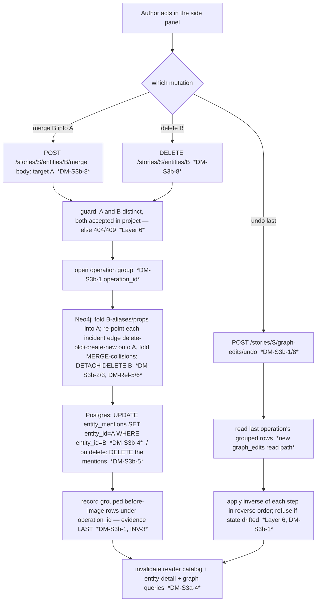

# M4.S3b — graph mutations that need downstream cleanup (merge · delete · undo)

> **✅ Status: ACCEPTED — register RESOLVED with the owner (2026-06-20).** Authoritative home for the
> resolution: `docs/PLAN_SHORT.md` Decided; spec **amended 2026-06-20** — **§3.4 (merge + delete) +
> §10 q2 (undo = append-only log)**; §3.5 left for S3c (its right-click is *mention*-level un-tagging,
> not whole-entity delete — the decompose's "delete → §3.5" was corrected to §3.4 at sign-off). ADR 0007
> drafted at build. The original
> forward-design body is kept intact below (public-portfolio history — append the resolution, don't
> delete the thinking). Mirrored to [[open-questions]] OQ-25.
>
> **Resolutions (owner, 2026-06-20):**
> - **DM-S3b-1 → general undo (my lean), + a new requirement: the author must *see what they are
>   undoing*.** Any edit/merge/delete is reversible newest-first via a grouped append-only `graph_edits`
>   log (a [[compensating-transaction]]); resolves §10 q2 as "append-only log of changes, executed". The
>   owner added that undo must **show what it is about to reverse** before it happens — so each operation
>   carries a **human-readable description** and the undo affordance **previews + confirms** (not a blind
>   pop). *Rejected:* undo-merge-only (inconsistent); full version history (post-PoC — recorded as the §10
>   q2 V1 path).
> - **DM-S3b-2 → author picks survivor, then resolves property conflicts BY HAND (owner chose this over
>   my survivor-wins lean).** More control, at the cost of a conflict-resolution step in the merge UI +
>   the backend surfacing conflicts and accepting the resolved values. Aliases still union (B's
>   canonical_name → an A alias). **§3.4 amended 2026-06-20** (merge in the detail panel).
> - **DM-S3b-3 → re-point all incident edges (delete-old+create-new), fold MERGE-collisions and REPORT
>   the count, drop post-merge self-loops** (my leans). DM-Rel-5/6 executed.
> - **DM-S3b-4 → Neo4j-then-Postgres-then-evidence, idempotent re-run** (my lean); mention re-point is a
>   bulk `UPDATE entity_mentions SET entity_id`.
> - **DM-S3b-5 → real `DETACH DELETE` + full-snapshot undo (my lean, owner-confirmed).** Not soft/tombstone
>   (avoids a read-filter through every screen). **§3.4 amended 2026-06-20** (delete in the detail panel —
>   corrected from the decompose's §3.5, which is mention-level S3c, not whole-entity delete).
> - **DM-S3b-6 → split be/fe** (my lean), with the be1(merge)/be2(delete+undo) fallback pre-authorised —
>   *more likely to be taken now*, since resolve-conflicts-by-hand (DM-S3b-2) enlarges the merge surface.
> - **DM-S3b-7 → INV-9 enumeration unchanged (ops live in `EntityEditService`); INV-3 now executed;
>   `graph_edits` unbounded = none-at-PoC + a noted undo depth-cap; ADR 0007 at build.**
> - **DM-S3b-8 → `POST …/entities/{eid}/merge`, `DELETE …/entities/{eid}`, `POST …/graph-edits/undo`**
>   (undo-last). The undo response/affordance carries the operation description (DM-S3b-1's see-what-I-undo).

> **Status: PROPOSED — register OPEN (DM-S3b-1..8 / OQ-25). The owner resolves before any code.**
> Step-0 forward design for the slice the M4.S3a proposal named at its seam ([[m4-entity-editing]]
> §"S3b (next)"). The three operations share one structural property the read/edit slices never had:
> **a single human action fans out into many writes across both stores**, and each must stay
> reversible. That is the whole design weight — not the UI.

This is the first slice that **re-points already-written graph state**. M3 never had to: relation
edges were *born* pointing at the survivor (endpoints resolve to a `merged` candidate's committed id —
[[relation-lifecycle]], DM-Rel-5 was explicitly deferred to "the M4 entity↔entity merge"). M4.S3a
edits a node *in place* (same id). S3b is where an id a write already committed against **changes or
disappears**: merging B into A re-points every edge and mention that pointed at B; deleting B removes
them. And because §11 demands every action be reversible, **undo** must replay the inverse of a
*compound* operation — which the S3a `graph_edits` log, per-row and ungrouped, cannot yet express.

---

## 0b. Operation-surface completeness sweep (CRUD over {entities, relations, mentions})

The feature is "manual correction in the reader", sliced by write-risk (S3a edit → S3b
merge/delete/undo → S3c text spans). Before fixing S3b's boundaries, the full operation surface and
its home:

| Object | Create | Read | Update | Delete | Merge / re-point |
|---|---|---|---|---|---|
| **Entity** | accept (M3.S4a) ✅ | side panel (S2) ✅ | field edit (S3a) ✅ | **S3b — NEW** | **S3b — NEW** (B→A consolidation) |
| **Relation** | decide (S4e) / manual-add (S3a) ✅ | ✅ | re-predicate (S3a) ✅ | remove (S3a) ✅ | **S3b — NEW** (re-point incident edges on merge) |
| **Mention** | accept (S4a) ✅ | reader (S1/S2) ✅ | — *(n/a — no field edit; re-point is the only mutation)* | **S3b — NEW** (delete on entity-delete) | **S3b — NEW** (re-point `entity_id` on merge) |
| **(cross-cutting)** | — | — | — | — | **Undo execution — S3b — NEW** (consumes `graph_edits`) |

**Every operation has a home; no slicing gap.** S3b owns: entity delete, entity↔entity merge (which
*contains* edge re-point + mention re-point), mention delete-on-entity-delete, and undo execution.
**Explicitly NOT here** (named at the seam, routed): manual tag/un-tag/change-boundaries → **S3c**
(reopens DM-IH-1 span storage); general **split** of a conflated entity + relation temporal/source
qualifiers → **post-PoC** (`docs/BACKLOG.md`). Mention "Update" is `n/a` — a mention has no editable
field; its only mutation is the re-point a merge causes (covered).

---

## Layers (the nine-layer pass — Balanced density)

1. **User / personas.** One author, full trust, local ([[project]] L1). No new [[trust-boundary]] —
   no egress, no LLM (name it so INV-2/INV-5 aren't hunted for). The payoff is *the author owns the
   graph*: the M3 cascade and S3a edits leave duplicates and junk nodes that only a human eye catches
   on reading; merge collapses a duplicate the matcher missed, delete removes a spurious extraction,
   and undo is the safety net that makes both **safe to try** (the §11 "never trust and forget"
   principle, now applied to the *author's own* destructive actions, not just the LLM's).
2. **Business.** Both drivers ([[project]] L2). Authoring: a clean baseline graph needs destructive
   correction, not just additive edits. Portfolio: this is the highest-stakes correctness set-piece in
   M4 — a reviewer sees the human-gate invariants tested by *destructive, multi-write, reversible*
   operations. Getting the compound-undo right is the demonstration.
3. **Domain.** No new persisted *nouns*. New *verbs*: **merge** (absorb entity B into survivor A),
   **delete** (remove an entity and its traces), **undo** (reverse the last graph operation). One
   concept this slice forces into first-class existence: a **graph operation** — a *named, grouped*
   unit of edits that is the atom of undo (today `graph_edits` rows are ungrouped). The ubiquitous
   language gains "merge **into**" (direction matters — B into A, A survives) and "undo" as a
   deterministic reverse, **not** an LLM action (§4.3).
4. **Data.** **The first re-point of committed identity.** A merge mutates: Neo4j (fold B's
   aliases/properties into A; **delete-old + create-new** every edge incident to B so it points at A —
   the edge id `uuid5(subject,predicate,object)` changes when an endpoint changes, DM-Rel-5/6; delete
   the B node) **and** Postgres (`UPDATE entity_mentions SET entity_id = A WHERE entity_id = B` — the
   per-mention `vector(768)` follows the row for free, no separate migration). Delete mutates: Neo4j
   `DETACH DELETE` the node (drops incident edges) **and** Postgres `DELETE FROM entity_mentions WHERE
   entity_id = B`. The **ownership seam** ([[overview]] L4, OQ-1) recurs on the *write* side: the two
   stores can't share a transaction, so write order must leave a **retryable** state, never a
   half-merge. Undo reads `graph_edits` back (no read path exists today) and applies the inverse.
5. **Behavior.** **Two terminal exits the lifecycles never had, plus an undo arc.**
   [[candidate-lifecycle]]'s committed node and [[relation-lifecycle]]'s `written` edge both gain a
   `→ deleted` exit (entity delete; merge deletes B; edge re-point deletes-then-recreates). Undo is the
   **inverse transition** of whatever the last operation was — `deleted → committed` (restore from
   snapshot), un-merge (re-split B out of A, restore its edges/mentions), un-edit (S3a field restore).
   This makes the §4.3 "deterministic undo *stack*" real: operations form an append-only log; undo pops
   the last. See **State & invariants**.
6. **Errors.** [[fail-closed]] on the destructive side. Merge target rejected/merged-away in another
   tab → a **dangling reference** ([[referential-integrity]]) → refuse (404/409), never write to a
   ghost. A half-completed cross-store merge → **retryable**, never silently lost. Undo of an operation
   whose state already drifted (the merged entity was since edited) → must detect and refuse rather than
   blindly restore a stale snapshot over newer data (a [[lost-update]] in reverse). "Refuse, don't
   half-apply."
7. **Security.** Author's own data, no egress, no LLM (named). The live concern stays **stored-XSS over
   the author's own input** — a merged/edited `canonical_name`/`properties` renders into reader/panel,
   must stay React-escaped (no `dangerouslySetInnerHTML`), as M4.S1/S2/S3a held. No new boundary.
8. **Compliance / Audit.** **The load-bearing layer — INV-3 stops being a *substrate* and starts being
   *executed*.** S3a recorded a before→after row per edit; S3b must (a) **read** that log and (b) group
   a merge's N writes as **one** reversible operation. Each destructive transition's *effect* is its
   `graph_edits` row(s); undo's *effect* is the inverse plus its own audit row (an undo is itself an
   auditable action — "the author un-merged X at T"). This is also the **§10 q2** resolution surface
   (graph versioning/rollback): the proposed answer is the spec's own "append-only log of changes",
   *executed* as undo — not snapshots-per-story, not full versioning.
9. **Operations.** No new infra, no LLM (INV-5 n/a — named). One ops note: a merge/delete is a heavier
   write (N edges + M mentions) than a field edit — trivial at one author's scale, but the
   read-view invalidation (reader catalog + graph + detail, DM-S3a-4) now fires after a *structural*
   change, so the reader must tolerate a node *vanishing* between fetches (the same benign single-user
   consistency window, now on a delete).

---

## Stations (enforcement-lifecycle checklist — empty boxes named)

| Station | State | Note |
|---|---|---|
| **Identity** | n/a | single local user, no auth ([[overview]]) |
| **Intent** | ✅ | the author explicitly invokes merge (pick survivor + confirm) / delete (confirm) / undo — a deliberate, often *destructive* human gesture |
| **Policy** | ✅ | only **accepted-graph** entities/edges are mergeable/deletable (never a staged candidate/held relation — the read-side echo of INV-1, now on a destructive write); merge needs **two distinct accepted** entities |
| **Decision** | ✅ deterministic | the human picks survivor + target / confirms delete / requests undo — no model, pure human data entry ([[prefer-deterministic]]); undo is a **deterministic** reverse (§4.3), never LLM-reconstructed |
| **Access** | n/a | localhost binding is the only gate |
| **Monitoring** | n/a | no LLM call, nothing to meter (INV-5 n/a) |
| **Evidence** | ⚠ **the open station** | a merge/delete must leave a **grouped, reversible** before-image (DM-S3b-1); the S3a per-row log is insufficient for a compound op. This is the station S3b exists to fill. |
| **Expiry** | ⚠ | `graph_edits` retention — the same **none-at-PoC** posture as `candidate_decisions`/`staged_relations` (OQ-4). But note: an *unbounded* undo log is the price of "always reversible"; name it (a depth cap is the V1 refinement). |
| **Review** | ✅ | the merge/delete/undo **is** the human review acting on the graph — the human is the reviewer (§3.3 Stage-4 spirit, post-commit). |

The **⚠ Evidence** station is the centre of the register (DM-S3b-1): a compound destructive write with
no grouped before-image cannot satisfy INV-3's "undo this *operation*."

---

## Data flow

A merge: the author opens entity B's side panel → "merge into…" → picks survivor A via the existing
entity search ([[m4-entity-editing]] DM-S3a-8 reuse) → confirms. The service, under the human gate,
runs a **compensating-transaction-shaped** ([[compensating-transaction]]) operation: record an
*operation header* (a group id), then for each step write the graph + a grouped `graph_edits` row, in
a **retryable order** (graph first, evidence last — the S3a/accept pattern), then invalidate the read
views. Delete is the same shape with a full-node before-image snapshot. Undo reads the last operation's
grouped rows and applies each step's inverse in reverse order, recording its own audit.

The **`graph first → evidence last`** order makes a crash retryable (re-run re-reads state, idempotent —
B already gone ⇒ the merge no-ops that step). The **operation group** (DM-S3b-1) is what lets undo treat
"merge" as one reversible atom instead of N orphan rows.

---

## State & invariants

**New transitions (folded into the state-machine notes / `invariants.md` only on acceptance):**

- **Entity (committed node).** Gains `committed → deleted` (human delete or merge-of-B; effect =
  Neo4j `DETACH DELETE` + the cross-store mention cleanup/re-point + a grouped before-image) and the
  **inverse** `deleted → committed` (undo restores from the snapshot). Extends the S3a edit
  self-transition in [[candidate-lifecycle]].
- **Relation (committed edge — extends [[relation-lifecycle]]).** Merge re-points an incident edge:
  `written → removed` (old id) + a fresh `[*] → written` (new id on A) — the edge-id-is-content rule
  again ([[m4-entity-editing]] DM-S3a-3). A merge's self-loop (B↔B becomes A↔A) is dropped as an
  artifact (consistent with the extraction path) unless it was a *manual* self-loop S3a allowed —
  flag (DM-S3b-3).
- **Graph operation (NEW, the undo unit).** A short append-only machine: `applied → undone`; undo is
  the only transition; re-undo is an idempotent no-op. This is the §4.3 "deterministic stack" made
  explicit. (Worth a short `state-machines/graph-operation.md` **on acceptance**.)

**Invariant pressure:**

- **INV-1 (human gate) — upheld.** Merge/delete/undo are all human-initiated; no automated stage
  performs them. (A future "auto-merge high-confidence duplicates" would violate this, not optimise it.)
- **INV-9 (only human-reached handlers write the graph) — upheld; enumeration likely unchanged.**
  Merge/delete/undo land in the existing `EntityEditService` (the S3a "edit" handler), reached only
  from human endpoints — so INV-9's "accept, decide, **edit**" wording already covers them (the *edit*
  handler grows operations; no new writer service). Confirm at build that no new writer class is
  introduced; if undo warrants its own service, INV-9's enumeration grows by one (broaden-don't-mint
  again). **The grep guard widens** to `delete_entity` + the mention re-point/delete SQL.
- **INV-3 (reversible + evidence) — finally *executed*, and this slice's load-bearing one.** S3a
  recorded the before-image; S3b *consumes* it. The honest risk: a destructive op whose before-image is
  *incomplete* (a merge that re-points 20 edges but the snapshot caught 19) is a **non-reversible
  action masquerading as reversible** — worse than no undo. So the before-image completeness is a
  test-first must (the failing test: "merge then undo restores the exact prior graph + mentions").
- **INV-4 (open-world) — upheld.** Merge's property reconciliation must keep `properties` a free dict
  and `type` a free string (DM-S3b-2) — never collapse to a fixed schema.
- **INV-2 / INV-5 — n/a** (no egress, no LLM). Named so a reviewer doesn't hunt.

---

## Decision register (OPEN — DM-S3b-1..8; mirrored to [[open-questions]] OQ-25)

> Each entry: **Context / Options / My proposal / Open.** I *propose*; the owner *resolves*.
> `verify-at-build` marks any call resting on un-inspected behaviour.

### DM-S3b-1 — Undo scope + the `graph_edits` grouping **(the central decision; ties §10 q2)**
> **✅ Decision (owner, 2026-06-20): (b) general undo via a grouped append-only log — AND undo must show
> what it is about to reverse.** Any edit/merge/delete is reversible newest-first; resolves §10 q2 as the
> spec's "append-only log of changes", executed. The owner's added requirement: an operation carries a
> **human-readable description** ("merged *Bronek* into *Bronisław*"; "deleted *the Shard*") and the undo
> affordance **previews + confirms** rather than blind-popping. Build consequence: the operation header
> stores a description string; the undo endpoint returns *what would be undone*; the fe shows it before
> acting. *Rejected:* (a) undo-merge-only (inconsistent INV-3); (c) full versioning (post-PoC, the §10 q2 V1 path).
- **Context.** §11 demands reversibility; §4.3 wants a "deterministic undo *stack*". The S3a
  `graph_edits` table is **per-row, write-only, with no group id and no read path** (verified:
  `domain/graph_edit.py`, `adapters/postgres_edit_store.py`, migration `3d760a15b9f9`). A merge is **one
  action = N writes**, so it has no way to be undone as a unit today. §10 q2 (graph versioning/rollback)
  is the spec's own open question this resolves.
- **Options.**
  - **(a) Undo-merge only** — narrowest; a bespoke "un-merge" that re-splits B from A. Cheapest, but
    leaves S3a field edits, relation add/remove, and delete *not* undoable — an inconsistent INV-3.
  - **(b) General undo of any operation, via a grouped append-only log** — add a nullable
    `operation_id` (+ a per-op sequence) to `graph_edits`, a read path, and a uniform "apply the
    inverse of each row" reverser; undo pops the last operation. Resolves §10 q2 toward the spec's
    "append-only log of changes". Every S3a/S3b mutation becomes undoable uniformly.
  - **(c) Full graph versioning / snapshots-per-story** (§10 q2's heavier options) — most powerful,
    far past PoC scope.
- **My proposal.** **(b)** — it is barely more than (a) once you accept a merge needs grouping anyway,
  and it makes INV-3 *uniform* (S3a edits become undoable too, closing the "undo enabled, not shipped"
  note in ADR 0006). It is the [[compensating-transaction]] pattern: each forward step stores enough to
  emit its inverse. The undo *stack* is "operations ordered by time, undo the latest not-yet-undone".
  *Considered & rejected:* (a) inconsistent reversibility; (c) post-PoC (record as the V1 path in §10 q2).
  **`verify-at-build`:** that each op type's inverse round-trips (merge→un-merge restores the exact
  graph+mentions; delete→undo restores node+edges+mentions; edit→undo restores fields) — the failing
  tests.
- **Open.** Owner: undo scope (a / **b** / c)? Is undo a **global "undo last"** stack, or
  **per-entity** undo? Is a single level of undo enough at PoC, or a full stack (depth cap → Expiry,
  DM-S3b-7)?

### DM-S3b-2 — Merge consolidation semantics **(spec-silent → a §3.4 amendment)**
> **✅ Decision (owner, 2026-06-20): author picks the survivor, then resolves property conflicts BY HAND
> (owner chose (ii) over my survivor-wins lean (i)).** The author chooses which entity survives; the
> other's `canonical_name` + aliases union into the survivor; **where both set the same property
> key differently, the author is shown the conflict and picks the value to keep** (non-conflicting keys
> union automatically). Build consequence: the merge is *not* a single atomic call — the backend must
> **detect property conflicts and surface them**, and the merge commits with the author's resolved
> values (enlarges the merge UI + endpoint; strengthens the be1/be2 split, DM-S3b-6). The discarded
> values still land in the before-image for undo. **§3.4 amended 2026-06-20** (merge in the detail panel).
- **Context.** The spec says merge happens (§3.3/§3.6/§8.3 "M = merge with…") but **never defines how
  two accepted entities consolidate**: which `canonical_name_*` survives, how aliases/properties/
  `first_seen` reconcile. This must be defined and (since the spec is silent on the §3.4 detail-panel
  merge) likely **amended into §3.4** via the stop-and-amend flow.
- **Options.** Survivor: **(a)** the author explicitly picks the survivor A in the UI (B is absorbed);
  **(b)** a rule (older/more-mentions wins). Aliases: union A∪B + add B's `canonical_name` as an A
  alias (the accept-merge pattern, `add_alias`). Properties: **(i)** survivor-wins on key conflict +
  union non-conflicting B keys; **(ii)** surface conflicts for the author to resolve; **(iii)** union,
  B overwrites.
- **My proposal.** Survivor **(a) author picks** (explicit, no surprise — merge is destructive).
  Aliases **union + B's canonical_name as an alias of A** (reuse `add_alias`, idempotent). Properties
  **(i) survivor-wins, union the rest**, and **record the discarded B values in the before-image** so
  undo restores them and nothing is silently lost. `first_seen` keep A's. *Considered:* (ii) surface
  conflicts is the cleaner V1 UX but ceremony at PoC; record it as a backlog refinement.
- **Open.** Owner: author-picks-survivor (my lean) vs a rule? Property conflict: survivor-wins (my
  lean) vs surface-to-author? Confirm the §3.4 amendment.

### DM-S3b-3 — Edge re-point on merge (DM-Rel-5/6, finally executed)
- **Context.** Every edge incident to B must point at A after the merge. Because `relation_edge_id =
  uuid5(subject_id, predicate, object_id)`, re-pointing an endpoint **changes the id** → it is
  delete-old + `create_relation`-new (the S3a re-predicate mechanic). `get_neighbourhood(B)` already
  enumerates B's incident edges in both directions (verified). A re-pointed edge `(A, p, X)` that
  **already exists** MERGE-collapses (DM-Rel-6 idempotency) — the silent-fold hazard S3a surfaced as
  `merged_into_existing`.
- **Options.** Collision: **(a)** fold silently; **(b)** fold but **report the count** (the
  `merged_into_existing` analogue) so the author knows multiplicity was lost. Self-loop after merge
  (B→B becomes A→A): **(a)** drop as artifact (extraction-path rule); **(b)** keep if it was a *manual*
  self-loop S3a allowed.
- **My proposal.** Re-point all incident edges (both directions) via delete-old + create-new onto A,
  recording **each** in the operation group (so undo restores the original endpoints); **fold
  collisions and report the count** (b — surface, don't silently dedup); **drop** post-merge self-loops
  as artifacts (a), consistent with [[relation-lifecycle]]. Each re-pointed/folded edge is a grouped
  before-image row. **`verify-at-build`:** the re-point + collision-fold round-trips under undo.
- **Open.** Owner: report collisions (my lean) vs silent fold? Drop vs keep a post-merge self-loop?

### DM-S3b-4 — Mention re-point (the cross-store half; OQ-1 on the write side)
- **Context.** B's `entity_mentions` rows must move to A or the reader silently drops B's highlights /
  the panel shows a ghost ([[m4-inline-highlights]] OQ-21, [[m4-side-panel]] OQ-22 named this). No
  re-point method exists today (verified — only `insert_entity_mention`). The per-mention `vector(768)`
  follows the row automatically (no separate migration). The two stores can't share a transaction (OQ-1).
- **Options.** Order: **(a)** Neo4j (fold + re-point edges + delete B) then Postgres (`UPDATE … SET
  entity_id = A`) then evidence last; **(b)** Postgres first. Idempotency: the op must tolerate a
  re-run after a partial crash.
- **My proposal.** **(a) Neo4j-then-Postgres-then-evidence** (the accept-path order, OQ-1 posture (c)),
  with the whole op **idempotent**: a re-run after B's node is already deleted skips that step and the
  `UPDATE` is a no-op (no rows match B). The mention re-point is a single bulk SQL `UPDATE`.
  **`verify-at-build`:** a crash between the Neo4j and Postgres writes leaves a retryable state (re-run
  completes the merge), not a half-merge — the integration test.
- **Open.** Confirm Neo4j-then-Postgres ordering + idempotent re-run (my lean).

### DM-S3b-5 — Whole-entity delete semantics **(spec-silent)**
- **Context.** §3.5 has "not this entity" correction UI but the spec **never defines whole-entity
  delete**: hard vs soft, cascade vs refuse. Delete must be reversible (INV-3) → its before-image is a
  **full snapshot** (node fields + incident edges + mentions), heavier than a field edit's diff.
- **Options.** **(a) hard `DETACH DELETE`** the node (drops incident edges) + `DELETE FROM
  entity_mentions WHERE entity_id = B`, with a full-snapshot before-image for undo. **(b) soft delete**
  (a `deleted` flag, hidden from every read) — easier undo, but *every* read path (reader, graph,
  panel, search, cascade) must learn to filter, a broad change.
- **My proposal.** **(a) hard delete + full-snapshot before-image** — avoids threading a
  tombstone-filter through every read ([[fail-closed]] simplicity), and the append-only-log undo model
  (DM-S3b-1b) already carries the snapshot. *Considered:* (b) soft delete is the cleaner "trash/restore"
  V1 UX but its read-filter sprawl is real risk at PoC. **`verify-at-build`:** delete→undo restores the
  node, its incident edges, and its mentions exactly.
- **Open.** Owner: hard delete + snapshot-undo (my lean) vs soft/tombstone? Refuse delete of an entity
  that is some other entity's merge-survivor, or allow?

### DM-S3b-6 — Slice split (be/fe, and is the backend itself one slice?)
- **Context.** Under DM-S3b-1b the backend is: `Neo4jRepo.delete_entity` + edge re-point + merge
  orchestration in `EntityEditService` + the Postgres mention re-point/delete + a `graph_edits`
  migration (add `operation_id`/sequence) + read path + the undo reverser + 3 endpoints + OpenAPI regen.
  The frontend is: a "merge into…" flow (reuse the entity picker), a delete-with-confirm, and an undo
  affordance, + hooks/invalidation.
- **Options.** **(a)** split **S3b-be** / **S3b-fe** (the S2/S3a rhythm). **(b)** further split the
  backend: **S3b-be1** = merge + re-point (the riskiest), **S3b-be2** = delete + the undo reverser —
  if be1+be2 is too big for one green session.
- **My proposal.** **(a) split be/fe**, and **provisionally keep the backend one slice** but
  pre-authorise the be1/be2 cut if the merge+undo test surface proves too large mid-build (flag it now
  so the cut isn't a surprise). The undo reverser is *shared* by merge+delete+edit, so building it once
  alongside merge is cohesive.
- **Open.** Owner: confirm be/fe split; pre-authorise the be1/be2 fallback?

### DM-S3b-7 — Invariants, Expiry, and the ADR
- **Context.** Merge/delete/undo are new graph-writing operations; INV-1/INV-9 must be checked; INV-3
  goes from substrate to executed; an unbounded undo log is an Expiry question; the §10 q2 resolution +
  the two-store merge contract are ADR-worthy.
- **My proposal.** **INV-9 enumeration unchanged** if merge/delete/undo live in `EntityEditService`
  (the "edit" handler grows ops); grep guard widens to `delete_entity` + mention SQL — confirm at
  build. **INV-3** gets a note that it is now *executed* (undo), with the completeness-of-before-image
  as its guard. **Expiry:** `graph_edits` unbounded = accepted **none-at-PoC** (OQ-4 family), but an
  undo **depth cap** is a cheap V1 refinement — record it. **ADR 0007** (escalated MADR — it resolves
  an open spec question §10 q2 **and** crosses the two-store data-ownership boundary): the
  merge/delete/undo contract + the append-only-log-as-undo model, **drafted at build on owner
  confirmation**, test-first, the ADR-0005/0006 broaden-don't-mint lineage.
- **Open.** Owner: confirm ADR 0007 at build; confirm none-at-PoC Expiry with a noted depth-cap.

### DM-S3b-8 — Endpoint shapes ([[backend-for-frontend]] write surface)
- **Context.** Three new human-reached write endpoints, declaring every non-2xx (`backend/src/
  story_forge/AGENTS.md`).
- **My proposal.** `POST /stories/{sid}/entities/{eid}/merge` body `{target_entity_id}` (eid=absorbed
  B, target=survivor A) → 200 with a merge summary (re-pointed/folded counts) / 404 (either missing) /
  409 (same id, or stale); `DELETE /stories/{sid}/entities/{eid}` → 204 / 404; `POST
  /stories/{sid}/graph-edits/undo` (undo-last) → 200 with what was undone / 404 (nothing to undo) / 409
  (state drifted). Regenerate the OpenAPI snapshot + typed client.
- **Open.** Owner/confirm-at-build: merge direction in the URL (absorbed in path, survivor in body — my
  lean) vs both in body; undo as "undo last" (my lean, matches the §4.3 stack) vs undo-by-operation-id.

---

## But what if (edge cases — name the failure, teach the name)

- **…the merge survivor A was deleted/merged-away in another tab before confirm?** A **dangling
  reference** ([[referential-integrity]]). Refuse 404/409 (re-resolve both endpoints at commit, the
  [[toctou]] guard `RelationReviewService` already models) — never write to a ghost.
- **…B and A are the same entity (self-merge)?** Reject 409 — a no-op merge that would delete the only
  node. Guard explicitly.
- **…re-pointing B's edge onto A collides with an edge A already has?** MERGE-collapse loses
  multiplicity (DM-S3b-3) — **report the fold count**; record the original in the before-image so undo
  restores the distinct edge.
- **…the merge crashes after Neo4j but before the Postgres mention re-point?** A **partial cross-store
  write**. The op is idempotent (DM-S3b-4) — a re-run re-reads state (B's node gone, edges re-pointed)
  and completes only the missing mention `UPDATE`. Never a half-merge silently left.
- **…undo is requested but the merged entity A was edited since the merge?** Restoring the snapshot
  blindly would clobber the newer edit (a [[lost-update]] in reverse). **Refuse** (the operation is no
  longer cleanly the top of the stack) or undo only the still-matching parts — owner call; default
  fail-closed (refuse, tell the author what drifted).
- **…undo is run twice?** Idempotent no-op (the operation is already `undone` — the graph-operation
  machine's guard).
- **…delete an entity that is the survivor of an earlier merge?** Its aliases include the absorbed B's
  name; deleting it is legal but the earlier merge's undo is now compromised (its survivor is gone).
  Surface, or block delete while an un-undone merge depends on it — DM-S3b-5 open.
- **…a merge re-points 0 edges and 0 mentions (B was bare)?** Fine — fold aliases/props, delete B,
  record an empty-edge-set operation; undo restores B as a bare node.
- **…the undo log grows without bound over a long editing session?** Accepted none-at-PoC (Expiry,
  DM-S3b-7); a depth cap is the V1 refinement — name it, don't silently let it grow as if free.

---

## Gaps for the product owner (plain language — the calls only you can make)

> **✅ All resolved (owner, 2026-06-20) — see the resolution banner at the top.** (1) **general undo**
> + the author **sees what they're undoing** (a preview/confirm); (2) **author picks the survivor and
> resolves property conflicts by hand** (owner chose more control over my survivor-wins lean); (3)
> **real delete, fully undoable** from a snapshot; (4) collisions are **reported**; (5) split be/fe, the
> be1/be2 fallback now likely, ADR 0007 at build, reuse the entity-search picker. The **§3.4/§3.5 spec
> amendments** (merge + delete semantics) await owner sign-off on wording before code. Items below kept
> as the original plain-language framing (history).

1. **How much "undo" do you want?** (DM-S3b-1, the big one.) My lean: build a **general undo** — any
   edit, merge, or delete can be reversed, newest-first, like a normal undo button — because once a
   *merge* needs grouping to be undoable, extending it to everything is cheap and makes "undo" mean one
   consistent thing. The narrower alternative (only un-merge) leaves edits and deletes permanent, which
   feels inconsistent. The much bigger alternative (full graph version history) is real but post-PoC.
2. **What does "merge B into A" actually do to the data?** (DM-S3b-2 — *the spec doesn't say*, so we'd
   write it down and amend §3.4.) My lean: **you pick which entity survives**; the other's names become
   aliases; on a conflicting property the survivor wins but we *remember* the discarded value so undo
   can restore it. Alternative: ask you to resolve each property conflict by hand (cleaner, more
   clicks).
3. **What does deleting an entity do, and the spec doesn't say either.** (DM-S3b-5.) My lean: a **real
   delete** (the node and its mentions go), but fully **undoable** from a saved snapshot — rather than a
   "hidden/trash" soft-delete that would force every screen to learn to skip hidden entities.
4. **When two of B's relations would become the same relation on A, we lose that something was said
   twice.** (DM-S3b-3.) My lean: **tell you** ("2 relations merged") rather than silently fold.
5. **Confirm:** one session backend then one session frontend (like the side panel); a likely **ADR
   0007** recording the merge/delete/undo contract; reuse the existing entity-search for "pick the
   entity to merge into".

---

## Hand-off (register OPEN — owner resolves DM-S3b-1..8 before any code)

Per the project's **spec- and test-driven** rule, **no production code until the owner resolves the
register** — and DM-S3b-1/2/5 carry **spec-silence**, so resolving them likely means a **stop-and-amend
of §3.4/§3.5** (merge + delete semantics) and a partial resolution of **§10 q2** (undo = append-only
log) *first*. Once resolved, the first failing test is the **pure merge-consolidation function** —
given two `GraphEntity`s + a survivor choice, produce the consolidated survivor + the list of
re-point/fold/discard steps (pure, deterministic, no store) — then (test-first, layering per
`backend/src/story_forge/AGENTS.md`): the `graph_edits` grouping migration + read path → `Neo4jRepo.
delete_entity` + the edge re-point + the Postgres mention re-point/delete (integration) → the merge /
delete / undo orchestration in `EntityEditService` → the three endpoints (declare **every** non-2xx;
regenerate the OpenAPI snapshot + typed client) → then **S3b-fe**.

On acceptance: draft **ADR 0007** (owner-confirmed), fold the new transitions + the **graph-operation**
machine into the state-machine notes + `invariants.md` (INV-3 now executed; the grep guard widens),
draw `state-machines/graph-operation.md`, and reconcile the register to *resolved* across this note +
[[open-questions]] OQ-25 + `docs/PLAN_SHORT.md` Decided + the spec amendments.
