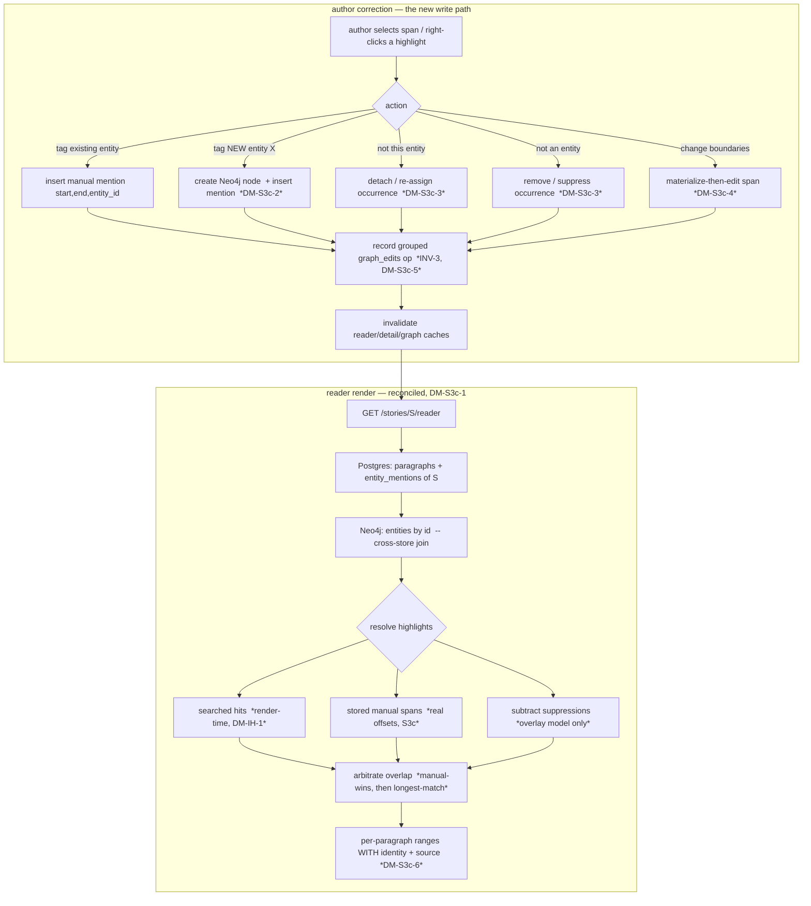

# M4.S3c — manual tag / un-tag / change-boundaries (step-0 forward design)

> **Status: ACCEPTED — register RESOLVED with the owner (Session 44, 2026-06-22). Build is next session
> (M4.S3c-be test-first; ADR 0008 drafted at build).** This is the M4.S3c step-0 decompose, the **final
> slice** of "manual correction in the reader" (the feature M4.S3a sliced by write-risk: S3a
> edit-fields+relations · S3b merge/delete/undo · **S3c tag/un-tag/boundaries**). Authority: spec **§3.5**
> ("Manual tagging" + "Manual correction: right-click → 'not this entity' / 'not an entity' / 'change
> boundaries'"), with **§3.2/§6.4** (entity_mentions/offsets) as the data home. Centre of gravity =
> **DM-S3c-1** (the span-storage model). Authoritative home of the resolutions: `docs/PLAN_SHORT.md`
> Decided (Session 44) + this banner; OQ-26 mirrors. The register text below keeps its original
> Context/Options reasoning (public-portfolio history); each entry's **Resolution** is appended.
>
> **Resolutions (owner, Session 44):**
> - **DM-S3c-1 → (B) overlay — "save only what you touch."** Keep render-time search for auto
>   highlights; a manual tag persists a **stored span** (real offsets) that overlays + wins over search;
>   a rejected highlight writes a **suppression** record the resolver subtracts; change-boundaries on a
>   search hit **materializes** that one occurrence. **Incremental** [[materialization]] — no backfill,
>   DM-IH-1's rename-free/edit-robust properties preserved for the auto layer. *Rejected:* (A)
>   materialize-all (a migration + discards DM-IH-1's properties); (C) alias-only (cannot express
>   change-boundaries or single-occurrence un-tag — fails the requirement).
> - **DM-S3c-2 → (a) both attach-existing AND create-new-entity.** Tagging offers a picker to attach to
>   an existing entity *and* a "create new entity of type X" path (a new human-reached graph writer —
>   INV-9 enumeration grows). The headline "catch an entity extraction missed" use needs create-new.
> - **DM-S3c-3 → occurrence-level corrections.** "not an entity" suppresses/removes the occurrence; "not
>   this entity" suppresses/removes **and** optionally re-tags to the right entity, recorded as one
>   grouped op (atomic re-assign — single-step undo).
> - **DM-S3c-4 → materialize-then-edit** (follows DM-S3c-1 B): the first change-boundaries on an auto
>   highlight promotes that occurrence to a stored manual span, then edits offsets in place.
> - **DM-S3c-5 → (a) yes — tag/un-tag/boundary ops ride the S3b `graph_edits` undo** (new op-kinds +
>   inverters; the existing story-scoped Undo button covers tagging, preview-before-reverse). Inverters
>   `verify-at-build` round-trip, **contract-tested from the writer's real output** (PR-#108 lesson).
> - **DM-S3c-6 → (a) add `source: search|manual` + nullable `mention_id` to `ReaderHighlight`** so a
>   correction addresses a specific occurrence unambiguously.
> - **DM-S3c-7 → (b) ADOPT TIPTAP NOW — owner override** (my lean was (a) native selection). The owner
>   chose to pay the Tiptap/ProseMirror setup in this slice so the V2 editing features (§4 inline
>   suggestions, rewrite-diff) inherit a robust selection+decoration engine rather than building
>   selection by hand twice. **Build note:** Tiptap is a new frontend dependency → `/add-dependency`
>   (exact pin, ≥14 days old, §6.7) at the fe build; the read-only `<mark>` renderer (DM-IH-3) is
>   replaced by Tiptap read-only mode with ProseMirror **decorations** for highlights.
> - **DM-S3c-8 → split** M4.S3c-be (mention/tag mutators + reconciling resolver + suppression + endpoints
>   + undo op-kinds) / M4.S3c-fe (Tiptap reader + selection + context menu + tag picker + hooks).
> - **DM-S3c-9 → no §3.5 *capability* amendment needed; storage model + INV-9 reword land in ADR 0008 at
>   build** (the S3a precedent — §3.5 already specifies manual tagging + the three corrections). A small
>   **§6.4 data-model clarification** (human-authored mentions carry real offsets; a suppression record
>   exists) is the one spec touch, taken through stop-and-amend *at build* if the migration needs it.
>   INV-9's enumeration grows for the new-entity-from-tag writer (broaden-don't-mint, as S3a/S3b).

**Requirement.** From the read-only reader ([[m4-inline-highlights]], shipped), let the solo author
**correct the graph at the level of an individual textual occurrence**:

1. **Manual tagging** — select an arbitrary text span → "this is an entity of type X" → add it to the
   graph (X may be an **existing** accepted entity, or a **new** one created on the spot).
2. **Manual correction** — right-click a highlight →
   - **"not this entity"** — this occurrence is an entity, but not the one highlighted (re-assign / detach);
   - **"not an entity"** — this occurrence is not an entity at all (remove the highlight);
   - **"change boundaries"** — the entity is right but the highlighted span is wrong (widen/narrow it).

**The one finding that dominates the design.** Today **a rendered highlight is not a stored record — it
is a render-time *search hit* with no identity.** The reader's `GET /stories/{id}/reader` reads
`entity_mentions` only to learn *which* accepted entities appear in a story, then
`domain/highlights.resolve_highlights` **searches each paragraph's prose** for those entities'
`canonical_name` + aliases and returns the matched ranges (DM-IH-1, resolved-as-built: `span_start`/
`span_end` on `entity_mentions` are **NULL** and unused by the reader). Two consequences make S3c hard,
and they are the whole reason this slice is non-trivial:

- **A manual tag is an arbitrary span search can never re-find.** The author may tag an *inflected*
  form ("Jankowi"), a *pronoun* ("he"), or a span of a *brand-new* entity — none of which is the
  canonical name or an alias. So a manual span **must persist real character offsets**; it cannot be a
  search target. This is the exact thing DM-IH-1's render-time-search design deliberately did *not* do.
- **Un-tagging acts on a highlight that has no row to delete.** "not this entity" / "not an entity"
  right-click a *derived* search hit. There is no `entity_mentions` row backing that specific
  occurrence (the mention is paragraph-level; the hit is one of possibly several search matches). You
  cannot `DELETE` a search result — you can only **suppress** it or **convert the whole model to stored
  spans**.

So S3c is, first, a **storage-model decision**: does the reader's highlight layer stay *derived* (render-
time search) with manual spans as a stored *overlay* + a *suppression* concept, or does it **materialize**
— move to stored per-occurrence spans as the source of truth? **Materialization** (turning a computed
projection into durable stored records so it gains identity, can be addressed, corrected, and reversed —
the inverse of the "render-time projection" DM-IH-1 chose) is the new architectural idea this slice
introduces, and DM-S3c-1 is where the owner decides how far to take it.

---

## 0b. Operation-surface completeness sweep

**Feature:** "manual correction in the reader", sliced across S3a/S3b/**S3c** at the 2026-06-19 M4.S3a
decompose ([[m4-entity-editing]]). S3c is the **last** slice. The sweep here is over the **mention**
domain object (the one S3a/S3b deferred to "spans") plus the **entity-create-from-tag** path:

| Operation | Object | Home | Status |
|---|---|---|---|
| **Create** mention (tag an *existing* entity at a span) | mention | **S3c** | this slice |
| **Create** entity **+** mention (tag a *new* entity of type X) | entity + mention | **S3c** (DM-S3c-2) | this slice |
| **Read** (render highlights in the reader) | mention/highlight | M4.S1 ([[m4-inline-highlights]]) | built — *reconciled here* |
| **Update** span boundaries ("change boundaries") | mention | **S3c** (DM-S3c-4) | this slice |
| **Update** which entity ("not this entity" → re-assign) | mention | **S3c** (DM-S3c-3) | this slice |
| **Delete / suppress** ("not an entity") | mention | **S3c** (DM-S3c-3) | this slice |
| Reverse any of the above (undo) | graph-operation | **S3c** (DM-S3c-5) | this slice |

**No slicing gap — the sweep closes.** Every mention operation has a home in S3c; the read path is the
M4.S1 highlighter this slice *reconciles* against (DM-S3c-1). The two operations the S3a sweep
explicitly routed **post-PoC** (`docs/BACKLOG.md`) stay there and are **out of scope**: general entity
**split** (one node → two) and relation **temporal/source qualifiers**. Entity-level CRUD (fields,
relations, merge, whole-entity delete, undo) is **done** in S3a/S3b — S3c does not re-touch it. After
S3c lands, "manual correction in the reader" is feature-complete for the PoC.

---

## Layers (the nine-layer pass)

A **per-feature** altitude pass (all nine ripple); I name where each is loud. This is the **second M4
*write* family** after S3a/S3b — but the first that writes the **mention** layer and the first to make
the reader's highlight projection *partly authoritative* rather than purely derived.

1. **User / personas.** One persona, full trust, local ([[project]] L1). No new trust surface — the
   author annotates their own text, no egress, no LLM. The payoff is *closing the correction loop where
   errors surface*: the smoke test (S33) argued the reader is exactly where a wrong/missing highlight is
   noticed, so this is where the fix belongs.
2. **Business.** Both drivers: a real authoring aid (fix the world model in-place) **and** the portfolio
   set-piece that completes "the graph is live *and editable* over the prose". Closes the §3.5 surface.
3. **Domain.** No new nouns, but one is **promoted**: a **Mention** (`entity_mentions` — an entity's
   appearance in a paragraph) stops being a back-reference the cascade writes and becomes a
   *human-authored, addressable, span-bearing* record. New verbs: *tag* (create a mention, possibly
   creating its entity), *un-tag* (suppress/remove a mention occurrence), *re-tag* (move an occurrence to
   another entity), *re-bound* (change a span). A *manual span* is a `[start, end)` char range the author
   asserts (vs DM-IH-1's *searched* range the resolver computes).
4. **Data.** The **finding** layer. Today `entity_mentions.span_start/end` are NULL and the reader
   ignores them; S3c gives them meaning for manually-authored rows (and possibly all rows — DM-S3c-1).
   A *new-entity* tag also writes a Neo4j node (the cross-store seam again — OQ-1 on the write side,
   Neo4j-then-Postgres). A *suppression* (if DM-S3c-1 picks the overlay model) is a **new negative
   record** — a "this (paragraph, span, entity) is **not** a highlight" row the resolver subtracts. The
   ownership seam stands: a mention's `entity_id` points at a Neo4j node with no Postgres FK
   ([[referential-integrity]] read-side).
5. **Behavior.** S3c adds the reader's **first write path + lifecycle**. A manual mention has a tiny
   state machine — `tagged → {re-bound | re-assigned}* → {removed | (entity) deleted}` — but the
   load-bearing model is the **reversibility unit**: each tag/un-tag/re-bound/re-tag is one author action
   recorded as a grouped `graph_edits` operation (the [[graph-operation]] `applied → undone` twin S3b
   built), so undo composes (DM-S3c-5).
6. **Errors.** [[fail-closed]] holds, now on a *write*: an out-of-bounds / cross-paragraph / zero-length
   selection is **rejected** (422), never clamped-and-guessed; a tag of a span that overlaps an existing
   highlight arbitrates deterministically (DM-S3c-1/longest-match); a correction targeting a highlight
   that changed under the author (a [[toctou]] / [[lost-update]]) refuses, mirroring S3b's drift-check.
7. **Security.** Story text stays local, no LLM call (purely local read+write), [[trust-boundary]]
   untouched. The selection→offset mapping must be computed from the **original** paragraph text (the
   same expanding-codepoint care `domain/highlights.py` already takes), and rendered text stays
   React-escaped (no `dangerouslySetInnerHTML`). `q`-injection n/a.
8. **Compliance / Audit.** Now **live** (was n/a in the read-only S1/S2): every tag/un-tag/re-bound is a
   write, so each leaves a before→after `graph_edits` evidence row — the INV-3 reversibility trail,
   *executed* by the S3b undo machinery. This is also flywheel substrate (manual corrections are the
   highest-signal training data — §4.2). The Evidence station flips ✅.
9. **Operations.** No new infra; **no `llm_calls` row** (INV-5 doesn't apply — name it). One ops note:
   if DM-S3c-1 picks materialization-of-all (option A), a **one-time backfill migration** resolves
   existing accepted mentions to offsets — a data migration to size, not a hot-path cost.

---

## Stations (the enforcement-lifecycle checklist)

The first **write** stations of the reader (S1/S2 left these n/a; S3a/S3b lit them for entity/edge edits;
S3c lights them for the *mention* layer). Each named, not blank.

| Station | State | Note |
|---|---|---|
| **Identity** | n/a | single local user, no auth |
| **Intent** | ✅ | the author selects text + picks an action — an explicit, deliberate correction |
| **Policy** | ✅ | what may be tagged = any span within **one** paragraph; what an occurrence may point at = an accepted entity (existing) or a new one the human creates — never a staged/rejected candidate (read-side echo of INV-1) |
| **Decision** | ✅ human | the author *is* the decision — a manual tag bypasses the cascade legitimately (the human is the §3.3 Stage-4 gate in person); no model, deterministic offset math |
| **Access** | n/a | localhost binding |
| **Monitoring** | n/a | no LLM call, nothing to meter |
| **Evidence** | ✅ | every tag/un-tag/re-bound writes a before→after `graph_edits` row (INV-3) — the station that was n/a in the read-only slices goes live |
| **Expiry** | none — at PoC | a suppression row / manual mention never expires; same none-at-PoC posture as the candidate/relation gates (OQ-4, ADR 0005/0007) — a noted V1 refinement, not a gap |
| **Review** | ✅ | the author reviews their own correction in-place; undo is the escape hatch (INV-3) |

No station is an unacknowledged gap.

---

## Data flow

A correction is a **write** that the reader immediately re-projects. The hard join is unchanged
(Postgres mentions × Neo4j entities in app code); what's new is that the highlight layer now merges
**three** sources — searched hits, stored manual spans, and (under the overlay model) suppressions —
before rendering.

---

## State & invariants

- **New state machine — the manual-mention lifecycle** (small, drawn at build if the owner confirms
  DM-S3c-1): `tagged → {re-bound | re-assigned}* → {removed | absorbed-by-entity-delete}`; guard = the
  span is in-bounds + paragraph-scoped + the entity is accepted; effect = a `graph_edits` evidence row.
  It is the *occurrence-level* twin of the entity [[candidate-lifecycle]] and edge relation-lifecycle.
- **INV-1 / INV-9 — the enumeration grows again (broaden, don't mint).** A manual tag that creates a
  **new entity** is a *new human-reached graph writer* (`create_entity` reached from a tag handler, not
  the accept handler) — the same broaden-don't-mint move as S3a (edit) and S3b (merge/delete). The
  guarded property is unchanged: only human-reached handlers write Neo4j. **The human *is* the cascade's
  Stage-4 gate, in person** — a manual tag bypassing the automated cascade does **not** weaken INV-1; it
  is the strongest possible form of it (the human directly asserts the entity). Folded into
  `invariants.md` INV-9 on acceptance (likely **ADR 0008**).
- **INV-3 — executed for the mention layer.** Each correction is reversible via the S3b undo executor;
  the *reversibility unit is the author action* (a tag-as-new-entity is node-create + mention-insert =
  one grouped op). DM-S3c-5 decides the new op-kinds + inverters.
- **INV-4 — open-world holds** for a manually-typed entity: `type` is a free string (the tag UI must not
  offer a closed enum — reuse the open-world type input).
- **A latent gap this slice partially *closes*.** DM-IH-1's "**granularity mismatch**" (a paragraph-level
  mention vs per-occurrence position; "5 occurrences, which is *the* mention?") becomes **correctable**:
  the author can now tag/suppress individual occurrences. S3c doesn't fully resolve it (auto highlights
  stay paragraph-derived) but gives the author the tool to fix any specific case.
- **A latent coupling carried (not this slice's to fix).** A suppression / manual span keyed to an
  entity dangles if that entity is later merged/deleted (S3b). S3b's undo snapshots mentions; a
  *suppression* row would need the same re-point/cleanup treatment — flag for DM-S3c-1/3, don't solve
  speculatively.

---

## Decision register (OPEN — owner resolves; mirrored to [[open-questions]] OQ-26)

> I *propose*; I do not resolve. Entries tagged `verify-at-build` rest on tool/code behaviour the
> implementer must confirm before relying on it.

### DM-S3c-1 — Span-storage model: how does a manual span persist and reconcile with render-time search? **(the central decision)**
- **Context.** Highlights today are *derived* search hits with no identity (DM-IH-1). A manual tag is an
  arbitrary span search can't re-find; un-tag/change-boundaries act on a specific occurrence. So the
  reader's highlight layer must somehow gain stored, addressable, per-occurrence records — the question
  is *how far* to take that **materialization**.
- **Options.**
  - **(A) Materialize all — stored spans become the source of truth.** A one-time **backfill** resolves
    every existing accepted mention to real offsets (run the current search once, persist the hits as
    `entity_mentions` rows with `span_start/end`); the reader renders stored spans and **drops render-time
    search**. Then tag = insert a row, un-tag = `DELETE` the row, "not an entity" = delete, change-bounds
    = `UPDATE` offsets — *clean, uniform, per-occurrence identity for free.* **Cost:** a backfill
    migration (with DM-IH-1a's own ambiguity — which of N occurrences is "the" mention) **and** losing
    DM-IH-1's two earned properties: a rename no longer re-highlights for free, and stored offsets are
    fragile under later text edits (V2).
  - **(B) Overlay — keep search, add stored manual spans + a suppression concept *(my lean)*.** Render-
    time search stays for auto highlights; a **manual tag persists a stored span** (real offsets) that
    *overlays and wins over* search; **"not an entity"/"not this entity" on a search hit writes a
    *suppression* row** the resolver subtracts; **"change boundaries" on a search hit *materializes* it**
    (promote that one hit to a stored span, then edit). **Cost:** the resolver reconciles three sources
    (search ∪ manual − suppressions) and a *suppression* is a new negative-record idea to test; but
    **zero backfill**, DM-IH-1's properties preserved for the common (auto) case, and materialization is
    *incremental* — only the occurrences the author actually touches become stored.
  - **(C) Alias-only — no offsets at all.** A manual tag just adds the selected surface form as an
    **alias** of the entity, so render-time search then finds it (the mechanism DM-IH-1 already leans
    on). **Cost:** can't tag a pronoun or a unique occurrence (an alias highlights *every* occurrence of
    that form); **"change boundaries" is impossible** (no stored span); **"not this entity" on one
    occurrence is impossible** (suppressing an alias suppresses all its hits); pollutes aliases with
    inflected noise. *It cannot express per-occurrence correction* — which is the spec's whole point.
- **My proposal. (B) overlay.** It honours §3.5's *per-occurrence* correction without throwing away the
  render-time-search investment, and it makes materialization *incremental* (pay only for occurrences the
  author corrects) rather than a big-bang backfill. (A) is cleaner-on-paper but buys uniformity with a
  migration **and** by discarding the edit-robust/rename-free properties the owner deliberately chose in
  DM-IH-1; (C) is cheapest but structurally **cannot** do change-boundaries or single-occurrence un-tag,
  so it fails the requirement.
- **Open / `verify-at-build`.** (i) Confirm the resolver can deterministically merge {search hits, stored
  manual spans, suppressions} with **manual-wins-then-longest-match** arbitration (extends the existing
  `resolve_highlights` sort). (ii) Does a suppression key on `(paragraph_id, start, end, entity_id)` or
  on `(paragraph_id, start, end)` for "not an entity" (all entities)? (iii) The backfill ambiguity under
  (A), if the owner prefers it.

### DM-S3c-2 — Tag-as-new-entity vs tag-as-existing-entity (entity creation outside the cascade)
- **Context.** §3.5 "this is an entity of type X" — X may be an existing accepted entity (attach a
  mention) or a **brand-new** entity (create an accepted Neo4j node directly, no candidate, no cascade) +
  its first mention. The latter is a *new human-reached entity writer* (INV-9 enumeration grows).
- **Options.** **(a)** support both — an entity **picker** (reuse the project-scoped `search_entities_route`
  / the `EntityPicker` S3a built) to attach to an existing entity, **plus** a "create new entity of type
  X" path *(my lean — the full §3.5 capability)*; **(b)** existing-only this slice, new-entity tagging
  deferred (smaller, but guts the headline "add to the graph" use the spec leads with).
- **My proposal. (a).** The new-entity-from-tag writer is the same broaden-don't-mint pattern as
  S3a/S3b (a visible human-reached handler), and "add a missed entity you can see in the prose" is the
  most valuable half of manual tagging.
- **Open / `verify-at-build`.** A manually-created entity must fill the project-language
  `canonical_name_{pl,en}` slot (the S3a `language`-on-`EntityDetailResponse` lesson — bilingual-per-
  project is out of PoC scope, spec §10 q8); reuse that resolution. Does a manual entity get an
  **embedding** (so the cascade can later match candidates to it), or is it embedding-less until
  re-extracted? *My lean:* embedding-less at PoC (a manual entity isn't a candidate; the cascade matches
  candidates) — name it so a future reviewer doesn't read the NULL vector as a bug.

### DM-S3c-3 — Un-tag semantics: "not this entity" vs "not an entity"
- **Context.** Two distinct §3.5 corrections on a highlighted occurrence. "not this entity" = *is* an
  entity, wrong one (re-assign/detach). "not an entity" = *not* an entity (remove).
- **Options (shaped by DM-S3c-1).** Under **(B)**: "not an entity" → suppression keyed to the span (all
  entities); "not this entity" → suppress `(span, Y)` and optionally **re-tag** to the right entity Z.
  Under **(A)**: "not an entity" → `DELETE` the mention; "not this entity" → `UPDATE entity_id` (or
  delete+insert). Plus: is "not this entity" **atomic re-assign** (one action) or **two steps** (un-tag
  then tag)?
- **My proposal.** Model both as corrections on a *resolved occurrence*; "not an entity" removes/suppresses;
  "not this entity" removes/suppresses **and** opens the tag picker to optionally re-assign (record as one
  grouped op so undo restores the original in a single step). *My lean:* atomic re-assign as one
  `graph_edits` operation, not two — cleaner undo.
- **Open.** Should "not an entity" suppress the span for *all* entities (a true "this is prose, not an
  entity") or just the one highlighted? *My lean:* all (that is what "not an entity" means); but the
  common case is a single claimant, so it rarely differs.

### DM-S3c-4 — Change-boundaries mechanics
- **Context.** Adjust a highlighted occurrence's span. Under (B) a *search hit* has no stored span, so
  change-boundaries first **materializes** it (promote to a stored manual span) then edits offsets; a
  *manual* span just updates offsets. Under (A) it is a plain `UPDATE`.
- **Options.** (a) materialize-then-edit (under B); (b) update-row (under A). Strictly downstream of
  DM-S3c-1.
- **My proposal.** Follows DM-S3c-1(B): the first change-boundaries on an auto highlight is the moment
  that occurrence becomes a stored manual span; thereafter it edits in place.
- **Open.** Validation: the new span must stay within the paragraph and be non-empty (Errors layer).

### DM-S3c-5 — Undo integration (INV-3): are tag/un-tag/boundary ops in the `graph_edits` log?
- **Context.** S3b built the grouped append-only `graph_edits` log + the `undo_last` executor +
  `domain/graph_undo` inverters (current op-kinds: `edit_fields`, `add_relation`, `remove_relation`,
  `repoint_relation`, `fold_relation`, `discard_self_loop_relation`, `delete_entity`, `delete_relations`,
  `delete_mentions`, `repoint_mentions`). INV-3 wants every author action reversible.
- **Options.** **(a)** record S3c ops as **new op-kinds** with inverters — e.g. `add_mention`
  (inverse: remove), `remove_mention`/`suppress_span` (inverse: re-add/un-suppress), `edit_mention_span`
  (inverse: restore offsets), `create_entity_from_tag` (inverse: delete the node+mention) — so the
  existing story-scoped **Undo** button covers tagging too *(my lean)*; **(b)** tagging *outside* the undo
  system at PoC (mentions are lightweight; undo-of-a-correction is lower value), documented as a gap.
- **My proposal. (a)** — at minimum the *entity-creating* tag must be reversible (it writes a Neo4j
  node — real graph state), and uniformity across all four ops is cheap given the S3b machinery already
  exists. **`verify-at-build`** each op's inverse round-trips, and — per the lesson PR #108 earned —
  **drive the inverter test from the writer's *real* output** (`_merge_rows`-style), never a hand-built
  op-row fixture (a fabricated fixture validates a fiction; producer↔consumer contract test — see
  `backend/src/story_forge/AGENTS.md`).
- **Open.** Does *materialization* (search-hit → stored span, no visible change) need its own undo entry,
  or is it folded into the boundary/un-tag op that triggered it? *My lean:* folded.

### DM-S3c-6 — Reader response: highlights need addressable identity now
- **Context.** `ReaderHighlight` carries `start/end/entity_id/type/text` — **no occurrence identity** (it
  is a search hit). To right-click-correct a *specific* occurrence the frontend must address it
  unambiguously and know whether it is a stored row (delete/update) or a search hit (suppress/materialize).
- **Options.** **(a)** add a discriminator + ids to `ReaderHighlight` — e.g. `source: "search" | "manual"`
  and a nullable `mention_id` *(my lean)*; **(b)** the frontend addresses corrections by the
  `(paragraph_id, start, end, entity_id)` tuple, no schema change.
- **My proposal. (a)** — give each highlight an explicit identity + source in the response, so the
  correction endpoint knows exactly which record (or which suppression to write); avoids the frontend
  reconstructing a key that could drift. **`verify-at-build`** the typed-client regen (OpenAPI snapshot →
  `npm run generate:api`).

### DM-S3c-7 — Render/selection surface: native Selection API vs adopt Tiptap now
- **Context.** DM-IH-3 chose a plain read-only `<mark>` renderer and **explicitly deferred Tiptap/
  ProseMirror "to the manual-annotation slice, where editing begins."** *This is that slice* — so the
  deferral comes due. Selecting an arbitrary span needs a selection model the `<mark>` splitter lacks.
- **Options.** **(a)** keep the `<mark>` renderer + the browser **native `window.getSelection()`** mapped
  to paragraph-relative offsets, plus a right-click context menu *(my lean)*; **(b)** adopt **Tiptap/
  ProseMirror now** (the DM-IH-3 plan), getting a robust selection+decoration model the V2 inline-editor
  (§4) will reuse anyway.
- **My proposal. (a)** — the reader is still read-only *prose* (we annotate, not edit the text), so native
  selection + a context menu is enough and avoids pulling the editor in for a slice that doesn't yet edit
  text; the honest Tiptap moment is **V2 inline text editing** (§4.1). But this is a **deliberate
  re-deferral of a call DM-IH-3 named** — the owner should bless it. **`verify-at-build`** that native
  selection maps reliably to paragraph offsets across the `<mark>`-split DOM (a selection can span
  plain+mark segments; map via the original paragraph text, not the rendered nodes).
- **Open.** The owner may prefer to pay the Tiptap setup here so the two write-slices ahead (V2 editing)
  inherit it — a sequencing preference only the owner can weigh (the same shape as DM-IH-3's open Q).

### DM-S3c-8 — Slice split (be/fe)
- **Context.** Mirrors S2/S3a/S3b: a backend write surface + a frontend interaction surface.
- **Options.** Split **M4.S3c-be** (mention/tag mutators + the reconciling resolver + suppression model +
  endpoints + the new undo op-kinds) / **M4.S3c-fe** (selection + right-click menu + tag picker + hooks)
  *(my lean)* vs one slice.
- **My proposal.** Split — the be carries the storage-model weight (DM-S3c-1) and is independently
  testable (the pure reconciling resolver is the first failing test); the fe is the interaction layer.

### DM-S3c-9 — Spec sufficiency / amendment (stop-and-amend before code?)
- **Context.** §3.5 *names* manual tagging + the three corrections but is **silent** on (i) that manual
  spans persist real offsets, (ii) the suppression/overlay model, (iii) creating an accepted entity from
  a tag *without the cascade*. §6.4 defines `entity_mentions` with nullable spans but doesn't say a human
  authors them. This mirrors S3b's §3.4/§10 stop-and-amend.
- **Options.** (a) amend §3.5 (+ a §6.4 note) to record the chosen storage model + human-authored
  mentions, and grow INV-9's enumeration, **before** code *(my lean — the S3b precedent)*; (b) treat it
  as within §3.5's existing wording and skip the amendment.
- **My proposal. (a)** — once DM-S3c-1 is chosen, amend §3.5/§6.4 to the resolved model and reword INV-9,
  then build. The amendment is small but real (the spec currently implies mentions are
  extraction-authored). **Read §3.5/§6.4 at amend time and confirm the capability lands there** — don't
  inherit a section number from this note (the S3b "delete → §3.5 vs §3.4" lesson).
- **Open.** Likely **ADR 0008** (the manual-annotation storage model + the search-vs-stored reconciliation
  contract) at build, on confirmation — it crosses the data-model boundary (a projection becomes partly
  authoritative) and rewords an invariant.

---

## But what if (edge cases — name the failure, teach the name)

- **…the author selects across a paragraph boundary?** A mention is **paragraph-scoped** (§6.4 keys it to
  `paragraph_id`). **Reject** (or clamp to one paragraph and require re-selection) — never write a
  cross-paragraph span. Errors-layer fail-closed.
- **…the selection is whitespace-only or zero-length?** Reject (422) — no empty mentions.
- **…the author tags a *pronoun* ("he") or an inflected form ("Jankowi")?** *This is the motivating case*
  — search can't re-find it, so it **must** be a stored manual span (DM-S3c-1 B/A, not C). The
  granularity/inflection gaps DM-IH-1 named are exactly what manual spans repair.
- **…a manual span overlaps an existing search highlight?** Arbitration: **manual-wins, then
  longest-match** (DM-S3c-1) — the author's explicit assertion beats a computed hit. Log the overlap rate.
- **…the author tags the same span twice (or re-runs an accept)?** **Idempotent** by a deterministic
  mention id (the `ON CONFLICT (id) DO NOTHING` pattern `insert_entity_mention` already uses), or dedupe
  by `(paragraph, start, end, entity)`.
- **…"not this entity" on an occurrence, then that entity is later merged/deleted (S3b)?** The
  suppression / manual span keyed to it **dangles** ([[referential-integrity]]). S3b's merge/delete
  snapshots *mentions* for undo; a *suppression* row needs the same re-point-or-cleanup treatment — flag
  to DM-S3c-1/3 (carry, don't speculatively solve).
- **…the author suppresses a search hit, then renames the entity so search no longer finds it anyway?**
  The suppression is now **orphaned** (harmless — it subtracts nothing) but accumulates; a V1 cleanup
  refinement, none-at-PoC (Expiry).
- **…a tag-as-new-entity crashes after the Neo4j node but before the Postgres mention?** The cross-store
  seam (OQ-1, write side): order **Neo4j-then-Postgres**, idempotent re-run; a node with no mention is
  the benign direction (it just doesn't highlight yet) — same posture as the accept path.
- **…undo of a tag-as-new-entity?** Must delete the created node **and** its mention as **one grouped op**
  (the reversibility-unit-is-the-action rule — DM-S3c-5); a per-row undo would orphan one half.
- **…two manual spans the author drew overlap each other?** Same arbitration (longest-match); or reject
  the second as a conflicting manual assertion — a UX call, frame at fe build.
- **…the text is edited later (V2)?** Manual stored offsets are **fragile under editing** — the exact
  fragility DM-IH-1 cited against persisting spans. S3c's manual spans inherently take on that fragility;
  V2's editor must re-anchor them. Name it now; it's a real tension, not a defect.
- **…a half-down cross-store read (Neo4j down)?** Reader degrades to plain text (the S1 posture); a
  *write* (tag) that can't reach Neo4j for a new-entity create fails-closed with a typed status, never a
  half-write.

---

## Gaps for the product owner

> **✅ All resolved (owner, Session 44, 2026-06-22)** — see the resolution banner at the top. (1) DM-S3c-1
> → (B) save-only-what-you-touch; (2) DM-S3c-7 → **Tiptap now** (owner override of my native-selection
> lean); (3) DM-S3c-2 → both attach-existing **and** create-new; (4) DM-S3c-9 → no §3.5 capability
> amendment (S3a precedent), storage model + INV-9 reword in ADR 0008, a small §6.4 data-model note at
> build. Items 1–4 below kept as the original framing.

1. **DM-S3c-1 is the real call** — the storage model. (B) overlay (keep search + stored manual spans + a
   suppression concept; incremental, no backfill, preserves DM-IH-1's properties — *my recommendation*)
   vs (A) materialize-all (a backfill migration buys uniform per-occurrence corrections but discards the
   rename-free/edit-robust properties you chose in DM-IH-1) vs (C) alias-only (cheapest, but *cannot*
   express change-boundaries or single-occurrence un-tag — fails the requirement). Everything downstream
   is shaped by this.
2. **Tiptap now or later (DM-S3c-7)** — DM-IH-3 *named this slice* as Tiptap's arrival. Keep the plain
   renderer + native selection (my lean — the reader still doesn't edit prose), or pay the editor setup
   now so V2 inline editing inherits it? A sequencing preference only you can weigh.
3. **New-entity-from-tag scope (DM-S3c-2)** — full (attach-existing **and** create-new, my lean) or
   existing-only this slice with new-entity tagging deferred?
4. **Spec §3.5/§6.4 amendment + INV-9 growth (DM-S3c-9)** — confirm the stop-and-amend (record the chosen
   storage model + human-authored mentions, reword INV-9) before code, per the S3b precedent. Likely
   **ADR 0008** at build.

---

## Hand-off (register RESOLVED — build M4.S3c-be test-first; ADR 0008 at build)

> **✅ Register resolved (owner, Session 44). Build is next session.** The resolutions (banner at top) are
> the build spec. Sequence below reflects DM-S3c-1 = **(B) overlay**, DM-S3c-2 = **both**, DM-S3c-5 =
> **undo-integrated**, DM-S3c-7 = **Tiptap now**.

The first failing test is the **pure reconciling resolver** (DM-S3c-1 B): extend `domain/highlights.py`
(or a sibling) so that, given a paragraph + searched targets + stored manual spans + suppressions, it
returns the final non-overlapping ranges under **manual-wins-then-longest-match** arbitration, each
carrying its identity + source (DM-S3c-6). Pure, deterministic, no store, no model — the altitude the
project unit-tests hardest. Then the mention/tag **mutators** + endpoints (tag-existing, tag-new-entity
— DM-S3c-2, suppress/“not an entity”, re-assign/“not this entity”, re-bound/“change boundaries”) with the
before→after `graph_edits` recording + the new undo op-kinds (DM-S3c-5, contract-tested from the writer's
real output — the PR-#108 producer↔consumer discipline), then the OpenAPI snapshot + typed-client regen
(DM-S3c-6). That is **M4.S3c-be**. Then **M4.S3c-fe**: adopt **Tiptap read-only** with ProseMirror
**decorations** for highlights (DM-S3c-7 — `/add-dependency` for the Tiptap pin first, §6.7), selection +
right-click context menu + the tag picker (reuse `EntityPicker` / `search_entities_route`) + mutation
hooks invalidating reader/detail/graph. **ADR 0008** (the manual-annotation storage model + the
search∪manual−suppression reconciliation contract + the INV-9 enumeration growth) drafted at build, on
confirmation. A **§6.4 data-model clarification** (human-authored mentions carry real offsets; the
suppression record) goes through stop-and-amend at build if the migration needs it; **no §3.5 capability
amendment** (the S3a precedent — §3.5 already specifies manual tagging + the three corrections).
