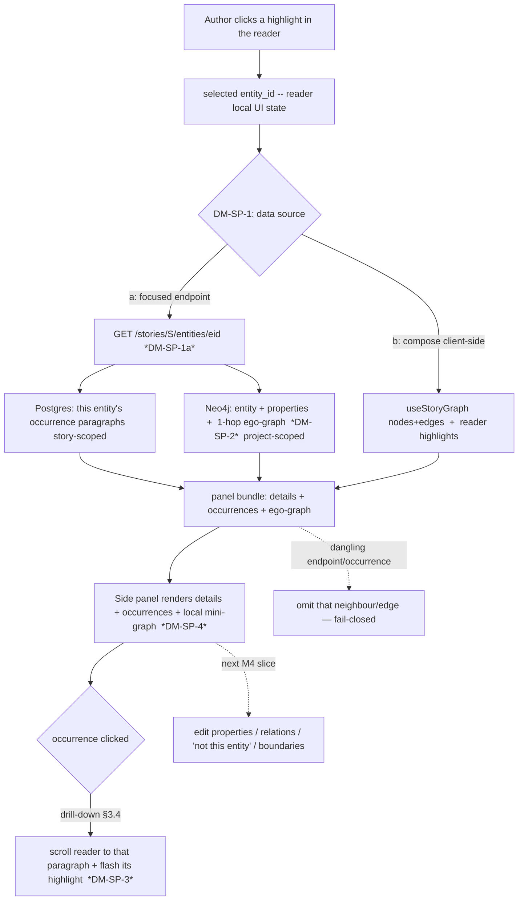

# M4.S2 — entity side panel in the reader (step-0 forward design)

> **Status: ACCEPTED — register RESOLVED with the owner (Session 34, 2026-06-18).** Owner chose the
> **side panel** as M4.S2 (over manual-correction-in-reader): the read-only inspection surface shows
> the context (an entity's aliases, type, properties, occurrences, relations, and a 1-hop graph around
> it) you need to *judge* a correction, so it lands **before** the edit tools that build on it (the
> *next* M4 slice). Authoritative home: `docs/PLAN_SHORT.md` (Session-34 **Decided**). The whole
> register below is annotated to resolved; the original Context/Options reasoning is kept intact
> (public-portfolio history — append resolution, don't delete the thinking). Predecessor:
> [[m4-inline-highlights]] (M4.S1, the read-only reader this panel attaches to).
>
> **Resolutions (lifted from `docs/PLAN_SHORT.md`, not invented):**
> - **DM-SP-1 → (a) a focused per-entity endpoint** `GET /stories/{id}/entities/{eid}` (the BFF
>   pattern: server-side cross-store join + the 1-hop neighbourhood + this story's occurrences; needs a
>   new `Neo4jRepo` 1-hop query). *Rejected:* compose client-side (loads the whole project graph into
>   the reader; the neighbour filter would live untested-in-Python in TS).
> - **DM-SP-7 → split** (carried by 1a): **M4.S2a backend** + **M4.S2b frontend**, the M4.S1 S32/S33 cut.
> - **DM-SP-2 → (a) strict 1-hop ego-graph** (entity + direct neighbours + entity-incident edges only).
> - **DM-SP-5 → (a) `properties` from the endpoint**, read-only key→value (open-world, escaped).
> - **DM-SP-6 → (b) a new reader panel** mirroring `NodeDetailsPanel`'s *structure*, not one shared
>   component (they diverge when editing lands — rule-of-three).
> - **DM-SP-3 → (a) occurrences driven off the *rendered highlights*** (panel agrees with the prose;
>   doubles as §3.4's timeline; click → scroll-to-paragraph + flash).
> - **DM-SP-8 → confirm** (occurrences story-scoped, neighbourhood project-scoped — inherits the §3.4 debt).
> - **DM-SP-4 → confirm-at-build (S2b)** — reuse `GraphCanvas`/cytoscape with the ego subset vs a
>   lightweight static view in a narrow panel; `verify-at-build` the embedded-cytoscape layout.

**Requirement.** When the author clicks a highlighted (accepted) entity in the read-only reader
([[m4-inline-highlights]], shipped), open a **side panel** showing that entity's details — spec
**§3.4** (canonical_name, aliases, type, **properties**, **all occurrences** as links to paragraphs,
**outgoing/incoming relations**, **timeline**) — plus a **local graph around that entity** per spec
**§3.5** ("click a highlighted entity → side panel with a local graph around that entity"). This is
still a **read-only projection** of the accepted graph: properties and relations are *shown*, not yet
*editable* — the edit affordances (manual tagging, "not this entity", boundary change, property/
relation edit) are the **next** M4 slice and are explicitly out of scope here. This slice ends at
"click a highlight → inspect the entity (details + occurrences + local graph) → drill an occurrence
back to its place in the prose."

**The two findings that shape the design.**

1. **The data is mostly already on hand — the slice is largely an *assembly* problem, not a new-data
   problem.** Of everything §3.4's panel lists, only **`properties`** is surfaced by *no* endpoint
   today (it lives on the Neo4j node — `GraphEntity.properties`, a free JSON dict — but `GraphNode`
   in `/graph` deliberately omits it, and the reader catalog only carries name+type+aliases). Type/
   canonical/aliases are in the reader catalog; **occurrences** are derivable from data the reader
   already renders (each `ReaderParagraph.highlights` carries `entity_id`); **relations** + the
   **local graph** are a filtered view of `get_relations(project_id)`. So the centre of gravity is
   **DM-SP-1: where does the panel's data come from** — a focused per-entity endpoint vs composing
   what the page can already fetch.

2. **A per-entity *neighbourhood* query does not exist yet.** `Neo4jRepo` exposes `get_entity(id)`
   (one node) and `get_relations(project_id)` (the *whole* project's edges) — but nothing that
   returns "the edges incident to entity E and the nodes on their far end." The local graph (§3.5)
   needs exactly that: a **1-hop ego-graph** (see DM-SP-2). Whether we add that Cypher query or filter
   the whole-project edge list in app code is DM-SP-1's sub-fork.

---

## Layers (the nine-layer pass)

A **per-feature** altitude pass (all nine layers ripple); I name where the altitude is loud. Density
is Balanced — known terms are `[[wikilinked]]`, only genuinely new ones defined inline.

1. **User / personas.** One persona, full trust, local ([[project]] L1). No new [[trust-boundary]] —
   this reads data the author already owns, no LLM call. The payoff is *legibility at the point of
   reading*: from a highlight in the prose, see the whole entity (who it relates to, where else it
   appears) without leaving the text. This is the read-only foundation the owner wants under the
   *next* slice's corrections — "I can't judge whether to un-merge Elira→Elara until I can see both
   entities' neighbourhoods and occurrences side by side."
2. **Business.** Both drivers ([[project]] L2): a real authoring aid (inspect the world model from
   inside the draft) **and** a portfolio set-piece (the §3.4 detail panel + a live mini-graph is the
   visible payoff of the whole ingest→cascade pipeline). Moderate portfolio value at low
   architectural risk — read-only, no new trust surface.
3. **Domain.** No new *persisted* nouns — **Entity**, **Mention**, **Relation**, **Paragraph** all
   exist. Two new *projection* nouns: an **ego-graph** (the 1-hop neighbourhood of one entity — see
   DM-SP-2 + glossary) and an **occurrence** (a place in the prose where the entity is highlighted —
   here, *derived from the rendered highlights*, not a new record). One new verb: *inspect* an entity
   = project its node + neighbourhood + occurrences into a panel.
4. **Data.** Reads only. The **ownership seam** ([[overview]] L4) is again in play: the panel joins
   Postgres (paragraphs/mentions, story-scoped) × Neo4j (entity, properties, relations,
   project-scoped) **in application code** — there is no SQL↔Cypher join. The one *unsurfaced* field
   is `GraphEntity.properties` (DM-SP-5). No schema change is required by any option (DM-SP-1).
5. **Behavior.** **No state machine** — like the highlight projection ([[m4-inline-highlights]] L5),
   the panel is a **pure read projection** `(entity, neighbours, occurrences) → panel view`,
   recomputed on click, owning no persisted state. The *next* slice (manual correction) is the one
   that adds a write path + a lifecycle (it will touch [[candidate-lifecycle]] / [[relation-lifecycle]]).
6. **Errors.** [[fail-closed]], the read-side posture inherited from the reader: a **dangling
   reference** ([[referential-integrity]]) — a relation endpoint or an occurrence pointing at an
   entity that was rejected or merged-away — must **degrade gracefully** (omit that neighbour/edge,
   render the rest), never throw, never show a stale name. "Omit, don't guess." A half-down cross-
   store read (Postgres up, Neo4j down) degrades to "details we have, no local graph," same posture
   as the reader.
7. **Security.** Author's own text + entity data, no egress (no LLM in this slice) — [[trust-boundary]]
   untouched. Same DOM-escaping flag as M4.S1: `properties` values and entity names render through
   React's default escaping; do **not** reach for `dangerouslySetInnerHTML` (stored-XSS over the
   author's own `properties` dict — low stakes single-user, but a portfolio reader will look).
8. **Compliance / Audit.** **n/a** — a read-only view mutates nothing, so there is no evidence to
   leave (named, not blank). The audit trail it *consumes* (which entities/relations are accepted) was
   written by the M3 review queues ([[candidate-lifecycle]] / [[relation-lifecycle]]).
9. **Operations.** No new infra, no LLM call ⇒ **no `llm_calls` row, no cost, no budget** (INV-5
   simply doesn't apply — name it so a reviewer doesn't hunt for a missing ledger row). One ops
   concern: a click that triggers a per-entity fetch (DM-SP-1a) adds a read per click — trivially
   cheap and cacheable for one solo author; if the local graph is derived from a whole-project graph
   fetch (DM-SP-1b) instead, the cost is one larger fetch on reader open (DM-SP-1's trade-off).

---

## Stations (the enforcement-lifecycle checklist)

A read-only projection leaves most stations legitimately empty — each named, not blank (house rule).

| Station | State | Note |
|---|---|---|
| **Identity** | n/a | single local user, no auth ([[overview]]) |
| **Intent** | ✅ | the author clicks a highlight to inspect an entity — an explicit gesture |
| **Policy** | ✅ | *which* entities/relations show = **accepted graph only**, never staged/rejected (the read-side echo of INV-1; same as DM-IH-7) |
| **Decision** | ✅ deterministic | neighbourhood + occurrence resolution are pure, deterministic filters — no model, no human in this slice |
| **Access** | n/a | localhost binding is the only gate |
| **Monitoring** | n/a | no LLM call, nothing to meter; the graph viewer already surfaces the whole graph |
| **Evidence** | n/a | read-only — nothing mutated, nothing to record |
| **Expiry** | n/a | no new persisted state (render-time projection) |
| **Review** | n/a | the human review already happened (M3); this *shows its result* |

The empties are the signature of a read-only view (same fingerprint as [[m4-inline-highlights]]). The
**next** slice flips Intent→Evidence to ✅ on a *write* (manual correction records a decision).

---

## Data flow

The author clicks a highlight in the reader; the panel needs three bundles for that entity: **details**
(name/type/aliases/properties), **occurrences** (where it appears in *this* story's prose), and the
**ego-graph** (its 1-hop neighbourhood). DM-SP-1 decides whether a focused endpoint assembles these
server-side (a) or the page composes them from existing fetches (b). The diagram shows (a), my lean.

The dashed edge (M) is the boundary: this slice stops at inspection + drill-down; all editing is the
next slice. The dashed (L) is the [[fail-closed]] omit posture for a [[referential-integrity]] break.

---

## State & invariants

- **No new state machine.** The panel persists nothing (pure projection of L5). Recorded so a future
  contributor doesn't invent a "panel cache" table. The clicked-entity selection is ephemeral reader
  UI state (`useState`), not a store.
- **Invariant pressure — none broken; the read-side echo of INV-1 applies again.** This slice writes
  nothing, so INV-1/INV-3/INV-9 are untouched (a read view *cannot* violate the human-gate
  invariants). It must honour the same read-side rule as the reader: **show only accepted-graph
  entities and accepted edges — never a staged/rejected candidate or a held/un-committed relation**
  (the panel reads Neo4j, and only the human-accept paths write Neo4j — INV-1/INV-9). Not a new INV-N;
  flagged so a future "preview staged neighbours" idea is recognised as crossing the line.
- **The latent merge-re-point coupling, now visible from the *relations* direction.** M4.S1 flagged
  that a future entity↔entity merge (the **DM-Rel-5** neighbourhood — [[relation-lifecycle]]) must
  re-point `entity_mentions.entity_id` or the reader silently drops highlights. The side panel widens
  the same debt: a **written edge** whose endpoint is later absorbed must be re-pointed too, or the
  ego-graph shows an edge to a ghost node. This slice **resolves gracefully** (omit the dangling
  neighbour — Layer 6), but it makes the re-point debt concrete from a second direction. Cross-linked
  to the M4 cross-cutting re-point item; **not this slice's to fix** (no entity↔entity merge exists
  until the later M4 slice that introduces it).

---

## Decision register (RESOLVED 2026-06-18, Session 34 — owner; DM-SP-4 confirm-at-build in S2b)

> Each entry keeps its original Context/Options/My-proposal text (history); the **✅ Decision** line is
> appended. Authoritative home: `docs/PLAN_SHORT.md` Decided (Session 34). Mirrored to [[open-questions]]
> OQ-22. `verify-at-build` marks any call resting on un-inspected behaviour — confirm before relying on it.

### DM-SP-1 — Where does the panel's data come from? **(the central decision)**
> **✅ Decision (owner, 2026-06-18): (a) a focused per-entity endpoint** `GET /stories/{id}/entities/{eid}`
> — the BFF: server-side cross-store join + the 1-hop neighbourhood + this story's occurrences; needs one
> new `Neo4jRepo` 1-hop query. *Rejected:* (b) compose client-side (loads the whole project graph into
> the reader; pushes the neighbour filter into untested-in-Python TS), (c) embed in the reader response.
> Carries DM-SP-7 = split. `verify-at-build`: a clean 1-hop Cypher query needs no new per-entity index at
> this scale.
- **Context.** The panel needs three bundles per entity: details (incl. `properties`, surfaced by no
  endpoint today), occurrences (story-scoped, derivable from the reader's own highlights), and the
  ego-graph (a 1-hop neighbourhood; no per-entity Neo4j query exists — only whole-project
  `get_relations`). How we source these sets the slice's shape.
- **Options.**
  - **(a) A focused per-entity endpoint** `GET /stories/{id}/entities/{eid}` returning the assembled
    bundle (entity + `properties` + the 1-hop ego-graph + this story's occurrence paragraph ids). The
    cross-store join + the neighbourhood filter live server-side, in Python, testable. This is the
    **backend-for-frontend (BFF)** pattern — a purpose-built endpoint shaped to one screen's needs,
    rather than the client stitching general-purpose endpoints. Needs **one new `Neo4jRepo` method**
    (1-hop edges + neighbour nodes for an id). *Pros:* mirrors DM-IH-2's rationale (join server-side,
    don't duplicate in TS); fetches only what the click needs; story-vs-project scoping decided once
    in one place. *Cons:* a new endpoint + a new Cypher query (a backend slice on top of the frontend
    one — argues for the DM-SP-7 split).
  - **(b) Compose client-side from existing fetches.** Reuse `useStoryGraph` (the whole project graph
    — nodes+edges, already what the graph viewer loads) for the ego-graph (filter edges incident to
    the id), derive occurrences from the reader's `highlights`, and surface `properties` by **adding
    it to `GraphNode`** (one field on an existing endpoint). *Pros:* little/no new backend; the graph
    viewer already proves the whole-graph fetch works; occurrences need zero new data. *Cons:* loads
    the **entire project graph** into the reader page just to show one entity's neighbours (§3.4
    demands the *graph* handle 500+ nodes — fetching all of it on the *reader* is wasteful, though
    one solo author makes it tolerable); the 1-hop filter logic lives in TS, untested-in-Python;
    `properties` (a free dict) shipped on every node of a 500-node graph is payload the reader doesn't
    otherwise need.
  - **(c) Embed everything in the reader response.** Extend `GET …/reader` to carry each entity's
    full details + neighbourhood inline. *Pros:* one fetch. *Cons:* fattens the reader payload with
    data needed only on click (most entities are never clicked); couples two concerns. *Rejected as
    primary* — pay per-click, not per-page.
- **My proposal.** **(a) the focused endpoint**, for the same reasons DM-IH-2 chose a purpose-built
  reader endpoint: keep the cross-store join + the neighbourhood resolution on the server (one place,
  Python-testable), and fetch per click rather than shipping the whole graph to the reader. Occurrences
  ride along in the same bundle (story-scoped). This makes the slice **backend + frontend** → see the
  DM-SP-7 split. *Considered:* (b) is genuinely attractive if the owner would rather avoid a new
  endpoint and accept the whole-graph fetch — it's less code; I lean (a) only because the whole-project
  fetch on the reader feels like the wrong default and the BFF endpoint is the project's established
  shape. **`verify-at-build`:** confirm a clean 1-hop Cypher query over the existing edge model (no
  per-entity index needed at this scale).
- **Open.** Does the owner prefer the smaller-code (b) and accept the whole-graph reader fetch, or the
  BFF endpoint (a)? This is the call everything downstream hangs on.

### DM-SP-2 — What is the "local graph around that entity" (ego-graph radius)?
> **✅ Decision (owner, 2026-06-18): (a) strict 1-hop, entity-incident edges only** — the legible
> "around that entity" view for a narrow panel. *Rejected:* (b) 1-hop + inter-neighbour edges (hairball
> on a busy entity, no filters yet), (c) configurable depth (later, pairs with the §3.4 graph filters).
- **Context.** Spec §3.5 says "a local graph **around that entity**." An **ego-graph** (graf egocentryczny
  — the subgraph induced by one focal node and its neighbours) can mean several radii.
- **Options.** (a) **strict 1-hop**: the entity + its direct neighbours + only the edges *incident to
  the entity*; (b) **1-hop + inter-neighbour edges**: also draw edges *among* the neighbours (richer,
  but denser — re-introduces the hairball §3.4 filters exist to tame); (c) **configurable depth**
  (1/2-hop toggle).
- **My proposal.** **(a) strict 1-hop, entity-incident edges only** — the smallest legible "around
  that entity" view, and the one that reads cleanly in a narrow side panel. Denser neighbourhoods
  (b) and depth control (c) are later refinements (they pair with the §3.4 graph *filters* still on
  the backlog). *Considered & rejected:* (b) now — a busy entity (Elara, the protagonist) would fill
  the panel with a tangle the slice can't yet filter.
- **Open.** Does the author want to see how neighbours relate to *each other*, or only to the focal
  entity? (a UX call; defer to use.)

### DM-SP-3 — Occurrence drill-down + the occurrence/mention granularity
> **✅ Decision (owner, 2026-06-18): (a) occurrences = the entity's *rendered highlights*** grouped by
> paragraph in document order (doubles as §3.4's timeline); click → scroll the reader to that paragraph
> + flash the highlight. Keeps the panel honest to what the prose shows + reuses the reader's span
> resolution. *Rejected:* (b) raw paragraph-level mentions (can claim an occurrence the prose doesn't
> highlight), (c) list-only/no navigation. `verify-at-build`: scroll-to-paragraph in the whole-story DOM.
- **Context.** §3.4: "click an occurrence → opens the paragraph in the reader with highlight." We are
  *already in the reader*, so a click should **scroll to that paragraph and flash its highlight**. But
  what *is* an occurrence? Mentions are **paragraph-level with null offsets** (the M4.S1 finding); the
  reader resolves render-time spans, which may find **more** surface-form matches in a paragraph than
  there are mentions (the granularity mismatch DM-IH-1 named). So "occurrences" computed from raw
  mentions and from rendered highlights can disagree.
- **Options.** (a) Drive occurrences off the **rendered highlights** (paragraph + the resolved
  range(s) the reader actually shows), so the panel's "occurrences" and the visible prose **always
  agree**, and clicking scrolls to that paragraph + emphasises the range; (b) drive off raw mentions
  (paragraph-level only), list paragraphs, click scrolls to paragraph top; (c) just list paragraph
  ids, no navigation.
- **My proposal.** **(a)** — occurrences = the entity's rendered highlights, grouped by paragraph,
  shown as a **timeline** in document order (which doubles as §3.4's "timeline: where it appears");
  clicking one scrolls the reader to that paragraph and briefly emphasises the highlight. This keeps
  the panel honest to what the prose shows and reuses the reader's existing span resolution — no new
  span work. *Considered:* (b) is simpler but can claim an occurrence the prose doesn't visibly
  highlight (a null-span mention whose surface form never matched), which would confuse. **`verify-at-build`:**
  the scroll-to-paragraph + flash interaction in a whole-story-rendered DOM (DM-IH-6 left it
  un-virtualised — anchor scrolling is simple while it stays one DOM).
- **Open.** Should the timeline group by chapter/scene (the document tree) rather than a flat
  paragraph list? Cheap to add; defer unless the owner wants it now.

### DM-SP-4 — Rendering the local mini-graph (reuse cytoscape vs a lightweight view)
> **◻ Confirm-at-build in M4.S2b (frontend).** Lean (a) reuse `GraphCanvas`/cytoscape with the ego
> subset (one renderer), but `verify-at-build` that a second cytoscape instance lays out acceptably in a
> ~288px panel — if awkward, fall back to (b) a lightweight static view (honestly fine for a 1-hop
> handful of nodes). Still open-but-narrowed; flag which way it went in the S2b PR.
- **Context.** The graph viewer renders the full graph with **cytoscape** (`GraphCanvas`, the
  jsdom-untestable mount covered by browser smoke — `frontend/src/AGENTS.md`). The side panel needs a
  *small* graph in a *narrow* column.
- **Options.** (a) **reuse `GraphCanvas`** with the ego-graph element subset (one graph renderer, free
  layout); (b) a **lightweight static** view (a short SVG or even a styled list "→ relates-to →
  Neighbour") with no force-layout dependency in a cramped panel.
- **My proposal.** Lean **(a) reuse `GraphCanvas`** to keep one graph renderer and inherit its
  node-colour-by-type + click behaviour — *but* `verify-at-build` that a second cytoscape instance
  embedded in a ~288px side panel lays out acceptably; if it's awkward, fall back to (b)'s static
  view, which is honestly fine for a 1-hop neighbourhood (a few nodes). *Considered:* (b) first for
  simplicity — a 1-hop view rarely needs force-direction; this may win at build time.
- **Open.** Resolved at build by the layout check — flag which way it went in the PR.

### DM-SP-5 — Showing `properties` (the one unsurfaced field)
> **✅ Decision (owner, 2026-06-18): (a) the focused endpoint returns `properties`**, rendered as a
> generic key→value list (open-world, no fixed keys; escaped; empty → "none"). Editing is the next slice.
> *Rejected:* a synthesised prose description (DM-IH-8's deferred richer description belongs here, but as
> the raw key:value list — an LLM summary would re-introduce egress into a read-only slice).
- **Context.** `GraphEntity.properties` (free JSON, §3.2 open-world) is on the Neo4j node but exposed
  by no endpoint. §3.4's panel lists "properties (editable)" — editing is the *next* slice; this slice
  shows them read-only.
- **Options.** (a) the focused endpoint (DM-SP-1a) returns `properties`; (b) add `properties` to
  `GraphNode` on `/graph` (DM-SP-1b's path).
- **My proposal.** **(a)** — falls out of DM-SP-1a; render as a generic key→value list (honour
  [[open-world-ontology]] — no fixed keys, never assume a schema), escaped (Layer 7). A genuinely
  empty `properties` shows "none." *Rejected:* deriving a prose "description" from properties (that
  was DM-IH-8's deferred richer-description — it belongs *here*, but as the raw key:value list, not a
  synthesised sentence; an LLM summary would re-introduce egress into a read-only slice).
- **Open.** none beyond DM-SP-1.

### DM-SP-6 — Panel component: extend `NodeDetailsPanel` or a new reader panel?
> **✅ Decision (owner, 2026-06-18): (b) a new reader-scoped panel** mirroring `NodeDetailsPanel`'s
> *structure* (the `aside`/`dl`/`data-testid`/close-button shape) but not forced into one shared
> component — the two panels have different inputs and the reader's gains *edit* affordances next slice.
> *Rejected:* (a) unify now (speculative coupling — Karpathy; revisit at a third consumer / rule-of-three).
- **Context.** The graph viewer's `NodeDetailsPanel` takes a `GraphNode` and shows a *subset*
  (type/canonical/aliases/first-seen). The reader panel needs **more** (properties, occurrences-as-
  timeline, relations, a mini-graph) from a **different** data source (DM-SP-1's bundle, not a
  `GraphNode`). The handoff says "mirror the existing panel pattern."
- **Options.** (a) **extend `NodeDetailsPanel`** into one richer shared panel both mounts use; (b) a
  **new `ReaderEntityPanel`**, leave the graph viewer's panel as-is, share only small primitives (the
  `dl` rows, the name-precedence helper) **if** duplication actually appears (rule-of-three).
- **My proposal.** **(b)** — a new reader-scoped panel. The two panels have different inputs and the
  reader's is materially richer; unifying them up front couples two screens that will diverge again at
  the next slice (the reader panel gains *edit* affordances the graph viewer's may not). Mirror the
  existing panel's *structure* (the `aside`/`dl`/`data-testid` shape, close button) without forcing a
  shared component prematurely. *Considered:* (a) — tempting for DRY, but it's speculative coupling
  (Karpathy: no abstraction for a single divergent use); revisit if a third consumer appears.
- **Open.** Owner may prefer one unified panel for consistency — a UX/maintenance trade-off worth a
  word.

### DM-SP-7 — Slice size: one slice, or split backend / frontend?
> **✅ Decision (owner, 2026-06-18): (a) split** (carried by DM-SP-1a) — **M4.S2a backend** (the
> `GET …/entities/{eid}` endpoint + the 1-hop `Neo4jRepo` query, test-first) + **M4.S2b frontend**
> (panel + ego-graph render + occurrence drill-down), mirroring M4.S1's S32/S33 cut.
- **Context.** Under DM-SP-1a this slice is **a new endpoint + a new Cypher neighbour query + a panel
  + a mini-graph + occurrence drill-down** — meaningfully bigger than M4.S1's frontend half. M4.S1
  itself split backend (S32) / frontend (S33).
- **Options.** (a) **split** → **M4.S2a backend** (the `GET …/entities/{eid}` bundle endpoint + the
  1-hop `Neo4jRepo` query, test-first: pure neighbourhood-assembly logic → endpoint over real
  Postgres + a stubbed/real graph reader) + **M4.S2b frontend** (panel + ego-graph render + occurrence
  drill-down, test-first: pure bundle→view mappers → hook → component); (b) **one slice** if it fits a
  conversation (more likely under DM-SP-1b, which adds little backend).
- **My proposal.** **(a) split** if DM-SP-1a is chosen (the backend is a coherent green slice on its
  own, mirroring M4.S1's shape and the project's test-first rhythm); **(b) one slice** is viable if the
  owner picks DM-SP-1b (compose client-side — almost no backend). So DM-SP-7 is *downstream of DM-SP-1*.
- **Open.** Tie to DM-SP-1: (a)→split, (b)→likely one slice.

### DM-SP-8 — Story-vs-project scoping (the §3.4 seam, confirm not fork)
> **✅ Decision (owner, 2026-06-18): confirm** — occurrences story-scoped, neighbourhood project-scoped,
> documented as inheriting the §3.4 project-vs-story debt (the reader endpoint is its first home; this is
> its second). No fork; the per-story filter lands for both when multi-story does.
- **Context.** Occurrences are **story-scoped** (mentions are per-paragraph, this story); the
  ego-graph's relations/neighbours are **project-scoped** (edges carry `project_id`; one story = one
  project today). Same honest seam the reader endpoint already documents.
- **My proposal.** **Confirm**: occurrences story-scoped, neighbourhood project-scoped, documented as
  inheriting the §3.4 project-vs-story debt (the reader endpoint is its first home; this is its
  second). No fork — when multi-story lands, both the reader and this panel get the per-story filter
  together. *Recorded, not decided-anew.*
- **Open.** none — confirm-only.

---

## But what if (edge cases — name the failure, teach the name)

- **…the clicked entity has zero relations?** The common case for a minor entity. The panel shows
  details + occurrences and an **empty ego-graph** ("no relations yet") — render the empty state, don't
  hide the section (so the author learns the entity is unconnected, which is itself information).
- **…a neighbour or a relation endpoint points at a rejected / merged-away entity?** A **dangling
  reference** ([[referential-integrity]]). **Fail-closed: omit** that neighbour/edge, render the rest
  — never throw, never draw an edge to a ghost. Surfaces the M4 merge-re-point debt from the relations
  direction (State & invariants).
- **…an entity is mentioned in a paragraph but its surface form never matched (null-span mention)?**
  The **granularity mismatch** (DM-IH-1 / DM-SP-3): a raw mention exists but the reader shows no
  highlight. Driving occurrences off *rendered highlights* (DM-SP-3a) means the panel simply won't
  list an occurrence the prose can't show — consistent, if under-counting. (Driving off raw mentions
  would over-claim.) A real trade-off, made explicit.
- **…the focal entity is the protagonist with 50 neighbours?** A **hairball** in a narrow panel —
  DM-SP-2 (strict 1-hop, entity-incident only) keeps it to one ring; if even that is dense, it argues
  for the §3.4 *filters* (backlog) sooner. Don't silently truncate — if a cap is ever added, `log`/note
  it (no silent caps).
- **…two relations between the same pair (e.g. "loves" and "betrays")?** Two distinct typed edges —
  draw both (the edge id is `uuid5(subject, predicate, object)`, so distinct predicates are distinct
  edges; [[relation-lifecycle]]). The panel lists each predicate.
- **…Neo4j is down but Postgres is up?** Degrade: show the occurrences/timeline (Postgres) with a
  "graph unavailable" note rather than 500 the panel — the read-side-gentle posture from the reader.
- **…the reader was opened, the graph changed (a new accept) in another tab, then a highlight is
  clicked?** The panel fetches on click (DM-SP-1a) so it sees current data; the reader's 30 s
  `staleTime` may mean the *highlights* lag, but the panel won't show a stale entity. A benign
  read-consistency window (single user), worth a one-line note.
- **…`properties` holds a deeply nested object or a huge value?** Render generically and defensively
  (stringify a value, escaped); don't assume scalar values. Open-world data can be any JSON.

---

## Gaps for the product owner

> **✅ All resolved (owner, Session 34, 2026-06-18)** — see the resolution banner at the top: (1) DM-SP-1
> → focused endpoint; (2) DM-SP-7 → split S2a/S2b; (3) DM-SP-2 → strict 1-hop; (4) DM-SP-6 → a new reader
> panel; (5) scope confirmed — read-only, ends at inspection + occurrence drill-down (editing is the next
> slice). Items 1–5 below kept as the original framing.

1. **DM-SP-1 is the real call** — the focused per-entity endpoint (a, my lean: server-side join,
   fetch-per-click, but a backend slice) vs composing client-side (b: little backend, but loads the
   whole project graph into the reader). Everything else — DM-SP-5 (properties home), DM-SP-7 (slice
   split) — hangs off it.
2. **Slice size / split (DM-SP-7)** — under (1a) I recommend splitting M4.S2 into S2a backend + S2b
   frontend (the M4.S1 rhythm); under (1b) it's plausibly one slice. Confirm the cut so the next
   session is sized for one conversation.
3. **Local-graph radius (DM-SP-2)** — strict 1-hop (my lean, legible) vs richer neighbourhoods now.
   A UX preference only you can weigh.
4. **One panel or two (DM-SP-6)** — a new reader panel (my lean, they'll diverge) vs unifying with the
   graph viewer's `NodeDetailsPanel` for consistency.
5. **Scope confirm** — this slice ends at **inspection + occurrence drill-down**, *read-only*.
   Property/relation **editing**, manual tagging, "not this entity", and boundary changes are the
   **next** M4 slice. Confirm that cut (it's the whole reason side-panel-before-correction was chosen).

---

## Hand-off (register RESOLVED — DM-SP-1a chosen; build M4.S2a backend test-first)

> **✅ Resolved DM-SP-1a (focused endpoint) + DM-SP-7a (split).** Build **M4.S2a backend** first.

The first failing test is the **pure 1-hop neighbourhood-assembly function** (given an entity id + the
project's edges + nodes → the 1-hop [[ego-graph]]: the focal node, its direct neighbours, the
entity-incident edges, with **dangling-endpoint omission** fail-closed) — pure, deterministic, no
store, the altitude the project unit-tests hardest. Then the `Neo4jRepo` 1-hop query (integration),
then the `GET /stories/{id}/entities/{eid}` endpoint assembling details + `properties` + the ego-graph
+ this story's occurrences (integration over real Postgres + a graph reader; declare every non-2xx on
`responses=`; regenerate the OpenAPI snapshot + typed client — `frontend/src/lib/api/AGENTS.md`). Then
**M4.S2b** (frontend): the pure bundle→view mappers → a `useEntityDetail` hook → the new reader panel +
the ego-graph mini-render (DM-SP-4 confirm-at-build) + occurrence drill-down (scroll + flash).

The slice stays **read-only** (INV-1/3/9 untouched, no LLM/INV-5; the read-side echo of INV-1), mirrors
the M4.S1 test-first shape (pure logic → hook → component), and ends at inspection + drill-down —
editing is the next M4 slice.
