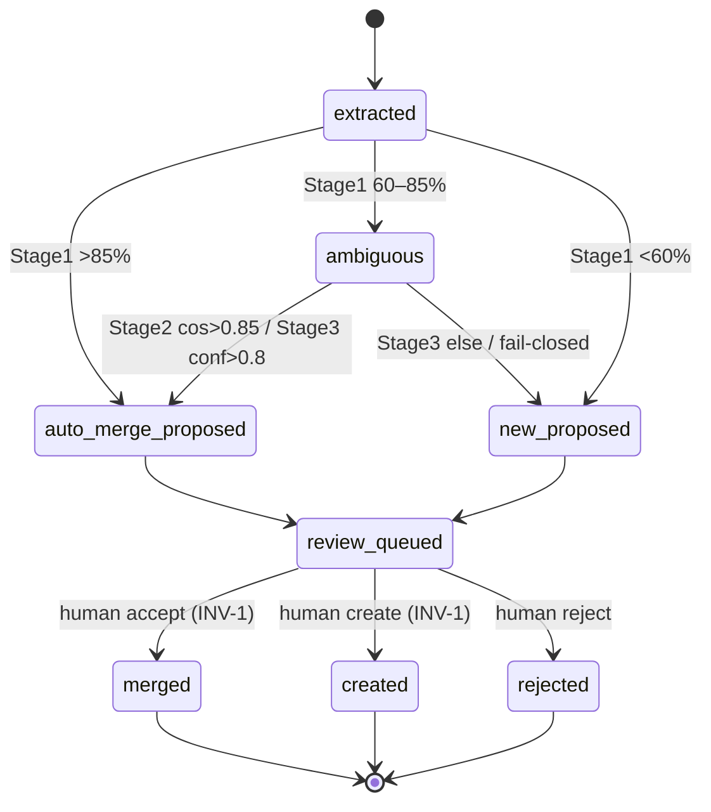

# State machine — Entity Candidate

A single instance is **one extracted candidate** working its way through the §3.3 cascade toward a
human decision: *is this a new entity, or one we already know?* Its lifecycle is owned by the M3
matching pipeline (`MatchingAgent` → `JudgeAgent` → review queue) — see [[m3-cascade-matching]].

> **Draft.** Drawn at the M3 step-0 decompose to give the cascade a precise shape; states/thresholds are
> spec-given (§3.3). **DM6 is decided (owner, 2026-06-11): (A) intercept-before-write** — so the commit
> edges below are the *only* graph writes and extraction merely *stages* candidates (no Neo4j write until
> the human accepts). Finalise to `living` when the gating code lands (the invariant flip is witnessed by
> the failing test, not before). Remaining open register items: `[[m3-cascade-matching]]` DM1–DM5, DM7,
> DM-rej.

## States

- **extracted** — the candidate exists (M2.S3 `ExtractionProposal`); cascade has not run.
- **auto-merge-proposed** — Stage 1 (`>85%`) or Stage 2 (`cosine >0.85`) or Stage 3 (`conf >0.8`)
  proposes a MERGE with a specific existing entity. *A proposal, not a merge.*
- **ambiguous** — an intermediate-confidence result handed to the next, more expensive stage
  (Stage 1 `60–85%` → Stage 2; Stage 2 miss → Stage 3). Transient.
- **new-proposed** — Stage 1 (`<60%`) or Stage 3 (`else`) proposes a NEW entity. *A proposal.*
- **review-queued** — sitting in the Stage-4 queue awaiting the human (carries the proposal +
  reasoning + top-3 alternatives).
- **merged** — *(terminal)* the human accepted a MERGE (or changed the target); the candidate folded
  into an existing entity as an alias/mention.
- **created** — *(terminal)* the human created a new entity (possibly with a custom type).
- **rejected** — *(terminal)* the human ignored the candidate; nothing enters the graph (memory of
  the rejection is DM-rej).

## Transitions

| From | To | Trigger | Guard (precondition) | Effect (incl. evidence) |
|------|----|---------|----------------------|-------------------------|
| extracted | auto-merge-proposed | Stage 1 `>85%` | a graph entity scores `>85%` | record match target; **none persisted to graph** |
| extracted | ambiguous | Stage 1 `60–85%` | mid-confidence | hand to Stage 2 |
| extracted | new-proposed | Stage 1 `<60%` | no near match | mark NEW; **no graph write** |
| ambiguous | auto-merge-proposed | Stage 2 `cosine >0.85` | embedding available (else fall through) | record match target |
| ambiguous | ambiguous | Stage 2 miss | — | hand to Stage 3 |
| ambiguous | auto-merge-proposed | Stage 3 `conf >0.8` | JudgeAgent returns | `llm_calls` row (INV-5) + reasoning |
| ambiguous | new-proposed | Stage 3 `else` / give-up | JudgeAgent returns or fails-closed | `llm_calls` row; reasoning = "uncertain" |
| auto-merge-proposed / new-proposed | review-queued | enqueue | — | candidate visible in Stage-4 UI |
| review-queued | **merged** | **human accept / change-target** | **a human action** (INV-1 guard) | MERGE → Neo4j **+ `edit_history` row (INV-3)** |
| review-queued | **created** | **human create-new** | **a human action** (INV-1 guard) | CREATE → Neo4j **+ `edit_history` row** |
| review-queued | **rejected** | **human reject** | **a human action** | `edit_history` row (so re-extraction can consult — DM-rej) |

The **commit guard** (`review-queued → merged|created` requires *a human action*) **is INV-1**. The
**effect is mandatory** on every terminal edge — an `edit_history` row — which makes the Compliance/Audit
layer (INV-3 reversibility) happen at the moment of decision.

## Diagram

## Invariants over the lifecycle

- **No path reaches `merged` or `created` without passing through `review-queued` and a human
  trigger.** This is INV-1; the commit edges are the *only* graph-writing transitions, and they are
  human-only. An automated stage that wrote to the graph would be a violation, not an optimisation.
- **Every automated stage is fail-closed** ([[fail-closed]]): an unavailable embedding model or judge
  must route the candidate *toward* `review-queued` (as ambiguous/uncertain), never silently to a
  terminal state, and never auto-commit. A high-confidence `auto-merge-proposed` is still only a
  *proposal* — confidence sets the queue's default, never the commit.
- **Terminal states are final** (INV-3 makes them *reversible by the human*, but the machine itself
  never auto-transitions out of `merged`/`created`/`rejected`; an undo is a new human action with its
  own evidence row).
- **`extracted` cannot skip to a terminal** — it must pass the cascade then the human.
