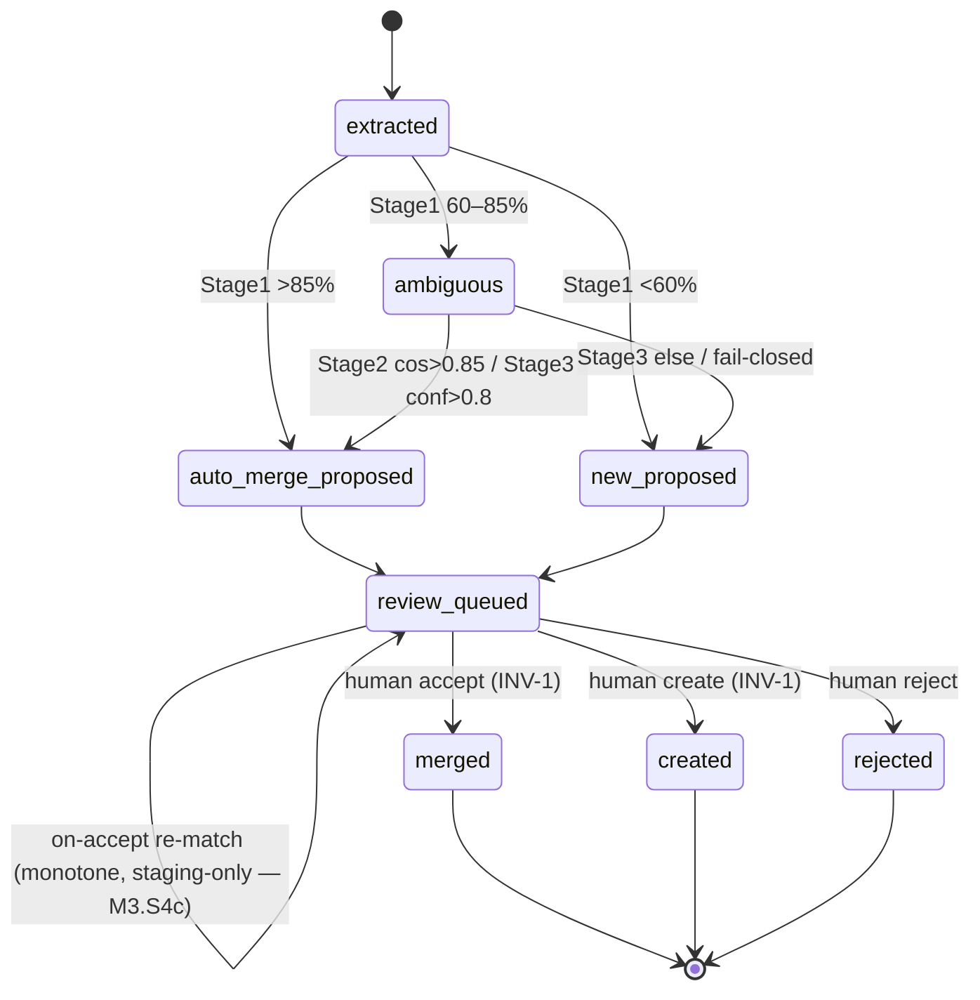

# State machine — Entity Candidate

A single instance is **one extracted candidate** working its way through the §3.3 cascade toward a
human decision: *is this a new entity, or one we already know?* Its lifecycle is owned by the M3
matching pipeline (`MatchingAgent` → `JudgeAgent` → review queue) — see [[m3-cascade-matching]].

> **Living (as-built, M3.S4a / ADR 0004).** The machine is implemented: the persisted `status` enum on
> the `candidates` table is the resting + terminal states (`review-queued`, `merged`, `created`,
> `rejected`); the transient cascade states (`extracted`/`ambiguous`/`*-proposed`) live only in memory
> while `CandidateStager` runs. The commit guard is `CandidateReviewService` (INV-1); the *only* graph
> write is its accept handler (INV-9). The terminal-edge evidence effect is a row in `candidate_decisions`
> (DM-S4a-4) — **not** §4.2 `edit_history` (text-edit-shaped, deferred). Whole register resolved
> (`docs/PLAN_SHORT.md` Decided 2026-06-11 S20 + 2026-06-15 S23; Stages 1–3 PRs #56/#58/#60, S4a this PR).
>
> **M3.S4c (on-accept re-match)** adds the one self-loop below — `review-queued → review-queued` —
> the first *automated* writer of a staged proposal. It is deterministic (Stage 1/2, no judge),
> **monotone** (only `new → merge`), and writes the `candidates` table only, so **INV-9 still holds**
> (graph-vs-staging — see "Invariants over the lifecycle").

## States

- **extracted** — the candidate exists (M2.S3 `ExtractionProposal`); cascade has not run.
- **auto-merge-proposed** — Stage 1 (`>85%`) or Stage 2 (`cosine >0.85`) or Stage 3 (`conf >0.8`)
  proposes a MERGE with a specific existing entity. *A proposal, not a merge.*
- **ambiguous** — an intermediate-confidence result handed to the next, more expensive stage
  (Stage 1 `60–85%` → Stage 2; Stage 2 miss → Stage 3). Transient.
- **new-proposed** — Stage 1 (`<60%`) or Stage 3 (`else`) proposes a NEW entity. *A proposal.*
- **review-queued** — sitting in the Stage-4 queue awaiting the human (carries the proposal +
  reasoning + top-3 alternatives).
- **merged** — *(terminal)* the human accepted a MERGE (or changed the target); the candidate folded
  into an existing entity as an alias/mention.
- **created** — *(terminal)* the human created a new entity (possibly with a custom type).
- **rejected** — *(terminal)* the human ignored the candidate; nothing enters the graph (memory of
  the rejection is DM-rej).

## Transitions

| From | To | Trigger | Guard (precondition) | Effect (incl. evidence) |
|------|----|---------|----------------------|-------------------------|
| extracted | auto-merge-proposed | Stage 1 `>85%` | a graph entity scores `>85%` | record match target; **none persisted to graph** |
| extracted | ambiguous | Stage 1 `60–85%` | mid-confidence | hand to Stage 2 |
| extracted | new-proposed | Stage 1 `<60%` | no near match | mark NEW; **no graph write** |
| ambiguous | auto-merge-proposed | Stage 2 `cosine >0.85` | embedding available (else fall through) | record match target |
| ambiguous | ambiguous | Stage 2 miss | — | hand to Stage 3 |
| ambiguous | auto-merge-proposed | Stage 3 `conf >0.8` | JudgeAgent returns | `llm_calls` row (INV-5) + reasoning |
| ambiguous | new-proposed | Stage 3 `else` / give-up | JudgeAgent returns or fails-closed | `llm_calls` row; reasoning = "uncertain" |
| auto-merge-proposed / new-proposed | review-queued | enqueue | — | candidate visible in Stage-4 UI |
| review-queued | **merged** | **human accept / change-target** | **a human action** (INV-1 guard) | `add_alias` → Neo4j + `entity_mention`(+vector) **+ `candidate_decisions` row (INV-3)** |
| review-queued | **created** | **human create-new** | **a human action** (INV-1 guard) | `create_entity` (MERGE-on-id) → Neo4j + `entity_mention`(+vector) **+ `candidate_decisions` row** |
| review-queued | **rejected** | **human reject** | **a human action** | `candidate_decisions` row (so re-extraction can consult — DM-rej) |
| review-queued | review-queued | **on-accept re-match** (another candidate's accept — M3.S4c) | a just-accepted entity strong-matches a still-`new` pending candidate (Stage 1 `>85%` **OR** Stage 2 `cosine >0.85`); **monotone** — only `new→merge`, never re-points an existing merge, never a terminal row | update `proposal`→merge + `target_entity_id` + provenance/alternatives in the **`candidates` table only** — **no graph write, no `candidate_decisions` row** (a machine suggestion refresh, not a human decision) |

The **commit guard** (`review-queued → merged|created` requires *a human action*) **is INV-1**, enforced
by `CandidateReviewService` (`agents/candidate_review.py`); the accept handler is the only graph writer
(INV-9). The **effect is mandatory** on every terminal edge — an append-only `candidate_decisions` row
(DM-S4a-4; *not* the §4.2 `edit_history` text-edit dataset) — which makes the Compliance/Audit layer
(INV-3 reversibility) happen at the moment of decision. The status flip is the **last** write, after the
Neo4j + mention + evidence writes, so an un-flipped candidate is always safely retryable (idempotency,
via deterministic accept-path ids).

## Diagram

## Invariants over the lifecycle

- **No path reaches `merged` or `created` without passing through `review-queued` and a human
  trigger.** This is INV-1; the commit edges are the *only* graph-writing transitions, and they are
  human-only. An automated stage that wrote to the graph would be a violation, not an optimisation.
- **Every automated stage is fail-closed** ([[fail-closed]]): an unavailable embedding model or judge
  must route the candidate *toward* `review-queued` (as ambiguous/uncertain), never silently to a
  terminal state, and never auto-commit. A high-confidence `auto-merge-proposed` is still only a
  *proposal* — confidence sets the queue's default, never the commit.
- **Terminal states are final** (INV-3 makes them *reversible by the human*, but the machine itself
  never auto-transitions out of `merged`/`created`/`rejected`; an undo is a new human action with its
  own evidence row).
- **The candidate terminal is *not* the committed graph node (M4.S3a).** `created`/`merged` is the
  terminal of this *candidate* machine; the entity node it commits then lives in Neo4j as editable
  graph state. M4.S3a edits that node **in place** via `EntityEditService` (`PATCH …/entities/{eid}`:
  name/aliases/type/`properties`) — a *self-transition on the committed node* (same id, new field
  values), recorded as a before→after `graph_edits` row (ADR 0006, DM-S3a-2). This does **not** reopen
  or re-transition the candidate row; the candidate machine stays terminal. (Edges have the parallel
  extension in [[relation-lifecycle]] — manual add + `written → removed`.)
- **`extracted` cannot skip to a terminal** — it must pass the cascade then the human.
- **On-accept re-match is monotone and staging-only** (M3.S4c). The `review-queued → review-queued`
  self-loop re-runs the *deterministic* matcher (Stage 1/2, never the judge) over still-pending
  candidates after each human accept, flipping a strong duplicate `new → merge`. It only ever
  *upgrades* (`new → merge`, never the reverse, never re-points an existing merge, never touches a
  terminal row), so it is idempotent and never thrashes a proposal the author is mid-decision on. It
  writes the **`candidates` staging table only** — never Neo4j — so although it is the first automated
  writer of a staged proposal, **INV-9 still holds** (INV-9's line is graph-vs-staging; re-match stays
  on the staging side). The monotone property lives here as this transition's guard, not as a new
  system-wide invariant (DM-S4c-4).
