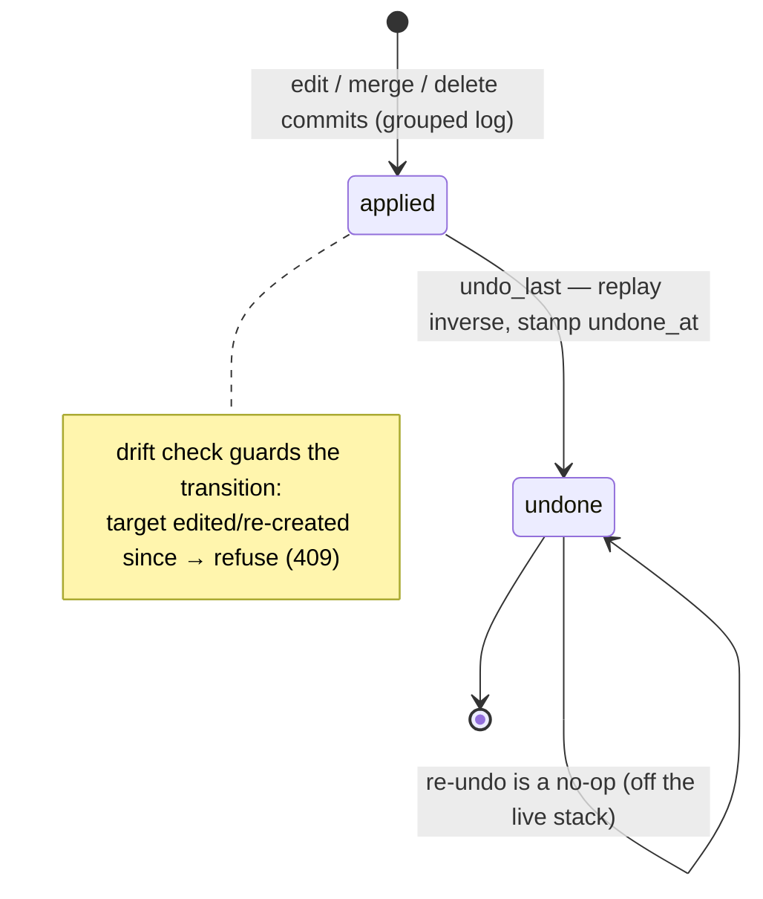

# State machine — Graph operation (the undo stack)

A single instance is **one recorded graph-mutating operation** — an entity edit, a merge, or a
whole-entity delete — captured in the `graph_edits` log as a group of before→after rows sharing an
`operation_id`, `seq`, and human-readable `description`. Its lifecycle answers one question: *is
this operation still in force, or has it been reversed?* It is owned by the M4.S3b write path
(`EntityEditService` — the edit/merge/delete handler) and consumed by the **undo executor**
(`undo_last` → `POST …/graph-edits/undo`). See `docs/decisions/0007` (ADR 0007) and
[[m4-s3b-graph-mutations]].

> **Living (as-built, M4.S3b — be1 writes, be2 executes / ADR 0007).** This is the *operation-level*
> companion to the per-object [[candidate-lifecycle]] / [[relation-lifecycle]] gates: where those
> model a single node/edge toward a human commit, this models a *whole author action* (one merge =
> many writes across Neo4j + Postgres) toward reversibility (INV-3). be1 records the grouped log;
> be2's `undo_last` consumes it. The undo executor is **not** a new graph writer (INV-9): it replays
> the recorded inverse through the *same* human-reached writers (`create_entity`/`create_relation`/
> `delete_relation`/`update_entity`/`delete_entity` + the Postgres mention re-point/restore), reached
> only from the explicit human undo action.

## States

- **applied** — *(persisted resting state; `undone_at IS NULL`)* the operation's grouped rows are in
  `graph_edits` and its effect is in force on the graph. It is **live** — the project's undo stack
  surfaces the newest applied operation as the next undo target (`latest_live_operation`, scoped by
  `project_id`; an S3a singleton edit with a NULL `operation_id` groups under its own `id` via
  `COALESCE(operation_id, id)`, so it is undoable too).
- **undone** — *(persisted terminal state; `undone_at` stamped)* the operation has been reversed —
  each recorded change's inverse was replayed in reverse `seq`, restoring the prior graph + mentions
  — and the rows are stamped with `undone_at` (the `applied → undone` flip). An undone operation is
  **off the live stack**: it is never the target of a future `undo_last`, and its evidence rows
  remain (append-only, not deleted) as the audit trail.

## Transitions

| From | To | Trigger | Guard | Effect |
|---|---|---|---|---|
| *(none)* | **applied** | a human edit / merge / delete commits | INV-1/INV-9 human-reached handler; before-image captured complete | grouped before→after rows written to `graph_edits` (evidence-last) |
| **applied** | **undone** | `undo_last` (the newest applied op in the project) | **drift check** — the op's target still matches the after-image it produced (else 409, [[lost-update]]); op is the live top of stack | inverse of each row replayed in reverse `seq` (recreate node → recreate edges → restore/re-point mentions → un-fold fields); `undone_at` stamped |
| **undone** | **undone** | a second `undo_last` cannot select it | it is no longer live (`undone_at` set) → undo-last picks the *next* applied op, or 404s if none | none — re-undo of the same op is a no-op (idempotent) |

## Diagram

## Invariants over the lifecycle

- **INV-3 (reversibility) is *executed* here.** Every applied operation can reach `undone`; the guard
  is **before-image completeness** — the recorded rows must capture every change (N edges + M
  mentions), or undo would restore a stale graph. The mention re-point returns the moved ids and a
  delete snapshots full mention rows precisely so the inverse moves/restores *exactly* the right rows.
- **INV-9 (only human-reached writers).** The `applied → undone` transition writes the graph, but adds
  no new writer: the undo executor is a *reverser* reusing the existing human-reached writers, reached
  only from the human undo endpoint.
- **Idempotency / crash-retry ([[idempotency]]).** Each inverse action is idempotent (`create` =
  MERGE, `delete` = no-op-if-absent, mention reassign/restore = id-keyed), so a crashed undo's retry
  re-applies safely; `mark_operation_undone`'s `undone_at IS NULL` guard makes the stamp idempotent.
- **Deterministic ids + generation discriminator.** An operation's row ids are `uuid5` of its targets
  (crash-retry never doubles evidence). Because an `undone` op's rows persist with the same ids,
  re-doing the *same* operation on the *same* targets after an undo (re-merge a pair, re-delete an
  entity) bumps a **generation** past any undone op for those targets — so the new evidence isn't
  dropped by `ON CONFLICT (id) DO NOTHING` (ADR 0007, Consequences).

## Open / carried

- **No redo, no multi-level branch (PoC).** The stack is undo-only and linear: `undo_last` walks
  applied operations newest-first; there is no "redo an undone op". Recorded as the §10 q2 V1 path
  (full version history) in ADR 0007.
- **Undo depth is unbounded (PoC).** `graph_edits` retention is the same none-at-PoC posture as the
  decision/staging logs; an undo **depth cap** is the noted V1 refinement (ADR 0007, DM-S3b-7).
- **Drift is detected, not merged.** A drifted undo is *refused* (fail-closed, 409), never
  partially-applied — the owner's default for the "lost update in reverse" edge case (DM-S3b "but
  what if" case 5). Undoing only the still-matching parts is a possible V1 refinement.
