# State machine — Staged Relation (the edge gate)

A single instance is **one extracted relation** — a surface-form `(subject, predicate, object)`
triple staged for a paragraph — working its way toward a human decision: *should this become a
graph edge between two committed entities, and is the predicate/direction right?* Its lifecycle is
owned by the M3.S4e/S4f relation-write path (`RelationReviewService`) — the **edge** twin of the
node gate [[candidate-lifecycle]]. See [[m3-relation-write]] and `docs/decisions/0005` (ADR 0005).

> **Living (as-built, M3.S4e/S4f / ADR 0005).** This is the symmetric counterpart of the entity
> [[candidate-lifecycle]]: that gate commits *nodes* under a human action (INV-1/INV-9); this gate
> commits *edges* under the §3.3 5th human action ("decide on relations"). `RelationReviewService`
> (`agents/relation_review.py`) is the **only** code that writes a graph edge, and only on an
> explicit human `decide`. The `ExtractionCoordinator` writes **zero** edges — it only stages
> surface-form relations into `staged_relations`.
>
> **The held/committable asymmetry to read first.** Unlike the candidate twin (whose `status` enum
> carries its resting + terminal states), `staged_relations.status` is `Literal["staged",
> "written", "rejected"]` — only the resting state plus the two terminals are *persisted*. **held**
> and **committable** are **not stored**: they are *derived* at read/commit time by re-resolving the
> relation's two surface endpoints against the current accepted-candidate set (`_resolve`). A
> `staged` row that resolves both endpoints to distinct committed ids *is* committable; one that
> can't *is* held. This mirrors the twin's transient-cascade-states-in-memory shape: the resting
> `staged` row is one persisted state with two computed faces. Modelling them as states is faithful
> to the *behaviour*; just know the projection is recomputed on every read, not written down.

## States

- **staged** — *(persisted resting state)* the relation exists as surface strings in
  `staged_relations` (`ExtractionCoordinator` wrote it on extract; endpoints carry **no** entity id,
  `subject_entity_id`/`object_entity_id`/`edge_id` are null). Its *committability* is not yet known —
  it is evaluated only when the decide-relations surface lists it or the human commits it.
- **held** — *(derived view of a `staged` row)* at least one endpoint does **not** currently resolve
  to a committed entity id — because that endpoint's same-paragraph candidate is still
  `review-queued` or was `rejected` (DM-Rel-7), because two same-name accepted candidates in the
  paragraph resolve to *different* ids (ambiguous → treated as unresolved, never guessed), or because
  both endpoints resolve to the **same** entity after merges (a self-loop — a merge artifact, dropped,
  not written `(e)-[r]->(e)`). A held relation is **excluded** from `list_committable`; it stays
  `staged` and is re-evaluated on the next read. *No fuzzy fallback* — held is fail-closed toward
  "don't write a wrong/half edge."
- **committable** — *(derived view of a `staged` row)* **both** endpoints currently resolve to
  *distinct* committed entity ids. This is the render set for the §3.3 decide-relations surface
  (`CommittableRelation` carries the resolved ids). Committable is *advisory at list time* — the
  commit re-checks (see the TOCTOU guard).
- **written** — *(terminal, persisted)* the human committed; the edge was MERGE-written to Neo4j by
  deterministic edge id and the row records `subject_entity_id`/`object_entity_id`/`edge_id`.
- **rejected** — *(terminal, persisted)* the human rejected the relation; no edge enters the graph.

## Transitions

| From | To | Trigger | Guard (precondition) | Effect (incl. evidence) |
|------|----|---------|----------------------|-------------------------|
| *(extraction)* | staged | `ExtractionCoordinator` stages a paragraph's relations | — | `staged_relations` row (idempotent: `uuid5(paragraph_id, subject, predicate, object)` + `ON CONFLICT DO NOTHING`); **no graph write** (INV-9) |
| staged | held *(view)* | listed / decide attempted | an endpoint unresolved/ambiguous, or self-loop after merges | excluded from `list_committable`; **stays `staged`**; no persisted change |
| staged | committable *(view)* | listed | **both** endpoints resolve to distinct committed ids | surfaced in `list_committable` with resolved ids; **no persisted change, no graph write** |
| committable | **written** | **human `decide(commit)`** | **a human action** (INV-1 guard) **AND** both endpoints **re-resolve** at commit (TOCTOU re-check) | `create_relation` MERGE-on-`relation_edge_id(subject_id, predicate, object_id)` → Neo4j edge **+ `mark_written`** (records resolved ids + `edge_id`, status→`written`, **LAST** write) |
| committable | **rejected** | **human `decide(reject)`** | **a human action** | `mark_rejected` (status→`rejected`, **LAST** write); nothing enters the graph |
| staged (held at commit) | *(refused)* | **human `decide(commit)`** but re-resolve fails | re-resolve returns None (endpoint drifted to unresolved/ambiguous/self-loop) | **`RelationEndpointsUnresolved` → HTTP 409**; **stays `staged`**; nothing written |
| written / rejected | written / rejected | re-submit (`decide` on a terminal row) | already terminal | **idempotent no-op** (`already_decided=True`); no second edge, no second row mutation |

The **commit guard** (`committable → written` requires *a human action* **and** a successful
re-resolve) **is INV-1 broadened to edges** (ADR 0005 — broadened, *not* a new INV-10), enforced by
`RelationReviewService.decide`; this service is the only edge writer (INV-9 broadened to edges). The
**effect is mandatory** on every transition — the staging effect is the `staged_relations` row
(idempotent edge-derivation lives there), and each terminal effect is the persisted status flip with
its resolved ids/`edge_id`, which is the Compliance/Audit ([[compliance-audit-layer]]) record of what
the human committed. The status flip is the **last** write after the Neo4j MERGE, so a crash before
it leaves the relation `staged` and a retry re-commits idempotently ([[idempotency]]).

## Diagram

```mermaid
stateDiagram-v2
    [*] --> staged: extraction stages surface triple (INV-9 — no edge)
    staged --> held: an endpoint unresolved/ambiguous, or self-loop (view; stays staged)
    staged --> committable: both endpoints resolve to distinct committed ids (view)
    held --> committable: a later accept resolves the missing endpoint (re-evaluated on read)
    committable --> held: an endpoint retargeted/rejected before commit (re-evaluated on read)
    committable --> written: human decide(commit) + re-resolve OK (INV-1)
    committable --> rejected: human decide(reject) (INV-1)
    committable --> committable: human decide(commit) but re-resolve fails → 409 (stays staged)
    written --> [*]
    rejected --> [*]
```

(held/committable are the two computed faces of the single persisted `staged` row; the dashed
intent is that a relation can move between them freely as endpoints land or drift, until a human
takes it terminal.)

## Invariants over the lifecycle

- **No path reaches `written` without the human `decide` action and a successful re-resolve.** This
  is INV-1 (broadened to edges, ADR 0005); `committable → written` is the *only* edge-writing
  transition, and it is human-only. An automated stage that wrote an edge would be a violation, not
  an optimisation — the `ExtractionCoordinator` writes zero edges (INV-9 broadened to edges).
- **Held is fail-closed, never an error** ([[fail-closed]]). An unresolved/ambiguous endpoint or a
  self-loop does **not** crash and does **not** guess — the relation is simply never committable and
  stays `staged`. "Omit, don't guess; no fuzzy fallback" (mirrors the M4 reader's omit-on-unresolvable).
- **Re-resolve at commit closes a TOCTOU race** ([[toctou]] — time-of-check to time-of-use). The
  decide-relations list resolves at *list time*, but a candidate could be rejected, retargeted, or
  merged-away between the human seeing the list and pressing commit. `decide` therefore **re-resolves
  against the current accepted set** and refuses (→409) rather than write a stale edge. List-time
  committability is advisory; commit-time committability is authoritative.
- **The edge write is idempotent by edge id** ([[idempotency]], DM-Rel-6). `relation_edge_id =
  uuid5(subject_id, predicate, object_id)` keys on the *resolved* triple, so the same fact stated in
  two paragraphs MERGEs to **one** edge and a retried commit never doubles it. (The provenance cost
  of this collapse is the carried follow-up below.)
- **Terminal states are final *within the decide machine*.** `written`/`rejected` never
  auto-transition; a re-submitted `decide` on a terminal row is an idempotent no-op. INV-3
  reversibility (undoing a wrong edge) is a *new human action*, not a machine transition out of the
  terminal. **From M4.S3a that human action has a first-class surface** — see the edit-path note below.
- **Merges need no edge re-point — by construction** ([[referential-integrity]]). Because endpoints
  resolve to the *committed* id of an accepted candidate (a `merged` candidate resolves to its
  target's id), an edge is *born* pointing at the survivor; M3 never writes-then-repoints. The only
  true re-point case — merging two **already-accepted** entities — does not exist in M3 (DM-Rel-5)
  and graduates to live M4 work (the entity↔entity merge; it must also re-point `entity_mentions`).

## M4.S3a — the edit path extends the machine (ADR 0006, DM-S3a-3)

The decide machine above commits *staged* edges. M4.S3a adds a second, human-reached origin and a
terminal exit, written **directly** by `EntityEditService` (not the decide path — a hand-picked edge
has no surface-form/paragraph to resolve, DM-S3a-3, owner-resolved at build):

- **Manual-add origin: `[*] → written` directly.** `POST /stories/{id}/relations` writes a
  hand-authored edge between two **already-accepted** entities — `create_relation` MERGE on the same
  `relation_edge_id(subject, predicate, object)` triple, confidence `1.0`, **no `staged_relations`
  predecessor** (so this edge carries no surface-form provenance — the accepted cost of the direct
  writer). A duplicate add MERGEs onto the existing edge and is surfaced (`merged_into_existing`); a
  manual **self-loop** is allowed (intentional, unlike the extraction path).
- **Removal: `written → removed`.** `DELETE /stories/{id}/relations/{edge_id}` deletes the edge
  (`delete_relation`); `removed` is a new exit the decide machine never had. Idempotent (a re-delete of
  an absent edge is a no-op; the route 404s a stale double-remove).
- **Re-predicate = `written → removed` + a fresh `[*] → written`** (the edge id is triple-keyed, so a
  new predicate is a new edge), done client-side as remove + add.
- **INV-3 now has its first-class undo substrate.** Every edit records a before→after `graph_edits`
  row (DM-S3a-2) — the prior-value image a reversal needs. (The undo *action/UI* is a later slice; the
  evidence that makes it possible lands here.)

## M4.S3b-be1 — merge re-points an edge (ADR 0007, DM-S3b-3)

Merging entity B into survivor A is the first operation that **moves an already-`written` edge to a
new identity**. Because `relation_edge_id = uuid5(subject, predicate, object)` is content-addressed,
re-pointing an endpoint *changes the id* — so a re-point is **`written → removed`** (the old triple's
edge) **+ a fresh `[*] → written`** (the new triple on A), exactly the re-predicate mechanic above,
now driven by a merge rather than the author re-typing a predicate. Three sub-cases (all in
`EntityEditService.merge_entities`, planned purely in `domain/entity_merge.py`):

- **Re-point** — `(B, p, X)` → `(A, p, X)`: `delete_relation(old)` + `create_relation(new)`.
- **Fold (MERGE-collision)** — when A already has `(A, p, X)`, the create collapses onto it: the old
  edge still goes `written → removed`, but no new edge is born (multiplicity is lost — **reported** as
  `folded_count`, not silent; the old triple lives in the grouped before-image so undo can restore the
  distinct edge).
- **Dropped self-loop** — a `(B, p, A)` or `(B, p, B)` edge becomes `(A, p, A)` after the swap and is
  dropped as an artifact (`written → removed`, no successor), consistent with the extraction path.

Each sub-change is one row of the merge's **grouped** `graph_edits` operation (`operation_id` + `seq`),
so undo (be2) reverses the whole re-point set as one unit.

## Open points carried while drawing this note (NOT resolved here — see [[open-questions]] OQ-20)

These are the two sub-gaps OQ-20 asked to fold in while drawing the machine. They remain **open**;
they are watch-items, not decisions taken here.

- **(a) Held-relation visibility — the Evidence gap for the edge gate.** A relation that is *never*
  committable (an endpoint never accepted, a permanent self-loop) rests in `held` **silently**: the
  decide-relations surface only ever lists *committable* relations, so a held row is an **invisible
  non-decision**. The author is never told *why* an extracted relation never became an edge. Contrast
  the node gate, where a `rejected` candidate writes an explicit `candidate_decisions` evidence row
  (INV-3). For edges, a *held* row leaves no decision evidence at all — INV-3 reversibility/auditability
  for the "this relation was extracted but silently dropped" case has no home. **Open:** surface held
  relations (with the reason: pending endpoint / rejected endpoint / self-loop) so the non-decision is
  visible and auditable, or accept the silent drop as a PoC limitation. (A reject-prunes-held rule —
  pruning a paragraph's now-impossible staged relations when an endpoint candidate is rejected — is the
  related cleanup ADR 0005 names.)
- **(b) Edge Expiry posture — held rows never expire.** A relation whose endpoint is never accepted
  is **held forever** in `staged_relations` (no retention, no age-based cleanup). This is the accepted
  **none-at-PoC** posture (ADR 0005, the second concrete instance of the same Expiry gap as the
  staging/rejection tables — [[open-questions]] OQ-4 / DM-S4a-5). Bounded by the single author's ingest
  volume; an age-based cleanup + the reject-prunes-held rule are the obvious V1 refinements. **Open
  (confirm-only):** the posture is decided (none-at-PoC); this note records it as the edge twin of the
  node-side Expiry gap so it stays visible, not vanished.

## Carried follow-up (from ADR 0005, not a state question)

- **Per-mention provenance for triple-deduped edges.** Because `relation_edge_id` collapses the same
  resolved `(subject, predicate, object)` across paragraphs into one edge, *how many times* and
  *where* a relation was stated is lost on the graph (the `staged_relations` rows retain it,
  un-promoted). See [[2026-06-17-architecture-review]]'s provenance-vs-deduplication note; post-PoC.
