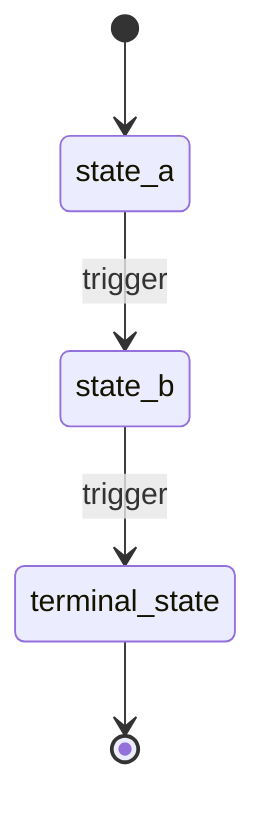

<!--
  STATE-MACHINE TEMPLATE.
  Lives in the vault at: architecture/state-machines/<entity>.md  — one per stateful entity.
  Doctrine #6: model state machines, not naïve statuses. A free-text "status" field invites
  impossible states and forgotten transitions; an explicit machine names every state, every
  legal move, and — crucially — the TERMINAL states where a thing's life ends.
  Two representations on purpose (your two readers): a Mermaid diagram you can SEE in Obsidian,
  and a transition table the agent and review can read precisely.
-->
---
type: state-machine
slug: example-entity
updated: 2026-06-01
status: living
related:
  - "[[owning-component]]"
---

# State machine — <Entity>

<One sentence: what a single instance of this entity IS, and which component owns its
lifecycle (→ [[owning-component]]).>

## States

- **<state-a>** — <what it means to be here>
- **<state-b>** — <…>
- **<terminal-state>** — *(terminal)* <a state from which there is no exit; the instance's
  life ends here. Every machine needs at least one, or it can never legitimately end.>

## Transitions

| From | To | Trigger | Guard (precondition) | Effect (incl. evidence left) |
|------|----|---------|----------------------|------------------------------|
| <a>  | <b>| <event> | <condition that must hold> | <what happens — e.g. "writes an audit record"> |

<The **Guard** is where invariants are enforced (the move is only legal if the condition
holds). The **Effect** is MANDATORY on every transition — it is where the Compliance/Audit
layer lives: a transition that emits an audit record is the system's evidence being created
in real time. If a move genuinely leaves nothing behind, write "none — <why>", never a blank
cell: a named "none" is a decision, a blank is a blind spot. A transition you *expected* to
leave evidence but that leaves none is a finding, not an omission.>

## Diagram

## Invariants over the lifecycle

<Rules the machine must never break, across any path → also in [[invariants]]. The sharpest
ones are about moves that must be IMPOSSIBLE, e.g. "no transition back to `active` from
`expired`" or "cannot reach `approved` without passing through `requested`".>
